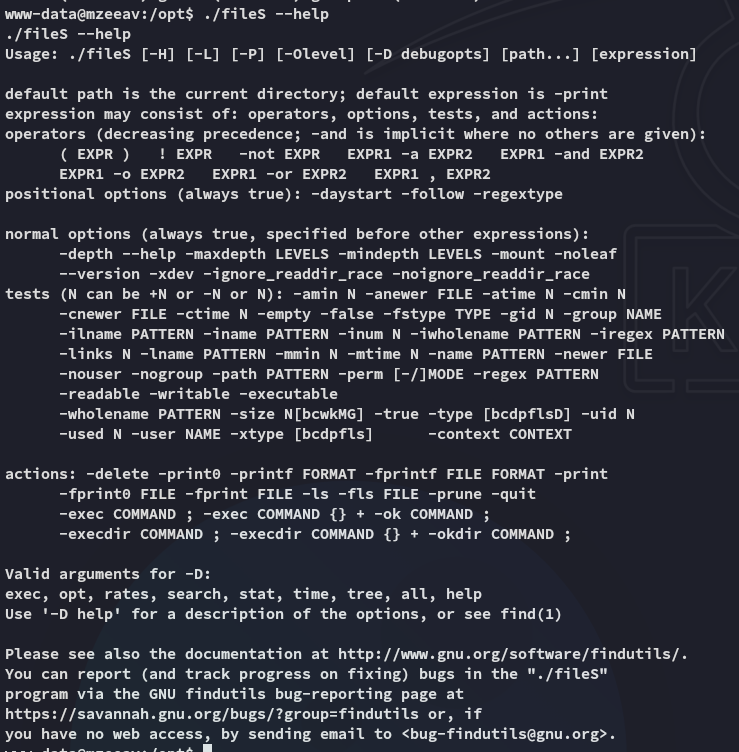

**Start 10:13 28-04-2025**

---
```
Scope:
192.168.241.33
```
## Recon

### Nmap

```bash
sudo nmap -sC -sV mzeeav -sT -T5 --min-rate=5000 -Pn -vvvv -p-

PORT   STATE SERVICE REASON  VERSION
22/tcp open  ssh     syn-ack OpenSSH 8.4p1 Debian 5+deb11u2 (protocol 2.0)
80/tcp open  http    syn-ack Apache httpd 2.4.56 ((Debian))
|_http-title: MZEE-AV - Check your files
| http-methods: 
|_  Supported Methods: HEAD GET POST OPTIONS
|_http-server-header: Apache/2.4.56 (Debian)
Service Info: OS: Linux; CPE: cpe:/o:linux:linux_kernel
```


### 80/TCP - HTTP


However when we intercept the server response we notice the following error:


The client however does not show this error.


Using `feroxbuster` I found some more directories:


When I go ahead and upload one of the `upload` files:


No error.

Let's check out the  `upload.php` script to figure out what's happening when we try to upload a file:


I head on over to this endpoint:


### Exploit

So in order to exploit this we need to understand what `upload.php` does.

It basically checks whether the file contains `45DA` as the first bytes:


We can exploit this by prepending these bytes to our malicious webshell.


We now see that it has been successfully uploaded.


We notice the page does *not* return an error, however neither does it return any output.

:::fail
This means that we probably have to intercept it with `burp` and add the `MZ` in front after the upload.
:::

### Burpsuite


We see no error this time, let's see if it worked.


EZ PZ.


## Foothold
### RCE

**


We get a shell as *www-data*.

### local.txt


### Enumeration

As always I start my enumeration from top down `/`.


:::note
I couldn't read the file since it was owned by *root*, but this might come in handy for when we're *avuser*?
:::

I downloaded `linpeas.sh`


Let's try and see what this binary does.


## Privilege Escalation


It acts sort of like `ls`?



I tried some commands but they didn't work, let's check out the `-version` instead:


Oh so it's actually the `find` binary disguised as another binary.

Using GTFOBins we find the binary and what we need for privesc:


:::note
For whatever reason I wasn't able to use `cat proof.txt` so I went ahead and transferred my `id_rsa.pub` as `authorized_keys` and got SSH access.

:::


:::bug
I had to revert the box to be able to properly read `proof.txt`.
:::

## proof.txt


:::summary
Pretty fun and simple box.
:::

---

**Finished 11:40 28-04-2025**

[^Links]: [[OSCP Prep]] 


