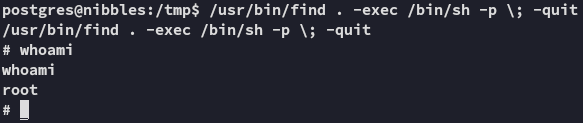

**Start 11:40 17-02-2025**

---
```
Scope:
192.168.237.47
```
# Recon

## Nmap

```bash
sudo nmap -sC -sV -vvvv -Pn -p- nibbles -sT --min-rate=5000 -T5

PORT     STATE  SERVICE      REASON       VERSION
21/tcp   open   ftp          syn-ack      vsftpd 3.0.3
22/tcp   open   ssh          syn-ack      OpenSSH 7.9p1 Debian 10+deb10u2 (protocol 2.0) 
80/tcp   open   http         syn-ack      Apache httpd 2.4.38 ((Debian))
| http-methods: 
|_  Supported Methods: GET POST OPTIONS HEAD
|_http-title: Enter a title, displayed at the top of the window.
|_http-server-header: Apache/2.4.38 (Debian)
5437/tcp open   postgresql   syn-ack      PostgreSQL DB 11.3 - 11.9
Service Info: OSs: Unix, Linux; CPE: cpe:/o:linux:linux_kernel
```


All ports are a bust, we could try to brute force SSH or try out PostgreSQL first.


## 5437/TCP - PostgreSQL


We check out the options for running `psql`:


We connect succesfully using the first found creds.


In order to list databases we issue the `\l` command.


It looks like there's nothing interesting. Let's check the version number and find out whether there's any **authenticated exploits** available.


It seems we've found something.


Good, this seems to fit our use case.

I then visited the authors mentioned [GitHub page](https://github.com/b4keSn4ke/CVE-2019-9193) to read more into the found vulnerability:


I downloaded the PoC and ran it:


Looks like it worked like a charm.

I even found out what user had the `local.txt` flag in his directory.


Unfortunately he didn't have any `.ssh` keys so we had to use a reverse shell instead.


# Foothold


## local.txt


# Privilege Escalation

I downloaded over `linpeas` and let it run.


This suggested that the `find` binary would HIGHLY LIKELY be a PE vector


I then used GTFObins to find the binary and how to exploit it. 


Turns out that since the SUID bit is set we can just run the following and get a root shell:

```bash
/usr/bin/find . -exec /bin/sh -p \; -quit
```




## proof.txt


>[!summary]
>We utilized an exploit to get RCE using the **PostgreSQL** service which is outdated.
>After gaining a foothold we took advantage of the SUID bit that was set on the `find` binary to get `root` RCE.

---

**Finished 12:19 17-02-2025**

[^Links]: [[OSCP Prep]]