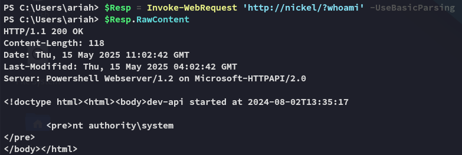

**Start 10:23 15-05-2025**

---
```
Scope:
192.168.169.99
```
## Recon

### Nmap

```bash
sudo nmap -sC -sV nickel -sT -vvvv -p- -Pn -T5 --min-rate=5000

PORT      STATE    SERVICE       REASON      VERSION
21/tcp    open     ftp           syn-ack     FileZilla ftpd 0.9.60 beta
| ftp-syst: 
|_  SYST: UNIX emulated by FileZilla
22/tcp    open     ssh           syn-ack     OpenSSH for_Windows_8.1 (protocol 2.0)
80/tcp    open     http          syn-ack     Microsoft HTTPAPI httpd 2.0 (SSDP/UPnP)
| http-methods: 
|_  Supported Methods: GET
|_http-title: Site doesnt have a title.
135/tcp   open     msrpc         syn-ack     Microsoft Windows RPC
139/tcp   open     netbios-ssn   syn-ack     Microsoft Windows netbios-ssn
445/tcp   open     microsoft-ds? syn-ack
3389/tcp  open     ms-wbt-server syn-ack     Microsoft Terminal Services
|_ssl-date: 2025-05-15T08:29:01+00:00; 0s from scanner time.
| rdp-ntlm-info: 
|   Target_Name: NICKEL
5040/tcp  open     unknown       syn-ack
7680/tcp  open     pando-pub?    syn-ack
8089/tcp  open     http          syn-ack     Microsoft HTTPAPI httpd 2.0 (SSDP/UPnP)
| http-methods: 
|_  Supported Methods: GET
|_http-server-header: Microsoft-HTTPAPI/2.0
|_http-title: Site doesnt have a title.
|_http-favicon: Unknown favicon MD5: 9D1EAD73E678FA2F51A70A933B0BF017
33333/tcp open     http          syn-ack     Microsoft HTTPAPI httpd 2.0 (SSDP/UPnP)
|_http-title: Site doesnt have a title.
|_http-favicon: Unknown favicon MD5: 76C5844B4ABE20F72AA23CBE15B2494E
| http-methods: 
|_  Supported Methods: GET POST
|_http-server-header: Microsoft-HTTPAPI/2.0
49664/tcp open     msrpc         syn-ack     Microsoft Windows RPC
49665/tcp open     msrpc         syn-ack     Microsoft Windows RPC
49666/tcp open     msrpc         syn-ack     Microsoft Windows RPC
49667/tcp open     msrpc         syn-ack     Microsoft Windows RPC
49668/tcp open     msrpc         syn-ack     Microsoft Windows RPC
49669/tcp open     msrpc         syn-ack     Microsoft Windows RPC
Service Info: OS: Windows; CPE: cpe:/o:microsoft:windows
```

### 80/TCP - HTTP


that's it nothing else

### 8098/TCP - HTTP


Clicking on the second button redirects us to the `33333` port:


Let's open up `burp` to see what's happening underneath


It's sending a `GET` request to a completely different IP, let's see what happens when we change the host to `nickel` instead.


### Curl

I couldn't for the life of me figure out why it wouldn't send anything so I switched to `curl`:


I tried both `GET` and `POST` requests.

We get a `411` request which means **Length Required**:


We need to supply the `Content-Length` header in this case to get any info:


### Password Spray

Awesome! We get what appears to be credentials:

```
ariah
Tm93aXNlU2xvb3BUaGVvcnkxMzkK
```

However it didn't seem particularly useful?


Which means that it is HIGHLY LIKELY encoded with what appears to be `base64`:


```
ariah
NowiseSloopTheory139
```


### 21/TCP - FTP

Awesome, we should definitely use it on `ssh` then, but I'll check out FTP first to see whether it might contain anything juicy.


### John

Time to crack this badboy open:


Doesn't seem super useful right now.

## Foothold
### SSH as ariah


From here we can get `local.txt` right away.

### local.txt


## Enumeration


Unfortunately I don't find anything extraordinarily useful.

## Privilege Escalation
### RCE via Endpoint - Adding to Admin

We return to the contents that we found inside the `.pdf` document, especially this line:


After some research I found that we could actually use this endpoint to issue commands (du'uh).



:::note
We could've also done this using `curl` in `cmd` but I prefer `powershell`.
:::

Using this premise we can give ourselves a privileged reverse shell:


### proof.txt


## ALTERNATIVE EXPLOITATION
### Pop INSTANT SYSTEM shell

Only afterwards did I realize that we had *SYSTEM* basically from the start if we connected the dots:


This means that from here I just had to insert the payload and catch the shell:


:::summary
In hindsight SUPER EASY box, made it harder than it was.
Exploitation was super fun, didn't really learn anything new apart from honing enumeration skills.
:::

---

**Finished 13:07 15-05-2025**

[^Links]: [[OSCP Prep]]
