**Start 11:58 04-05-2025**

---
```
Scope:
192.168.179.210
```
# Recon

## Nmap

```bash
sudo nmap -sC -sV pc -sT -T5 --min-rate=5000 -Pn -vvvv -p-

PORT     STATE SERVICE REASON  VERSION
22/tcp   open  ssh     syn-ack OpenSSH 8.2p1 Ubuntu 4ubuntu0.9 (Ubuntu Linux; protocol 2.0)
8000/tcp open  http    syn-ack ttyd 1.7.3-a2312cb (libwebsockets 3.2.0)
|_http-title: ttyd - Terminal
| http-methods: 
|_  Supported Methods: GET HEAD POST OPTIONS
|_http-server-header: ttyd/1.7.3-a2312cb (libwebsockets/3.2.0)
Service Info: OS: Linux; CPE: cpe:/o:linux:linux_kernel
```

## 8000/TCP - HTTP

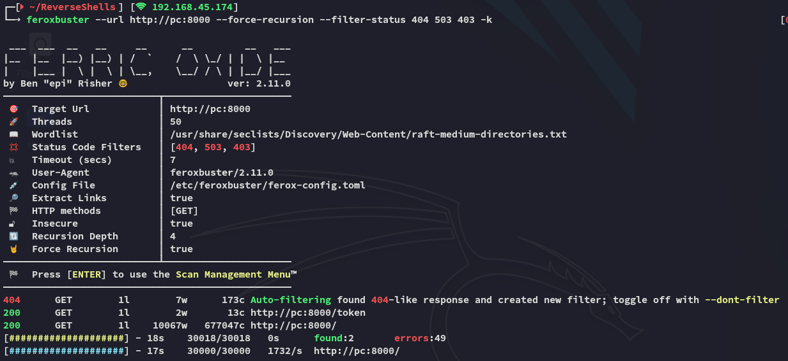

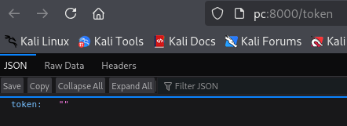

But the main thing here was this page:

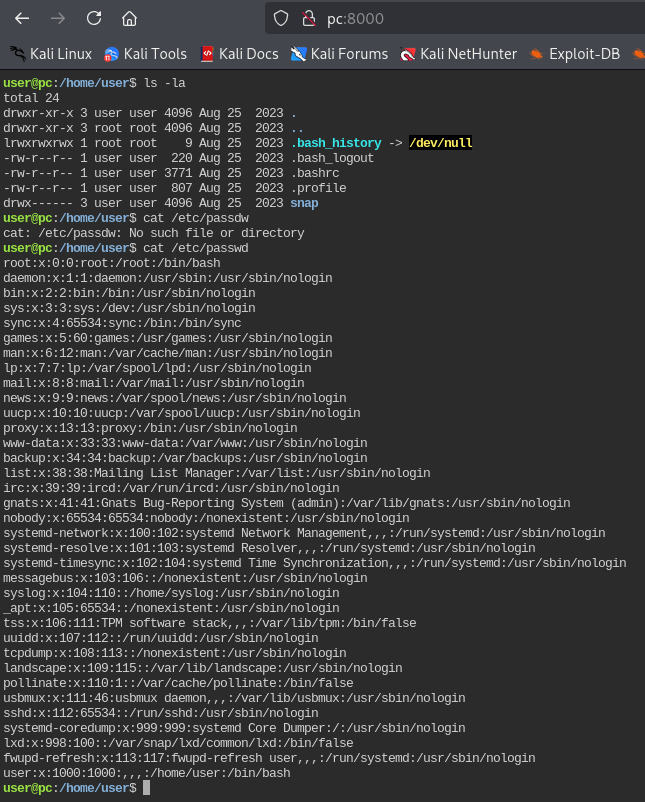

There was a literal webshell already up.


# Foothold
## Shell as User

The world's easiest foothold goes to....

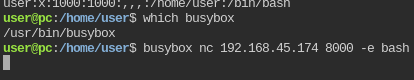

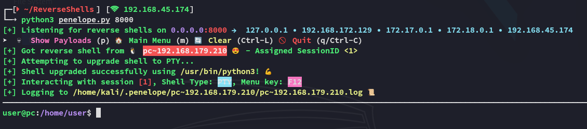

>[!note]
>Instead of `rlwrap` I decided to try out `penelope.py` for once.

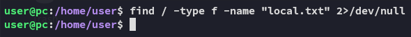

There does not appear to be a `local.txt` flag.

## Enumeration

As always I went ahead and downloaded over `linpeas.sh`

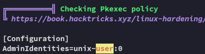

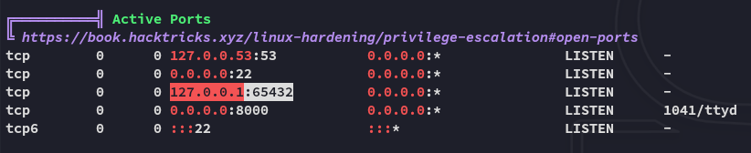

We notice an active port which was not mentioned in the port scan, makes sense since it is only available via `localhost`. We might have to port forward, but let's check further first.

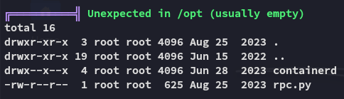

>[!important]
>Interesting, anything in `/opt` is HIGHLY LIKELY a PE vector with OffSec boxes

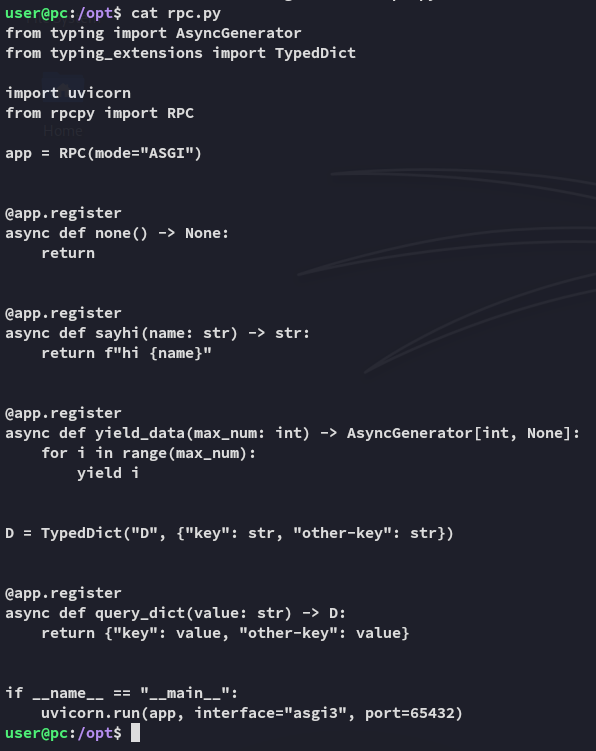

I take what I can gather and start my OSINT:

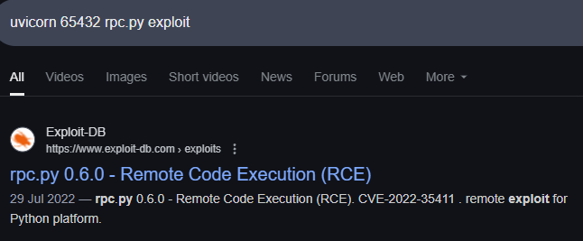


# Privilege Escalation

I modify the found PoC:

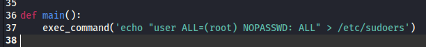

And now I can transfer it and run it.

>[!bug]
>This exploit DID NOT WORK in `penelope.py`, thus I had to use old fashioned `rlwrap`.

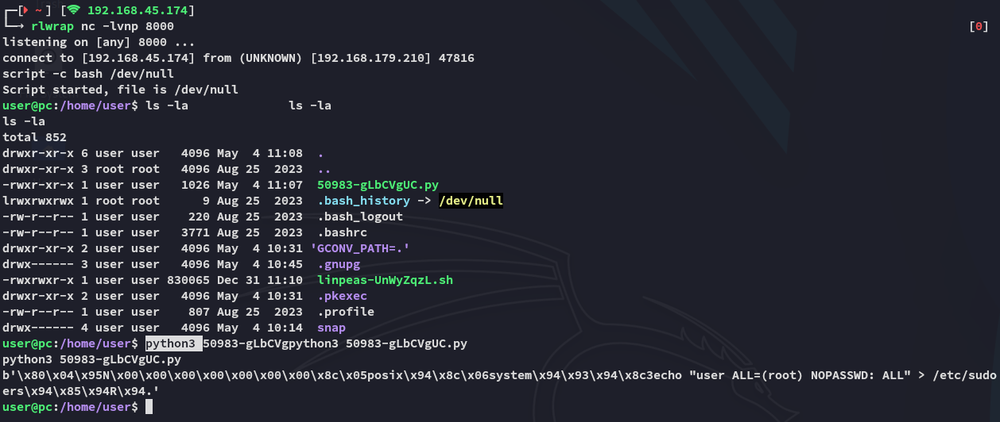

We verify our privs:

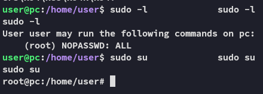

## proof.txt

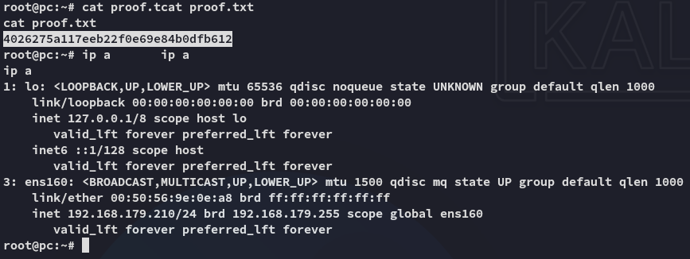

---

**Finished 13:10 04-05-2025**

[^Links]: [[OSCP Prep]]

#CVE 
