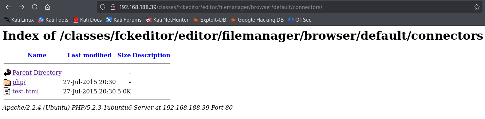
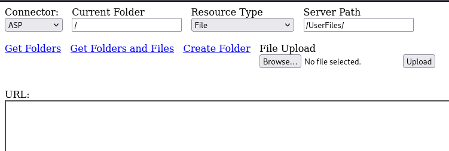
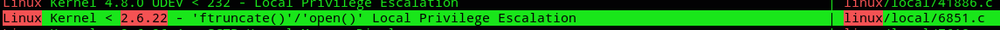

**Start 20:04 04-01-2025**

---
```
Scope:
192.168.188.39
```
# Recon

## Nmap

```bash
PORT    STATE SERVICE     REASON  VERSION
22/tcp  open  ssh         syn-ack OpenSSH 4.6p1 Debian 5build1 (protocol 2.0)
80/tcp  open  http        syn-ack Apache httpd 2.2.4 ((Ubuntu) PHP/5.2.3-1ubuntu6)
| http-methods: 
|_  Supported Methods: GET HEAD POST OPTIONS
|_http-server-header: Apache/2.2.4 (Ubuntu) PHP/5.2.3-1ubuntu6
|_http-title: CS-Cart. Powerful PHP shopping cart software
110/tcp open  pop3        syn-ack Dovecot pop3d
139/tcp open  netbios-ssn syn-ack Samba smbd 3.X - 4.X (workgroup: MSHOME)
143/tcp open  imap        syn-ack Dovecot imapd
445/tcp open  netbios-ssn syn-ack Samba smbd 3.0.26a (workgroup: MSHOME)
993/tcp open  ssl/imap    syn-ack Dovecot imapd
995/tcp open  ssl/pop3    syn-ack Dovecot pop3d

Host script results:
|_smb2-security-mode: Couldn't establish a SMBv2 connection.
| nbstat: NetBIOS name: PAYDAY, NetBIOS user: <unknown>, NetBIOS MAC: <unknown> 
| smb-os-discovery: 
|   OS: Unix (Samba 3.0.26a)
|   Computer name: payday
|   NetBIOS computer name: 
|   Domain name: 
|   FQDN: payday
|_  System time: 2025-01-04T14:05:33-05:00
|_smb2-time: Protocol negotiation failed (SMB2)
| smb-security-mode: 
|   account_used: <blank>
|   authentication_level: user
|   challenge_response: supported
|_  message_signing: disabled (dangerous, but default)
|_clock-skew: mean: 50m06s, deviation: 2h02m28s, median: 5s
```

We've got a web server running, as well as multiple `pop3` servers, and 2 `SMB` servers.

We'll start off enumerating the web page first, for this I'll check for hidden directories first.


## Gobuster

```bash
gobuster dir -u http://192.168.188.39 -w /usr/share/seclists/Discovery/Web-Content/directory-list-2.3-small.txt -x txt,php,config,zip,pdf
```

From this enumeration I found this endpoint which I could then access and view the directories through:


# Initial Foothold

## 80/TCP - HTTP

Using `curl` I checked the headers of the webpage:


Nothing of grave interest except for the Ubuntu version and that it's running `PHP` in the tech stack.

From our previous enumeration using gobuster we found some directories that might be of interest. I then jumped into this rabbit hole and starting looking for possible entry points:



Here I clicked on `test.html` and got the following:



Could this mean we could upload arbitrary files via this page?

When we try to upload the `php-reverse-shell.php` file we get the following error:


>[!info]
>Following [this blog](https://secureyes.net/wp-content/uploads/2022/08/File-Upload-Vulnerability-in-FCKEditor.pdf) there is a version of **FCKEditor** in which we could modify the request using burpsuite and change the behaviour of the file afterwards. Below I tried this out.


After adding this line we should be able to change the behaviour.


It didn't work, meaning the version is HIGHLY LIKELY newer.

Let's try a different approach.


## Keep It Simple Stupid

I went back to the main page of the site where I found a login screen in the top right. Here I could once again just log in using default creds `admin - admin`.

>[!note]
>OffSec *loves* default credentials like admin - admin.

Afterwards I wanted to know how to check the version of **CS-Cart** the server was running in order to check for exploits:


Well that's pretty easy.


Let's check for vulnerabilities.


Yeah this explanation sucks. After some more checking I found [the following blog](https://gist.github.com/momenbasel/ccb91523f86714edb96c871d4cf1d05c):


Let's check it out.


>[!note]
>Same creds, `admin - admin`.


And we got a succesful shell.

### local.txt


# Privilege Escalation

Now it was time to escalate our privileges.

Let's enumerate the environment.


## Enumeration

>[!note]
>Below I've dumped every finding that I could link something to.





But the one that really stood out was all the way at the bottom:


Let's check the file out:


Well well, I guess we can log into the db using `root - root`.

>[!fail]
>Alas I was *NOT* able to log in for some reason.


From here I could guess that since whomever created this machine was using the same creds for user and password, e.g.

```
admin - admin
root - root
```

Perhaps other users were also configured in the same way? 

Let's try out to log in as *patrick*.

>[!important]
>I ran into issues with the shell as well as logging in via SSH, the only way it would work is written below:

```bash
# Spawn python shell
python -c 'import pty; pty.spawn("/bin/bash")'

# Export TERM
export TERM=xterm

# SSH into localhost via reverse shell
ssh patrick@localhost

# Use creds patrick - patrick
```


From here we could enumerate the system again:


Since we can run any command let's grab the `proof.txt` flag.

### proof.txt


---

**Finished 21:58 04-01-2025**

[^Links]: [[OSCP Prep]]

#troubleshooting #KISS #gobuster #linpeas #cs-cart 