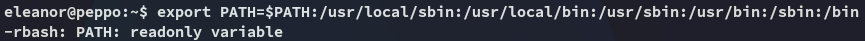

**Start 13:38 14-05-2025**

---
```
Scope:
192.168.106.60
```
# Recon

## Nmap

```bash
sudo nmap -sC -sV 192.168.106.60 -sT -vvvv -p- -Pn -T5 --min-rate=5000

PORT      STATE  SERVICE           REASON       VERSION
22/tcp    open   ssh               syn-ack      OpenSSH 7.4p1 Debian 10+deb9u7 (protocol 2.0)
|_auth-owners: root
113/tcp   open   ident             syn-ack      FreeBSD identd
|_auth-owners: nobody
5432/tcp  open   postgresql        syn-ack      PostgreSQL DB 9.6.0 or later
8080/tcp  open   http              syn-ack      WEBrick httpd 1.4.2 (Ruby 2.6.6 (2020-03-31))
|_http-title: Redmine
| http-methods: 
|_  Supported Methods: GET HEAD POST OPTIONS
|_http-favicon: Unknown favicon MD5: D316E1622C58825727E7E4E6C954D289
|_http-server-header: WEBrick/1.4.2 (Ruby/2.6.6/2020-03-31)
| http-robots.txt: 4 disallowed entries 
|_/issues/gantt /issues/calendar /activity /search
10000/tcp open   snet-sensor-mgmt? syn-ack
|_auth-owners: eleanor
| fingerprint-strings: 
|   DNSStatusRequestTCP, DNSVersionBindReqTCP, Help, Kerberos, LANDesk-RC, LDAPBindReq, LDAPSearchReq, LPDString, RPCCheck, RTSPRequest, SIPOptions, SMBProgNeg, SSLSessionReq, TLSSessionReq, TerminalServer, TerminalServerCookie, X11Probe: 
|     HTTP/1.1 400 Bad Request
|     Connection: close
|   FourOhFourRequest: 
|     HTTP/1.1 200 OK
|     Content-Type: text/plain
|     Date: Wed, 14 May 2025 12:07:54 GMT
|     Connection: close
|     Hello World
|   GetRequest, HTTPOptions: 
|     HTTP/1.1 200 OK
|     Content-Type: text/plain
|     Date: Wed, 14 May 2025 12:07:48 GMT
|     Connection: close
|_    Hello World
```

We find a few `auth_owners` here and there which we can use to test `ssh`.

## Hydra


Succes!

# Foothold
## Breaking out of Jail

We simply try the `username - username` combo and get in:


We find that we're in this stupid restricted `rbash` shell:


Let's try and escape it.


I then followed along and tried to export the path but it didnt work:



Which meant that I'd have to check out the binaries to see which ones I could use to break out.


I used this to break out:


### local.txt


# Privilege Escalation
## Docker 

I notice we're part of quite a few groups:


We can use the `docker` group to our advantage:


We first check what `docker` images are running, then execute the command:


### proof.txt


---

**Finished 14:26 14-05-2025**

[^Links]:  [[OSCP Prep]]

#docker #GTFObins 