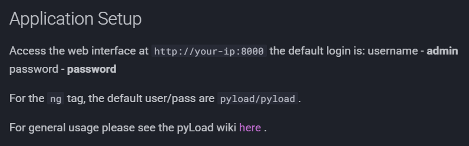
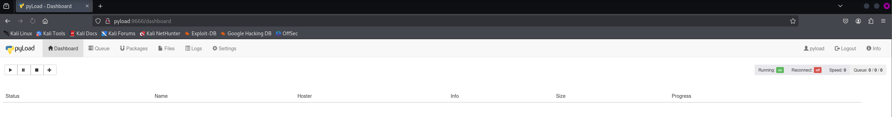
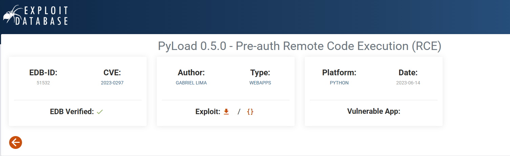
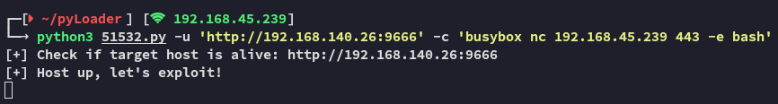
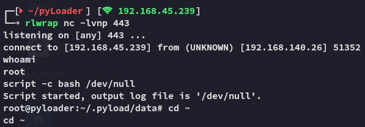
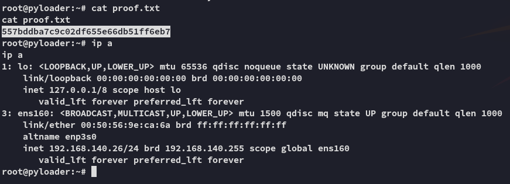

**Start 13:47 31-01-2025**

---
```
Scope:
192.168.140.26
```
# Recon

## Nmap

```bash
sudo nmap -sC -sV -vvvv -Pn -p- 192.168.140.26 -sT --min-rate=5000 -T5

PORT     STATE SERVICE REASON  VERSION
22/tcp   open  ssh     syn-ack OpenSSH 8.9p1 Ubuntu 3ubuntu0.1 (Ubuntu Linux; protocol 2.0)
9666/tcp open  http    syn-ack CherryPy wsgiserver
| http-methods: 
|_  Supported Methods: HEAD OPTIONS GET
| http-title: Login - pyLoad 
|_Requested resource was /login?next=http://192.168.140.26:9666/
|_http-favicon: Unknown favicon MD5: 71AAC1BA3CF57C009DA1994F94A2CC89
|_http-server-header: Cheroot/8.6.0
| http-robots.txt: 1 disallowed entry 
|_/
Service Info: OS: Linux; CPE: cpe:/o:linux:linux_kernel
```


We can easily log in with the default creds:





However this is unnecessary as we can easily get a reverse shell using this PoC:




# Foothold







---

**Finished 14:14 31-01-2025**

[^Links]:  [[OSCP Prep]]