**Start 18:40 06-01-2025**

---
```
Scope:
192.168.225.91
```
# Recon

## Nmap

```bash
sudo nmap -sC -sV -oN Scrutiny/nmap 192.168.225.91 -T5 -vvvv --min-rate=5000 -sT -p-

PORT    STATE  SERVICE REASON       VERSION
22/tcp  open   ssh     syn-ack      OpenSSH 8.2p1 Ubuntu 4ubuntu0.11 (Ubuntu Linux; protocol 2.0)
25/tcp  open   smtp    syn-ack      Postfix smtpd
| ssl-cert: Subject: commonName=onlyrands.com
| Subject Alternative Name: DNS:onlyrands.com
| Issuer: commonName=onlyrands.com
|_smtp-commands: onlyrands.com, PIPELINING, SIZE 10240000, VRFY, ETRN, STARTTLS, ENHANCEDSTATUSCODES, 8BITMIME, DSN, SMTPUTF8, CHUNKING
|_ssl-date: TLS randomness does not represent time
80/tcp  open   http    syn-ack      nginx 1.18.0 (Ubuntu)
|_http-server-header: nginx/1.18.0 (Ubuntu)
|_http-title: OnlyRands
| http-methods: 
|_  Supported Methods: GET HEAD
443/tcp closed https   conn-refused
Service Info: Host:  onlyrands.com; OS: Linux; CPE: cpe:/o:linux:linux_kernel
```


## 25/TCP - SMTP

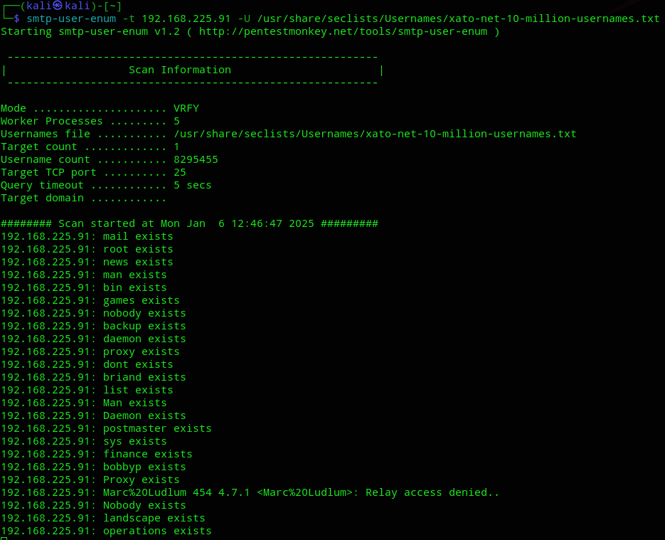


## Gobuster

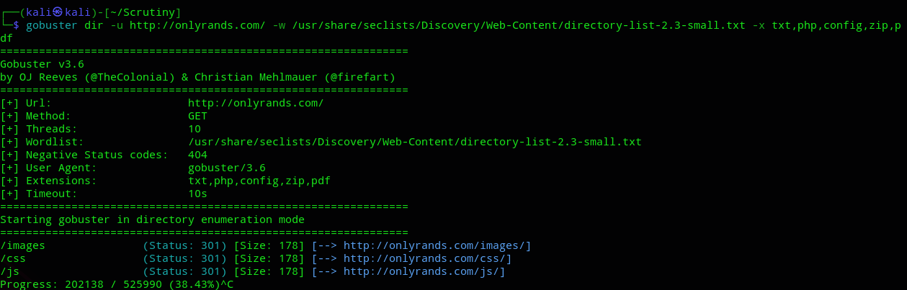

No significant output. I then went to the website and found a login page which was inaccessible unless I added the `teams.` subdomain in the `/etc/hosts` file:

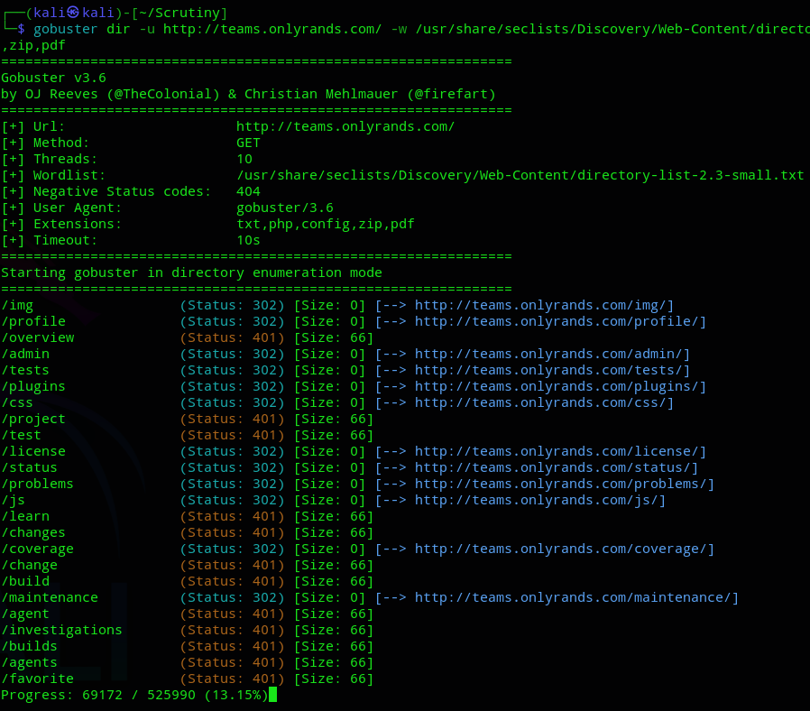


## 80/TCP - HTTP

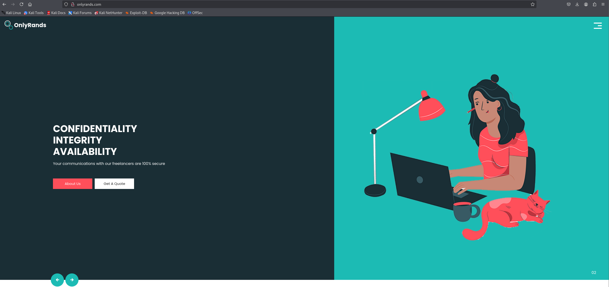


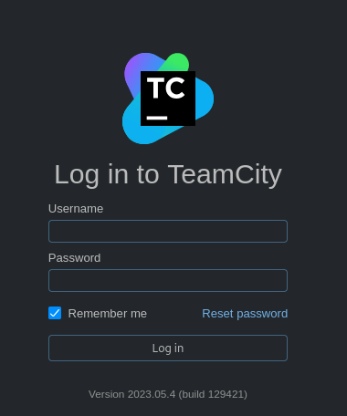

We get a **JetBrains TeamCity** login screen. I looked the version up as well as any sort of default credentials.

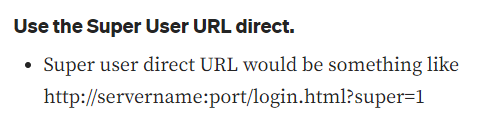

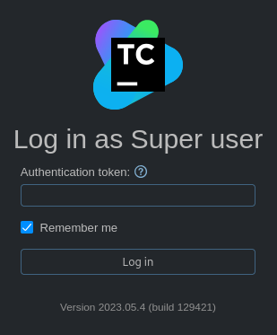


# Initial Foothold

## Manual Exploitation - FAIL

I started looking for an exploit that would match this version 

>[!note]
>While I found multiple CVE's for this version and the ones after, only **CVE-2024-27198** seemed to work in this case.

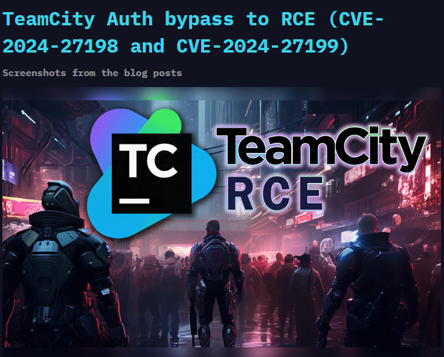

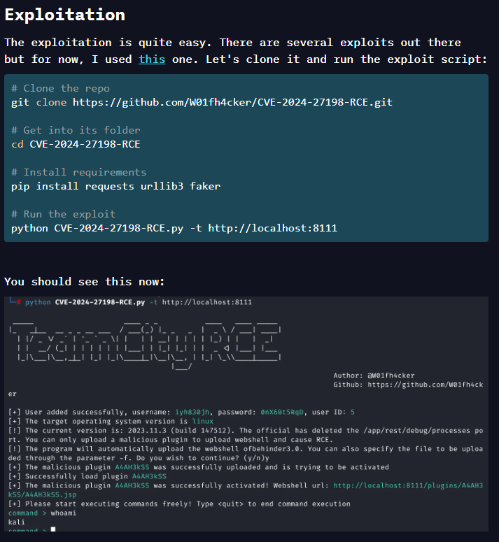

Yet again for whatever reason the manual exploitation didn't work, eventhough I was *literally* following the *OffSec* walkthrough at this point:

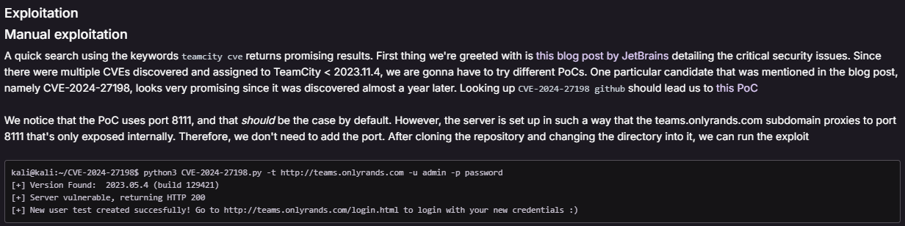

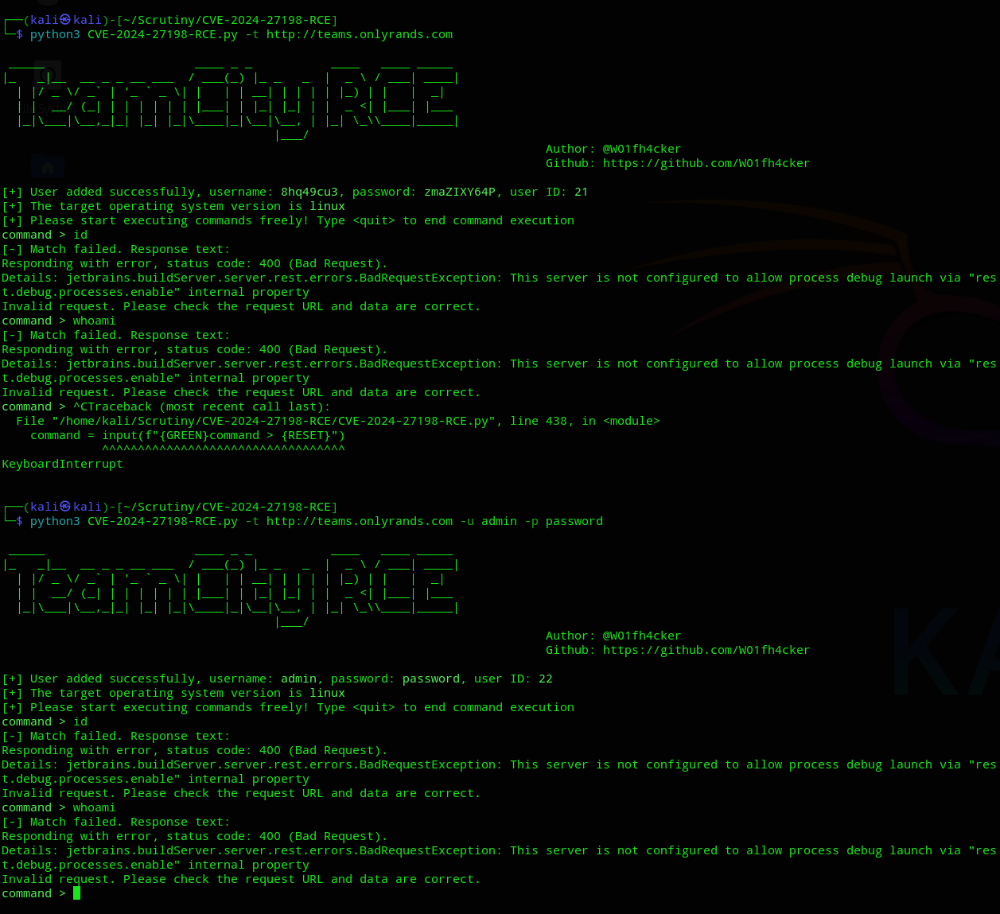


## Automated Exploitation

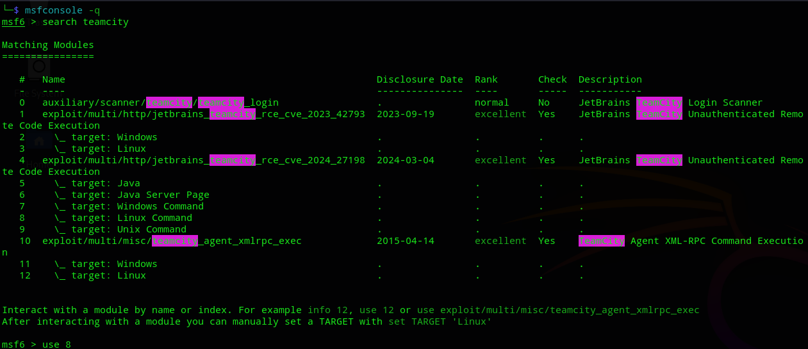

Then we set all the options as follows:

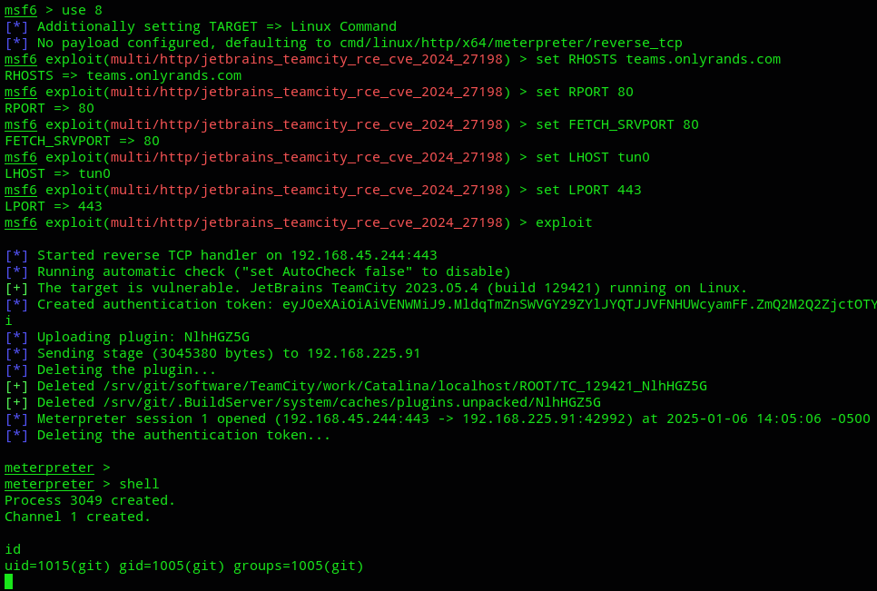

We can upgrade our shell again:

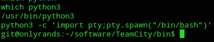


### local.txt

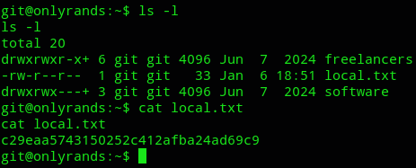


## Lateral Movement

We now need to move laterally to some other user. Let's enumerate our environment.

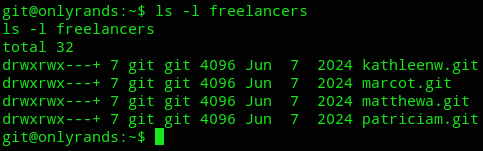

We found a bunch of `.git` repo's, 

>[!note]
>We'll write a simple `for` loop that queries the latest 3 commit messages in each repository. We want to see if we can find patterns in the commit message style of users in the `freelancers` group. If there's a pattern, it's easy to look for messages that **don't** follow that pattern.

```bash
for i in `ls /srv/git/freelancers/`; do 
   cd /srv/git/freelancers/$i
   git --no-pager log --abbrev-commit -n3
   cd /srv/git 
done
```

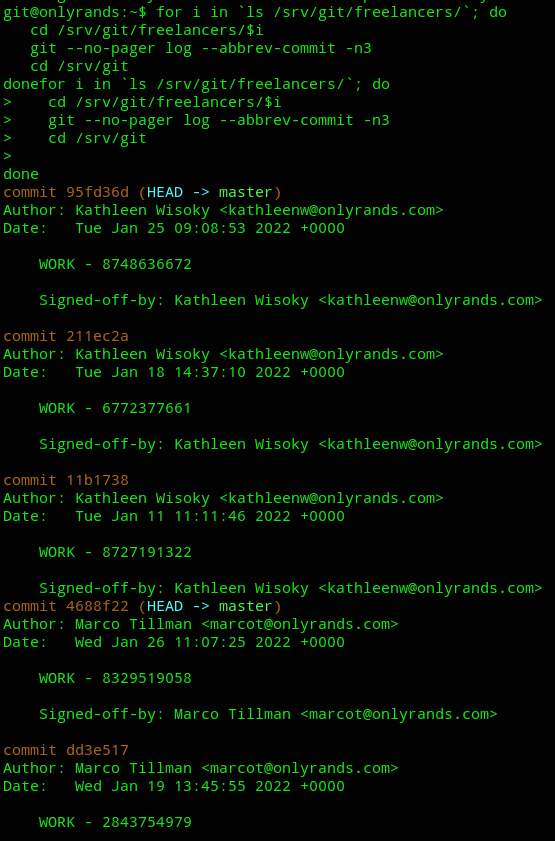

We see that every message is signed off with **WORK** which is a recurring pattern.

We can then modify the `bash` script to look as follows in order to find messages that do *NOT* follow the pattern.

```bash
for i in `ls /srv/git/freelancers/`; do
  echo "Repository: /srv/git/freelancers/$i"
  cd /srv/git/freelancers/$i
  git --no-pager log --abbrev-commit -n3 --invert-grep --grep='^WORK'
  cd /srv/git
done
```

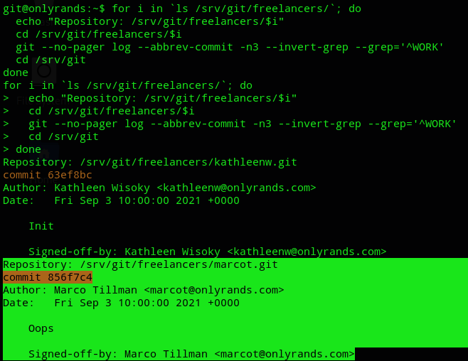

This one stands out, since it just says **Oops** it means they probably fucked up.

```bash
git --no-pager show 856f7c4
```

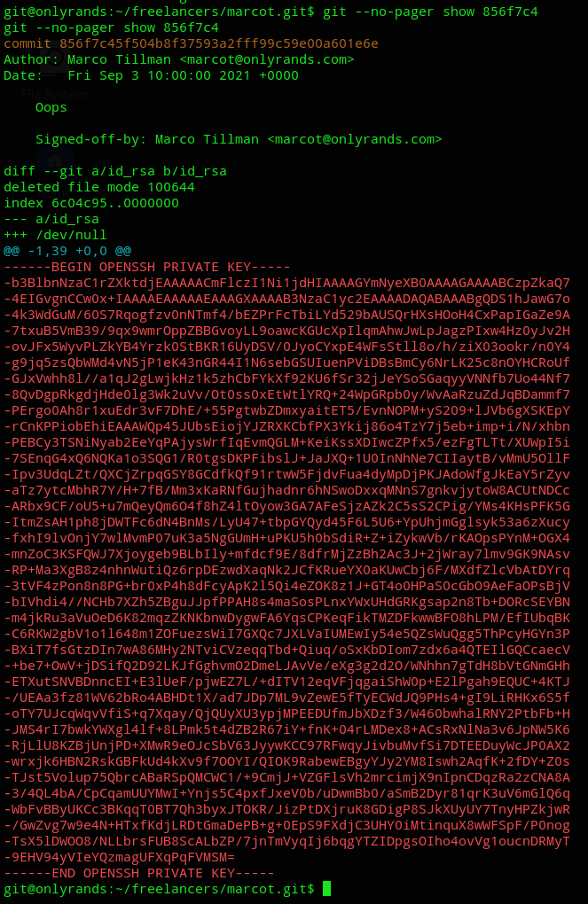

Oh they did fuck up.

Let's copy the private key and use it to log in as this user.

>[!danger]
>This is a diff for a deleted file, meaning each deleted line (i.e. the entire file) is prefixed with a (-) sign. Therefore when pasting, we'll make sure to delete the entire first column.

We will now attempt to crack the key:

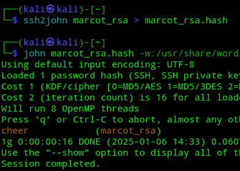

Let's log in.

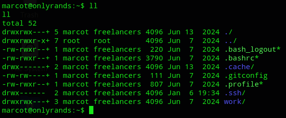

We can now further enumerate the system.


# System Enumeration

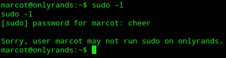

Crap.

Let's go ahead and download over `linpeas.sh`


We didn't find anything useful but that might tell us more about what else we could check.

Circling back to our `nmap` scan we found out that there was also a **SMTP** server running on port `25` with a shit ton of users found.

We can check the mailbox by simply using the `mail` command:

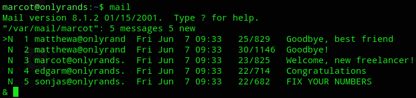

>[!note]
>We can go from top to bottom through all the mail using the `Enter` button.

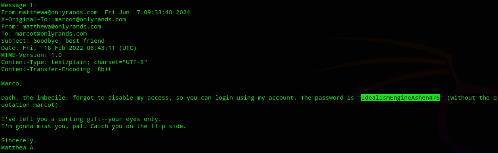

```
matthewa
IdealismEngineAshen476
```

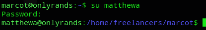

We have further laterally moved to *matthewa*.

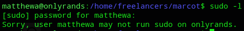

But unfortunately we could *STILL* not run `sudo -l`.

We do find something interesting in the `/home` directory:

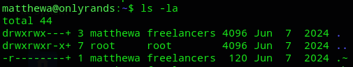

There seems to be a hidden file?

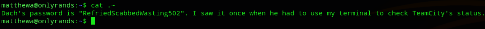

Nice lol.

```
"dach"?
RefriedScabbedWasting502
```

# Privilege Escalation

But who is this *Dach*? I decided to once again check my mailbox as *matthewa*.

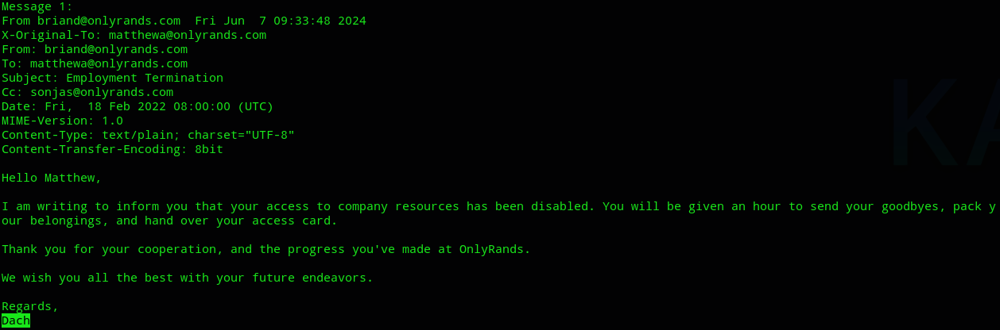

Turns out it's the *briand* user, and by the way he's talking in the message he seems to be a higher positioned dude.

Time to escalate privileges.

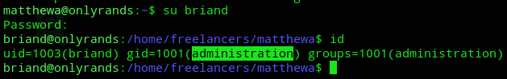

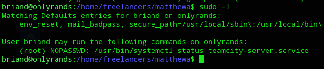

Turns out this is indeed an Administrator with NOPASSWD privileges on the `systemctl` binary. Unfortunately for us it only checks the server status which on itself isn't a valid PrivEsc vector.

*However* we can check the systemctl version by using `systemd --version`.

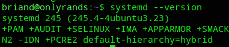

Perhaps we can find a CVE for this version?

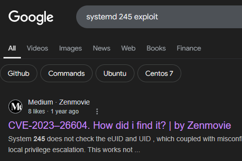

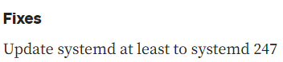

So we need to check for exploits below `247`.

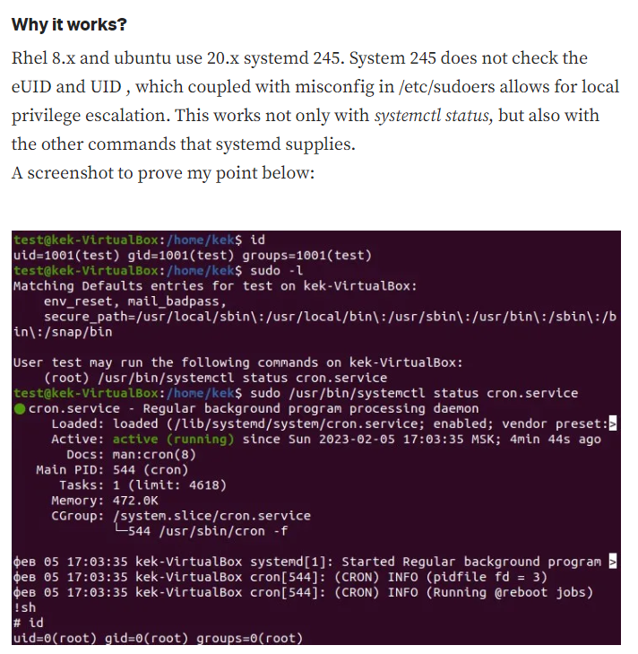

So basically we issue the command, then go ahead and issue `!sh` and we become `root`?

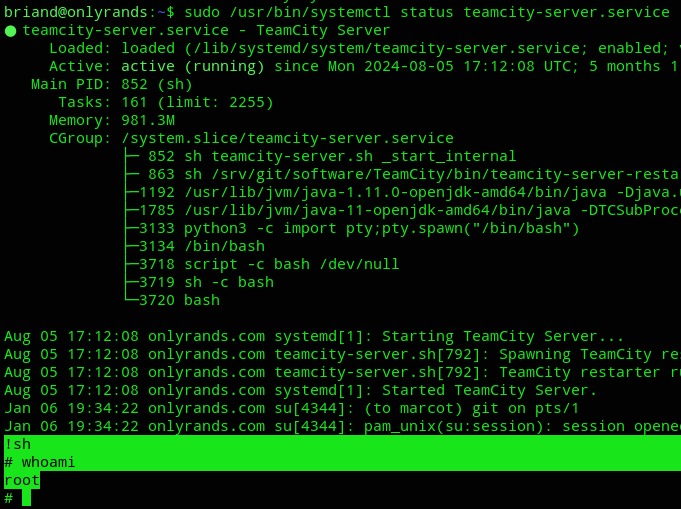

I guess it really is as simple as that.


### proof.txt

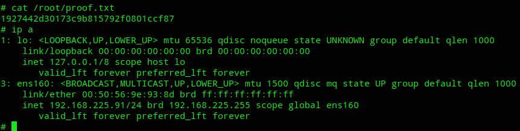

>[!summary]
>This box was REALLY hard and I had to check the walkthrough quite often.

---

**Finished 21:13 06-01-2025**

[^Links]: [[OSCP Prep]] 

#scripting #smtp #enumeration #metasploit #CVE-2024-27198 #CVE-2023-26604 #TeamCity 
