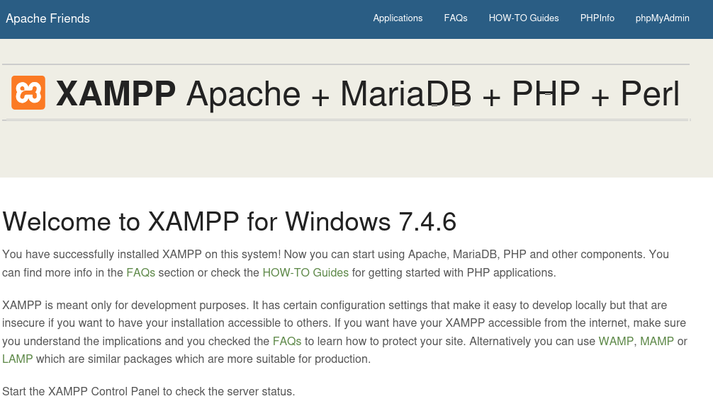

**Start 16:02 23-02-2025**

---
```
Scope:
192.168.246.53
```
## Recon

### Nmap

```bash
sudo nmap -sC -sV -vvvv -p- slort -sT -T5 --min-rate=5000

PORT      STATE SERVICE       REASON  VERSION
21/tcp    open  ftp           syn-ack FileZilla ftpd 0.9.41 beta
| ftp-syst: 
|_  SYST: UNIX emulated by FileZilla
135/tcp   open  msrpc         syn-ack Microsoft Windows RPC
139/tcp   open  netbios-ssn   syn-ack Microsoft Windows netbios-ssn
445/tcp   open  microsoft-ds? syn-ack
3306/tcp  open  mysql         syn-ack MariaDB 10.3.24 or later (unauthorized)
4443/tcp  open  http          syn-ack Apache httpd 2.4.43 ((Win64) OpenSSL/1.1.1g PHP/7.4.6)
| http-title: Welcome to XAMPP
|_Requested resource was http://slort:4443/dashboard/
| http-methods: 
|_  Supported Methods: GET POST OPTIONS
|_http-favicon: Unknown favicon MD5: 6EB4A43CB64C97F76562AF703893C8FD
|_http-server-header: Apache/2.4.43 (Win64) OpenSSL/1.1.1g PHP/7.4.6
5040/tcp  open  unknown       syn-ack
7680/tcp  open  pando-pub?    syn-ack
8080/tcp  open  http          syn-ack Apache httpd 2.4.43 ((Win64) OpenSSL/1.1.1g PHP/7.4.6)
49664/tcp open  msrpc         syn-ack Microsoft Windows RPC
49665/tcp open  msrpc         syn-ack Microsoft Windows RPC
49666/tcp open  msrpc         syn-ack Microsoft Windows RPC
49667/tcp open  msrpc         syn-ack Microsoft Windows RPC
49668/tcp open  msrpc         syn-ack Microsoft Windows RPC
49669/tcp open  msrpc         syn-ack Microsoft Windows RPC
Service Info: OS: Windows; CPE: cpe:/o:microsoft:windows

Host script results:
|_clock-skew: -1s
| smb2-time: 
|   date: 2025-02-23T15:09:24
|_  start_date: N/A
| p2p-conficker: 
|   Checking for Conficker.C or higher...
|   Check 1 (port 9776/tcp): CLEAN (Couldn't connect)
|   Check 2 (port 40292/tcp): CLEAN (Couldn't connect)
|   Check 3 (port 11653/udp): CLEAN (Failed to receive data)
|   Check 4 (port 52321/udp): CLEAN (Timeout)
|_  0/4 checks are positive: Host is CLEAN or ports are blocked
| smb2-security-mode: 
|   3:1:1: 
|_    Message signing enabled but not required
```


### 21/TCP - FTP


### 445/TCP - SMB


### 4443/TCP - HTTP





We find the following *very* promising info!


:::tip
If `allow_url_open` and/or `allow_url_include` are set to **On**, that means that **RFI** is HIGHLY LIKELY possible!
:::

### Remote File Inclusion

Let's test for RFI.


We will then head on over and type the following in the URL:


We notice right away that it works! Our suspicions have been confirmed, let's create a reverse shell.

We will use the [following php reverse shell](https://github.com/ivan-sincek/php-reverse-shell/blob/master/src/reverse/php_reverse_shell.php?ref=benheater.com) for this task.


Modify the above and now we can upload it.


## Foothold


EZ PZ.

Let's check our privs first of all.


Unfortunate.


### local.txt


## Enumeration


We find a non-default directory with some files, let's check them out.

I just notice a `.dll` mentioned in here the whole time:


Looks like it's time to overwrite this file, this is HIGHLY LIKELY part of a scheduled task that runs under *Administrator* rights.


## Privilege Escalation

### Service Binary Hijacking

We craft up our payload:


And we upload it to the target:


Almost instantly I get a reverse shell:


### proof.txt


---

**Finished 17:00 23-02-2025**

[^Links]: [[OSCP Prep]]
