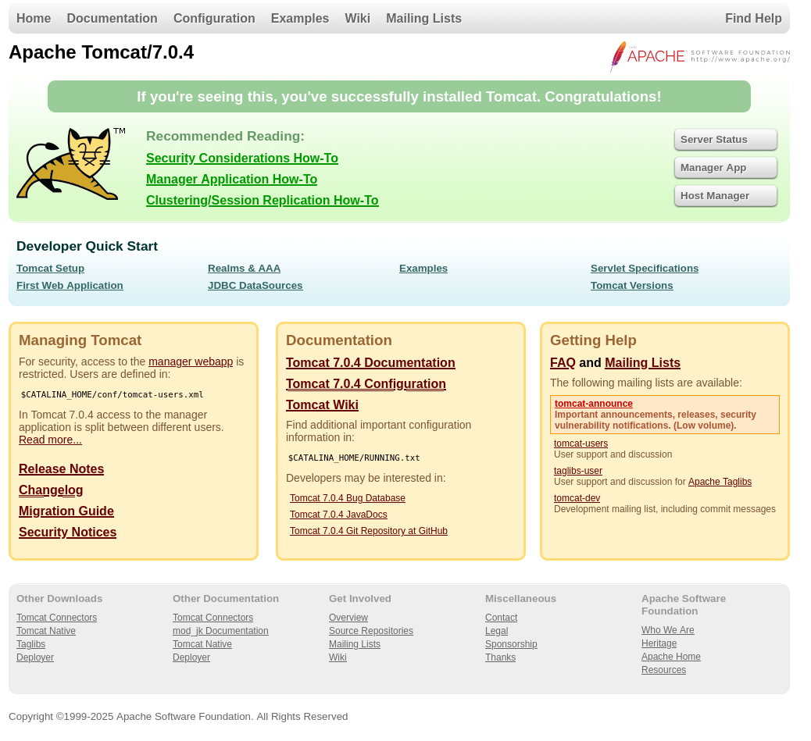
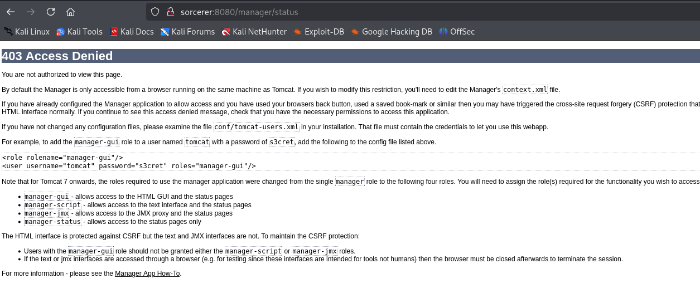

**Start 17:01 24-04-2025**

---
```
Scope:
192.168.215.100
```
# Recon

## Nmap

```bash
sudo nmap -sC -sV sorcerer -sT -T5 --min-rate=5000 -Pn -vvvv

PORT     STATE SERVICE REASON  VERSION
22/tcp    open  ssh      syn-ack OpenSSH 7.9p1 Debian 10+deb10u2 (protocol 2.0)
80/tcp    open  http     syn-ack nginx
| http-methods: 
|_  Supported Methods: GET HEAD
|_http-title: Site doesn't have a title (text/html).
111/tcp   open  rpcbind  syn-ack 2-4 (RPC #100000)
| rpcinfo: 
|   program version    port/proto  service
|   100000  2,3,4        111/tcp   rpcbind
|   100000  2,3,4        111/udp   rpcbind
|   100003  3           2049/udp   nfs
|   100003  3,4         2049/tcp   nfs
|   100005  1,2,3      34625/tcp   mountd
|   100005  1,2,3      39117/udp   mountd
|   100021  1,3,4      36944/udp   nlockmgr
|   100021  1,3,4      45551/tcp   nlockmgr
|   100227  3           2049/tcp   nfs_acl
|_  100227  3           2049/udp   nfs_acl
2049/tcp  open  nfs      syn-ack 3-4 (RPC #100003)
7742/tcp  open  http     syn-ack nginx
|_http-title: SORCERER
| http-methods: 
|_  Supported Methods: GET HEAD POST OPTIONS
8080/tcp  open  http     syn-ack Apache Tomcat 7.0.4
| http-methods: 
|_  Supported Methods: GET HEAD POST OPTIONS
|_http-title: Apache Tomcat/7.0.4
|_http-favicon: Apache Tomcat
34625/tcp open  mountd   syn-ack 1-3 (RPC #100005)
43449/tcp open  mountd   syn-ack 1-3 (RPC #100005)
45551/tcp open  nlockmgr syn-ack 1-4 (RPC #100021)
49951/tcp open  mountd   syn-ack 1-3 (RPC #100005)
Service Info: OS: Linux; CPE: cpe:/o:linux:linux_kernel
```

## 80/TCP - HTTP

Seems empty:


## 8080/TCP - HTTP



And all the other significant `/manager` pages are disallowed for us...



>[!note]
>I then tried NFS and RPC, both failed.


## 7742/TCP - HTTP


## Zip files


No way we actually found `.ssh` keys...?


Ah yes, of course it wouldn't be THAT easy.

What else do we have?


```
tomcat
VTUD2XxJjf5LPmu6
```

And this file:


>[!note]
>I found a login page as well on the `7742` port, however the creds didn't work:


Let's check out the rest of *max*'s files:


Essentially the `authorized_keys` has the line in front that makes us unable to connect. We'll replace this file with the `id_rsa.pub` file instead, since that seems to be the original.


Since the `scp` command seems to work, judging from the script, we should be able to `scp` the files and overwrite the current ones, essentially giving ourselves a way to SSH into the system.

# Foothold
## Copying over SSH files


EZ access.

Unfortunately for us, no `local.txt` file yet:


## local.txt

No problem though:


## Enumeration


That's interesting.

I downloaded over some tools to check out the environment.

### pspy


The process under `UID=1005` seems interesting and long, make me wonder if that's our entry.

### linpeas.sh


Perhaps this is our PE vector?


# Privilege Escalation
## SUID 

This was pretty straight forward, just copy and paste:


## proof.txt


>[!summary]
>This one was actually super easy and I did not require any help!

---

**Finished 17:55 24-04-2025**

[^Links]: [[OSCP Prep]]

#SUID 