**Start 08:19 21-05-2025**

---
```
Scope:
192.168.239.214
```

# Objectives

:::summary
This lab challenges learners to uncover and exploit misconfigurations within a seemingly secure network environment. By identifying exposed internal services and leveraging weak credentials, learners gain initial access before pivoting through the system to escalate privileges. The scenario emphasizes enumeration, abuse of common tools, and lateral movement, testing real-world penetration skills in a layered, realistic setup.
:::

This hands-on lab immerses learners in a realistic network environment where seemingly secure systems hide critical misconfigurations. Participants will start by enumerating exposed services and identifying weak points in the infrastructure. Using techniques such as service exploitation and credential abuse, learners will gain initial access, escalate privileges, and pivot across the network to access restricted systems. The lab emphasizes core penetration testing skills including enumeration, privilege escalation, and lateral movement—mirroring real-world attack scenarios.

This lab is ideal for aspiring penetration testers, red teamers, and cybersecurity professionals aiming to sharpen their offensive security skills. Participants will gain practical experience in uncovering service misconfigurations, exploiting internal tools, and navigating complex environments—essential capabilities for anyone preparing for certifications or active roles in offensive security.
## Recon
### Nmap

```bash
sudo nmap -sC -sV spidersociety -sT -vvvv -p- -Pn -T5 --min-rate=5000

PORT     STATE SERVICE REASON  VERSION
22/tcp   open  ssh     syn-ack OpenSSH 9.6p1 Ubuntu 3ubuntu13.9 (Ubuntu Linux; protocol 2.0)
80/tcp   open  http    syn-ack Apache httpd 2.4.58 ((Ubuntu))
|_http-title: Spider Society
|_http-server-header: Apache/2.4.58 (Ubuntu)
| http-methods: 
|_  Supported Methods: GET POST OPTIONS HEAD
|_http-favicon: Unknown favicon MD5: 6415DD3213A122D39F9E526862609952
2121/tcp open  ftp     syn-ack vsftpd 3.0.5
```

### 80/TCP - HTTP


There's a **Login** button but it leads straight to `404.html`:


`feroxbuster` didn't find anything useful either:

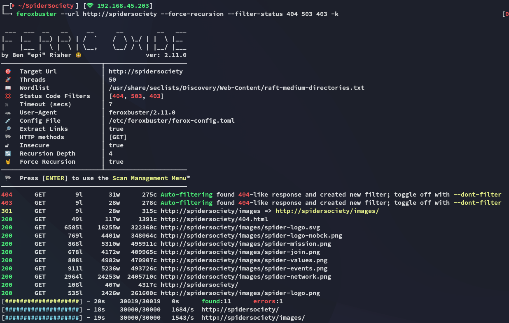

I launched `finalrecon` to see whether it could find anything:

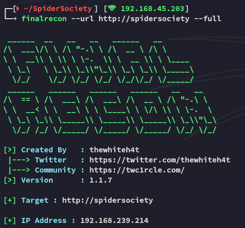

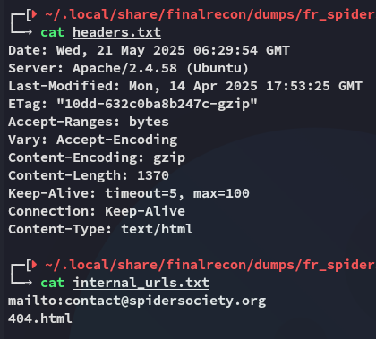

Is that really it? Let's launch `gobuster`:

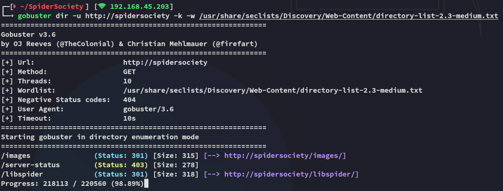

After waiting for a long time we finally found a hidden directory.


Using `admin - admin` default creds we easily get in:

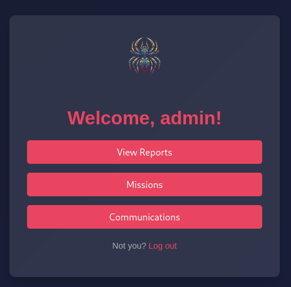

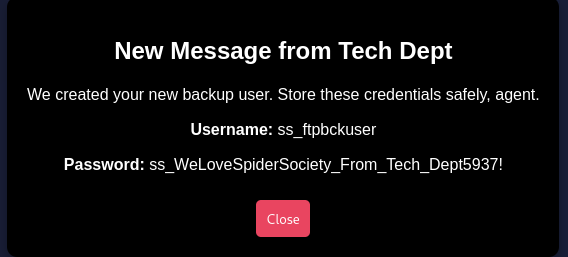

```
ss_ftpbckuser
ss_WeLoveSpiderSociety_From_Tech_Dept5937!
```

### 2121/TCP - FTP

Using the found creds we log into `ftp`:

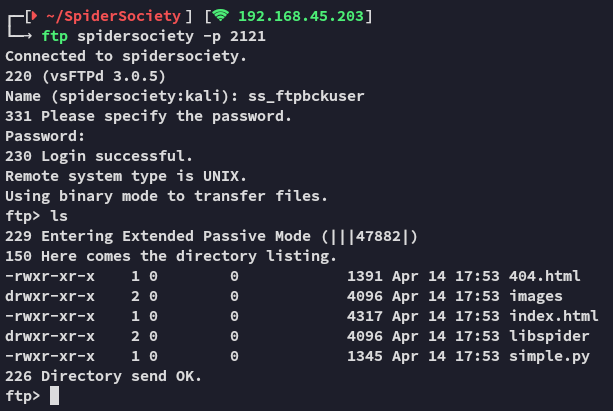

Let's see if we can upload files here:

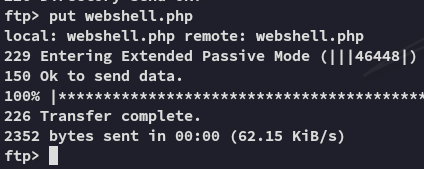

We can! Let's go to the webshell.

:::fail
We need to `chmod 755` first to be able to view the contents of the file on the webserver.
:::

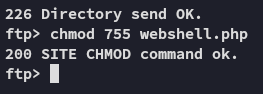

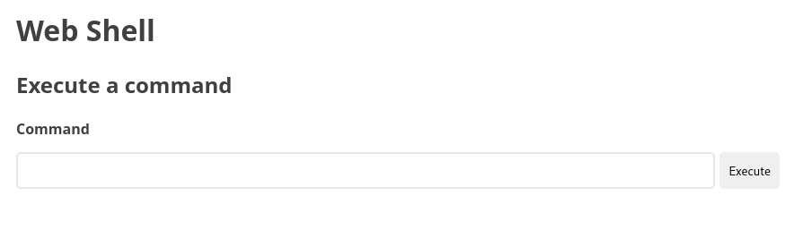

I then tried to get a reverse shell but found that I couldn't reach my own machine:

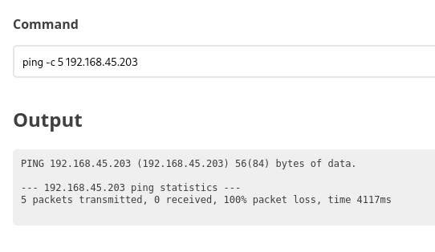

:::note
Time for a reset.
:::

## Foothold
### Shell as www-data

After a reset & reboot I was good to go.

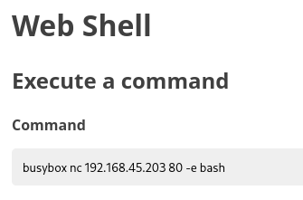

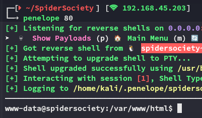

I enumerated the users and found the following:

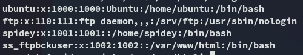

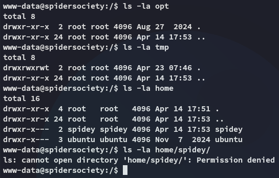

I started enumerating from the `/` directory:

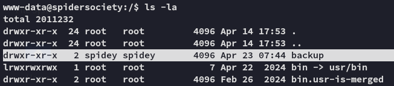

This stuck out to me as it's a non-default directory.

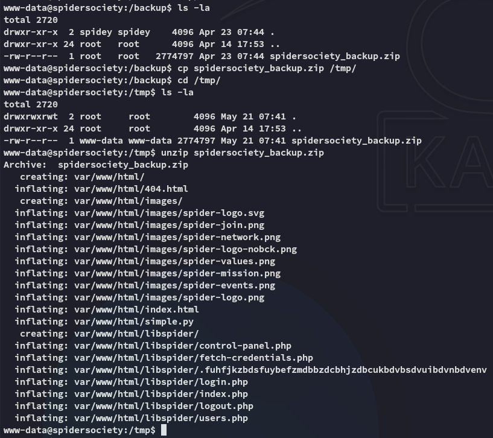

I found a `backup.zip` file which I copied over to the `/tmp` directory and unzipped.

Inside I found an unusual hidden file:

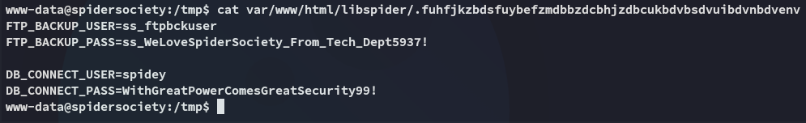

We found a new set of creds for spidey!

```
spidey
WithGreatPowerComesGreatSecurity99!
```

However I could not find any DB ports open:

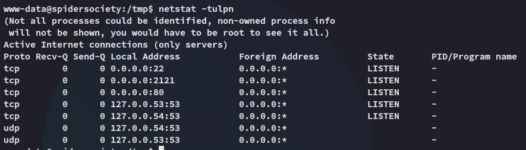

I figured we could use these creds for `ssh` access.

## SSH as Spidey

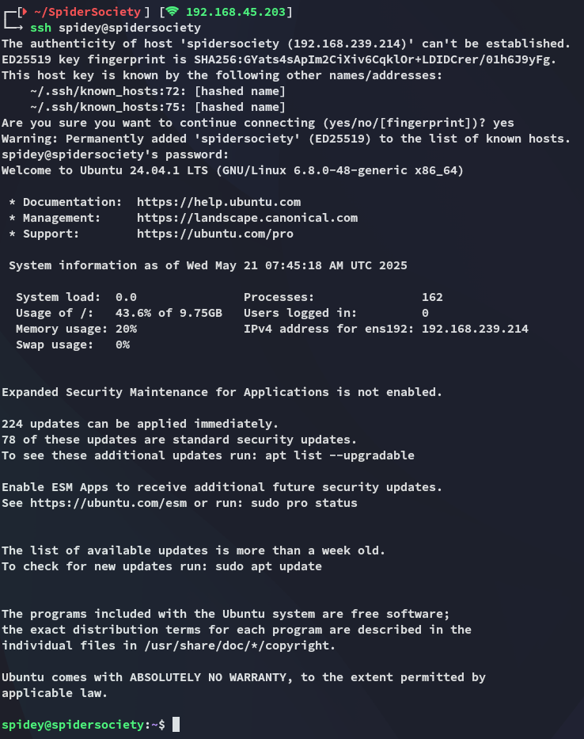

And we get in!

### local.txt

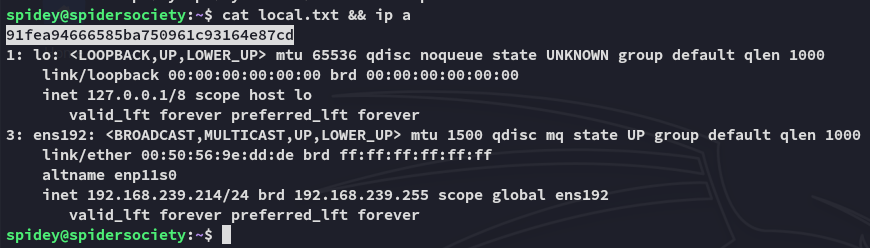

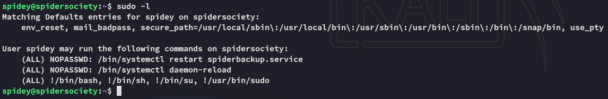

Well well well, let's check out this service.

## Privilege Escalation
### Spiderbackup.service

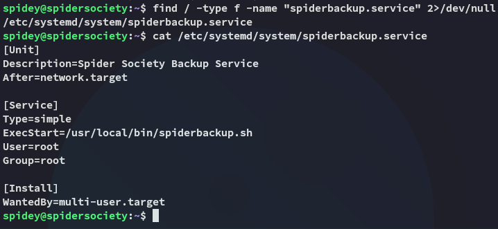

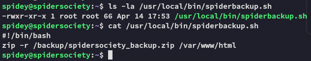

So it seems the service is using the script to start up, where the script zips up the contents of `/var/www/html` into a `backup.zip` file.

The BEST part however is that the service is owned by *spidey*:

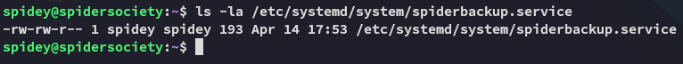

Meaning we can easily overwrite this so we get a reverse shell as *root*.

## Exploit

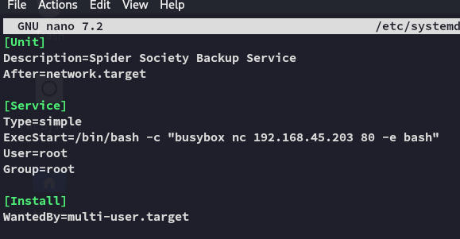

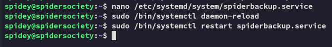

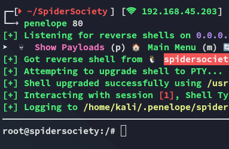

EZ PZ

### proof.txt

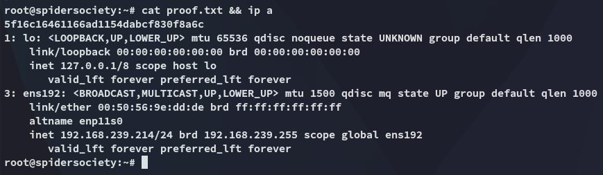

---

**Finished 10:10 21-05-2025**

[^Links]: [[OSCP Prep]]
