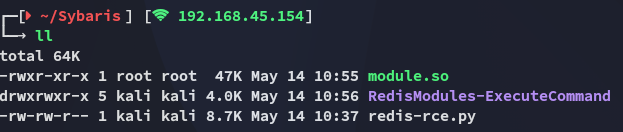

**Start 10:21 14-05-2025**

---
```
Scope:
192.168.106.93
```
# Recon

## Nmap

```bash
sudo nmap -sC -sV sybaris -sT -T5 --min-rate=5000 -Pn -vvvv -p-

PORT      STATE  SERVICE   REASON       VERSION
21/tcp    open   ftp       syn-ack      vsftpd 3.0.2
| ftp-anon: Anonymous FTP login allowed (FTP code 230)
|_drwxrwxrwx    2 0        0               6 Apr 01  2020 pub [NSE: writeable]
| ftp-syst: 
|   STAT: 
| FTP server status:
|      Connected to 192.168.45.154
|      Logged in as ftp
|      TYPE: ASCII
|      No session bandwidth limit
|      Session timeout in seconds is 300
|      Control connection is plain text
|      Data connections will be plain text
|      At session startup, client count was 4
|      vsFTPd 3.0.2 - secure, fast, stable
|_End of status
22/tcp    open   ssh       syn-ack      OpenSSH 7.4 (protocol 2.0)
80/tcp    open   http      syn-ack      Apache httpd 2.4.6 ((CentOS) PHP/7.3.22)
|_http-title: Sybaris - Just another HTMLy blog
|_http-favicon: Unknown favicon MD5: A4DA8778FE902EB34FD9A5D4C0A832E1
| http-robots.txt: 11 disallowed entries 
| /config/ /system/ /themes/ /vendor/ /cache/ 
| /changelog.txt /composer.json /composer.lock /composer.phar /search/ 
|_/admin/
|_http-server-header: Apache/2.4.6 (CentOS) PHP/7.3.22
| http-cookie-flags: 
|   /: 
|     PHPSESSID: 
|_      httponly flag not set
|_http-generator: HTMLy v2.7.5
| http-methods: 
|_  Supported Methods: GET POST
6379/tcp  open   redis     syn-ack      Redis key-value store 5.0.9
```

## 21/TCP - FTP


There's nothing here but this could be potentially a directory where we can upload scripts since it is allowed.


Moving on for now though

## 80/TCP - HTTP

We found a `robots.txt` file in the `nmap` scan:


I also found a login page but had no credentials to log in so I looked at the **Redis** port as this could LIKELY be a rabbithole.

## 6379/TCP - Redis


I have already exploited **Redis** previously and tried the same techniques here again:


Unfortunately it didn't work, and here we pay attention to the error at the end:

```bash
[-] Error:-ERR unknown command `system.exec`, with args beginning with: `whoami`, , check your module!
```

### HackTricks to the rescue

I looked this error up and found the following on HackTricks:


I follow the instructions and run the following commands:

```bash
git clone https://github.com/n0b0dyCN/RedisModules-ExecuteCommand.git
cd RedisModules-ExecuteCommand
sudo make
```

And as a result I get the following `module.so` file:



I can now go ahead and upload this to `ftp` and execute the `rce` script again.


### Redis-cli

Now that we have uploaded the module to `ftp` we need to `LOAD` it using `redis-cli`:


When that is done we can now execute the rce payload.

# Foothold
## Shell as Pablo


Just like that we got easy access.

### local.txt


# Privilege Escalation
## Enumeration

I launched `linpeas.sh` and started checking the results:


That's quite an outdated Linux version


However it also displayed `PwnKit`:


Since I already had the script locally I would upload and run it.


### proof.txt


---

**Finished 11:36 14-05-2025**

[^Links]: [[OSCP Prep]]

#pwnkit #redis 