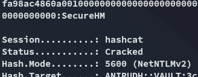

**Start 12:56 23-05-2025**

---
```
Scope:
192.168.156.172
```
# Recon

## Nmap

```bash
sudo nmap -sC -sV -sT -vvvv -p- -Pn -T5 --min-rate=5000 vault

PORT      STATE SERVICE       REASON  VERSION
53/tcp    open  domain        syn-ack Simple DNS Plus
88/tcp    open  kerberos-sec  syn-ack Microsoft Windows Kerberos (server time: 2025-05-23 10:59:00Z)
135/tcp   open  msrpc         syn-ack Microsoft Windows RPC
139/tcp   open  netbios-ssn   syn-ack Microsoft Windows netbios-ssn
389/tcp   open  ldap          syn-ack Microsoft Windows Active Directory LDAP (Domain: vault.offsec0., Site: Default-First-Site-Name)
445/tcp   open  microsoft-ds? syn-ack
464/tcp   open  kpasswd5?     syn-ack
593/tcp   open  ncacn_http    syn-ack Microsoft Windows RPC over HTTP 1.0
636/tcp   open  tcpwrapped    syn-ack
3268/tcp  open  ldap          syn-ack Microsoft Windows Active Directory LDAP (Domain: vault.offsec0., Site: Default-First-Site-Name)
3269/tcp  open  tcpwrapped    syn-ack
3389/tcp  open  ms-wbt-server syn-ack Microsoft Terminal Services
| rdp-ntlm-info: 
|   Target_Name: VAULT
|   NetBIOS_Domain_Name: VAULT
|   NetBIOS_Computer_Name: DC
|   DNS_Domain_Name: vault.offsec
|   DNS_Computer_Name: DC.vault.offsec
|   DNS_Tree_Name: vault.offsec
|   Product_Version: 10.0.17763
|_  System_Time: 2025-05-23T10:59:55+00:00
| ssl-cert: Subject: commonName=DC.vault.offsec
| Issuer: commonName=DC.vault.offsec
|_ssl-date: 2025-05-23T11:00:35+00:00; +1s from scanner time.
5985/tcp  open  http          syn-ack Microsoft HTTPAPI httpd 2.0 (SSDP/UPnP)
|_http-title: Not Found
|_http-server-header: Microsoft-HTTPAPI/2.0
9389/tcp  open  mc-nmf        syn-ack .NET Message Framing
49666/tcp open  msrpc         syn-ack Microsoft Windows RPC
49668/tcp open  msrpc         syn-ack Microsoft Windows RPC
49675/tcp open  ncacn_http    syn-ack Microsoft Windows RPC over HTTP 1.0
49676/tcp open  msrpc         syn-ack Microsoft Windows RPC
49681/tcp open  msrpc         syn-ack Microsoft Windows RPC
49708/tcp open  msrpc         syn-ack Microsoft Windows RPC
Service Info: Host: DC; OS: Windows; CPE: cpe:/o:microsoft:windows
```

## Enum4Linux-NG


## 445/TCP - SMB
### SMBclient

I tried out logging in anonymously and was succesfull!


We see the non-default share `DocumentsShare`:


It turns out empty, but since this seems like the only possible attack vector, we can try out uploading files.


Well look at that, it works indeed!

### ntlm_theft

What we'll be doing now is basically the same as my [[Laser#ntlm_theft]] writeup where we will use the `ntlm_theft` tool to create a malicious URL, upload it to the share and then in turn get the hash via `responder`.


We will now be uploading the `.lnk` file to `smb` and start up `responder`:


After waiting for a little while:


>[!note]
>Funny enough, subsequently at the same time my `kerbrute` brute force found the same user present on the target:
>


### Hashcat

Time to start cracking the hash:




Within no time it cracked the hash succesfully.

```
anirudh
SecureHM
```

I then went to straight password spraying and had good luck!


# Foothold
## Shell as anirudh

I easily get in and start my enum:


I noticed an interesting file in my directory:


Before I started going further I went ahead and got the `local.txt` flag.

### local.txt


# Privilege Escalation
## SeBackupPrivilege

Eventhough we didn't find `SeImpersonatePrivilege`, we *did* find `SeBackupPrivilege` which is also super valuable:


This means we can go ahead and use the following commands to retrieve both `SAM` and `SYSTEM` and in turn crack them using `secretsdump`.

```powershell
reg save hklm\sam SAM
reg save hklm\system SYSTEM
```


Now let's crack it using `secretsdump`:


We can now either go ahead and try to crack the hash....or we can just pass it and log in as *Admin* via `psexec`.

### Pass The Hash - FAIL


We end up completely and utterly failing so we need to check for other options.

## SeRestorePrivilege

I have never encountered this one before but let's try it out:


I go to the website and find the following instructions inside the `README`:


Pretty straightforward, let's try it out:


I went ahead and copied my favorite trusty reverse shell:


>[!note]
>This one never fails on me 😎

### proof.txt


---

**Finished 14:05 23-05-2025**

[^Links]: [[OSCP Prep]]

#SeRestorePrivilege #SeBackupPrivilege #ntlm_theft 