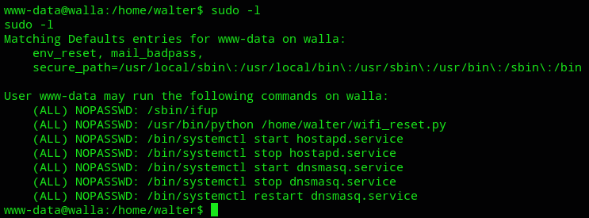

**Start 12:08 03-01-2025**

---
```
Scope:
192.168.196.97
```
## Recon

### Nmap

```bash
sudo nmap -sC -sV -oN nmap 192.168.196.97 -T5 -vvvv --min-rate=5000 -sT -p-

PORT      STATE SERVICE    REASON  VERSION
22/tcp    open  ssh        syn-ack OpenSSH 7.9p1 Debian 10+deb10u2 (protocol 2.0)
23/tcp    open  telnet     syn-ack Linux telnetd
25/tcp    open  smtp       syn-ack Postfix smtpd
53/tcp    open  tcpwrapped syn-ack
422/tcp   open  ssh        syn-ack OpenSSH 7.9p1 Debian 10+deb10u2 (protocol 2.0)
8091/tcp  open  http       syn-ack lighttpd 1.4.53
| http-methods: 
|_  Supported Methods: GET HEAD POST OPTIONS
| http-cookie-flags: 
|   /: 
|     PHPSESSID: 
|_      httponly flag not set
|_http-favicon: Unknown favicon MD5: B5F9F8F2263315029AD7A81420E6CC2D
|_http-server-header: lighttpd/1.4.53
| http-auth: 
| HTTP/1.1 401 Unauthorized\x0D
|_  Basic realm=RaspAP
|_http-title: Site doesn't have a title (text/html; charset=UTF-8).
42042/tcp open  ssh        syn-ack OpenSSH 7.9p1 Debian 10+deb10u2 (protocol 2.0)
Service Info: Host:  walla; OS: Linux; CPE: cpe:/o:linux:linux_kernel
```

For some reason there's just 3 SSH services running which seems odd.

There's also a `telnet` server running and a web server on `8091`. When heading to the webpage we're just greeted with the following:


We notice the `Basic realm=RaspAP` name so let's check for default creds.


I tried it and was succesfull.


For now I went ahead and enumerated the other ports as well:


### SMTP

```bash
smtp-user-enum -t 192.168.196.97 -U /usr/share/seclists/Usernames/xato-net-10-million-usernames.txt 

######## Scan started at Fri Jan  3 06:27:11 2025 #########
192.168.196.97: mail exists
192.168.196.97: root exists
192.168.196.97: terry exists
192.168.196.97: news exists
192.168.196.97: man exists
192.168.196.97: bin exists
192.168.196.97: games exists
192.168.196.97: nobody exists
192.168.196.97: walter exists
192.168.196.97: backup exists
192.168.196.97: daemon exists
192.168.196.97: proxy exists
192.168.196.97: Terry exists
192.168.196.97: list exists
192.168.196.97: TERRY exists
192.168.196.97: Man exists
192.168.196.97: Daemon exists
192.168.196.97: postmaster exists
192.168.196.97: paige exists
192.168.196.97: sys exists
192.168.196.97: Proxy exists
192.168.196.97: janis exists
```

I tried to use `hydra` to brute force myself into it using a password list but got a bunch of error messages:


For now nothing came of the other ports.

## Initial Foothold

### 8091/TCP - HTTP

I went ahead and took a dive into this web page and started snooping around.


I checked around and found [the following](https://github.com/gerbsec/CVE-2020-24572-POC):


I downloaded and inspected it:


:::success
Luckily for me the payload fired right away and I got access as `www-data`.
:::


Here I found the same users that `smtp-user-check` enumerated for me.

### local.txt

I went into `walter`'s directory since I had access and got the flag:


## Privilege Escalation

For my next steps I started off with `sudo -l`:



I notice that I can run the `wifi_reset.py` binary using sudo as `www-data` which could be a potential priv-esc manouvre.


There must be a way for us to create our own version of `wifi_reset.py` that gives us a root shell.

We cannot *edit* the current file since it is owned by `root` however.


Still I was able to `rm` the current file and replace it with my own:


I could now go ahead and run the binary as `sudo`.


### proof.txt


---

**Finished 12:57 03-01-2025**

[^Links]: [[OSCP Prep]] 
