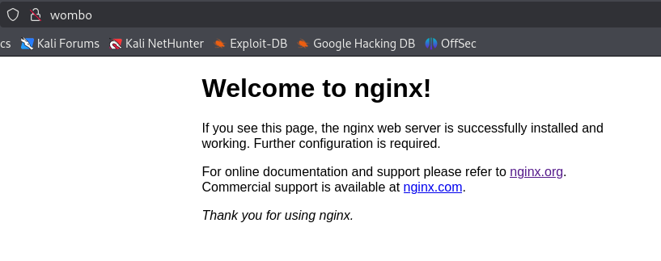
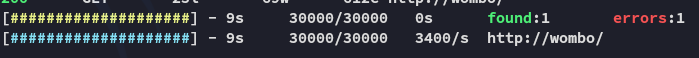
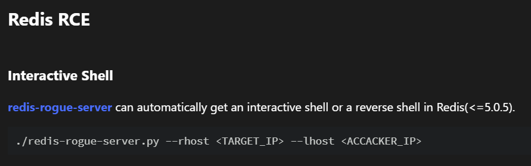
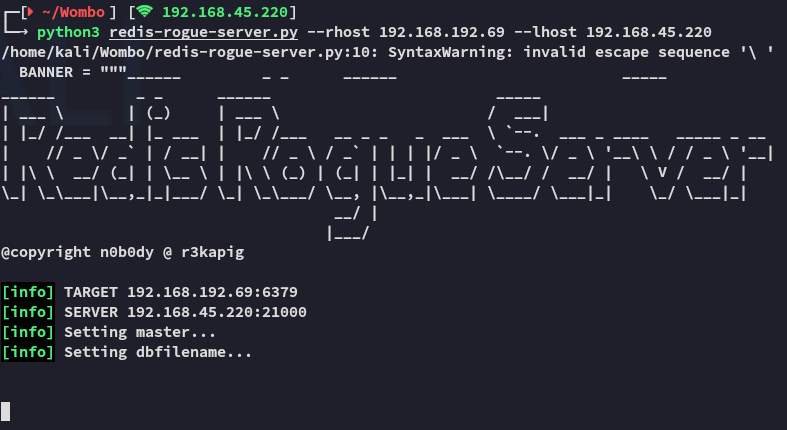
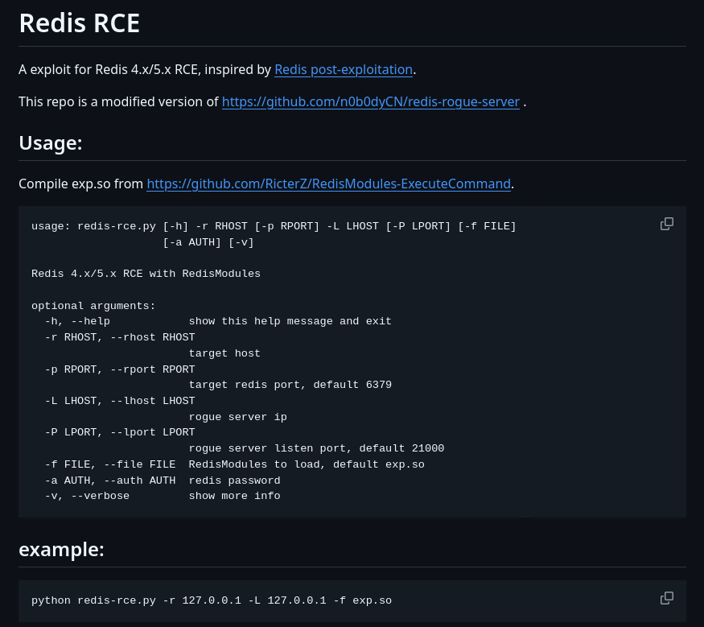
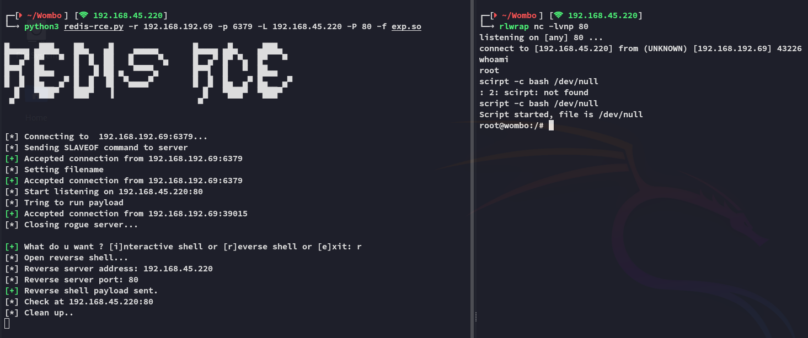
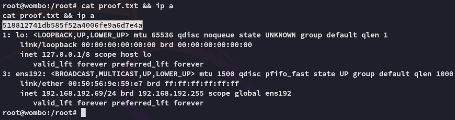

**Start 19:22 26-02-2025**

---
```
Scope:
192.168.192.69
```
# Recon

## Nmap

```bash
sudo nmap -sC -sV -vvvv -p- wombo -sT -T5 --min-rate=5000

PORT      STATE  SERVICE    REASON       VERSION
22/tcp    open   ssh        syn-ack      OpenSSH 7.4p1 Debian 10+deb9u7 (protocol 2.0)
80/tcp    open   http       syn-ack      nginx 1.10.3
|_http-server-header: nginx/1.10.3
|_http-title: Welcome to nginx!
| http-methods: 
|_  Supported Methods: GET HEAD
6379/tcp  open   redis      syn-ack      Redis key-value store 5.0.9
8080/tcp  open   http-proxy syn-ack
| http-robots.txt: 3 disallowed entries 
|_/admin/ /reset/ /compose
| http-methods: 
|_  Supported Methods: GET HEAD POST OPTIONS
|_http-favicon: Unknown favicon MD5: 152FF7D5AE5BDB84B33D4DCA31EB7CD3
|_http-title: Home | NodeBB
| fingerprint-strings: 
|   FourOhFourRequest: 
|     HTTP/1.1 404 Not Found
|     X-DNS-Prefetch-Control: off
|     X-Frame-Options: SAMEORIGIN
|     X-Download-Options: noopen
|     X-Content-Type-Options: nosniff
|     X-XSS-Protection: 1; mode=block
|     Referrer-Policy: strict-origin-when-cross-origin
|     X-Powered-By: NodeBB
|     set-cookie: _csrf=k1Z1DkzHNIuaNRITv4jVw54m; Path=/
|     Content-Type: text/html; charset=utf-8
|     Content-Length: 11098
|     ETag: W/"2b5a-HX157Dv2tQrZOgc4sT546eQQVc0"
|     Vary: Accept-Encoding
|     Date: Wed, 26 Feb 2025 18:24:10 GMT
|     Connection: close
|     <!DOCTYPE html>
|     <html lang="en-GB" data-dir="ltr" style="direction: ltr;" >
|     <head>
|     <title>Not Found | NodeBB</title>
|     <meta name="viewport" content="width&#x3D;device-width, initial-scale&#x3D;1.0" />
|     <meta name="content-type" content="text/html; charset=UTF-8" />
|     <meta name="apple-mobile-web-app-capable" content="yes" />
|     <meta name="mobile-web-app-capable" content="yes" />
|     <meta property="og:site_n
|   GetRequest: 
|     HTTP/1.1 200 OK
|     X-DNS-Prefetch-Control: off
|     X-Frame-Options: SAMEORIGIN
|     X-Download-Options: noopen
|     X-Content-Type-Options: nosniff
|     X-XSS-Protection: 1; mode=block
|     Referrer-Policy: strict-origin-when-cross-origin
|     X-Powered-By: NodeBB
|     set-cookie: _csrf=KF3j4EPbLhSoc4F8CwPQe8Zi; Path=/
|     Content-Type: text/html; charset=utf-8
|     Content-Length: 18181
|     ETag: W/"4705-VIXMpfBs4sJIOiTM9hMX88k/yxE"
|     Vary: Accept-Encoding
|     Date: Wed, 26 Feb 2025 18:24:10 GMT
|     Connection: close
|     <!DOCTYPE html>
|     <html lang="en-GB" data-dir="ltr" style="direction: ltr;" >
|     <head>
|     <title>Home | NodeBB</title>
|     <meta name="viewport" content="width&#x3D;device-width, initial-scale&#x3D;1.0" />
|     <meta name="content-type" content="text/html; charset=UTF-8" />
|     <meta name="apple-mobile-web-app-capable" content="yes" />
|     <meta name="mobile-web-app-capable" content="yes" />
|     <meta property="og:site_name" content
|   HTTPOptions: 
|     HTTP/1.1 200 OK
|     X-DNS-Prefetch-Control: off
|     X-Frame-Options: SAMEORIGIN
|     X-Download-Options: noopen
|     X-Content-Type-Options: nosniff
|     X-XSS-Protection: 1; mode=block
|     Referrer-Policy: strict-origin-when-cross-origin
|     X-Powered-By: NodeBB
|     Allow: GET,HEAD
|     Content-Type: text/html; charset=utf-8
|     Content-Length: 8
|     ETag: W/"8-ZRAf8oNBS3Bjb/SU2GYZCmbtmXg"
|     Vary: Accept-Encoding
|     Date: Wed, 26 Feb 2025 18:24:10 GMT
|     Connection: close
|     GET,HEAD
|   RTSPRequest: 
|     HTTP/1.1 400 Bad Request
|_    Connection: close
27017/tcp open   mongodb    syn-ack      MongoDB 4.1.1 - 5.0
| mongodb-databases: 
|   code = 13
|   ok = 0.0
|   errmsg = command listDatabases requires authentication
|_  codeName = Unauthorized
| mongodb-info: 
|   MongoDB Build info
|     version = 4.0.18
|     ok = 1.0
|     allocator = tcmalloc
|     buildEnvironment
|       distmod = debian92
|       target_arch = x86_64
|       ccflags = -fno-omit-frame-pointer -fno-strict-aliasing -ggdb -pthread -Wall -Wsign-compare -Wno-unknown-pragmas -Winvalid-pch -Werror -O2 -Wno-unused-local-typedefs -Wno-unused-function -Wno-deprecated-declarations -Wno-unused-but-set-variable -Wno-missing-braces -fstack-protector-strong -fno-builtin-memcmp
|       distarch = x86_64
|       cxx = /opt/mongodbtoolchain/v2/bin/g++: g++ (GCC) 5.4.0
|       cc = /opt/mongodbtoolchain/v2/bin/gcc: gcc (GCC) 5.4.0
|       cxxflags = -Woverloaded-virtual -Wno-maybe-uninitialized -std=c++14
|       target_os = linux
|       linkflags = -pthread -Wl,-z,now -rdynamic -Wl,--fatal-warnings -fstack-protector-strong -fuse-ld=gold -Wl,--build-id -Wl,--hash-style=gnu -Wl,-z,noexecstack -Wl,--warn-execstack -Wl,-z,relro
|     versionArray
|       3 = 0
|       2 = 18
|       1 = 0
|       0 = 4
|     modules
|     maxBsonObjectSize = 16777216
|     openssl
|       running = OpenSSL 1.1.0l  10 Sep 2019
|       compiled = OpenSSL 1.1.0l  10 Sep 2019
|     javascriptEngine = mozjs
|     debug = false
|     sysInfo = deprecated
|     gitVersion = 6883bdfb8b8cff32176b1fd176df04da9165fd67
|     storageEngines
|       3 = wiredTiger
|       2 = mmapv1
|       1 = ephemeralForTest
|       0 = devnull
|     bits = 64
|   Server status
|     code = 13
|     ok = 0.0
|     errmsg = command serverStatus requires authentication
|_    codeName = Unauthorized

Service Info: OS: Linux; CPE: cpe:/o:linux:linux_kernel
```


## 80/TCP - HTTP





Nothing here


## 6379/TCP - Redis

In my [[Blackgate]] walkthrough I encountered the **Redis** service once before, there I found the following on [hacktricks](https://book.hacktricks.wiki/en/network-services-pentesting/6379-pentesting-redis.html):



It mentions that it only works up until `5.0.5` but it's still worth trying out.

Since it kept hanging I figured it indeed didn't work:



Let's look further.

>[!note]
>I then found the updated version called `redis-rce.py` which was basically the same premise, but also worked with our version. -> [https://github.com/Ridter/redis-rce](https://github.com/Ridter/redis-rce)



I downloaded it, and the `exp.so` file from the other GitHub page and got to work.


# Foothold



*root* right away, EZ PZ


## proof.txt



---

**Finished 19:50 26-02-2025**

[^Links]:  [[OSCP Prep]]

#redis 
