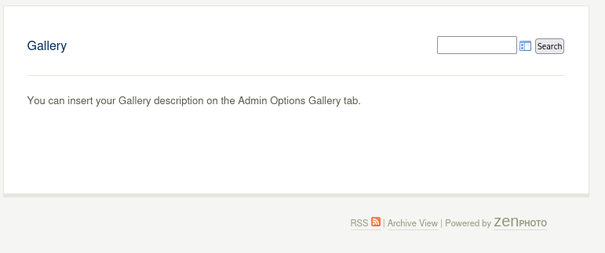

**Start 14:56 24-04-2025**

---
```
Scope:
192.168.215.41
```
## Recon

### Nmap

```bash
sudo nmap -sC -sV zenphoto -sT -T5 --min-rate=5000 -Pn -vvvv 

PORT     STATE SERVICE REASON  VERSION
22/tcp   open  ssh     syn-ack OpenSSH 5.3p1 Debian 3ubuntu7 (Ubuntu Linux; protocol 2.0)
23/tcp   open  ipp     syn-ack CUPS 1.4
|_http-server-header: CUPS/1.4
|_http-title: 400 Bad Request
80/tcp   open  http    syn-ack Apache httpd 2.2.14 ((Ubuntu))
|_http-title: Site doesn't have a title (text/html).
|_http-server-header: Apache/2.2.14 (Ubuntu)
| http-methods: 
|_  Supported Methods: GET HEAD POST OPTIONS
3306/tcp open  mysql   syn-ack MySQL (unauthorized)
Service Info: OS: Linux; CPE: cpe:/o:linux:linux_kernel
```

I don't recall seeing port `23` before, I'll definitely have to check it out.


### 80/TCP - HTTP


I then did some directory fuzzing:


Let's check out some of the matches:




And we have a `robots.txt` file.


On the `/test` page we have a search bar, upon entering data we see the following in the URL:


:::note
This COULD point to some sort of **File Inclusion** vulnerability.
:::


## PoC 
### RFI - FAIL

I decided to check for some PoC's online:


There appear to be multiple exploits, since we don't know the exact 


I checked out the PoC and found the following:


I still checked out the URL and found a login screen, however I could not find default creds. 


### Hydra

I tried out `hydra` in order to crack the user and password:


I let it run while I checked for other options.


### LFI - FAIL


:::fail
This was also a bust.
:::

### RCE - CVE-2011-4825

:::tip
It was only here that I decided to check out the source code using `curl`, better late than never.
:::


Using `curl` I actually found out the version running.

I decided to use `searchsploit` to look up whether there were any other exploits:


:::important
Well here we go, good to know for the next time before we dive in too deep.
:::

I then went on to grab this PoC and checking it out using my code editor of choice.


Pretty straightforward stuff here, let's run it.

## Foothold
### www-data


super simple stuff, let's see what users are on here.


No users? Weird, perhaps there's no `user.txt` either?

### local.txt


Well that's a first.

:::note
For whatever reason I was ONLY able to get a stable rev shell after rebooting the VM, downloading a new VPN pack and reconnecting:

:::

## Privilege Escalation

I downloaded over `linpeas.sh` and started enum, first thing I noticed was the extremely old Linux version:


Alarm bells started tingling, I looked it up:


There were a LOT of exploits here.

:::fail
However fucking none of them worked.
:::

## CVE-2010-3904

I then broadened the search and found some more exploits, specifically this one:


This one actually worked!


:::danger
I had to `exit` my shell first because it was throwing off the script:

:::

### proof.txt


:::summary
In true OffSec fashion, rabbitholes, technical issues and a CVE only exploitation.
Didn't really learn much, this *intermediate* is sure easier than the [[Hack The Box]] *easy* ones.
:::
---

**Finished 16:49 24-04-2025**

[^Links]: [[OSCP Prep]]
