**Start 10:40 21-02-2025**

---
```
Scope:
192.168.198.65
```
# Recon

## Nmap

```bash
sudo nmap -sT algernon -sV -sC -vvvv -T5 -p- -T5 --min-rate=5000

PORT      STATE    SERVICE       REASON      VERSION
21/tcp    open     ftp           syn-ack     Microsoft ftpd
| ftp-anon: Anonymous FTP login allowed (FTP code 230)
| 04-29-20  09:31PM       <DIR>          ImapRetrieval
| 02-21-25  01:39AM       <DIR>          Logs
| 04-29-20  09:31PM       <DIR>          PopRetrieval
|_02-21-25  01:39AM       <DIR>          Spool
| ftp-syst: 
|_  SYST: Windows_NT
80/tcp    open     http          syn-ack     Microsoft IIS httpd 10.0
| http-methods: 
|   Supported Methods: OPTIONS TRACE GET HEAD POST
|_  Potentially risky methods: TRACE
|_http-server-header: Microsoft-IIS/10.0
|_http-title: IIS Windows
135/tcp   open     msrpc         syn-ack     Microsoft Windows RPC
139/tcp   open     netbios-ssn   syn-ack     Microsoft Windows netbios-ssn
445/tcp   open     microsoft-ds? syn-ack
5040/tcp  open     unknown       syn-ack
9998/tcp  open     http          syn-ack     Microsoft HTTPAPI httpd 2.0 (SSDP/UPnP)
| http-methods: 
|_  Supported Methods: GET HEAD POST OPTIONS
|_http-favicon: Unknown favicon MD5: 9D7294CAAB5C2DF4CD916F53653714D5
| uptime-agent-info: HTTP/1.1 400 Bad Request\x0D
| Content-Type: text/html; charset=us-ascii\x0D
| Server: Microsoft-HTTPAPI/2.0\x0D
| Date: Fri, 21 Feb 2025 09:43:48 GMT\x0D
| Connection: close\x0D
| Content-Length: 326\x0D
| \x0D
| <!DOCTYPE HTML PUBLIC "-//W3C//DTD HTML 4.01//EN""http://www.w3.org/TR/html4/strict.dtd">\x0D
| <HTML><HEAD><TITLE>Bad Request</TITLE>\x0D
| <META HTTP-EQUIV="Content-Type" Content="text/html; charset=us-ascii"></HEAD>\x0D
| <BODY><h2>Bad Request - Invalid Verb</h2>\x0D
| <hr><p>HTTP Error 400. The request verb is invalid.</p>\x0D
|_</BODY></HTML>\x0D
|_http-server-header: Microsoft-IIS/10.0
| http-title: Site doesn't have a title (text/html; charset=utf-8).
|_Requested resource was /interface/root
17001/tcp open     remoting      syn-ack     MS .NET Remoting services
49664/tcp open     msrpc         syn-ack     Microsoft Windows RPC
49665/tcp open     msrpc         syn-ack     Microsoft Windows RPC
49666/tcp open     msrpc         syn-ack     Microsoft Windows RPC
49667/tcp open     msrpc         syn-ack     Microsoft Windows RPC
49668/tcp open     msrpc         syn-ack     Microsoft Windows RPC
49669/tcp open     msrpc         syn-ack     Microsoft Windows RPC
Service Info: OS: Windows; CPE: cpe:/o:microsoft:windows

Host script results:
| smb2-security-mode: 
|   3:1:1: 
|_    Message signing enabled but not required
|_clock-skew: 0s
| p2p-conficker: 
|   Checking for Conficker.C or higher...
|   Check 1 (port 55999/tcp): CLEAN (Couldn't connect)
|   Check 2 (port 7682/tcp): CLEAN (Couldn't connect)
|   Check 3 (port 62932/udp): CLEAN (Timeout)
|   Check 4 (port 16225/udp): CLEAN (Failed to receive data)
|_  0/4 checks are positive: Host is CLEAN or ports are blocked
| smb2-time: 
|   date: 2025-02-21T09:43:50
|_  start_date: N/A
```


## 21/TCP - FTP

Right away I started off with port `21` before the nmap scan was even done:

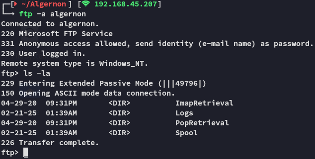

In here I found the following in the `Logs` tab:

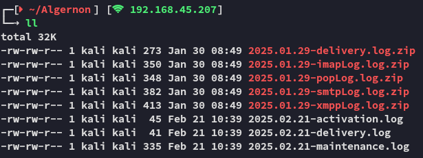

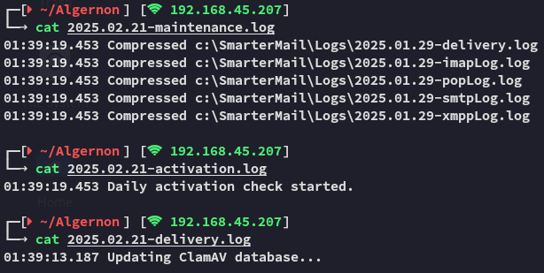

Looks like we're dealing with a **ClamAV** antivirus?

I then unzipped everything and went on to check out the files:

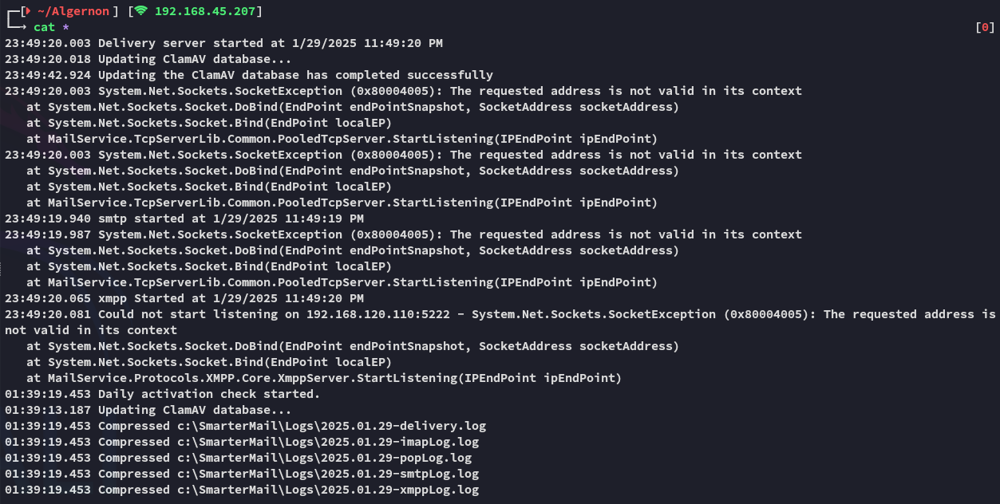

None of it really seems interesting.


## 445/TCP - SMB

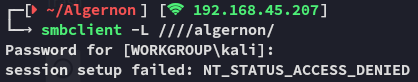


## 80/TCP - HTTP

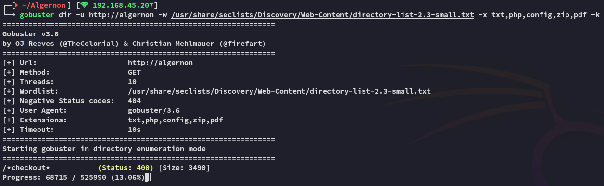

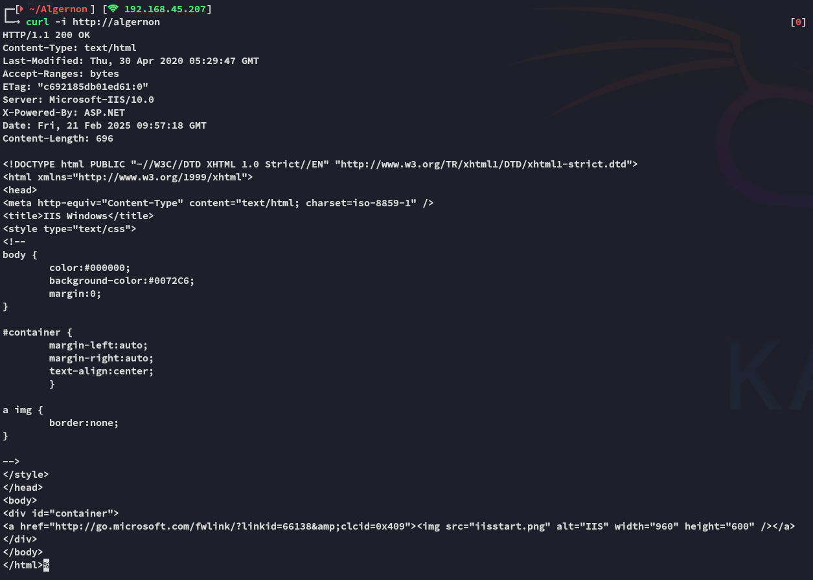

Didn't seem promising, moving on


## 9998/TCP - HTTP


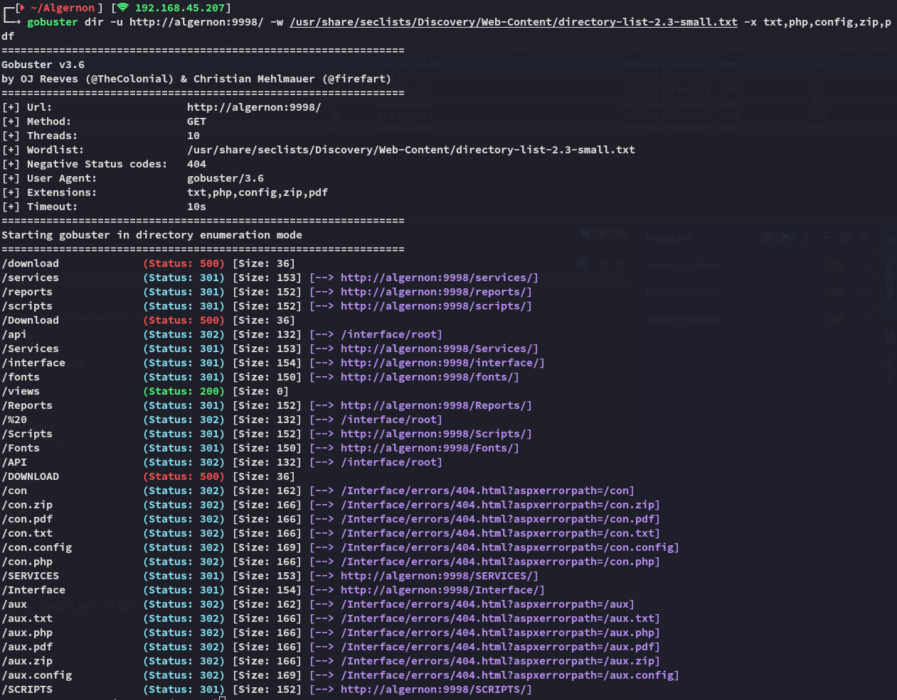

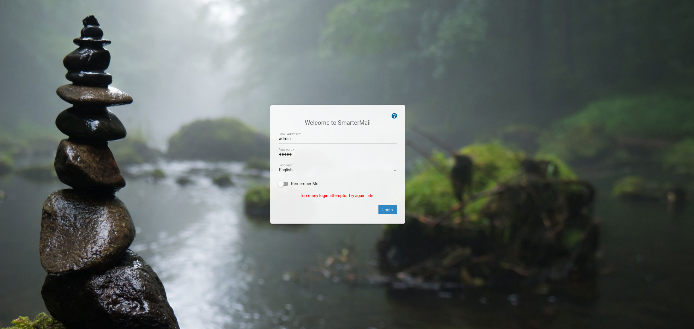

I observed the request in burpsuite:

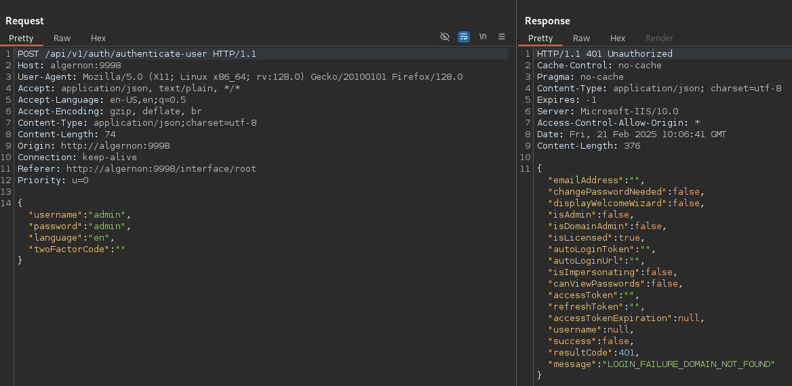

This didn't really tell me anything, so I went and checked the source code:

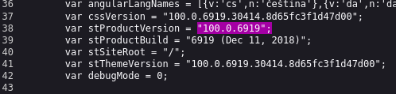

This seems to be the version number, let's look up any exploits matching this number:

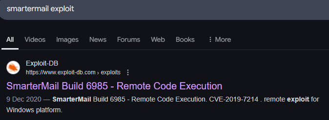

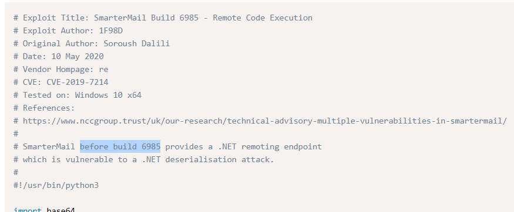

Just what we need, let's modify the PoC.


## PoC modifying

There was a super long base64 encrypted payload here so I decrypted it for good measure:

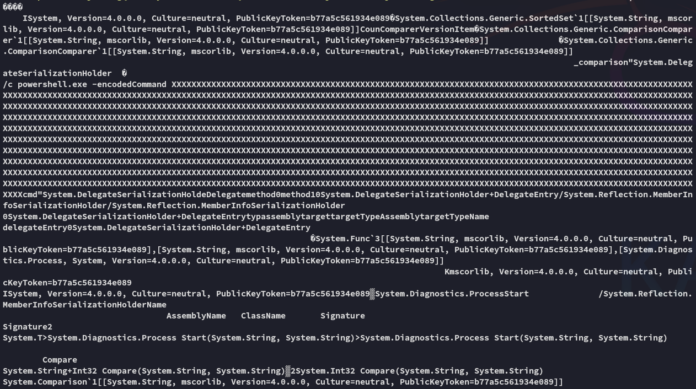

Don't see anything malicious, let's get to it.

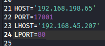

>[!note]
>Keep in mind that the RHOST port of `17001` is already set correctly, as per our `nmap` scan.

Let's save and run it.


# Foothold

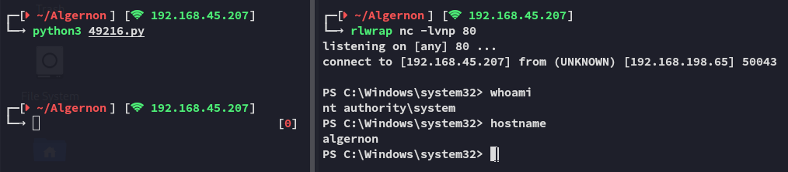

Surprisingly easy! Worked right away.

## proof.txt

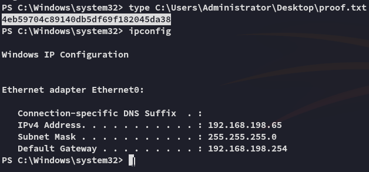

---

**Finished 11:20 21-02-2025**

[^Links]:  [[OSCP Prep]]

#windows #SmarterMail 