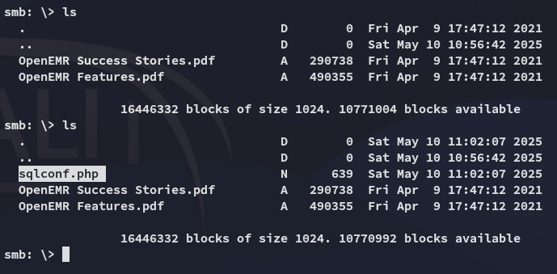
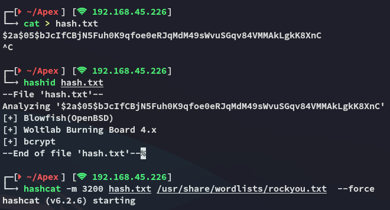

**Start 09:53 10-05-2025**

---
```
Scope:
192.168.231.145
```
## Recon

### Nmap

```bash
sudo nmap -sC -sV apex -T5 -vvvv --min-rate=5000 -sT -p-

PORT     STATE SERVICE     REASON  VERSION
80/tcp   open  http        syn-ack Apache httpd 2.4.29 ((Ubuntu))
| http-methods: 
|_  Supported Methods: HEAD GET POST OPTIONS
|_http-title: APEX Hospital
|_http-server-header: Apache/2.4.29 (Ubuntu)
|_http-favicon: Unknown favicon MD5: FED84E16B6CCFE88EE7FFAAE5DFEFD34
445/tcp  open  netbios-ssn syn-ack Samba smbd 4.7.6-Ubuntu (workgroup: WORKGROUP)
3306/tcp open  mysql       syn-ack MariaDB 5.5.5-10.1.48
| mysql-info: 
|   Protocol: 10
|   Version: 5.5.5-10.1.48-MariaDB-0ubuntu0.18.04.1
|   Thread ID: 52
|   Capabilities flags: 63487
|   Some Capabilities: SupportsCompression, LongPassword, Support41Auth, Speaks41ProtocolOld, ConnectWithDatabase, InteractiveClient, IgnoreSigpipes, SupportsLoadDataLocal, SupportsTransactions, DontAllowDatabaseTableColumn, LongColumnFlag, Speaks41ProtocolNew, IgnoreSpaceBeforeParenthesis, ODBCClient, FoundRows, SupportsMultipleStatments, SupportsMultipleResults, SupportsAuthPlugins
|   Status: Autocommit
|   Salt: =_I0R/2Ja(BQT/.:xm;~
|_  Auth Plugin Name: mysql_native_password
```

### 445/TCP - SMB
### Enum4linux-ng


Time to check out the `docs` directory.

### Smbclient


I checked out the `.pdf` files and they contained a few pages of medical records and such.


### Exiftool

Just in case I used `exiftool` to view the metadata of the files.


### 80/TCP - HTTP

I opened up my browser and expected to see some sort of hospital website:


Indeed it is.

Here I find a few possible usernames:


The contact form didn't seem vulnerable:


I clicked on **Scheduler** and this took me to a login page:


I tried out `admin - admin` but this didn't work:


### Gobuster

I launched `gobuster` to enumerate the directories and endpoints:


I found a `admin.php` page which I checked out:


Awesome we found the version, let's look for an exploit!


We need to be authenticated though, we have potential usernames but not the passwords.

I started searching further and found the following directory:


In here I could apparently upload files!

### LFI - Responsive Filemanager 9.13.4

I tried uploading a webshell but it wasn't allowed:


We could now brute force filetypes and check whether any would be allowed but I decided to enumerate further first.

I noticed a little question mark in the top right corner:


Ah yes... We now got another version.


Pretty straightforward 


Unfortunate

We need to find another way to get RCE.

## Foothold
### Checking Source Code 

I checked out GitHub where I found the source code to `openemr` where they had the following `sqlconf.php` file:


I checked whether this existed here, perhaps it could contain credentials:


No error, meaning it HIGHLY LIKELY exists, let's try reading it using the LFI exploit.

:::note
Before doing this however we need to make slight changes to the PoC, we'll have to change the `read_file` `url_path` so we can get the file via `smb`, namely because the file won't be read on the client side as it is a `.php` file:
:::

>



Now we can grab it and check the contents.


## 3306/TCP - MySQL

>[!danger]
>I had to issue the `skip_ssl` option otherwise it *WOULD NOT WORK*!!!!
>


We gain access with the found password.


This was obviously not the pass?

I checked the tables again:


```
$2a$05$bJcIfCBjN5Fuh0K9qfoe0eRJqMdM49sWvuSGqv84VMMAkLgkK8XnC
$2a$05$bJcIfCBjN5Fuh0K9qfoe0n$
```

## Hashcat

I threw the hash into `hashcat`:




I could now use these creds to log in to the portal.

```
admin
thedoctor
```

## RCE - OpenEMR 5.0.1

I then followed the previously found github RCE steps:


Yeah this didn't work, let's check alternative scripts.


I went ahead and launched the following one:


### local.txt


## Privilege Escalation
### Shell as root

Since the password was for the *admin* user, we can try and password spray before doing any further enum:


Easiest privesc ever.

### proof.txt


>[!summary]
>This one was indeed *VERY HARD*
>I needed help on multiple occassions
>- More source code checking
>- Chained CVE's
>- Password Spraying

---

**Finished 11:34 10-05-2025**

[^Links]: [[OSCP Prep]]

