**Start 11:22 21-02-2025**

---
```
Scope:
192.168.198.46
```
# Recon

## Nmap

```bash
sudo nmap -sT authby -sV -sC -vvvv -T5 -p- -T5 --min-rate=5000

PORT     STATE SERVICE       REASON  VERSION
21/tcp   open  ftp           syn-ack zFTPServer 6.0 build 2011-10-17
| ftp-anon: Anonymous FTP login allowed (FTP code 230)
| total 9680
| ----------   1 root     root      5610496 Oct 18  2011 zFTPServer.exe
| ----------   1 root     root           25 Feb 10  2011 UninstallService.bat
| ----------   1 root     root      4284928 Oct 18  2011 Uninstall.exe
| ----------   1 root     root           17 Aug 13  2011 StopService.bat
| ----------   1 root     root           18 Aug 13  2011 StartService.bat
| ----------   1 root     root         8736 Nov 09  2011 Settings.ini
| dr-xr-xr-x   1 root     root          512 Feb 21 18:23 log
| ----------   1 root     root         2275 Aug 09  2011 LICENSE.htm
| ----------   1 root     root           23 Feb 10  2011 InstallService.bat
| dr-xr-xr-x   1 root     root          512 Nov 08  2011 extensions
| dr-xr-xr-x   1 root     root          512 Nov 08  2011 certificates
|_dr-xr-xr-x   1 root     root          512 Aug 03  2024 accounts
242/tcp  open  http          syn-ack Apache httpd 2.2.21 ((Win32) PHP/5.3.8)
|_http-server-header: Apache/2.2.21 (Win32) PHP/5.3.8
| http-methods: 
|_  Supported Methods: GET HEAD POST OPTIONS
|_http-title: 401 Authorization Required
| http-auth: 
| HTTP/1.1 401 Authorization Required\x0D
|_  Basic realm=Qui e nuce nuculeum esse volt, frangit nucem!
3145/tcp open  zftp-admin    syn-ack zFTPServer admin
3389/tcp open  ms-wbt-server syn-ack Microsoft Terminal Service
|_ssl-date: 2025-02-21T10:24:30+00:00; 0s from scanner time.
| rdp-ntlm-info: 
|   Target_Name: LIVDA
|   NetBIOS_Domain_Name: LIVDA
|   NetBIOS_Computer_Name: LIVDA
|   DNS_Domain_Name: LIVDA
|   DNS_Computer_Name: LIVDA
|   Product_Version: 6.0.6001
Service Info: OS: Windows; CPE: cpe:/o:microsoft:windows
```

## 21/TCP - FTP

There's a boatload of files here, but I can't transfer them since they're owned by root:


Luckily for us it seems that all we have to do is *omit* the `-a` option and try logging in with default creds.

I first tried the other port to no avail

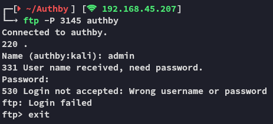

And then I tried 21 again

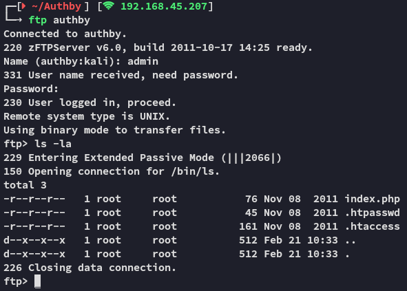

We get in using default `admin - admin` creds!

The directory looks a whole lot different now as well.

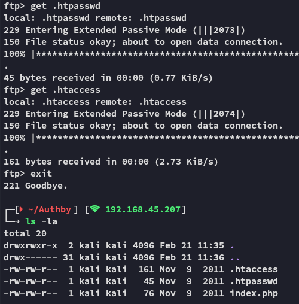

Let's check them out.

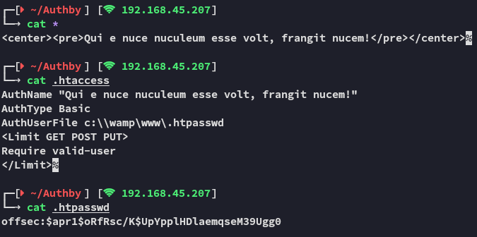

>[!info]
>Little side note:
>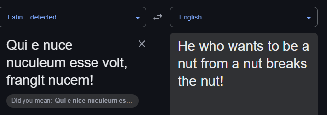

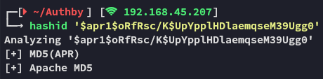


## Hashcat

Let's go ahead and crack it.

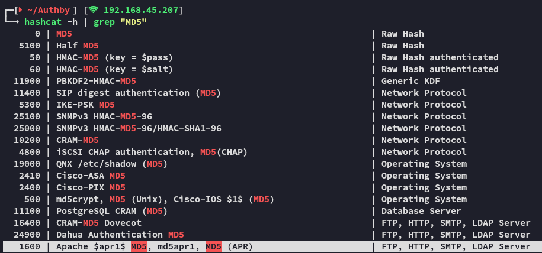


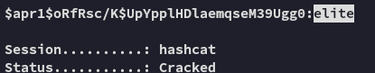


## 242/TCP - HTTP

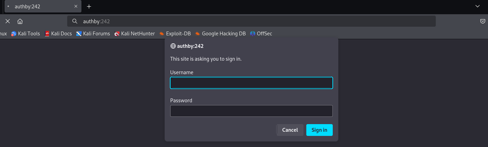

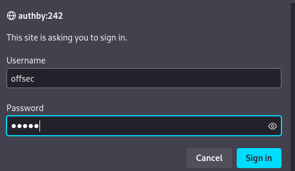

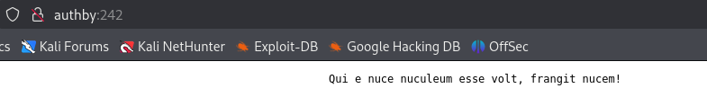

I then checked whether the creds could be the ones for RDP but it seems they're invalid:

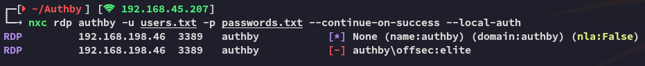

However we can try **Remote File Upload** via FTP! 

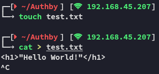

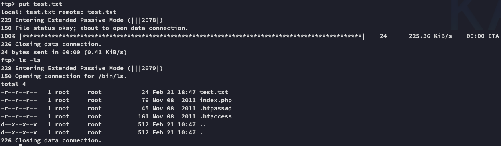

Since we have access as *admin* on FTP we can easily upload any sort of file. Let's see if this reflects on the website.

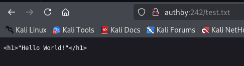

Awesome, this proves that the FTP server is indeed the docroot, let's go ahead and make a webshell payload that we will `put` onto the FTP server.

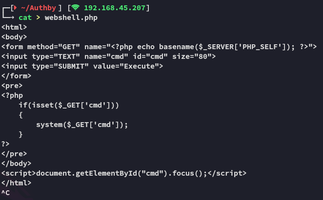

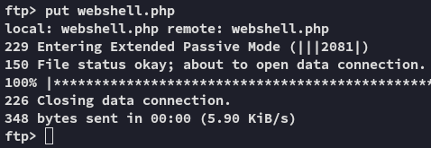


Let's check out what else we can do:

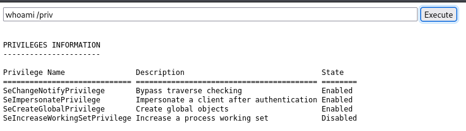

Hell yeah, let's upload one of the potatoes to the docroot, and execute it to get ourselves a *SYSTEM* shell right away.

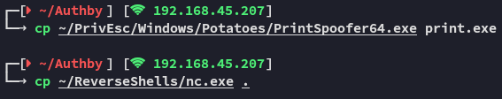

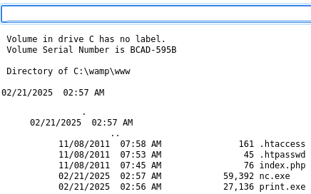

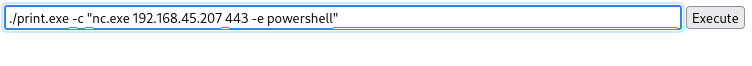

Unfortunately this did not seem to work.

I decided to ping my own IP to see whether there was an issue of some sorts

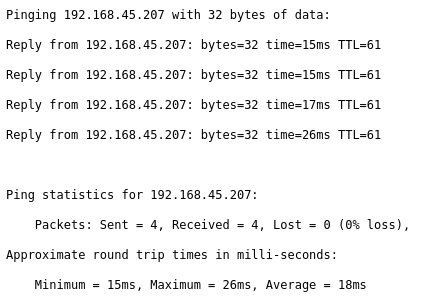

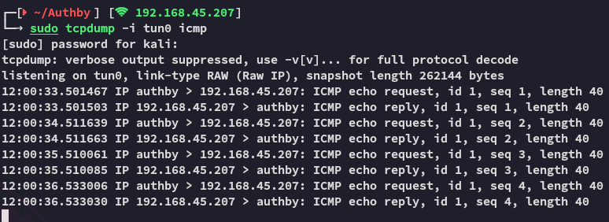

This seemed to work however.


# Foothold

I then proceeded to simply initiate a reverse shell via the `nc.exe` binary I'd uploaded.

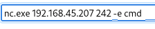


>[!caution]
>Well this explains why the `powershell` reverse shell wouldn't kick in.


## local.txt

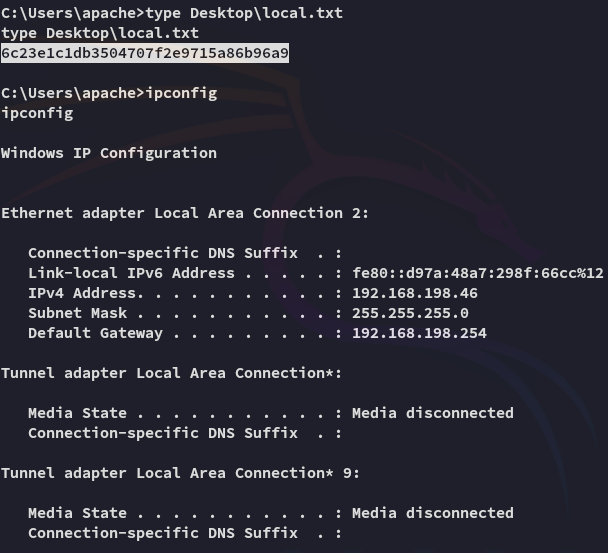


# Privilege Escalation

## Abusing privileges


I guess this won't fire since we have the 64-bit version.

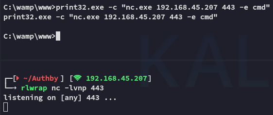

Well this wouldn't work either, what now?

Looks like none of the other potatoes worked either, let's do some more enumeration.


## Enum


It appears to be a clean install of **Windows Server 2008**, there *MUST* be some exploits for it.

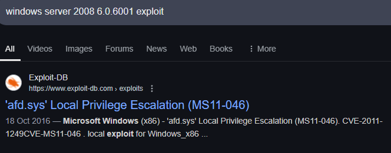

Perfect, let's check out the PoC

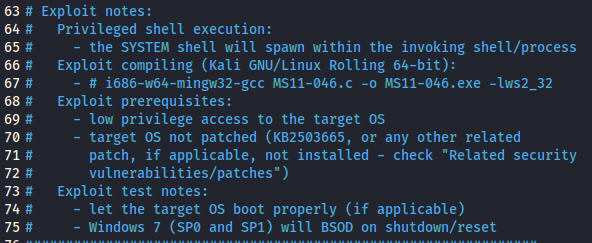

Alrighty then, pretty straightforward. Let's compile it.

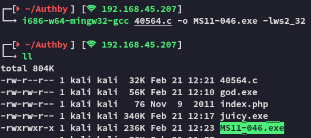

We transfer it over and *instantly* become **SYSTEM**

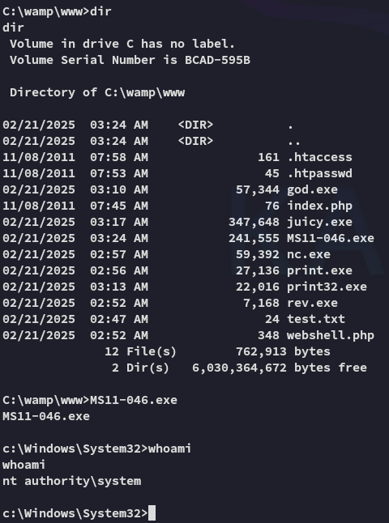


## proof.txt

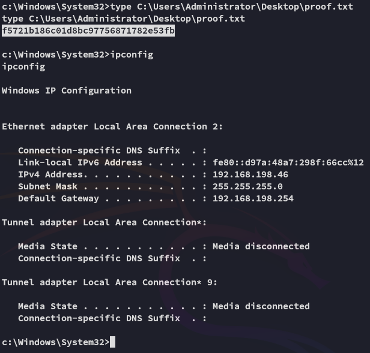

---

**Finished 12:25 21-02-2025**

[^Links]: [[OSCP Prep]]

#windows #docroot #FTP 