**Start 09:49 16-05-2025**

---
```
Scope:
192.168.128.61
```
# Recon

## Nmap

```bash
sudo nmap -sC -sV billyboss -sT -vvvv -p- -Pn -T5 --min-rate=5000 

PORT      STATE    SERVICE         REASON      VERSION
21/tcp    open     ftp             syn-ack     Microsoft ftpd
| ftp-syst: 
|_  SYST: Windows_NT
80/tcp    open     http            syn-ack     Microsoft IIS httpd 10.0
|_http-server-header: Microsoft-IIS/10.0
|_http-favicon: Unknown favicon MD5: 8D9ADDAFA993A4318E476ED8EB0C8061
|_http-cors: HEAD GET POST PUT DELETE TRACE OPTIONS CONNECT PATCH
|_http-title: BaGet
| http-methods: 
|_  Supported Methods: GET HEAD
135/tcp   open     msrpc           syn-ack     Microsoft Windows RPC
139/tcp   open     netbios-ssn     syn-ack     Microsoft Windows netbios-ssn
445/tcp   open     microsoft-ds?   syn-ack
5040/tcp  open     unknown         syn-ack
7680/tcp  open     pando-pub?      syn-ack
8081/tcp  open     http            syn-ack     Jetty 9.4.18.v20190429
| http-robots.txt: 2 disallowed entries 
|_/repository/ /service/
|_http-title: Nexus Repository Manager
| http-methods: 
|_  Supported Methods: GET HEAD
|_http-favicon: Unknown favicon MD5: 9A008BECDE9C5F250EDAD4F00E567721
|_http-server-header: Nexus/3.21.0-05 (OSS)
49664/tcp open     msrpc           syn-ack     Microsoft Windows RPC
49665/tcp open     msrpc           syn-ack     Microsoft Windows RPC
49666/tcp open     msrpc           syn-ack     Microsoft Windows RPC
49667/tcp open     msrpc           syn-ack     Microsoft Windows RPC
49668/tcp open     msrpc           syn-ack     Microsoft Windows RPC
49669/tcp open     msrpc           syn-ack     Microsoft Windows RPC
```

## 21/TCP - FTP

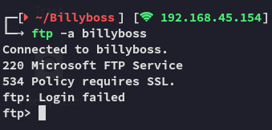

I then tried out the secure version `lftp`:

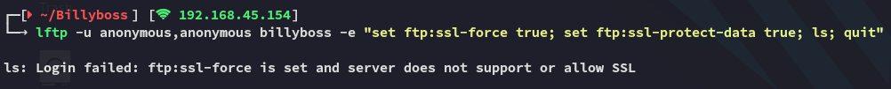

Didn't work either.

## 8081/TCP - HTTP

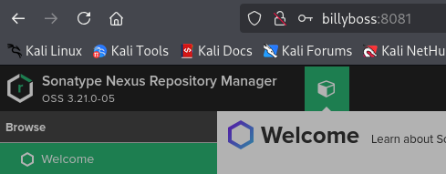

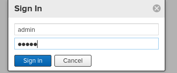


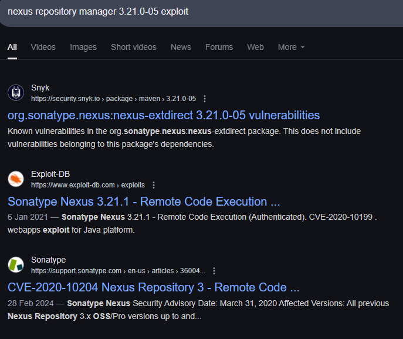

However this exploit still requires a set of valid creds which we do not have.

Other than that I can only find the following according to `nmap`:

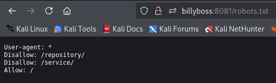

### Access

Alright so I guess we will need to guess credentials?

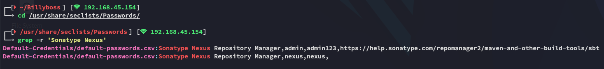


`nexus - nexus` worked!

So what can we actually do here?

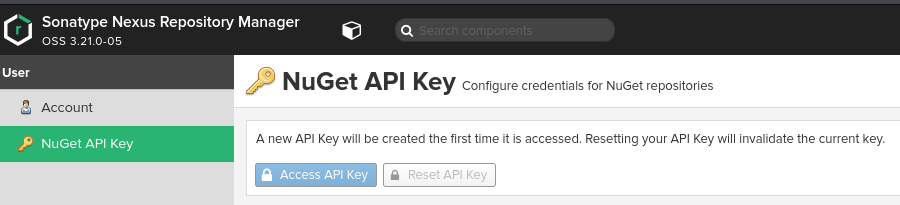

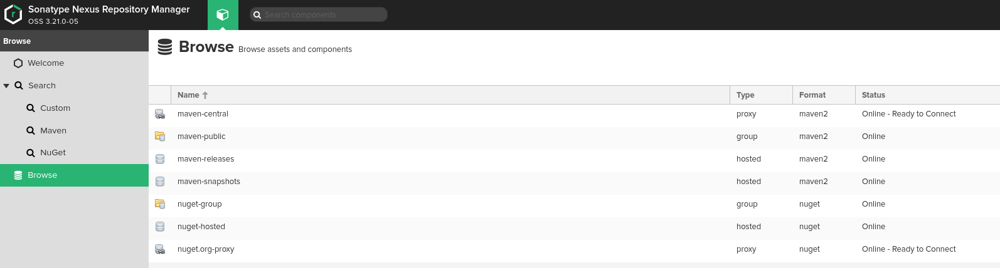

Doesn't seem interesting, but we found the PoC so let's check it out.

### PoC

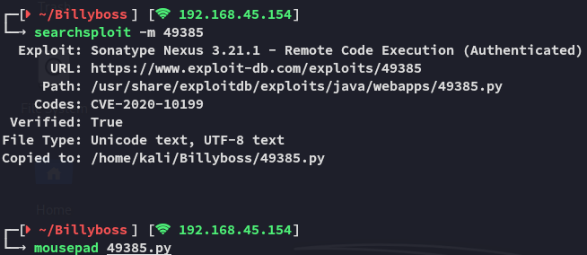

We modify it to suit our needs:


# Foothold
## Shell as Nathan

I execute the PoC

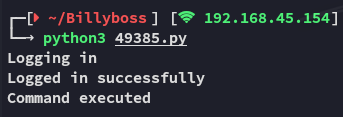

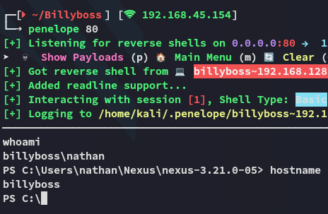

We get a shell back.

>[!note]
>Interestingly we land inside the Nexus directory which is in *nathan*'s `Users` folder.

Since this is the case we must have interesting privileges, as Windows users running the web server usually have the `SeImpersonatePrivilege` enabled:

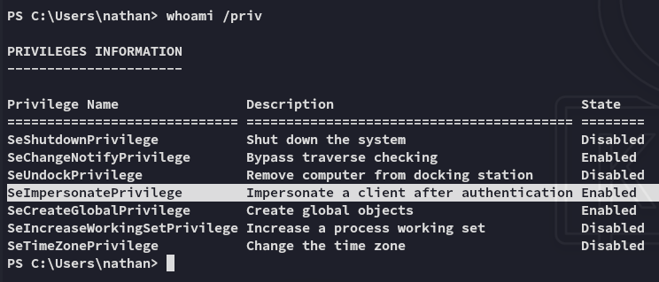

Indeed! We can try to escalate privs right away.

# Privilege Escalation
## SeImpersonatePrivilege

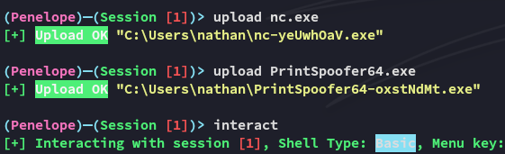

>[!fail]
>PrintSpoofer failed, let's see if GodPotato will work


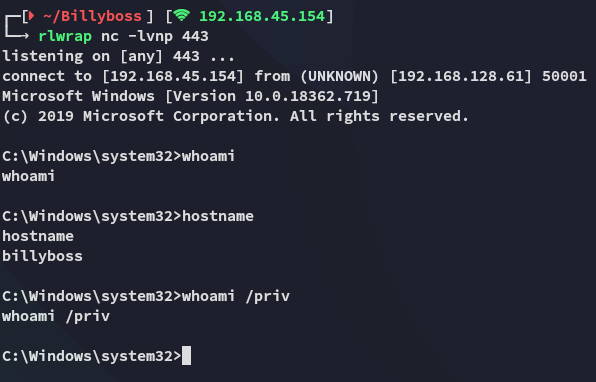

We got a reverse shell although it is unclear whether we are actually *SYSTEM*.

### flags

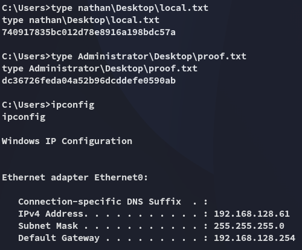

---

**Finished**

[^Links]: [[OSCP Prep]]

#potatoes #CVE 