**Start 14:35 08-01-2025**

---
```
Scope:
192.168.247.176
```
# Recon

## Nmap

```bash
sudo nmap -sC -sT -sV -oN nmap 192.168.247.176 -p- -T5 -vvvv --min-rate=5000

PORT   STATE SERVICE REASON  VERSION
22/tcp open  ssh     syn-ack OpenSSH 8.3p1 Ubuntu 1ubuntu0.1 (Ubuntu Linux; protocol 2.0)
6379/tcp open  redis   syn-ack Redis key-value store 4.0.14
Service Info: OS: Linux; CPE: cpe:/o:linux:linux_kernel
```

It appears there's only 2 services running of which we're probably only able to test `6379` right away.

It seems to be running on version **4.0.14**.


It seems that this exploitation can be done manually but also using metasploit:

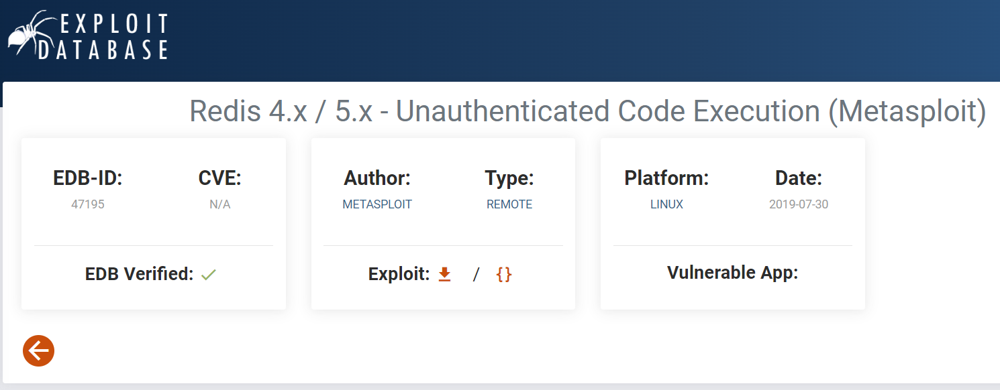

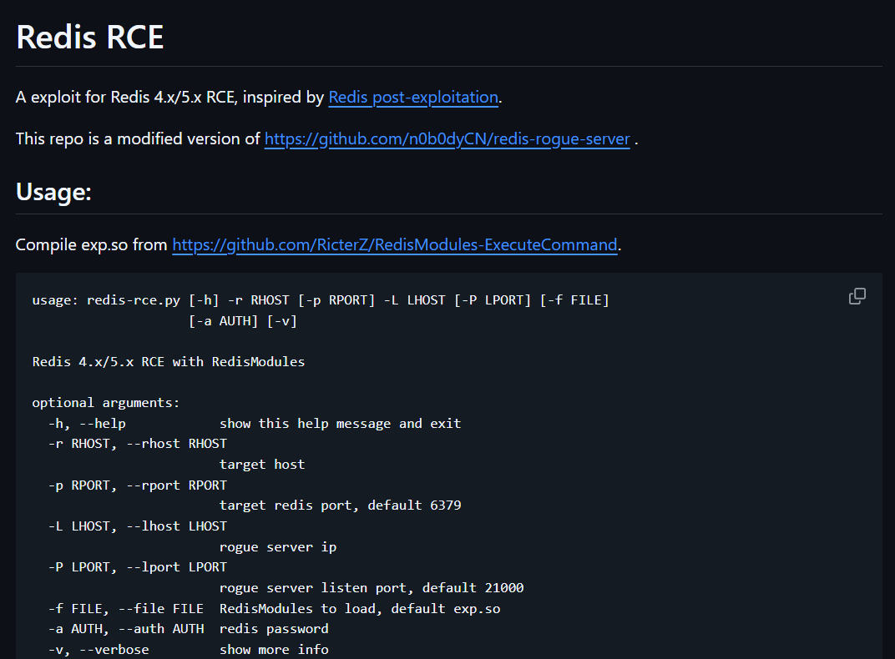

We'll first try do some directory enumeration.


## Feroxbuster

This didn't give us anything:

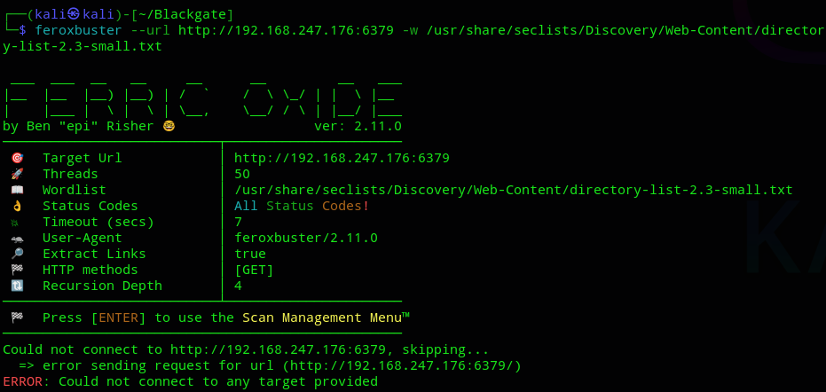


# Initial Foothold

## 6379/TCP - Redis

I did some more digging since the GitHub page I first listed won't be useful, the payload that the person used is no longer available.

We'll have to find an alternative.

Luckily [hacktricks](https://book.hacktricks.wiki/en/network-services-pentesting/6379-pentesting-redis.html) comes to save the day yet again:

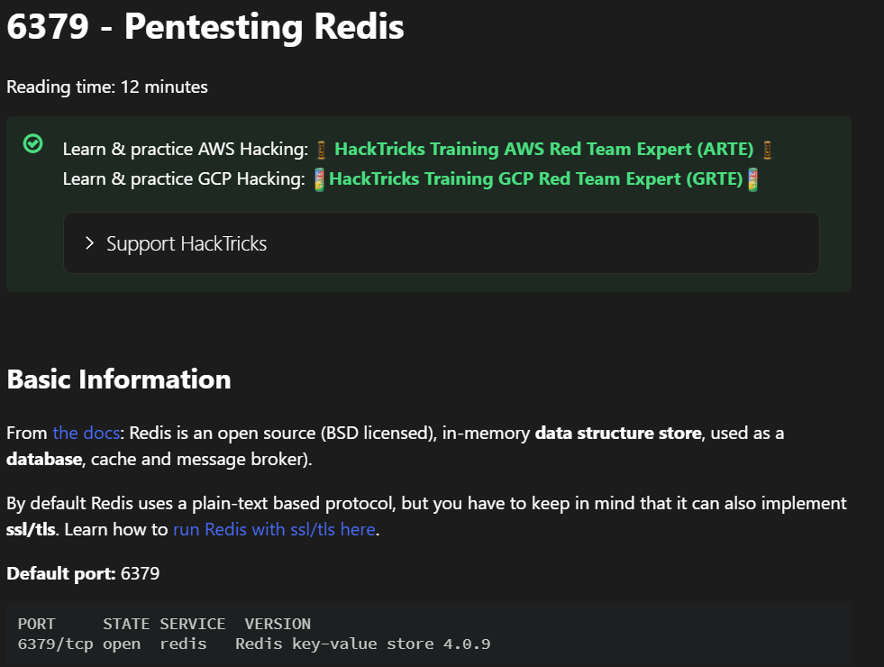

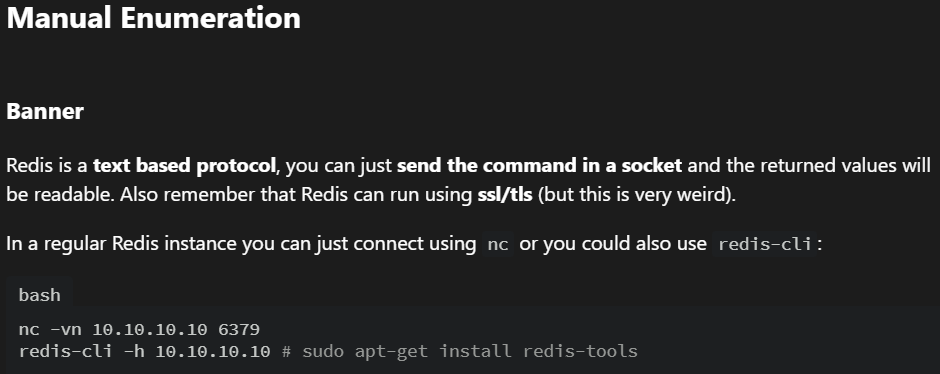

Let's try it from the easiest solution to the furthest.

```bash
nc -vn 192.168.247.176 6379

info
```

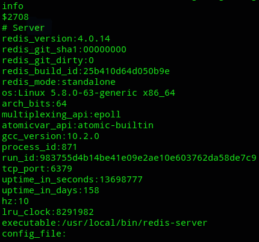

Since we can't do much from here we should get RCE asap.


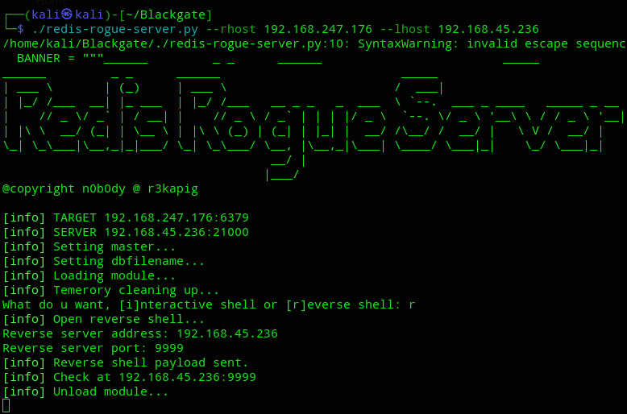


And we got our shell.


### local.txt

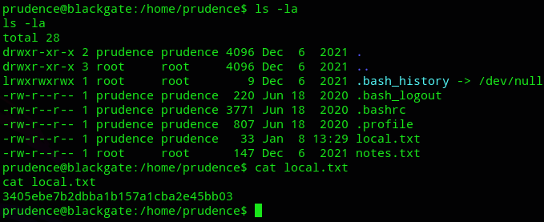


# Privilege Escalation

I then started to check on how to escalate my privileges when I found the following noteworthy:

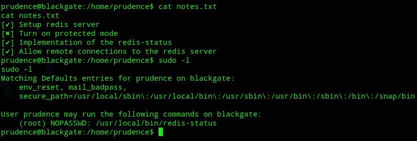

It turns out this so called **protected mode** is turned off, and we can run `/usr/local/bin/redis-status` as `root`.

>[!note]
>I went ahead and gave myself an `.ssh` shell to get a stable environment.

I looked up what we could do with the protected mode off but didn't really find anything. Guess it's time to transfer over linpeas.


First thing I found was the OS version.


Then I found a PoC called `PwnKit` with a link to it, let's check it out.

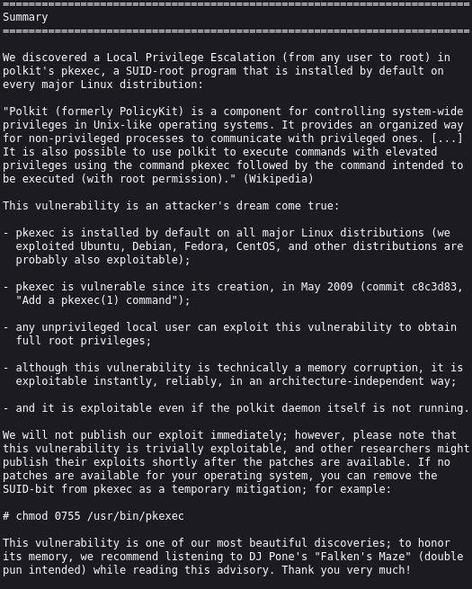

We just had to go ahead and download over the binary and then execute it.


### proof.txt

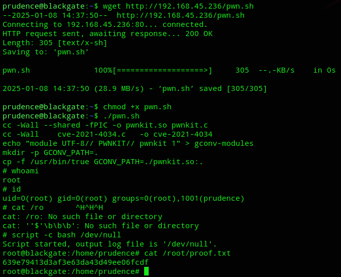

---

**Finished 15:38 08-01-2025**

[^Links]: [[OSCP Prep]]

#pwnkit #redis #hacktricks #priv-esc 