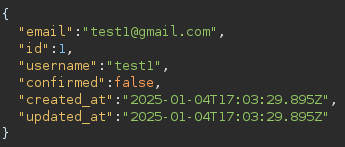

**Start 17:51 04-01-2025**

---
```
Scope:
192.168.188.231
```
## Recon

### Nmap

```bash
sudo nmap -sC -sV -oN nmap 192.168.188.231 -T5 -vvvv --min-rate=5000 -sT -p-

PORT      STATE  SERVICE REASON       VERSION
22/tcp    open   ssh     syn-ack      OpenSSH 7.9p1 Debian 10+deb10u2 (protocol 2.0)
80/tcp    open   http    syn-ack
|_http-title: Site doesn't have a title (text/html; charset=UTF-8).
| fingerprint-strings: 
|   DNSStatusRequestTCP, DNSVersionBindReqTCP, GenericLines, Help, JavaRMI, Kerberos, LANDesk-RC, LDAPBindReq, LDAPSearchReq, LPDString, NCP, NotesRPC, RPCCheck, RTSPRequest, SIPOptions, SMBProgNeg, SSLSessionReq, TLSSessionReq, TerminalServer, TerminalServerCookie, WMSRequest, X11Probe, afp, giop, ms-sql-s, oracle-tns: 
|     HTTP/1.1 400 Bad Request
|   FourOhFourRequest, GetRequest, HTTPOptions: 
|     HTTP/1.0 403 Forbidden
|     Content-Type: text/html; charset=UTF-8
|_    Content-Length: 0
3000/tcp  closed ppp     conn-refused
33017/tcp open   http    syn-ack      Apache httpd 2.4.38 ((Debian))
| http-methods: 
|_  Supported Methods: GET HEAD POST OPTIONS
|_http-title: Development
|_http-server-header: Apache/2.4.38 (Debian)
```

That's weird, we get 3 ports of which `3000` seems to be closed but still shown, and `80` is open but has a `403` code. I decided to check it using `curl`:


However port `33017` gave us some other output:


It seems this port is still in development, could be a potential attack vector. We'll note it down for now.

### Gobuster

Let's do some directory enumeration.


We get some `filemanager*` pages, including a `.config` file which could be potentially interesting. Problem is that we need login creds in order to access it.


Funnily enough when we check the page source we notice something interesting:


I registered for an account using fake creds but couldn't get access.


I then checked the other port:


This yet again showed us a bunch of interesting extensions but we couldn't access them:


## Initial Foothold 

### 80/TCP - HTTP

Using **WappAlyzer** I found out that the webpage was using **Ruby on Rails**.


Since the exact version was not known nor found I had to do some digging.

I booted up burpsuite and analyzed the POST request.

:::note
It turns out that when a user creates an account, they need to verify the email first.
Via burp I found out that the response told the server whether the `confirmed` state was either `true` or `false`, e.g. a Boolean value.
:::


We needed to zoom in on this part:



This response meant that we could manipulate our request by adding the `confirmed=true` value.

Let's test it out.

```bash
# Change ONLY the following parameter
user%5Bemail%5D=test1%40gmail.com

# Into
user%5Bconfirmed%5D=True
```


By modifying the request we were able to verify our email address and account, now let's login.

Upon refreshing the page we got a new dashboard:


I tested the upload function to better understand it:


I then right clicked the file to check where it was uploaded:


This is the link that would execute every time I tried to download the file again.

Let's try something out.


We were able to get the `/etc/passwd` file.

:::success
We were able to get the `/etc/passwd` file by exploiting a **Directory Traversal** vulnerability.
:::

Inside the `/etc/passwd` we found the following user:


Let's try to insert a `ssh` key in their `.ssh` directory in order to simplify logging in to their system.


### SSH Keygen

To drop our ssh key in there we can follow [this guide](https://mqt.gitbook.io/oscp-notes/ssh-keys?source=post_page-----9c7f5b963559--------------------------------):


We have successfully copied it over, let's log in now.


### local.txt


## Privilege Escalation

I noticed the `boolean` directory in remi's `/home` directory. I went in and started snooping around, after some searching I found the following:


We could try and log into **MySQL** and check for some interesting stuff.


Nothing interesting came up.

:::note
I got a bit stuck then realized that the `root` key was inside remi's `/.ssh/keys` directory, meaning I could just log in using that key.
:::


:::caution
Using normal `ssh -i root root@127.0.0.1` kept resulting in an error so this was the only way to get it working.
:::

---

**Finished 19:50 04-01-2025**

[^Links]: [[OSCP Prep]] 
