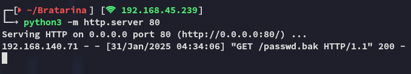

**Start 10:05 31-01-2025**

---
```
Scope:
192.168.140.71
```
# Recon

## Nmap

```bash
sudo nmap -sC -sV -vvvv -Pn -p- bratarina -sT --min-rate=5000 -T5

PORT    STATE  SERVICE     REASON       VERSION
22/tcp  open   ssh         syn-ack      OpenSSH 7.6p1 Ubuntu 4ubuntu0.3 (Ubuntu Linux; protocol 2.0)
25/tcp  open   smtp        syn-ack      OpenSMTPD
| smtp-commands: bratarina Hello bratarina [192.168.45.239], pleased to meet you, 8BITMIME, ENHANCEDSTATUSCODES, SIZE 36700160, DSN, HELP
|_ 2.0.0 This is OpenSMTPD 2.0.0 To report bugs in the implementation, please contact bugs@openbsd.org 2.0.0 with full details 2.0.0 End of HELP info
53/tcp  closed domain      conn-refused
80/tcp  open   http        syn-ack      nginx 1.14.0 (Ubuntu)
|_http-server-header: nginx/1.14.0 (Ubuntu)
|_http-title:         Page not found - FlaskBB        
445/tcp open   netbios-ssn syn-ack      Samba smbd 4.7.6-Ubuntu (workgroup: COFFEECORP)
Service Info: OS: Linux; CPE: cpe:/o:linux:linux_kernel

Host script results:
| smb-os-discovery: 
|   OS: Windows 6.1 (Samba 4.7.6-Ubuntu)
|   Computer name: bratarina
|   NetBIOS computer name: BRATARINA\x00
|   Domain name: \x00
|   FQDN: bratarina
|_  System time: 2025-01-31T04:03:43-05:00
| smb2-time: 
|   date: 2025-01-31T09:03:42
|_  start_date: N/A
| smb2-security-mode: 
|   3:1:1: 
|_    Message signing enabled but not required
| smb-security-mode: 
|   account_used: <blank>
|   authentication_level: user
|   challenge_response: supported
|_  message_signing: disabled (dangerous, but default)
```

Right away I noticed SMB open and nmap could fingerprint it, so I went ahead and ran some smb specific tools.


## Enum4Linux

Here I found the following:


Accordingly I used `smbclient` to log in anonymously


## SMBclient


I then downloaded the file and inspected it.


We could use this file to add our own user to it, then upload this file to the target and login with our own user.

Let's copy the root user and add our own name.


## Modifying passwd file


Now we need to find a way to upload this file. Port `80` was a bust and wouldn't do, so we probably need to use port `25` SMTP for it.


## 25/TCP - SMTP




It seemed to work, let's see if it did the trick.


## Foothold


>[!info]
I modified the name to *mk* instead of *kali*.


### proof.txt


---

**Finished 10:35 31-01-2025**

[^Links]: [[OSCP Prep]]

#smtp #enum4linux 