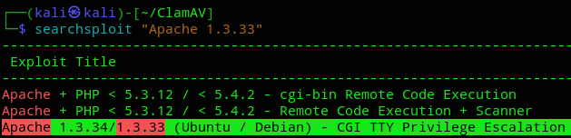
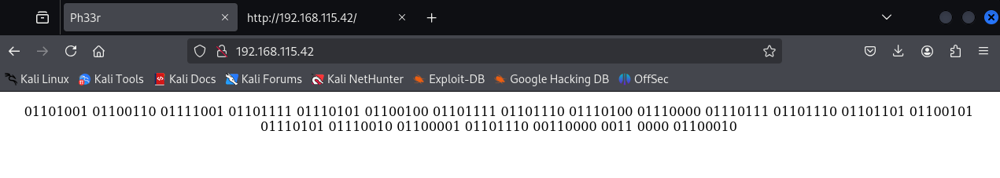
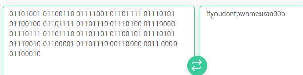
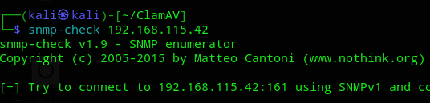
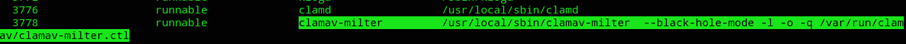
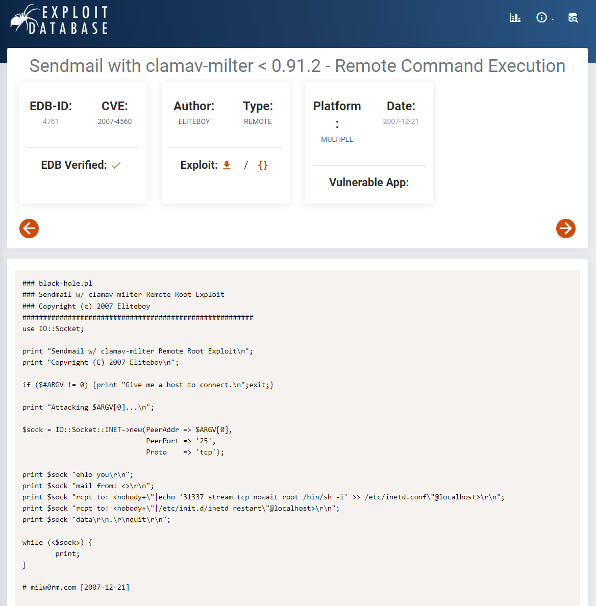
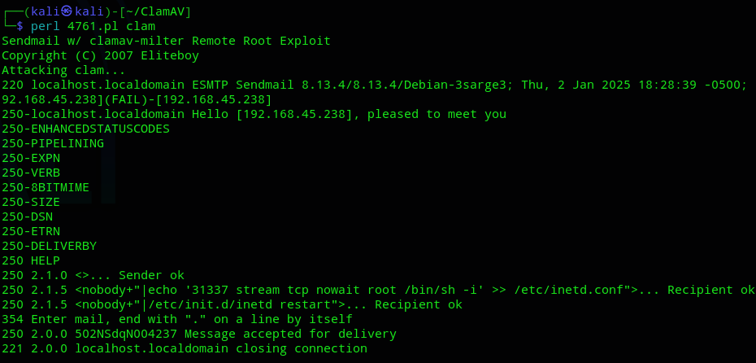
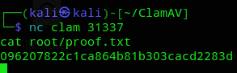

**Start 18:57 02-01-2025**

---
```
Scope:
192.168.115.42
```
## Recon

### Nmap

```bash
sudo nmap -sC -sV -oN nmap  192.168.115.42 -T5 -vvvv --min-rate=5000 -sT

PORT    STATE SERVICE     REASON  VERSION                                        
22/tcp  open  ssh         syn-ack OpenSSH 3.8.1p1 Debian 8.sarge.6 (protocol 2.0)
25/tcp  open  smtp        syn-ack Sendmail 8.13.4/8.13.4/Debian-3sarge3     
80/tcp  open  http        syn-ack Apache httpd 1.3.33 ((Debian GNU/Linux))
| http-methods: 
|   Supported Methods: GET HEAD OPTIONS TRACE
|_  Potentially risky methods: TRACE
|_http-title: Ph33r
|_http-server-header: Apache/1.3.33 (Debian GNU/Linux)
139/tcp open  netbios-ssn syn-ack Samba smbd 3.X - 4.X (workgroup: WORKGROUP)
199/tcp open  smux        syn-ack Linux SNMP multiplexer
445/tcp open  netbios-ssn syn-ack Samba smbd 3.0.14a-Debian (workgroup: WORKGROUP)
Service Info: Host: localhost.localdomain; OSs: Linux, Unix; CPE: cpe:/o:linux:linux_kernel
```

I went ahead and ran a `searchsploit` search for all the versions, and did find one that seemed interesting for the `Apache` server:



I'll note it for now but enumerate further.

I reran the nmap scan with all ports and found an unusual high number port:

```bash
60000/tcp open  ssh         syn-ack OpenSSH 3.8.1p1 Debian 8.sarge.6 (protocol 2.0)
```

So for now we have a **SMB** server and an **Apache** webserver. I'll check port 80 first.


## Initial Foothold

### 80/TCP - HTTP

Going to the site I found nothing of interest:



I checked the page source as well, but didn't find anything.

I converted the binary to text:



Understood, time to pwn it then.

### 199/TCP - SNMP 

I went ahead and enumerated this port using `snmp-check`:



Scrolling a bit down I found this:



it's the `ClamAV` antivirus that is also conveniently the name of the box.

I looked it up to see if there's a PoC for it.



There appears to be a RCE PoC available. Let's try it out.



### proof.txt

Afterwards we can just continue to **port 31337**:



---

**Finished 19:34 02-01-2025**

[^Links]: [[OSCP Prep]] 