**Start 15:48 22-01-2025**

---
```
Scope:
192.168.192.240
```
# Recon

## Nmap

```bash
sudo nmap -sC -sV -vvvv --min-rate=5000 -sT -T5 -p- 192.168.192.240

PORT     STATE  SERVICE          REASON       VERSION
22/tcp   open   ssh              syn-ack      OpenSSH 7.9p1 Debian 10+deb10u2 (protocol 2.0)
80/tcp   open   http             syn-ack      Apache httpd 2.4.38
|_http-server-header: Apache/2.4.38 (Debian)
| http-methods: 
|_  Supported Methods: OPTIONS HEAD GET POST
|_http-title: 403 Forbidden
139/tcp  closed netbios-ssn      conn-refused
445/tcp  closed microsoft-ds     conn-refused
3000/tcp open   http             syn-ack      Thin httpd
|_http-favicon: Unknown favicon MD5: 68089FD7828CD453456756FE6E7C4FD8
| http-methods: 
|_  Supported Methods: GET HEAD
|_http-server-header: thin
|_http-title: Cassandra Web
8021/tcp open   freeswitch-event syn-ack      FreeSWITCH mod_event_socket
Service Info: Host: 127.0.0.1; OS: Linux; CPE: cpe:/o:linux:linux_kernel
```

port `80` gives error 403:

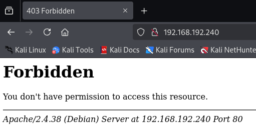

port `3000` however is more successful:

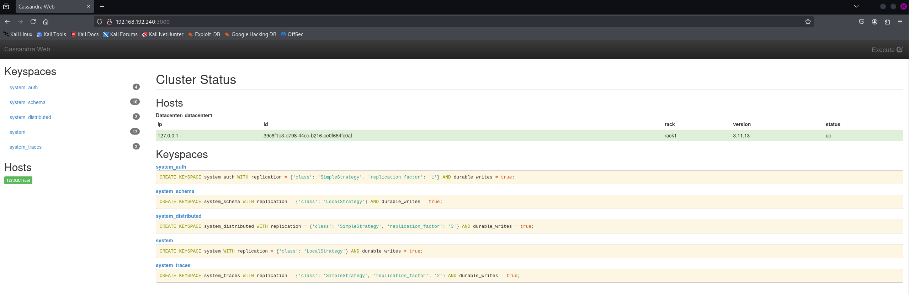

No idea what it does yet, but it's open and mentions something like **Cassandra Web**.

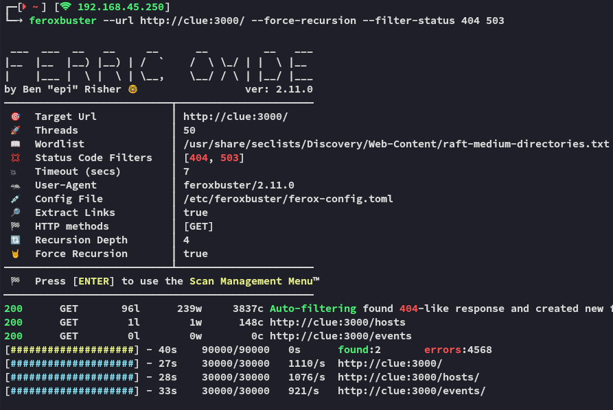

`feroxbuster` didn't get me anywhere either.

Luckily I've found exploits for both ports, downside is, I don't know what versions are running so I cannot be certain.

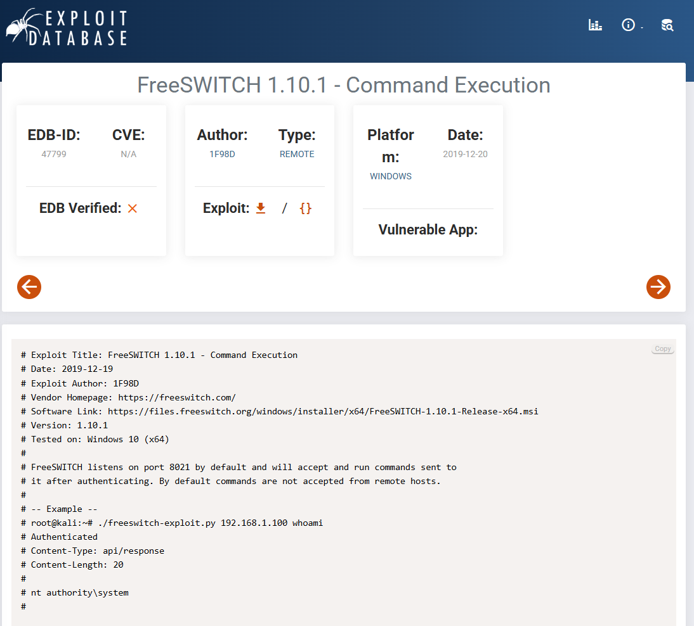

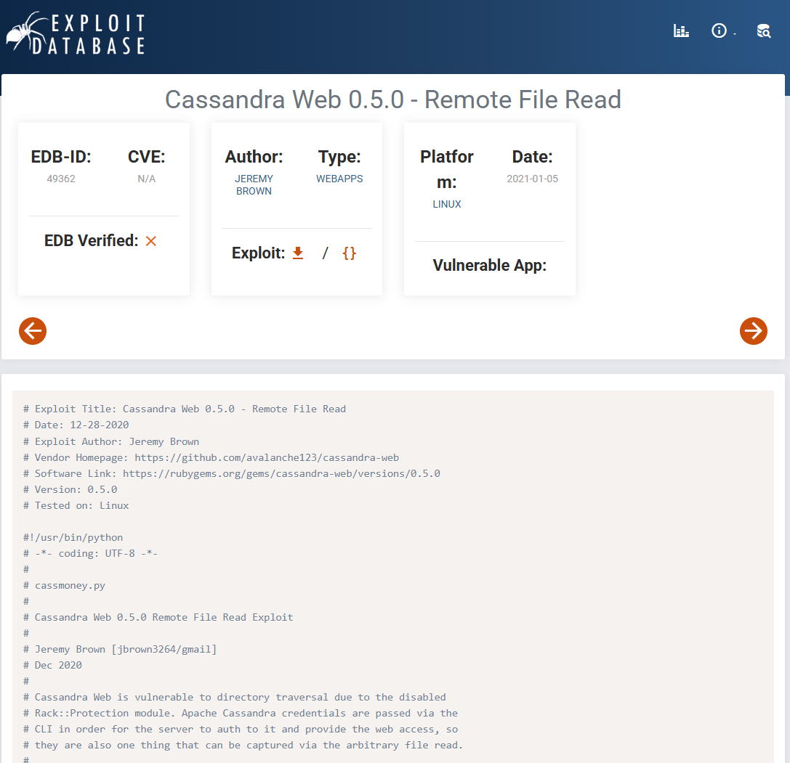


## Remote File Read

I tried out the latter and surprisingly it worked right away!

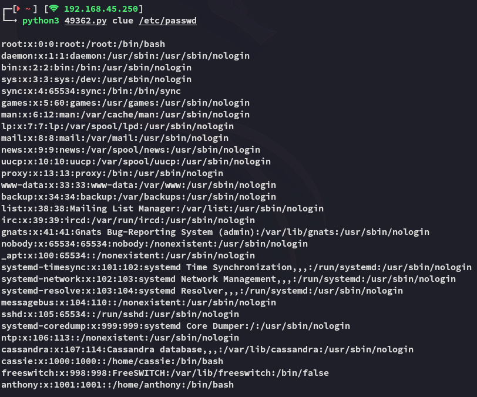

Since it worked I moved on to the second part of the PoC:

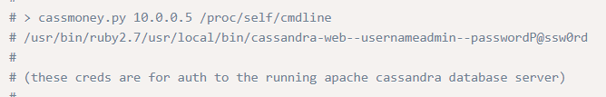

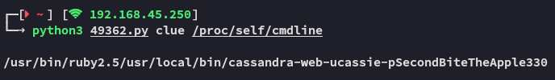

```bash
cassie
SecondBiteTheApple330
```

Hell yeah, we got creds for *cassie*. 

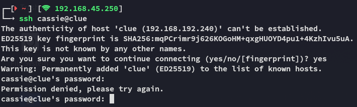

Unfortunately we find unable to log in as *cassie*, so let's continue onto the other PoC found.

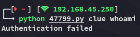

This failed as well (eventhough the exploit itself did not!)

Let's check out SMB.


## 445/TCP - SMB

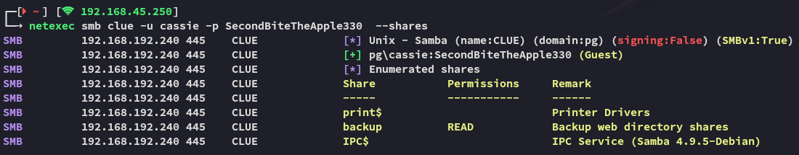

Thus I connected to `\backup` via `smbclient`:

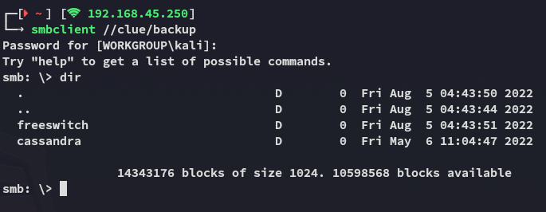

After a while of fiddling around I found a zipped file called **changelog** which contained the version:

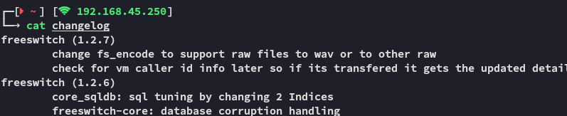

However after a while of searching this didn't yield shite either.


## Foothold

According to [this article](https://developer.signalwire.com/freeswitch/FreeSWITCH-Explained/Modules/mod_event_socket_1048924/) the password should be stored in the following place:

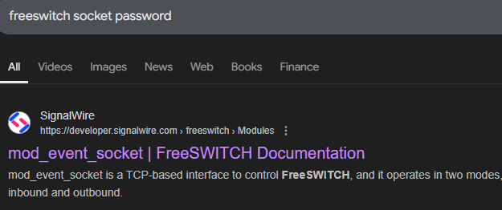

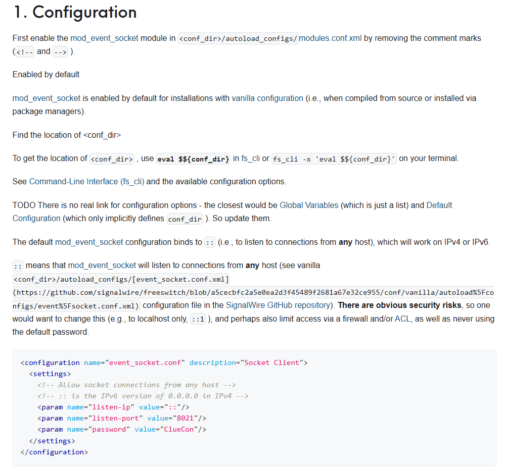

So I used the previous exploit again to read the file:

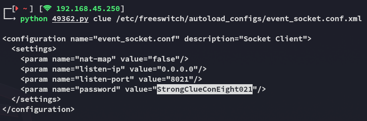

```
StrongClueConEight021
```

Now all that was left was to modify the other PoC so it will use this password:


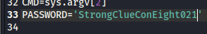

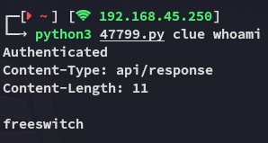

Hell yeah, let's get a shell!

### Shell

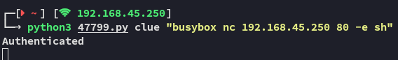

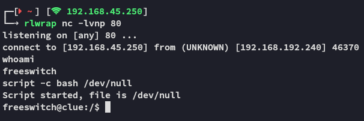


### local.txt

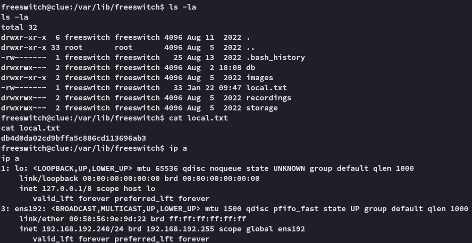


# Lateral Movement


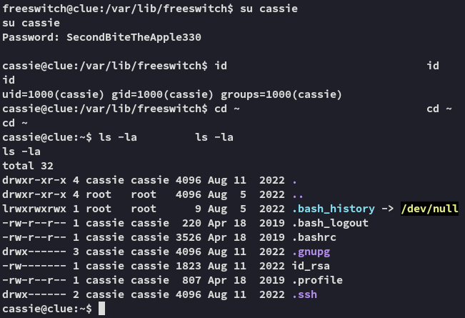

Awesome, we're now logged in as *cassie* at last. Let's enumerate the system.

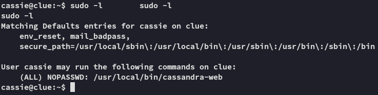

Let's check what we can do with this binary:

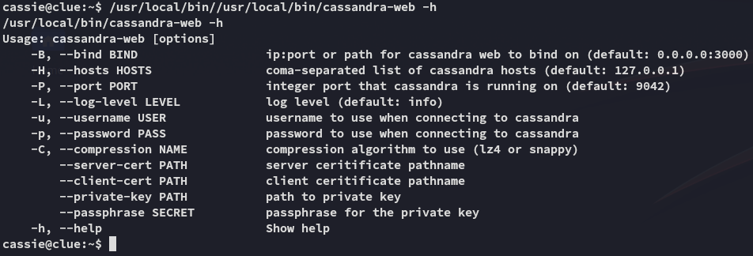

Perhaps we can run it using `sudo` which might then give us more stuff.

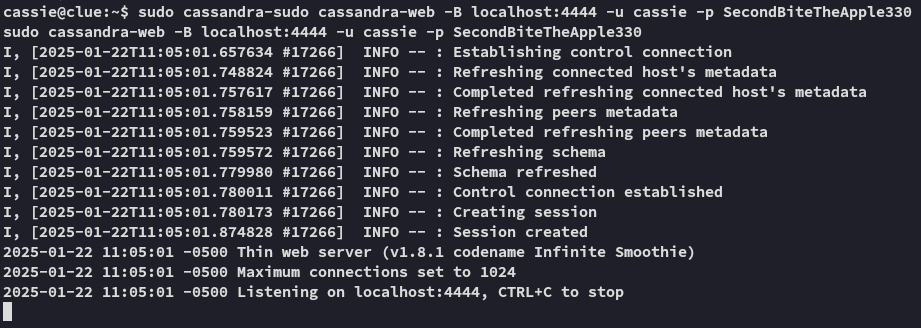

Now using another terminal we could use `curl` try out the file read again.

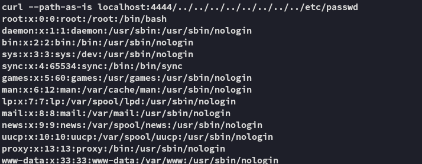

Hell yeah it worked! Let's try some other files.

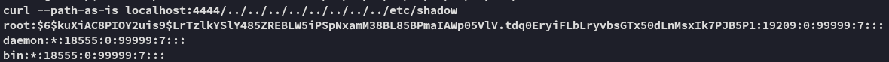

Even better! We've got *root*'s hash, let's crack it!

>[!fail]
>Since cracking the hash took too long I resulted to other measures.

I instead went ahead and read *anthony*'s `.bash_history` where I found the following:

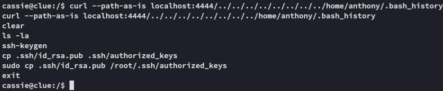

Holy shit this means that we can get *root* access through *anthony*'s auth keys!

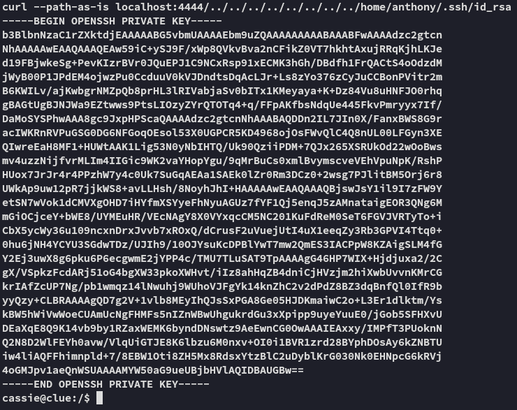


# Privilege Escalation

## Foothold

```bash
curl --path-as-is localhost:4444/../../../../../../../../home/anthony/.ssh/id_rsa > id_rsa
```

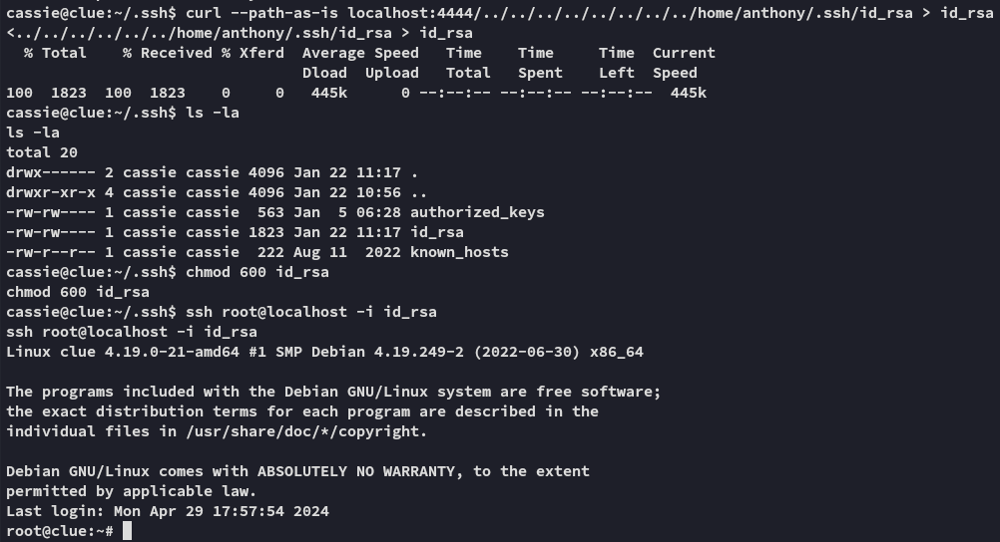


### proof.txt

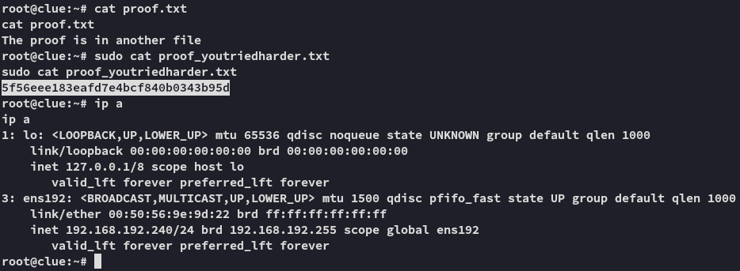


## Alternative Exploitation

Since there already is a `id_rsa` in *cassie*'s home directory from the start, we can just use that one to log into *root*.

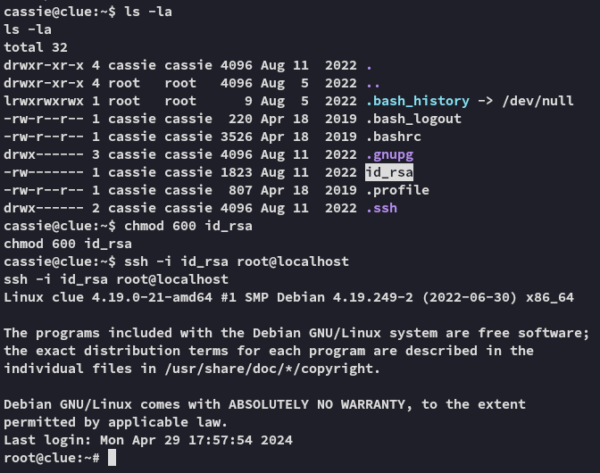

---

**Finished 17:20 22-01-2025**

[^Links]:  [[OSCP Prep]]

#FreeSwitch #CassandraWeb 