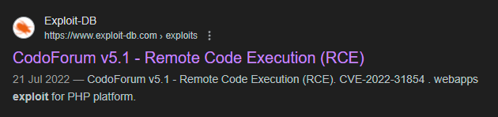
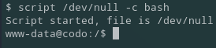

**Start 10:49 20-09**

---
```
Scope:
192.168.230.23
```
## Recon

### Nmap
```bash
┌──(kali㉿kali)-[~]
└─$ nmap -sC -sV -sT -vvvv -T5 -p- codo --min-rate 5000

PORT   STATE SERVICE REASON  VERSION
22/tcp open  ssh     syn-ack OpenSSH 8.2p1 Ubuntu 4ubuntu0.7 (Ubuntu Linux; protocol 2.0)
| ssh-hostkey: 
|   3072 62:36:1a:5c:d3:e3:7b:e1:70:f8:a3:b3:1c:4c:24:38 (RSA)
| ssh-rsa AAAAB3NzaC1yc2EAAAADAQABAAABgQDFR/u8yZrrxkDWw/8gy/fNFksvT+QIL8O/6eD8zVxwKwgBURa9uRtOC8Dk6P+ktLwXJ9oSUitZeXVWjijbehpZBVHvywEOj9nc0bmk0+M/DGGbr1etS7cDvRzRATUtMPxQfYhzXqHlZe6Q2GfA0c75uybUXxOha8CTdK0Iv/maUUaiaPv3LGebQ4CpNaXNQfYVpCdsxLn5MxFi+tfenn/4CinBPn1Ahnx499V1G0ANTaKLsEETjqaMd5jnmml2wH1GmKfKf/6FevWv0Q9Ylsi3x/ipkDpcQAMRQ/aw5NuSSDrGTdo0wRuuoEf5Ybenp9haPVxUAPHbEcMI2hdcP5B3Cd03qimMhHEkFXE8sTUxRKHG+hg7cF8On1EXZsH1fsVyrFAAoHRrap5CsubmNXT93EcK7lc65DbKgeqls643x0p/4WOUiLXFstm6X4JCdEyhvWmnYtL3qDKMuQbCwrCJGeDjoaZTjHXbpjSxSnvtO04RT84x2t8MThyeYO3kSyM=
|   256 ee:25:fc:23:66:05:c0:c1:ec:47:c6:bb:00:c7:4f:53 (ECDSA)
| ecdsa-sha2-nistp256 AAAAE2VjZHNhLXNoYTItbmlzdHAyNTYAAAAIbmlzdHAyNTYAAABBBNBWjceIJ9NSOLk8zk68zCychWoLxrcrsuJYy2C1pvpfOhVBrr8QBhYbJxzzGJ7DpuMT/DXiCwuLXdu0zeR4/Dk=
|   256 83:5c:51:ac:32:e5:3a:21:7c:f6:c2:cd:93:68:58:d8 (ED25519)
|_ssh-ed25519 AAAAC3NzaC1lZDI1NTE5AAAAIG3LJwn9us7wxvkL0E6EEgOPG3P0fa0fRVuJuXeASZvs
80/tcp open  http    syn-ack Apache httpd 2.4.41 ((Ubuntu))
|_http-title: All topics | CODOLOGIC
| http-cookie-flags: 
|   /: 
|     PHPSESSID: 
|_      httponly flag not set
|_http-server-header: Apache/2.4.41 (Ubuntu)
| http-methods: 
|_  Supported Methods: GET HEAD POST OPTIONS
Service Info: OS: Linux; CPE: cpe:/o:linux:linux_kernel
```

I searched for a `Codologic` exploit and found the following:



### 80/TCP - HTTP

I logged in using the default `admin - admin` creds. I then tried to use the previously found exploit. Since I don't know the exact version I guessed whether it would work but it failed


Other than that we really couldn't do anything on this page, so I used `gobuster` to enumerate the host further:

```bash
┌──(kali㉿kali)-[~]
└─$ gobuster dir -u http://codo/ -w /usr/share/seclists/Discovery/Web-Content/directory-list-2.3-small.txt 
===============================================================
Gobuster v3.6
by OJ Reeves (@TheColonial) & Christian Mehlmauer (@firefart)
===============================================================
[+] Url:                     http://codo/
[+] Method:                  GET
[+] Threads:                 10
[+] Wordlist:                /usr/share/seclists/Discovery/Web-Content/directory-list-2.3-small.txt
[+] Negative Status codes:   404
[+] User Agent:              gobuster/3.6
[+] Timeout:                 10s
===============================================================
Starting gobuster in directory enumeration mode
===============================================================
/admin                (Status: 301) [Size: 296] [--> http://codo/admin/]
/sites                (Status: 301) [Size: 296] [--> http://codo/sites/]
/cache                (Status: 301) [Size: 296] [--> http://codo/cache/]
/sys                  (Status: 301) [Size: 294] [--> http://codo/sys/]
```

Right away I found the `/admin` endpoint which I went to. I logged in with the same `admin - admin` creds and got this dashboard:


When I went to `Global Settings` I found this:


I added `.php` in order to allow the upload of a `php-reverse-shell` and clicked `Save` at the bottom.

Then I checked `Exploit-DB` again for where the exploit was uploaded:


Apparently it get's uploaded to the `forum_logo` form, scrolling down in the same `Global Settings` I found the field:


Here I selected my reverse shell:


And clicked `Save` again.
Scrolling to the top of the exploit we find the path where the payload get's uploaded to: 


Thus we insert this `URL` + our payload name:


And we get the reverse shell


First thing I do is upgrade my shell:



I then started another reverse shell in case I accidently `Ctrl + C`'d the original shell:


I went to the user `offsec`'s home directory but there was no flag or anything that I could access really, so I started looking for `Priv Esc` vectors.


## Privilege Escalation

I checked `sudo -l` but couldn't run it. Then I checked `find / -perm -u=s -type f 2>/dev/null` but got no interesting results either:

```bash
www-data@codo:/$ find / -perm -u=s -type f 2>/dev/null
find / -perm -u=s -type f 2>/dev/null
/usr/bin/fusermount
/usr/bin/sudo
/usr/bin/su
/usr/bin/umount
/usr/bin/passwd
/usr/bin/chsh
/usr/bin/chfn
/usr/bin/at
/usr/bin/mount
/usr/bin/newgrp
/usr/bin/gpasswd
/usr/bin/pkexec
/usr/lib/dbus-1.0/dbus-daemon-launch-helper
/usr/lib/openssh/ssh-keysign
/usr/lib/eject/dmcrypt-get-device
/usr/lib/policykit-1/polkit-agent-helper-1
/usr/lib/snapd/snap-confine
/snap/core20/1518/usr/bin/chfn
/snap/core20/1518/usr/bin/chsh
/snap/core20/1518/usr/bin/gpasswd
/snap/core20/1518/usr/bin/mount
/snap/core20/1518/usr/bin/newgrp
/snap/core20/1518/usr/bin/passwd
/snap/core20/1518/usr/bin/su
/snap/core20/1518/usr/bin/sudo
/snap/core20/1518/usr/bin/umount
/snap/core20/1518/usr/lib/dbus-1.0/dbus-daemon-launch-helper
/snap/core20/1518/usr/lib/openssh/ssh-keysign
/snap/core20/1891/usr/bin/chfn
/snap/core20/1891/usr/bin/chsh
/snap/core20/1891/usr/bin/gpasswd
/snap/core20/1891/usr/bin/mount
/snap/core20/1891/usr/bin/newgrp
/snap/core20/1891/usr/bin/passwd
/snap/core20/1891/usr/bin/su
/snap/core20/1891/usr/bin/sudo
/snap/core20/1891/usr/bin/umount
/snap/core20/1891/usr/lib/dbus-1.0/dbus-daemon-launch-helper
/snap/core20/1891/usr/lib/openssh/ssh-keysign
/snap/snapd/19361/usr/lib/snapd/snap-confine
```

So I looked up online where the database config file get's stored:


So I went to this directory and used `cat` to read the `config.php` file:

```bash
www-data@codo:/var/www/html/sites/default$ cat config.php
cat config.php
<?php

/* 
 * @CODOLICENSE
 */

defined('IN_CODOF') or die();

$CF_installed=true;

function get_codo_db_conf() {


    $config = array (
  'driver' => 'mysql',
  'host' => 'localhost',
  'database' => 'codoforumdb',
  'username' => 'codo',
  'password' => 'FatPanda123',
  'prefix' => '',
  'charset' => 'utf8',
  'collation' => 'utf8_unicode_ci',
);

    return $config;
}

$DB = get_codo_db_conf();

$CONF = array (
    
  'driver' => 'Custom',
  'UID'    => '631042af544ef',
  'SECRET' => '631042af544f0',
  'PREFIX' => ''
);
```

Looks like I got a new set of creds for a `mysql` database

```
codo
FatPanda123
```

I tried to log in to `MySQL` but completely forgot that there was no database instance running. So I tried the password for `codo`, `offsec` and finally for `root` and that one worked:


From here I got the `proof.txt` flag in the `/root` directory:

```bash
root@codo:~# cat proof.txt
cat proof.txt
ddfb38a604ec776e3f2e5efde0ca39d8
```

---

**Finished 11:46 20-09**

[^Links]: [[OSCP Prep]] 